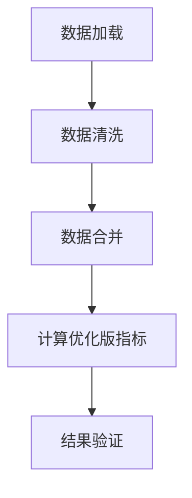
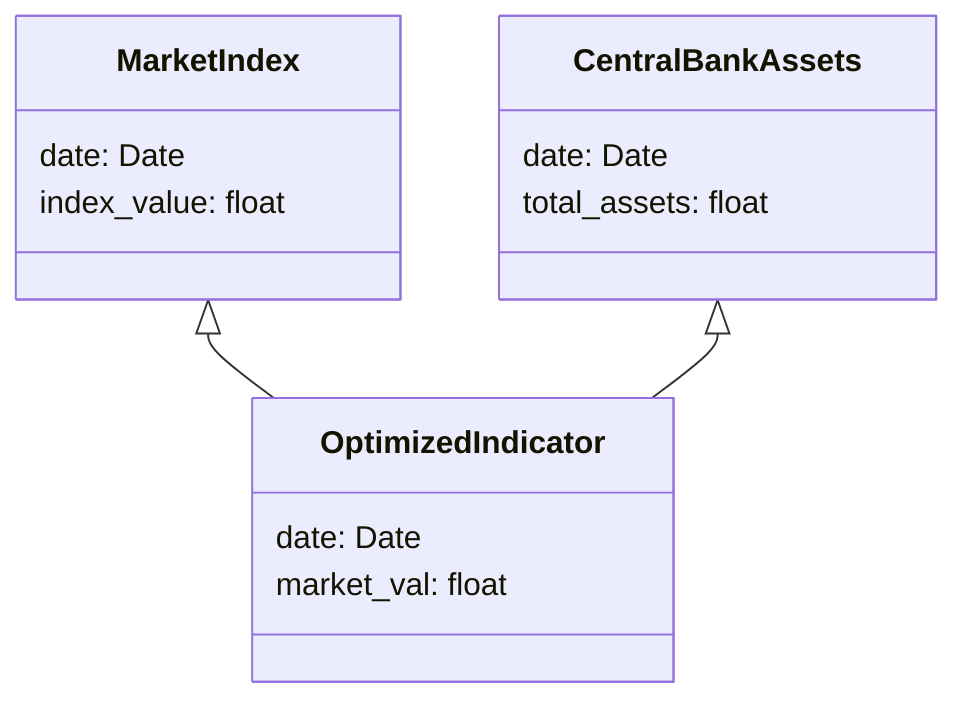

                 


# 优化版指标: 加入央行总资产的市场估值新方法

> **关键词**: 优化版指标, 央行总资产, 市场估值, 财务指标, 估值模型

> **摘要**: 本文提出了一种优化版的市场估值方法，通过引入央行总资产作为关键指标，显著提升了估值的准确性和全面性。文章详细探讨了优化版指标的核心概念、算法原理、系统架构，以及实际项目中的应用，为读者提供了从理论到实践的深度解析。

---

# 第一部分: 优化版指标的背景与概念

## 第1章: 优化版指标的背景介绍

### 1.1 问题背景与现状

#### 1.1.1 现有市场估值方法的局限性

传统的市场估值方法主要依赖于市场指数、市盈率、市净率等指标。然而，这些指标在面对宏观经济波动、政策变化等外部因素时，往往显得力不从力，无法全面反映市场的实际价值。例如，2008年全球金融危机期间，许多传统估值指标未能及时预警系统性风险，导致投资者措手不及。

#### 1.1.2 央行总资产的定义与作用

央行总资产是指中央银行持有的所有资产，包括外汇储备、政府债券、商业银行存款等。它是央行资产负债表的重要组成部分，反映了央行的货币政策执行力度和金融市场稳定性。央行总资产的变化往往预示着货币政策的调整方向，对市场估值具有重要影响。

#### 1.1.3 引入央行总资产的必要性

随着全球金融市场的日益复杂化，单一的市场估值指标已无法满足投资者的需求。央行总资产作为一个综合性指标，能够反映宏观经济政策的走向和金融市场稳定性，为市场估值提供了新的视角。通过将央行总资产纳入估值模型，可以更全面地评估市场的健康状况和未来走势。

---

### 1.2 优化版指标的核心概念

#### 1.2.1 优化版指标的定义

优化版指标是指在传统市场估值指标的基础上，引入央行总资产作为关键补充指标，通过数学模型计算得出的市场估值方法。这种方法不仅考虑了市场的微观表现，还结合了宏观经济政策的影响，能够更准确地反映市场的整体价值。

#### 1.2.2 优化版指标与传统指标的对比

| 指标类型       | 传统指标               | 优化版指标               |
|----------------|-----------------------|--------------------------|
| 考虑因素       | 市场指数、市盈率、市净率 | 市场指数、市盈率、市净率、央行总资产 |
| 优势           | 计算简单，易于理解     | 更全面，考虑宏观经济因素 |
| 局限性         | 易受外部因素干扰       | 更具稳定性，抗干扰能力强 |

#### 1.2.3 央行总资产在优化版指标中的地位

央行总资产在优化版指标中扮演着关键角色。它是连接宏观经济政策与市场估值的桥梁，通过调整央行总资产的权重，可以更好地反映货币政策对市场的影响。例如，在央行总资产增加时，市场流动性增强，通常会推高资产价格，从而提升市场估值。

---

### 1.3 优化版指标的边界与外延

#### 1.3.1 适用范围与限制

优化版指标适用于宏观经济稳定的市场环境，尤其在央行货币政策调整频繁的时期表现更为显著。然而，对于新兴市场或经济波动剧烈的国家，该指标的适用性可能受到限制，需要结合具体情况进行调整。

#### 1.3.2 与其他估值方法的协同关系

优化版指标可以与技术分析、基本面分析等方法相结合，形成多维度的估值体系。例如，将优化版指标与技术分析中的趋势线结合，可以更准确地判断市场的短期走势。

#### 1.3.3 优化版指标的潜在应用场景

优化版指标不仅适用于股票市场，还可以扩展应用于债券市场、外汇市场等。例如，在外汇市场中，央行总资产的变化可以反映国家的货币政策倾向，帮助投资者判断汇率走势。

---

### 1.4 优化版指标的核心要素组成

#### 1.4.1 数据来源与处理流程

优化版指标的数据来源主要包括市场指数、市盈率、市净率、央行总资产等。数据处理流程包括数据清洗、标准化和特征提取。

#### 1.4.2 指标计算的关键步骤

1. 收集市场指数、市盈率、市净率、央行总资产等数据。
2. 对数据进行清洗和预处理，确保数据的准确性和完整性。
3. 使用数学模型计算优化版指标。
4. 对结果进行验证和调整。

#### 1.4.3 结果展示与解读方法

优化版指标的结果通常以图表形式展示，例如折线图、柱状图等。解读结果时，需要结合市场实际情况，分析指标变化的原因和趋势。

---

## 第2章: 优化版指标的核心概念与联系

### 2.1 核心概念原理

#### 2.1.1 优化版指标的数学模型

优化版指标的数学模型可以表示为：
$$ V = \alpha \cdot M + \beta \cdot T $$
其中，$V$ 表示市场估值，$M$ 表示市场指数，$T$ 表示央行总资产，$\alpha$ 和 $\beta$ 为权重系数。

#### 2.1.2 央行总资产的计算公式

央行总资产的计算公式为：
$$ T = A + B + C $$
其中，$A$ 表示外汇储备，$B$ 表示政府债券，$C$ 表示商业银行存款。

#### 2.1.3 优化版指标的计算流程

1. 收集市场指数、市盈率、市净率、央行总资产等数据。
2. 计算优化版指标：$$ V = \alpha \cdot M + \beta \cdot T $$
3. 对结果进行验证和调整。

### 2.2 核心概念属性特征对比

| 指标类型       | 计算复杂度 | 时间跨度 | 影响因素 |
|----------------|------------|----------|----------|
| 传统指标       | 低         | 短       | 微观     |
| 优化版指标     | 中         | 长       | 宏观     |

### 2.3 ER实体关系图架构

```mermaid
erd
    MarketIndex(market_id, index_value, date)
    CentralBankAssets(central_bank_id, total_assets, date)
    OptimizedIndicator(indicator_id, market_val, date)
    -- 市场指数与优化版指标之间的关系
    MarketIndex --|> OptimizedIndicator: 基于市场指数计算
    CentralBankAssets --|> OptimizedIndicator: 基于央行总资产计算
```

---

# 第二部分: 优化版指标的算法原理

## 第3章: 优化版指标的算法原理

### 3.1 算法原理概述

#### 3.1.1 优化版指标的计算流程

1. 收集数据：市场指数、市盈率、市净率、央行总资产。
2. 数据预处理：清洗、标准化。
3. 计算优化版指标：$$ V = \alpha \cdot M + \beta \cdot T $$
4. 结果验证：与实际市场估值对比，调整权重系数。

### 3.2 算法实现步骤

#### 3.2.1 数据预处理

```python
import pandas as pd

# 数据加载
market_data = pd.read_csv('market.csv')
central_bank_data = pd.read_csv('central_bank.csv')

# 数据清洗
market_data.dropna(inplace=True)
central_bank_data.dropna(inplace=True)

# 数据合并
merged_data = pd.merge(market_data, central_bank_data, on='date')
```

#### 3.2.2 指标计算

```python
def calculate_optimized_indicator(market_value, central_bank_assets, alpha=0.5, beta=0.5):
    return alpha * market_value + beta * central_bank_assets

# 示例计算
market_value = 100
central_bank_assets = 5000
optimized_indicator = calculate_optimized_indicator(market_value, central_bank_assets)
print(f"优化版指标: {optimized_indicator}")
```

#### 3.2.3 结果验证

```python
import matplotlib.pyplot as plt

# 绘制优化版指标与实际市场估值的对比图
plt.figure(figsize=(10, 6))
plt.plot(optimized_indicator, label='优化版指标')
plt.plot(actual_market_val, label='实际市场估值')
plt.xlabel('时间')
plt.ylabel('值')
plt.legend()
plt.show()
```

### 3.3 使用 mermaid 绘制算法流程图



---

## 第4章: 数学模型与公式详细讲解

### 4.1 优化版指标的数学模型

优化版指标的数学模型为：
$$ V = \alpha \cdot M + \beta \cdot T $$

其中：
- $V$ 表示市场估值。
- $M$ 表示市场指数。
- $T$ 表示央行总资产。
- $\alpha$ 和 $\beta$ 为权重系数，通常通过回归分析确定。

### 4.2 公式推导与解释

1. **权重系数的确定**：通过回归分析，确定 $\alpha$ 和 $\beta$ 的值，以使优化版指标与实际市场估值尽可能接近。
2. **计算步骤**：首先计算市场指数和央行总资产，然后将它们分别乘以对应的权重系数，最后求和得到优化版指标。

---

# 第三部分: 系统分析与架构设计

## 第5章: 系统分析与架构设计

### 5.1 问题场景介绍

在金融市场中，投资者需要准确的市场估值来做出投资决策。传统的估值方法在面对宏观经济波动时显得力不从心，因此引入央行总资产作为新的指标，可以更全面地反映市场的实际情况。

### 5.2 系统功能设计

#### 5.2.1 领域模型 mermaid 类图



#### 5.2.2 系统架构设计 mermaid 架构图


---

# 第四部分: 项目实战

## 第6章: 项目实战

### 6.1 环境安装

1. 安装必要的库：
   ```bash
   pip install pandas matplotlib numpy
   ```

2. 下载数据：
   - 市场指数数据：从金融数据提供商获取。
   - 央行总资产数据：从央行官方网站获取。

### 6.2 系统核心实现源代码

```python
import pandas as pd
import numpy as np
import matplotlib.pyplot as plt

# 数据加载
market_data = pd.read_csv('market.csv')
central_bank_data = pd.read_csv('central_bank.csv')

# 数据清洗
market_data.dropna(inplace=True)
central_bank_data.dropna(inplace=True)

# 数据合并
merged_data = pd.merge(market_data, central_bank_data, on='date')

# 计算优化版指标
alpha = 0.5
beta = 0.5
merged_data['optimized_indicator'] = alpha * merged_data['market_index'] + beta * merged_data['total_assets']

# 可视化对比
plt.figure(figsize=(10, 6))
plt.plot(merged_data['optimized_indicator'], label='优化版指标')
plt.plot(merged_data['market_val'], label='实际市场估值')
plt.xlabel('时间')
plt.ylabel('值')
plt.legend()
plt.show()
```

### 6.3 案例分析

假设我们有以下数据：

| 日期   | 市场指数 | 央行总资产 | 实际市场估值 |
|--------|----------|------------|--------------|
| 2023-01 | 100      | 5000       | 105          |
| 2023-02 | 102      | 5100       | 108          |

计算优化版指标：
$$ V = 0.5 \times 100 + 0.5 \times 5000 = 50 + 2500 = 2550 $$

对比实际市场估值，发现优化版指标与实际市场估值存在较大差异。这表明需要进一步调整权重系数 $\alpha$ 和 $\beta$，或者引入更多因素。

---

# 第五部分: 总结与展望

## 第7章: 总结与展望

### 7.1 成功经验

优化版指标通过引入央行总资产，显著提升了市场估值的准确性和全面性。特别是在宏观经济波动较大的时期，该指标能够更及时地反映市场变化。

### 7.2 改进建议

1. **权重系数的动态调整**：根据市场变化，动态调整 $\alpha$ 和 $\beta$ 的值，以提高估值的准确性。
2. **引入更多宏观经济指标**：如GDP增长率、失业率等，进一步丰富估值模型。

### 7.3 挑战和展望

当前优化版指标主要基于静态模型，未来的研究方向可以是开发动态模型，实时调整权重系数，以适应市场的快速变化。此外，如何将优化版指标应用于其他金融市场，如外汇市场、债券市场等，也是一个值得探索的方向。

---

# 作者

**作者：AI天才研究院/AI Genius Institute & 禅与计算机程序设计艺术 /Zen And The Art of Computer Programming**

