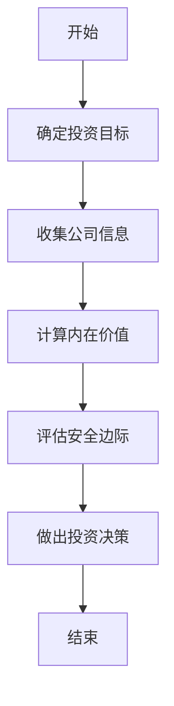
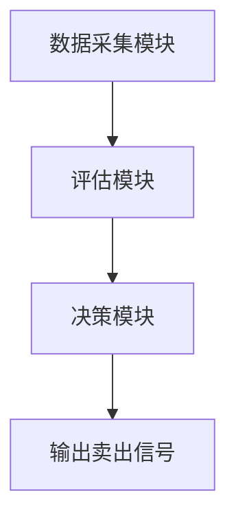

                 


# 何时卖出格雷厄姆特价股票

> 关键词：价值投资，卖出时机，安全边际，内在价值，市盈率，市净率，投资决策

> 摘要：本文详细探讨了如何在价值投资框架下决定何时卖出股票，特别是基于格雷厄姆的投资理念。文章从价值投资的基本概念出发，分析卖出决策的关键指标和策略，结合系统设计和实际案例，提供可操作的卖出时机判断方法。

---

## 第一部分：价值投资与卖出决策的基本概念

### 第1章：价值投资的背景与核心概念

#### 1.1 价值投资的定义与背景

- **1.1.1 投资的基本概念与分类**
  - 投资是将资金分配到不同资产以实现收益的行为。
  - 资产类型包括股票、债券、房地产等，股票投资是最常见的形式之一。

- **1.1.2 价值投资的起源与发展**
  - 价值投资由本杰明·格雷厄姆在20世纪初提出，强调购买被市场低估的股票。
  - 格雷厄姆的学生大卫·多德共同发展了这一理论，强调安全边际的重要性。

- **1.1.3 格雷厄姆与价值投资的关联**
  - 格雷厄姆的学生包括沃伦·巴菲特，他将价值投资理念发扬光大。
  - 格雷厄姆的方法强调基本面分析和安全边际，以降低投资风险。

#### 1.2 格雷厄姆的投资理念

- **1.2.1 格雷厄姆的投资哲学**
  - 投资的目的是寻找具有内在价值的股票，即市场价格低于其内在价值。
  - 安全边际：购买价格低于内在价值的一定折扣，以减少市场波动带来的风险。

- **1.2.2 安全边际的概念与应用**
  - 安全边际 = 内在价值 - 市场价格。
  - 当市场价格低于内在价值时，安全边际为正，投资风险降低。

- **1.2.3 内在价值的计算方法**
  - 内在价值是基于公司基本面分析得出的理论价值，通常通过市盈率（P/E）和市净率（P/B）等指标计算。

#### 1.3 当前市场环境与价值投资

- **1.3.1 现代市场与价值投资的适应性**
  - 现代市场波动加剧，但价值投资的基本原理仍适用。
  - 技术进步使得数据分析更加高效，但基本面分析仍然是核心。

- **1.3.2 技术进步对投资策略的影响**
  - 量化工具和算法交易提高了投资效率，但价值投资仍强调长期基本面分析。

- **1.3.3 价值投资在不同经济周期的表现**
  - 在经济衰退期，价值投资表现更优，因为市场低估优质资产。
  - 在经济繁荣期，价值投资可能表现较弱，因为市场高估部分资产。

### 第2章：价值投资的核心概念与联系

#### 2.1 核心概念原理

- **2.1.1 安全边际的数学模型**
  - 安全边际 = 内在价值 - 市场价格。
  - 当安全边际为正时，投资风险较低，适合作为买入或卖出决策的依据。

- **2.1.2 内在价值的评估方法**
  - 内在价值通常通过市盈率和市净率计算。
  - 市盈率 = 股价 / 每股收益（EPS）。
  - 市净率 = 股价 / 每股净资产（BPS）。

- **2.1.3 市场情绪与投资决策的关系**
  - 市场情绪影响股票价格波动，但价值投资强调独立于市场情绪的长期分析。
  - 投资者应关注市场情绪对安全边际的影响，避免过度波动。

#### 2.2 投资策略对比表格

| 投资策略         | 价值投资          | 股票投资          | 债券投资          |
|------------------|-------------------|-------------------|-------------------|
| 核心理念         | 寻找低估资产       | 短期交易获利       | 稳定收益          |
| 风险承受         | 较低             | 较高             | 较低             |
| 投资期限         | 长期             | 短期或中期        | 长期             |
| 代表人物         | 格雷厄姆，巴菲特  | 技术分析师         | 债券基金经理       |

#### 2.3 投资决策流程图



---

## 第二部分：价值投资的卖出决策策略

### 第3章：卖出决策的指标与策略

#### 3.1 市盈率（P/E）与市净率（P/B）分析

- **市盈率分析**
  - 当市盈率远高于行业平均水平时，可能意味着股票被高估。
  - 例如，若行业平均市盈率为15，而某股票市盈率为25，则可能需要卖出。

- **市净率分析**
  - 市净率 = 股价 / 每股净资产。
  - 当市净率远高于行业平均水平时，股票可能被高估，卖出时机到来。

- **案例分析**
  - 假设某公司市盈率为30，行业平均为20，市净率为4，行业平均为2，则该股票可能被高估，考虑卖出。

#### 3.2 安全边际的变化

- **安全边际减少**
  - 当市场价格接近或超过内在价值时，安全边际减少，卖出信号出现。
  - 例如，内在价值为50，市场价格为45，安全边际为5，当市场价格升至50时，安全边际为0，考虑卖出。

- **动态调整**
  - 定期重新评估内在价值和市场价格，动态调整卖出决策。
  - 例如，每季度重新计算内在价值和安全边际，根据变化调整持有时间。

#### 3.3 财务指标的恶化

- **盈利能力下降**
  - 每股收益（EPS）连续下降，可能是卖出信号。
  - 例如，某公司过去三年EPS分别为10, 8, 6，显示出盈利能力下降趋势。

- **杠杆率增加**
  - 过高的负债比例可能增加公司风险，影响内在价值。
  - 例如，某公司负债率从40%升至60%，需重新评估内在价值。

### 第4章：卖出决策的系统设计

#### 4.1 系统架构设计

- **模块划分**
  - 数据采集模块：收集公司财务数据和市场数据。
  - 评估模块：计算内在价值和安全边际。
  - 决策模块：根据指标变化做出卖出决策。

- **系统架构图**



- **系统功能设计**
  - 数据采集：从数据库或API获取股票数据。
  - 评估模块：计算市盈率、市净率和内在价值。
  - 决策模块：根据指标变化发出卖出信号。

#### 4.2 系统实现

- **数据采集代码**
  ```python
  import pandas as pd
  data = pd.read_csv('stock_data.csv')
  ```

- **内在价值计算**
  ```python
  def calculate_intrinsic_value(eps, pe_ratio):
      return eps * pe_ratio
  ```

- **卖出决策逻辑**
  ```python
  def should_sell(current_price, intrinsic_value, margin_of_safety):
      if margin_of_safety <= 0:
          return True
      else:
          return False
  ```

---

## 第三部分：项目实战与案例分析

### 第5章：卖出决策的实战应用

#### 5.1 环境安装与配置

- **工具安装**
  - 安装Python、Pandas、Matplotlib等库。
  ```bash
  pip install pandas matplotlib
  ```

#### 5.2 核心代码实现

- **数据处理代码**
  ```python
  import pandas as pd
  df = pd.DataFrame({
      'stock': ['A', 'B', 'C'],
      'price': [50, 60, 70],
      'eps': [10, 15, 20]
  })
  ```

- **计算内在价值**
  ```python
  df['intrinsic_value'] = df['eps'] * 15
  ```

- **计算安全边际**
  ```python
  df['margin_of_safety'] = df['intrinsic_value'] - df['price']
  ```

- **判断卖出信号**
  ```python
  df['sell_signal'] = df['margin_of_safety'] <= 0
  ```

#### 5.3 案例分析

- **案例1：股票A**
  - 市盈率：15，行业平均：15，内在价值：150。
  - 当市场价格升至150，安全边际为0，发出卖出信号。

- **案例2：股票B**
  - 市盈率：20，行业平均：15，内在价值：225。
  - 当市场价格升至225，安全边际为0，考虑卖出。

### 第6章：系统优化与拓展

#### 6.1 系统优化

- **动态调整阈值**
  - 根据市场波动调整安全边际阈值。
  - 例如，牛市中降低阈值，熊市中提高阈值。

- **多指标结合**
  - 结合市盈率、市净率和股息率等指标进行综合评估。

#### 6.2 拓展与应用

- **风险管理**
  - 设置止损点，当股价跌破预设价格时立即卖出。
  - 例如，止损点设为买入价的80%，股价跌破时卖出。

- **长期投资策略**
  - 定期再平衡投资组合，保持资产配置合理。
  - 例如，每季度调整投资组合，卖出表现不佳的股票。

---

## 第四部分：结论与展望

### 第7章：最佳实践与注意事项

#### 7.1 最佳实践

- **定期评估**
  - 至少每季度评估一次投资组合，检查卖出条件。
- **分散投资**
  - 避免过度集中，降低风险。
- **长期视角**
  - 价值投资需要长期持有，避免短期波动影响决策。

#### 7.2 小结

- 本文详细探讨了如何在价值投资框架下决定卖出时机，强调安全边际和财务指标的重要性。
- 通过系统设计和案例分析，展示了如何将理论应用于实际投资决策。

#### 7.3 注意事项

- **市场波动**
  - 市场波动可能影响短期价格，但长期基本面分析更重要。
- **个人风险承受能力**
  - 根据个人风险偏好调整卖出策略。
- **持续学习**
  - 投资者需持续学习和适应市场变化。

---

## 作者

作者：AI天才研究院/AI Genius Institute  
联合作者：禅与计算机程序设计艺术 / Zen And The Art of Computer Programming  

---

感谢您的阅读，希望本文能为您提供有价值的投资决策参考！

