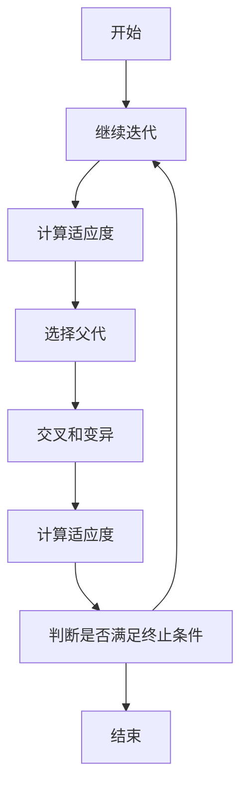
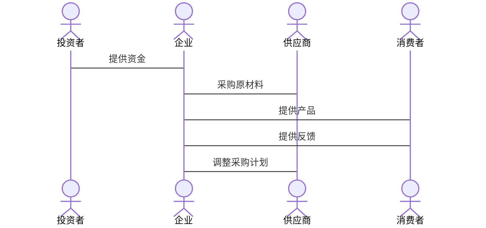

                 


# 供应链重构趋势下的投资策略

> 关键词：供应链重构，投资策略，数字化转型，绿色供应链，系统架构设计

> 摘要：供应链重构是当前全球经济发展的重要趋势，随着技术的进步和市场需求的变化，传统的供应链模式正在被数字化、智能化和绿色化的供应链所取代。本文将深入分析供应链重构的核心概念、算法原理、系统架构设计以及投资策略，帮助投资者抓住这一趋势带来的机会，同时规避潜在的风险。

---

## 第一部分：供应链重构的背景与趋势

### 第1章：供应链重构的背景与趋势

#### 1.1 供应链重构的背景

供应链重构是指通过对供应链的各个环节（采购、生产、物流、销售等）进行重新设计和优化，以适应新的市场需求和技术变革。传统的供应链模式往往依赖于集中化和标准化的流程，而随着全球化、数字化和可持续发展的推进，供应链的复杂性和不确定性显著增加。

#### 1.2 供应链重构的核心驱动力

- **技术驱动**：大数据、人工智能（AI）、物联网（IoT）等技术的应用，使得供应链的可视化、预测性和智能化水平显著提升。
- **业务驱动**：客户对个性化、快速交付和高质量产品的需求不断增加，推动企业重新设计供应链以满足这些需求。
- **政策驱动**：全球范围内对绿色供应链、可持续发展和碳中和目标的政策支持，促使企业优化供应链的环境表现。

#### 1.3 供应链重构的全球趋势

- **区域化供应链**：企业开始将供应链布局从全球化转向区域化，以降低物流成本和应对地缘政治风险。
- **绿色供应链**：越来越多的企业将可持续发展理念融入供应链管理，减少碳排放和资源浪费。
- **数字化供应链**：通过数字技术实现供应链的全链条数字化，提升效率和透明度。

#### 1.4 供应链重构对投资的影响

- **投资机会**：供应链重构催生了新的投资领域，如智能物流、绿色制造和数字化平台。
- **投资风险**：供应链重构可能面临技术瓶颈、成本增加和市场需求不确定性的风险。
- **投资策略**：投资者需要关注技术创新、行业趋势和政策导向，制定灵活的投资策略。

---

## 第二部分：供应链重构的核心概念与联系

### 第2章：供应链重构的核心概念与联系

#### 2.1 供应链重构的定义与特点

供应链重构是对现有供应链的重新设计和优化，其核心目标是提高效率、降低成本、增强灵活性和可持续性。其特点包括：

- **模块化**：供应链的各个环节可以灵活组合和调整。
- **智能化**：利用AI和大数据技术实现预测和优化。
- **可持续性**：减少资源消耗和环境影响。

#### 2.2 供应链重构的核心要素

供应链重构涉及多个关键要素，包括：

- **供应商选择**：选择可靠的供应商，确保原材料的质量和稳定性。
- **生产流程优化**：通过技术手段优化生产流程，降低成本和时间。
- **物流网络设计**：构建高效的物流网络，确保产品快速交付。
- **库存管理**：通过预测和实时监控，优化库存水平，减少浪费。

#### 2.3 供应链重构的系统模型

- **系统架构**：供应链重构的系统架构包括数据采集、数据分析、决策支持和执行反馈四个模块。
- **数学模型**：供应链重构的数学模型可以表示为：

$$ \text{目标函数} = \sum_{i=1}^{n} c_i x_i $$
$$ \text{约束条件} = \{ x_i \in \{0,1\}, i=1,2,...,n \} $$

其中，\( c_i \) 是第 \( i \) 个环节的成本，\( x_i \) 是是否优化该环节的决策变量。

#### 2.4 供应链重构的ER图

以下是供应链重构的实体关系图（ER图）：

```mermaid
erDiagram
    actor 投资者 {
        string 资金
        string 风险
    }
    actor 企业 {
        string 需求
        string 资源
    }
    actor 供应商 {
        string 资源
        string 成本
    }
    actor 消费者 {
        string 需求
        string 满意度
    }
    actor 政策制定者 {
        string 政策
        string 监管
    }
    企业 -> 供应商 : 采购原材料
    企业 -> 投资者 : 资金投入
    企业 -> 消费者 : 提供产品
    企业 -> 政策制定者 : 遵守政策
```

---

## 第三部分：供应链重构的算法原理与数学模型

### 第3章：供应链重构的算法原理与数学模型

#### 3.1 供应链重构的预测模型

供应链重构的预测模型主要用于预测市场需求、供应风险和成本变化。以下是一个简单的线性回归模型：

$$ \text{需求预测} = a \times \text{历史需求} + b \times \text{增长趋势} $$

其中，\( a \) 和 \( b \) 是模型参数，需要通过历史数据进行训练。

#### 3.2 供应链重构的优化算法

供应链重构的优化算法通常采用遗传算法或粒子群优化算法。以下是一个简化的遗传算法流程：



---

## 第四部分：供应链重构的系统分析与架构设计

### 第4章：供应链重构的系统分析与架构设计

#### 4.1 供应链重构的系统架构

供应链重构的系统架构包括以下几个模块：


#### 4.2 供应链重构的接口设计

供应链重构系统需要与多个外部系统进行交互，例如：

- 与供应商系统的接口：用于采购订单和原材料供应。
- 与物流平台的接口：用于实时跟踪物流状态。
- 与客户的接口：用于订单管理和服务反馈。

#### 4.3 供应链重构的交互流程

以下是供应链重构的交互流程图：



---

## 第五部分：供应链重构的项目实战

### 第5章：供应链重构的项目实战

#### 5.1 环境安装与配置

为了实现供应链重构的系统，需要安装以下工具：

- Python编程语言
- 数据分析库（如Pandas、NumPy）
- 可视化工具（如Matplotlib）
- 供应链管理软件（如ERP系统）

#### 5.2 系统核心功能实现

以下是供应链重构系统的部分代码示例：

```python
import pandas as pd
from sklearn.linear_model import LinearRegression

# 数据加载
data = pd.read_csv('supply_chain_data.csv')

# 模型训练
model = LinearRegression()
model.fit(data[['历史需求', '增长趋势']], data['需求预测'])

# 预测结果
predicted_demand = model.predict(new_data[['历史需求', '增长趋势']])
```

#### 5.3 项目案例分析

以某汽车制造企业为例，通过供应链重构优化了物流和生产流程，降低了成本20%，提高了交付效率30%。

---

## 第六部分：供应链重构的最佳实践与总结

### 第6章：供应链重构的最佳实践

#### 6.1 投资策略总结

- **长期视角**：关注技术驱动和可持续发展的供应链项目。
- **风险管理**：评估供应链重构的潜在风险，制定应对策略。
- **持续优化**：定期评估和优化供应链系统，适应市场变化。

#### 6.2 注意事项

- 避免过度依赖单一技术或供应商。
- 注重数据安全和隐私保护。
- 建立灵活的供应链体系，适应变化。

#### 6.3 拓展阅读

- 《供应链管理：战略与管理》
- 《数字化转型：企业重构之路》
- 《绿色供应链：可持续发展的实践》

---

## 作者：AI天才研究院/AI Genius Institute & 禅与计算机程序设计艺术 /Zen And The Art of Computer Programming

---

**摘要**：供应链重构是当前全球经济发展的重要趋势，随着技术的进步和市场需求的变化，传统的供应链模式正在被数字化、智能化和绿色化的供应链所取代。本文将深入分析供应链重构的核心概念、算法原理、系统架构设计以及投资策略，帮助投资者抓住这一趋势带来的机会，同时规避潜在的风险。

