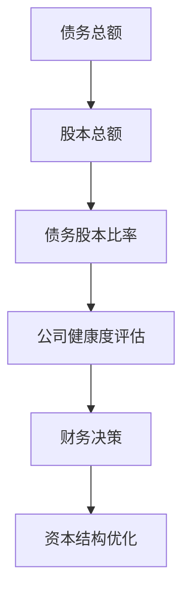
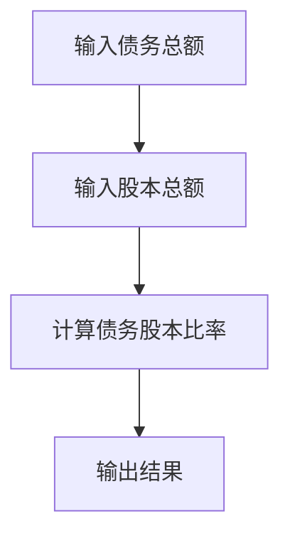
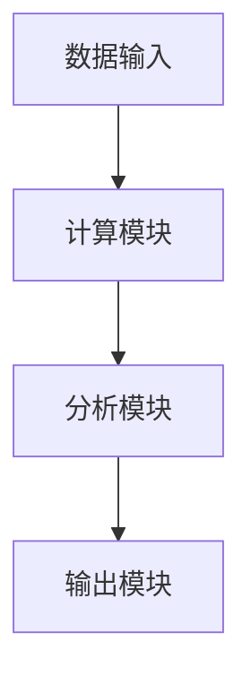
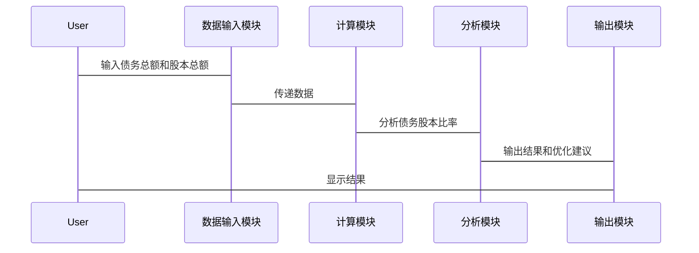

                 


# 债务股本比率：衡量公司健康度的关键

> 关键词：债务股本比率、公司健康度、财务指标、资本结构优化、财务风险管理

> 摘要：债务股本比率是衡量公司财务健康状况的重要指标之一。本文从债务股本比率的基本概念出发，详细探讨其计算方法、影响因素、在不同情境下的应用，以及如何通过系统分析和算法实现来评估和优化公司的资本结构。结合数学模型和实际案例，本文旨在帮助读者全面理解债务股本比率的原理和应用，并通过项目实战掌握其在实际财务分析中的应用技巧。

---

# 第一部分: 债务股本比率的背景与概念

## 第1章: 债务股本比率的背景介绍

### 1.1 什么是债务股本比率

#### 1.1.1 债务股本比率的定义
债务股本比率（Debt-to-Equity Ratio，简称D/E）是公司债务与股本之间的比率，用于衡量公司财务结构中债务与股权的比例关系。它是公司资本结构的重要指标之一。

#### 1.1.2 债务股本比率的意义
债务股本比率可以帮助投资者和债权人评估公司的财务风险。高比率可能意味着公司依赖债务融资，财务风险较高；低比率则可能意味着公司资本结构更稳健。

#### 1.1.3 债务股本比率的重要性
债务股本比率是衡量公司财务健康状况的关键指标之一，它能够反映公司的偿债能力、资本结构的合理性以及财务风险的大小。

### 1.2 债务股本比率的计算方法

#### 1.2.1 债务与股本的定义
- **债务**：公司所有债务的总和，包括短期债务和长期债务。
- **股本**：公司发行的普通股和优先股的总和。

#### 1.2.2 债务股本比率的公式推导
债务股本比率的公式为：
$$
\text{债务股本比率} = \frac{\text{债务总额}}{\text{股本总额}}
$$

#### 1.2.3 债务股本比率的计算实例
假设某公司债务总额为$500万，股本总额为$1000万，则债务股本比率为：
$$
\text{债务股本比率} = \frac{500}{1000} = 0.5
$$

### 1.3 债务股本比率的影响因素

#### 1.3.1 行业差异对债务股本比率的影响
不同行业的公司由于经营模式和资本需求的不同，债务股本比率会有显著差异。例如，重资产行业（如制造业、房地产）通常具有较高的债务股本比率，而轻资产行业（如软件公司）则较低。

#### 1.3.2 企业规模对债务股本比率的影响
大型企业通常可以通过发行债券或贷款来筹集资金，因此债务股本比率可能较高；而小型企业则更多依赖于股权融资，债务股本比率较低。

#### 1.3.3 财务政策对债务股本比率的影响
公司的财务政策，如分红政策、再融资政策等，也会影响债务股本比率。例如，公司如果选择发行更多的债券来回购股票，会增加债务股本比率。

### 1.4 债务股本比率与公司健康度的关系

#### 1.4.1 债务股本比率对债权人和股东的影响
- **债权人**：高债务股本比率意味着公司可能面临较高的偿债压力，债权人面临较高的风险。
- **股东**：高债务股本比率意味着公司财务风险较高，股东可能面临较低的回报率或较高的投资风险。

#### 1.4.2 债务股本比率与公司偿债能力的关系
债务股本比率是衡量公司偿债能力的重要指标之一。过高的债务股本比率可能表明公司难以偿还债务，而过低的比率可能表明公司财务杠杆不足，无法充分利用债务融资的优势。

#### 1.4.3 债务股本比率与公司资本结构的优化
通过合理调整债务股本比率，公司可以在风险和收益之间找到最佳平衡点，实现资本结构的最优化。

### 1.5 本章小结
本章介绍了债务股本比率的基本概念、计算方法及其在公司健康度评估中的重要性。通过分析不同因素对债务股本比率的影响，我们能够更好地理解该比率在财务分析中的应用价值。

---

## 第2章: 债务股本比率的核心概念与联系

### 2.1 债务股本比率的核心原理

#### 2.1.1 债务股本比率的数学模型
债务股本比率的数学模型可以表示为：
$$
\text{D/E} = \frac{\text{债务总额}}{\text{股本总额}}
$$
其中，债务总额包括短期债务和长期债务，股本总额包括普通股和优先股。

#### 2.1.2 债务股本比率的属性特征对比
| 属性         | 债务总额         | 股本总额         | 债务股本比率         |
|--------------|------------------|------------------|----------------------|
| 定义         | 公司所有债务的总和 | 公司所有股本的总和 | 债务与股本的比率     |
| 计算公式     |                   |                  | $\text{D/E} = \frac{\text{债务总额}}{\text{股本总额}}$ |
| 影响因素     | 贷款、债券等      | 股票发行等       | 公司的财务政策、行业特点等 |

#### 2.1.3 债务股本比率的ER实体关系图
```mermaid
er
    %% 债务股本比率的ER实体关系图
    entity 债务总额 {
        key 定义
        attribute 短期债务、长期债务
    }
    entity 股本总额 {
        key 定义
        attribute 普通股、优先股
    }
    entity 债务股本比率 {
        key D/E = 债务总额 / 股本总额
        attribute 债务总额、股本总额
        relationship 债务总额 --> 债务股本比率
        relationship 股本总额 --> 债务股本比率
    }
```

### 2.2 债务股本比率与其他财务指标的关系

#### 2.2.1 债务股本比率与流动比率的关系
流动比率（Current Ratio）是衡量公司短期偿债能力的指标，公式为：
$$
\text{流动比率} = \frac{\text{流动资产}}{\text{流动负债}}
$$
债务股本比率与流动比率不同，前者衡量的是长期偿债能力，后者衡量的是短期偿债能力。

#### 2.2.2 债务股本比率与速动比率的关系
速动比率（Quick Ratio）是流动比率的修正版本，公式为：
$$
\text{速动比率} = \frac{\text{流动资产} - \text{存货}}{\text{流动负债}}
$$
债务股本比率与速动比率均用于衡量公司的偿债能力，但前者关注长期债务，后者关注短期债务。

#### 2.2.3 债务股本比率与资产负债率的关系
资产负债率（Debt-to-Assets Ratio）是衡量公司整体负债水平的指标，公式为：
$$
\text{资产负债率} = \frac{\text{债务总额}}{\text{资产总额}}
$$
债务股本比率与资产负债率的区别在于，前者关注债务与股本的比例，而后者关注债务与资产的比例。

### 2.3 债务股本比率的Mermaid流程图



---

## 第3章: 债务股本比率的算法原理讲解

### 3.1 债务股本比率的数学模型

#### 3.1.1 债务股本比率的公式推导
债务股本比率的公式推导如下：
$$
\text{D/E} = \frac{\text{债务总额}}{\text{股本总额}}
$$
其中，债务总额包括短期债务和长期债务，股本总额包括普通股和优先股。

#### 3.1.2 债务股本比率的数学表达式
债务股本比率的数学表达式可以表示为：
$$
\text{D/E} = \frac{D}{E}
$$
其中，$D$ 表示债务总额，$E$ 表示股本总额。

#### 3.1.3 债务股本比率的计算实例
假设某公司债务总额为 $500万，股本总额为 $1000万，则债务股本比率为：
$$
\text{D/E} = \frac{500}{1000} = 0.5
$$

### 3.2 债务股本比率的算法实现

#### 3.2.1 算法实现的步骤
1. 收集公司债务总额和股本总额的数据。
2. 使用债务股本比率的公式进行计算。
3. 根据计算结果分析公司的财务健康状况。

#### 3.2.2 算法实现的Python代码

```python
def calculate_debt_equity_ratio(debt, equity):
    return debt / equity

# 示例数据
debt = 500  # 万元
equity = 1000  # 万元
ratio = calculate_debt_equity_ratio(debt, equity)
print(f"债务股本比率 = {ratio}")
```

#### 3.2.3 算法实现的流程图



### 3.3 债务股本比率的数学公式与举例说明

#### 3.3.1 债务股本比率的数学公式
债务股本比率的数学公式为：
$$
\text{D/E} = \frac{\text{债务总额}}{\text{股本总额}}
$$

#### 3.3.2 债务股本比率的举例说明
假设某公司债务总额为 $800万，股本总额为 $2000万，则债务股本比率为：
$$
\text{D/E} = \frac{800}{2000} = 0.4
$$
这表明公司的债务相对于股本来说较低，财务风险较小。

---

## 第4章: 债务股本比率的系统分析与架构设计

### 4.1 系统分析

#### 4.1.1 问题场景介绍
在公司财务分析中，债务股本比率是衡量公司健康度的重要指标之一。通过对债务股本比率的分析，可以评估公司的财务风险和资本结构的合理性。

#### 4.1.2 系统功能设计
系统需要实现以下功能：
1. 输入公司债务总额和股本总额的数据。
2. 计算债务股本比率。
3. 分析债务股本比率的合理性。
4. 提供优化建议。

#### 4.1.3 系统架构设计
系统的架构设计包括数据输入、计算模块、分析模块和输出模块。

### 4.2 系统架构设计

#### 4.2.1 系统架构的Mermaid图



#### 4.2.2 系统架构的实现步骤
1. 数据输入：用户输入债务总额和股本总额。
2. 计算模块：计算债务股本比率。
3. 分析模块：分析债务股本比率的合理性。
4. 输出模块：输出分析结果和优化建议。

#### 4.2.3 系统架构的优化建议
为了提高系统的准确性和效率，可以引入更多的财务指标进行综合分析。

### 4.3 系统接口设计

#### 4.3.1 系统接口的设计原则
系统接口设计应遵循简洁、直观、高效的原则。

#### 4.3.2 系统接口的实现方式
系统接口可以通过命令行或图形界面实现。

#### 4.3.3 系统接口的测试方法
通过输入不同的债务总额和股本总额，测试系统的计算和分析功能。

### 4.4 系统交互设计

#### 4.4.1 系统交互的Mermaid序列图



#### 4.4.2 系统交互的实现步骤
1. 用户输入债务总额和股本总额。
2. 数据输入模块将数据传递给计算模块。
3. 计算模块计算债务股本比率。
4. 分析模块分析债务股本比率的合理性。
5. 输出模块显示结果和优化建议。

#### 4.4.3 系统交互的优化建议
为了提高用户体验，可以在系统中增加数据可视化功能，如图表展示债务股本比率的变化趋势。

---

## 第5章: 债务股本比率的项目实战

### 5.1 项目介绍
本项目旨在通过实际案例分析，展示如何利用债务股本比率评估公司的财务健康状况。

### 5.2 核心代码实现

#### 5.2.1 算法实现的Python代码

```python
def calculate_debt_equity_ratio(debt, equity):
    return debt / equity

# 示例数据
debt = 1500  # 万元
equity = 5000  # 万元
ratio = calculate_debt_equity_ratio(debt, equity)
print(f"债务股本比率 = {ratio}")
```

#### 5.2.2 代码解读与分析
代码通过输入债务总额和股本总额，计算债务股本比率，并输出结果。

#### 5.2.3 代码实现的功能
代码实现了债务股本比率的计算功能，能够帮助用户快速评估公司的财务健康状况。

### 5.3 实际案例分析

#### 5.3.1 案例背景介绍
某制造公司债务总额为 $1500万，股本总额为 $5000万。

#### 5.3.2 债务股本比率的计算
债务股本比率为：
$$
\text{D/E} = \frac{1500}{5000} = 0.3
$$

#### 5.3.3 案例分析与解读
债务股本比率为0.3，表明公司的债务相对于股本较低，财务风险较小，资本结构较为稳健。

### 5.4 项目总结
通过本项目，我们学会了如何利用债务股本比率评估公司的财务健康状况，并掌握了相关的计算方法和分析技巧。

---

## 第6章: 债务股本比率的总结与展望

### 6.1 本章总结
债务股本比率是衡量公司健康度的重要指标之一。通过合理调整债务股本比率，公司可以优化资本结构，降低财务风险，提高盈利能力。

### 6.2 本章小结
本章总结了债务股本比率的核心概念、计算方法和应用价值，并展望了其在未来财务分析中的重要性。

### 6.3 本章注意事项
在实际应用中，应结合其他财务指标和公司实际情况，综合评估公司的财务健康状况。

### 6.4 拓展阅读
建议读者进一步阅读《财务报表分析》、《公司财务》等相关书籍，深入理解债务股本比率的理论和实践应用。

---

## 作者信息

作者：AI天才研究院/AI Genius Institute & 禅与计算机程序设计艺术/Zen And The Art of Computer Programming

---

通过本文的详细讲解和实际案例分析，读者可以全面理解债务股本比率的原理和应用，并掌握其在公司健康度评估中的重要作用。希望本文能够为读者在财务分析领域提供有价值的参考和指导。

