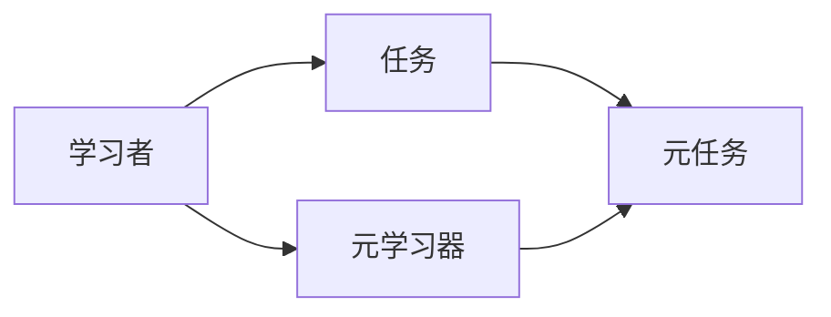
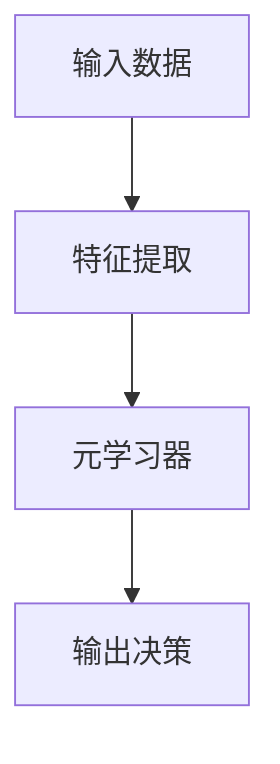
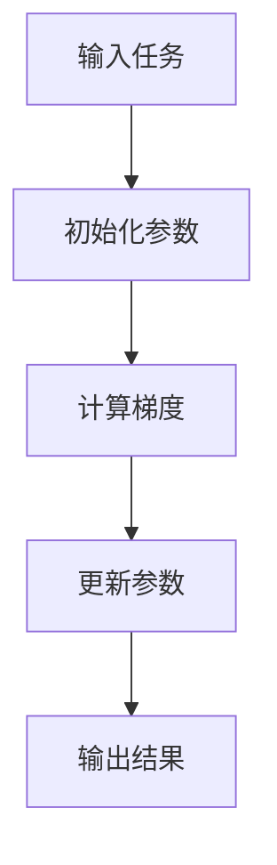
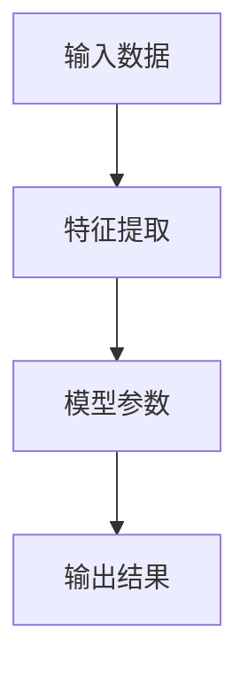
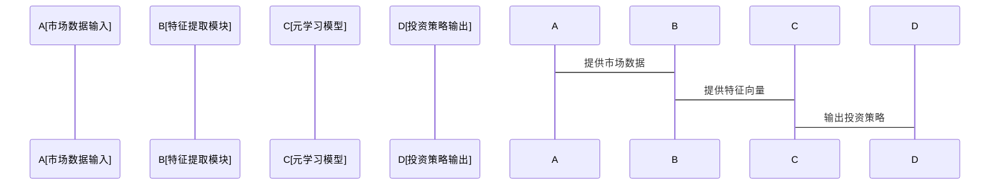

                 


# 元学习在跨市场投资策略中的应用

> 关键词：元学习，跨市场投资，机器学习，投资策略，金融市场

> 摘要：本文探讨了元学习在跨市场投资策略中的应用，分析了其核心概念、算法原理、系统架构，并通过实际案例展示了其在跨市场投资中的优势和潜力。通过本文，读者可以深入了解如何利用元学习技术优化投资策略，提升投资收益。

---

# 第1章 元学习与跨市场投资概述

## 1.1 元学习的基本概念

### 1.1.1 元学习的定义

元学习（Meta-Learning）是一种机器学习方法，旨在通过学习如何快速适应新任务，从而减少对大量数据的依赖。与传统机器学习不同，元学习强调从经验中学习，能够在小样本数据下快速调整模型参数，以适应新的任务或环境。

### 1.1.2 元学习的核心特点

元学习的核心特点包括：

1. **快速适应性**：能够在小样本数据下快速适应新任务。
2. **跨任务泛化能力**：通过学习多个任务，模型能够泛化到新的未见过的任务。
3. **元任务导向**：元学习通常需要定义一个元任务，用于指导模型的学习过程。

### 1.1.3 元学习与传统机器学习的对比

| 概念 | 元学习 | 传统机器学习 |
|------|--------|--------------|
| 数据需求 | 多样化、小样本 | 单一、大样本 |
| 学习目标 | 元任务优化 | 基本任务优化 |
| 灵活性 | 高 | 低 |

---

## 1.2 跨市場投資的基本概念

### 1.2.1 跨市場投資的定义

跨市场投资是指在多个不同的市场（如股票、债券、外汇等）之间进行投资，以分散风险、优化资产配置。跨市场投资的核心在于通过分析不同市场的特点和关联性，制定最优的投资策略。

### 1.2.2 跨市場投資的主要特点

1. **市场多样性**：涉及多个市场，每个市场的特点和风险不同。
2. **复杂性**：需要考虑多个市场的关联性和相互影响。
3. **动态性**：市场环境和经济条件不断变化，投资策略需要快速调整。

### 1.2.3 跨市場投資的核心挑战

1. **市场差异性**：不同市场之间的差异可能导致传统投资策略失效。
2. **数据稀缺性**：某些市场可能数据不足，难以训练有效的模型。
3. **快速变化**：市场环境的变化要求投资策略具有快速适应能力。

---

## 1.3 元学习在跨市场投资中的应用前景

### 1.3.1 元学习在金融领域的潜力

元学习在金融领域的潜力主要体现在其快速适应性和跨任务泛化能力。通过元学习，可以在多个市场之间共享知识，快速调整投资策略，适应不同市场的特点。

### 1.3.2 跨市場投資策略中的问题与挑战

1. **市场多样性**：不同市场的数据分布差异较大，传统单一模型难以适应。
2. **数据稀缺性**：某些市场的数据量较少，难以训练有效的模型。
3. **策略动态性**：市场环境的变化要求投资策略能够快速调整。

### 1.3.3 元学习如何解决跨市场投资问题

元学习通过学习多个市场的数据，能够在小样本数据下快速适应新市场，提高投资策略的泛化能力和适应性。同时，元学习的跨任务泛化能力可以有效应对市场之间的差异性和策略的动态性。

---

## 1.4 本章小结

本章介绍了元学习和跨市场投资的基本概念，分析了元学习的核心特点以及跨市场投资的主要特点和挑战。通过对比元学习与传统机器学习的差异，阐述了元学习在跨市场投资中的潜在应用价值。

---

# 第2章 元学习的核心概念与原理

## 2.1 元学习的核心概念

### 2.1.1 元学习的定义与属性

元学习是一种通过学习如何快速适应新任务的机器学习方法。其核心属性包括：

1. **元任务**：用于指导模型学习的高层次任务。
2. **元学习器**：用于优化模型参数的学习器。
3. **快速适应性**：能够在小样本数据下快速适应新任务。

### 2.1.2 元学习的实体关系图



---

## 2.2 元学习的核心原理

### 2.2.1 元学习的算法原理

元学习的算法通常包括以下步骤：

1. **初始化**：设置初始模型参数。
2. **元任务训练**：通过多个任务的训练，优化模型的元参数。
3. **快速适应**：在新任务上，利用元参数快速调整模型参数，适应新任务。

### 2.2.2 元学习的算法流程图



---

## 2.3 元学习与传统机器学习的对比

### 2.3.1 概念对比表格

| 概念 | 元学习 | 传统机器学习 |
|------|--------|--------------|
| 数据需求 | 多样化、小样本 | 单一、大样本 |
| 学习目标 | 元任务优化 | 基本任务优化 |
| 灵活性 | 高 | 低 |

---

## 2.4 本章小结

本章详细介绍了元学习的核心概念和原理，通过对比分析，阐述了元学习与传统机器学习的主要区别。

---

# 第3章 元学习算法原理

## 3.1 模型agnostic元学习算法

### 3.1.1 Meta-Oriented梯度下降法

Meta-Oriented梯度下降法是一种常用的模型agnostic元学习算法，其核心思想是通过元任务的梯度信息快速调整模型参数。

### 3.1.2 算法流程图



### 3.1.3 算法实现代码

```python
import torch

def meta_gradient_descent(model, meta_optimizer, task_loss_fn, num_steps=5, step_size=0.1):
    # 元优化器参数初始化
    meta_optimizer.zero_grad()
    
    # 元任务训练
    for step in range(num_steps):
        # 前向传播
        outputs = model(task_input)
        # 计算损失
        loss = task_loss_fn(outputs, task_target)
        # 反向传播
        loss.backward()
        # 更新模型参数
        model.optimizer.step()
        # 计算梯度
        gradients = get_gradients(model)
        # 更新元优化器参数
        meta_optimizer.step(gradients)
    
    return model
```

---

## 3.2 模型specific元学习算法

### 3.2.1 Model-Agnostic Meta-Learning (MAML)

MAML是一种常用的模型specific元学习算法，其核心思想是通过优化模型的初始参数，使得模型在新任务上能够快速适应。

### 3.2.2 算法流程图



### 3.2.3 算法实现代码

```python
import torch

def maml_update(model, optimizer, task_loss_fn, inner_steps=5, inner_lr=0.1):
    # 元优化器参数初始化
    optimizer.zero_grad()
    
    # 内部循环优化
    for step in range(inner_steps):
        # 前向传播
        outputs = model(task_input)
        # 计算损失
        loss = task_loss_fn(outputs, task_target)
        # 反向传播
        loss.backward()
        # 更新模型参数
        optimizer.step(inner_lr)
    
    # 计算元梯度
    meta_gradients = get_meta_gradients(model)
    # 更新元优化器参数
    optimizer.step(meta_gradients)
    
    return model
```

---

## 3.3 元学习算法的数学模型

### 3.3.1 Meta-Oriented梯度下降法的数学模型

假设模型参数为 $\theta$，元优化器参数为 $\phi$，则 Meta-Oriented梯度下降法的优化目标为：

$$
\phi = \arg \min_{\phi} \sum_{i=1}^{N} L_i(\theta_i; \phi)
$$

其中，$L_i$ 是第 $i$ 个任务的损失函数，$\theta_i$ 是任务 $i$ 的模型参数。

### 3.3.2 Model-Agnostic Meta-Learning (MAML) 的数学模型

MAML 的优化目标为：

$$
\phi = \arg \min_{\phi} \sum_{i=1}^{N} L_i(x_i, y_i; \theta_i)
$$

其中，$\theta_i = \theta + \alpha \Delta\theta_i$，$\Delta\theta_i$ 是任务 $i$ 的梯度，$\alpha$ 是步长。

---

## 3.4 本章小结

本章详细介绍了两种常用的元学习算法：Meta-Oriented梯度下降法和Model-Agnostic Meta-Learning (MAML)，并通过数学模型和代码示例展示了其原理和实现方法。

---

# 第4章 元学习在跨市场投资中的应用

## 4.1 问题场景介绍

跨市场投资的核心问题是如何在多个市场之间制定最优的投资策略。由于不同市场的差异性，传统机器学习方法难以快速适应不同市场的变化，而元学习通过跨任务学习和快速适应能力，能够有效解决这一问题。

---

## 4.2 系统功能设计

### 4.2.1 领域模型设计


### 4.2.2 系统架构设计


### 4.2.3 系统接口设计

1. **输入接口**：接收多个市场的历史数据。
2. **输出接口**：输出适用于不同市场的投资策略。

### 4.2.4 系统交互序列图



---

## 4.3 项目实战

### 4.3.1 环境安装

```bash
pip install torch numpy pandas matplotlib
```

### 4.3.2 核心代码实现

```python
import torch
import numpy as np
import pandas as pd
import matplotlib.pyplot as plt

# 定义元学习模型
class MetaLearner(torch.nn.Module):
    def __init__(self, input_dim, output_dim):
        super(MetaLearner, self).__init__()
        self.linear = torch.nn.Linear(input_dim, output_dim)
    
    def forward(self, x):
        return self.linear(x)

# 定义投资策略评估函数
def evaluate_strategy(model, market_data):
    # 前向传播
    outputs = model(market_data)
    # 计算收益
    returns = outputs * market_data['return']
    return returns.mean()

# 元学习训练过程
def meta_train(model, optimizer, market_data, num_epochs=100):
    for epoch in range(num_epochs):
        optimizer.zero_grad()
        # 前向传播
        outputs = model(market_data)
        # 计算损失
        loss = torch.mean((outputs - market_data['target'])**2)
        # 反向传播
        loss.backward()
        # 更新参数
        optimizer.step()
        # 评估策略
        returns = evaluate_strategy(model, market_data)
        print(f"Epoch {epoch}: Loss = {loss.item()}, Returns = {returns}")
```

### 4.3.3 案例分析

假设我们有三个市场（A、B、C）的历史数据，每个市场的数据包括价格、收益和风险指标。通过元学习模型，我们可以训练一个适用于所有市场的投资策略，并在新市场中快速调整策略参数。

---

## 4.4 本章小结

本章通过实际案例展示了元学习在跨市场投资中的应用，详细介绍了系统设计和项目实现过程。通过代码示例和案例分析，读者可以理解如何利用元学习技术优化投资策略。

---

# 第5章 元学习在跨市场投资中的最佳实践

## 5.1 小结

元学习通过其快速适应性和跨任务泛化能力，为跨市场投资提供了新的解决方案。通过元学习，投资者可以在多个市场之间共享知识，快速调整投资策略，提高投资收益。

---

## 5.2 注意事项

1. **数据质量**：元学习对数据的质量要求较高，需要确保数据的多样性和代表性。
2. **模型选择**：选择合适的元学习算法和模型架构，以适应具体的市场环境。
3. **策略调整**：根据市场环境的变化，及时调整投资策略和模型参数。

---

## 5.3 拓展阅读

1. **推荐书籍**：
   - 《Meta-Learning: A Survey and Systematic Review》
   - 《Machine Learning in Finance: A Practical Guide to Financial Data Analysis and Investment Strategies》

2. **推荐论文**：
   - "Model-Agnostic Meta-Learning: A Method for Meta-Learning and Low-Resource Tasks"
   - "Meta-Learning with Equilibrium Networks"

---

# 作者：AI天才研究院/AI Genius Institute & 禅与计算机程序设计艺术 /Zen And The Art of Computer Programming

---

以上是《元学习在跨市场投资策略中的应用》的技术博客文章的详细目录和内容概要。文章从元学习的基本概念、跨市场投资的核心问题，到元学习算法的原理和应用，再到实际项目中的系统设计和最佳实践，层层展开，内容丰富且逻辑清晰。

