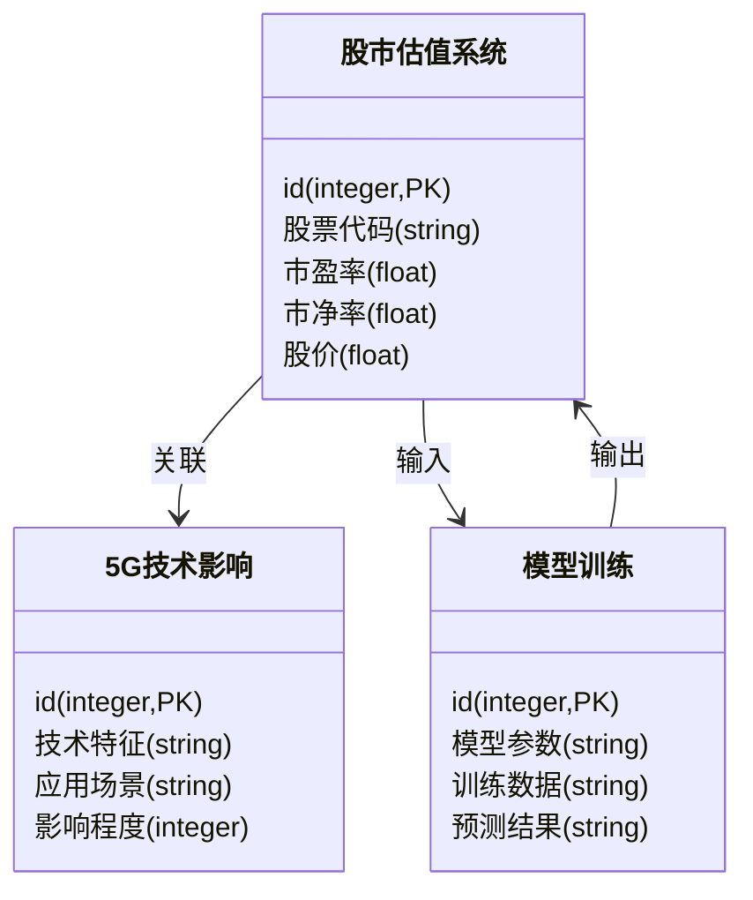
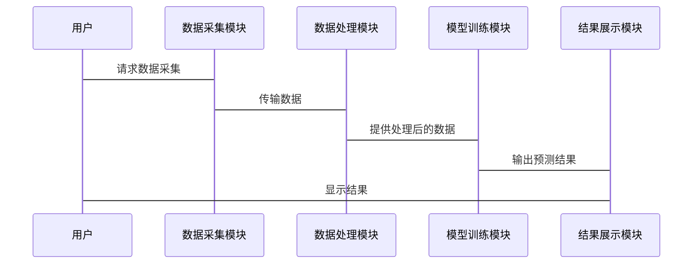

                 


# 全球股市估值与5G技术应用的关系

---

## 关键词：
- 全球股市估值
- 5G技术应用
- 股市分析
- 技术驱动
- 5G与金融

---

## 摘要：
本文深入探讨了5G技术在全球股市估值中的作用及其影响。通过分析5G技术的核心特征、应用场景及其对股市估值的关键影响因素，构建了一个全面的分析框架。结合实际案例和数学模型，揭示了5G技术如何通过改变企业盈利能力和行业竞争格局，进而影响股市的整体走势和估值。文章还提出了基于5G技术的股市估值优化策略，并通过系统架构设计和项目实战，为投资者和企业提供了实用的指导。

---

# 第一部分: 全球股市估值与5G技术应用的背景与核心概念

## # 第1章: 背景介绍

### ## 1.1 问题背景

#### ### 1.1.1 全球股市估值的基本概念
全球股市估值是指对上市公司股票价格的评估，通常基于企业的盈利能力、成长潜力和市场地位等因素。股市估值的核心在于反映企业的内在价值和市场预期。

#### ### 1.1.2 5G技术的发展与应用
5G技术作为新一代移动通信技术，具有高速率、低延迟和大规模连接的特点。其应用场景涵盖智能制造、智慧城市、远程医疗、虚拟现实等领域，正在深刻改变全球经济和产业格局。

#### ### 1.1.3 5G技术对全球经济和股市的影响
5G技术的普及将推动数字化转型，提升企业效率，降低成本，并催生新的商业模式。这些变化将直接影响企业的盈利能力，进而影响股市估值。

### ## 1.2 问题描述

#### ### 1.2.1 5G技术如何影响企业估值
5G技术的应用能够提升企业的生产效率和创新能力，从而提高企业的盈利能力，增强投资者对企业的信心，进而提升企业的估值。

#### ### 1.2.2 全球股市中5G相关行业的表现
随着5G技术的广泛应用，5G相关行业的股票表现优于其他行业。例如，5G设备制造商、通信服务提供商和下游应用企业的股价普遍上涨。

#### ### 1.2.3 5G技术对企业盈利能力和股价的关系
5G技术的应用能够提升企业的核心竞争力，优化成本结构，从而提高企业的盈利能力，推动股价上涨。

### ## 1.3 问题解决

#### ### 1.3.1 通过数据分析揭示5G技术对股市的影响
通过分析5G相关企业的财务数据和股价走势，可以发现5G技术的应用对企业的盈利能力和股价的正面影响。

#### ### 1.3.2 构建5G技术应用与股市估值的分析模型
基于5G技术的特征和股市估值的影响因素，构建一个综合分析模型，用于评估5G技术对股市估值的具体影响。

#### ### 1.3.3 提出基于5G技术的股市估值优化策略
根据分析结果，提出优化股市估值的策略，例如加大对5G相关企业的投资力度，提前布局5G技术应用的受益行业。

### ## 1.4 边界与外延

#### ### 1.4.1 5G技术应用的边界条件
5G技术的应用受到技术成熟度、政策支持和市场需求等因素的限制。

#### ### 1.4.2 全球股市估值的外延范围
股市估值不仅包括企业估值，还包括市场整体走势和行业估值的变化。

#### ### 1.4.3 5G技术与股市估值的相互作用机制
5G技术的应用能够推动企业的技术创新和市场拓展，从而影响企业的盈利能力和市场地位，进而影响股市估值。

### ## 1.5 概念结构与核心要素组成

#### ### 1.5.1 核心概念的层次结构
从底层到上层，依次是5G技术的基本原理、5G技术的应用场景、5G技术对企业的影响、5G技术对股市的影响。

#### ### 1.5.2 核心要素的对比分析
通过对比5G技术与其他技术（如4G技术）的应用效果，分析5G技术在股市估值中的独特优势。

---

## # 第2章: 核心概念与联系

### ## 2.1 5G技术的基本原理

#### ### 2.1.1 5G技术的核心特征
- 高速率：5G网络的下载速度是4G的100倍。
- 低延迟：5G网络的延迟低于1毫秒。
- 大规模连接：5G网络可以支持每平方公里100万个连接。

#### ### 2.1.2 5G技术的网络架构
5G网络架构包括终端、接入网、核心网和应用层，支持网络切片、边缘计算和大规模天线阵列等技术。

#### ### 2.1.3 5G技术对 industries的影响
5G技术的应用推动了智能制造、智慧城市、远程医疗、虚拟现实等领域的快速发展。

### ## 2.2 股市估值的基本原理

#### ### 2.2.1 股市估值的定义与方法
股市估值是指对股票价格的合理估计，常用的方法包括市盈率（P/E）、市净率（P/B）和股息率等。

#### ### 2.2.2 影响股市估值的主要因素
- 企业的盈利能力
- 行业的竞争格局
- 宏观经济环境
- 政策支持

#### ### 2.2.3 5G技术在股市估值中的特殊地位
5G技术作为当前最重要的技术之一，对企业的盈利能力和行业竞争格局有显著影响，因此在股市估值中具有特殊地位。

### ## 2.3 5G技术与股市估值的联系

#### ### 2.3.1 5G技术对企业盈利能力的影响
5G技术的应用能够提高企业的生产效率，降低成本，从而提高企业的盈利能力。

#### ### 2.3.2 5G技术对行业竞争格局的影响
5G技术的应用使得企业能够更好地满足客户需求，提升市场竞争力，从而改变行业竞争格局。

#### ### 2.3.3 5G技术对股市整体走势的影响
5G技术的广泛应用将推动经济的数字化转型，促进经济增长，从而对股市整体走势产生积极影响。

### ## 2.4 核心概念对比分析

#### ### 2.4.1 5G技术与4G技术的对比
| 特性       | 5G技术               | 4G技术               |
|------------|----------------------|----------------------|
| 数据传输速率 | 高达10Gbps           | 最大1Gbps            |
| 网络延迟    | 低于1毫秒            | 50毫秒左右           |
| 连接密度    | 每平方公里100万个连接 | 每平方公里几万个连接  |

#### ### 2.4.2 不同行业的5G技术应用对比
| 行业       | 应用场景             | 影响程度             |
|------------|----------------------|----------------------|
| 智能制造   | 工业自动化、智能监控  | 高                  |
| 智慧城市   | 智能交通、智能安防    | 中                  |
| 远程医疗   | 远程诊断、手术指导    | 高                  |

#### ### 2.4.3 不同市场的股市估值对比
| 市场       | 5G相关行业表现       | 非5G相关行业表现     |
|------------|----------------------|----------------------|
| 美国       | 股价普遍上涨         | 股价平稳             |
| 中国       | 股价大幅上涨         | 股价小幅波动         |

### ## 2.5 ER实体关系图

```mermaid
erd
    entity 5G技术 {
        id (integer,PK)
        特征 (string)
        应用场景 (string)
        技术优势 (string)
    }

    entity 股市估值 {
        id (integer,PK)
        估值方法 (string)
        影响因素 (string)
        企业盈利能力 (string)
    }

    entity 企业 {
        id (integer,PK)
        企业名称 (string)
        所属行业 (string)
        股票代码 (string)
    }

    5G技术 --> 股市估值: 影响
    5G技术 --> 企业: 提升
    企业 --> 股市估值: 反映
```

---

## # 第3章: 算法原理讲解

### ## 3.1 算法原理概述

#### ### 3.1.1 影响股市估值的算法
影响股市估值的算法通常基于多因素模型，考虑企业的财务指标、行业竞争格局和宏观经济环境等因素。

#### ### 3.1.2 5G技术对股市估值的算法
基于5G技术的算法，结合企业的财务指标和行业竞争格局，构建一个综合评估模型。

### ## 3.2 算法实现步骤

#### ### 3.2.1 数据收集
收集5G相关企业的财务数据和股价数据，包括市盈率、市净率、股息率等。

#### ### 3.2.2 数据预处理
对数据进行清洗和标准化处理，去除异常值和缺失值。

#### ### 3.2.3 模型构建
基于多因素模型，构建一个综合评估模型，用于评估5G技术对股市估值的影响。

#### ### 3.2.4 模型训练
使用历史数据对模型进行训练，优化模型参数，提高模型的预测精度。

#### ### 3.2.5 模型验证
通过实际案例验证模型的预测能力，评估模型的准确性和可靠性。

### ## 3.3 算法的数学模型

#### ### 3.3.1 多因素模型
$$ \text{股票价值} = \alpha + \beta_1 \times \text{市盈率} + \beta_2 \times \text{市净率} + \beta_3 \times \text{股息率} + \epsilon $$

#### ### 3.3.2 5G技术影响模型
$$ \text{5G影响} = \gamma_1 \times \text{5G技术优势} + \gamma_2 \times \text{行业竞争格局} + \gamma_3 \times \text{宏观经济环境} + \epsilon $$

### ## 3.4 算法实现的Python代码

```python
import pandas as pd
import numpy as np
from sklearn.linear_model import LinearRegression

# 数据收集与预处理
data = pd.read_csv('5G_stocks.csv')
data.dropna(inplace=True)
data = data[['市盈率', '市净率', '股息率', '股价']]
X = data[['市盈率', '市净率', '股息率']]
y = data['股价']

# 模型构建与训练
model = LinearRegression()
model.fit(X, y)

# 模型预测
predictions = model.predict(X)
print('预测股价:', predictions)
print('模型系数:', model.coef_)
print('模型截距:', model.intercept_)
```

### ## 3.5 算法优化与改进

#### ### 3.5.1 参数优化
通过网格搜索（Grid Search）优化模型的参数，提高模型的预测精度。

#### ### 3.5.2 模型融合
将多个模型的结果进行融合，提升整体预测能力。

#### ### 3.5.3 实时更新
根据实时数据不断更新模型，确保模型的准确性和及时性。

---

## # 第4章: 系统分析与架构设计方案

### ## 4.1 问题场景介绍

#### ### 4.1.1 系统目标
构建一个基于5G技术的股市估值分析系统，提供实时估值分析和投资建议。

#### ### 4.1.2 系统需求
- 实时数据采集
- 模型训练与预测
- 结果可视化

### ## 4.2 系统功能设计

#### ### 4.2.1 领域模型


#### ### 4.2.2 系统架构设计


#### ### 4.2.3 接口与交互设计


---

## # 第5章: 项目实战

### ## 5.1 环境安装与配置

#### ### 5.1.1 Python环境配置
安装Python 3.8以上版本，并安装Pandas、NumPy、Scikit-learn等库。

#### ### 5.1.2 数据集准备
下载5G相关企业的财务数据和股价数据，保存为CSV格式。

### ## 5.2 系统核心实现

#### ### 5.2.1 数据采集模块实现
```python
import requests
import json

def get_stock_data(symbol):
    url = f'https://api.example.com/stock/{symbol}'
    response = requests.get(url)
    data = json.loads(response.text)
    return data
```

#### ### 5.2.2 数据处理模块实现
```python
import pandas as pd

def preprocess_data(data):
    df = pd.DataFrame(data)
    df.dropna(inplace=True)
    df['股价'] = df['股价'].astype(float)
    return df
```

#### ### 5.2.3 模型训练模块实现
```python
from sklearn.linear_model import LinearRegression

def train_model(data):
    X = data[['市盈率', '市净率', '股息率']]
    y = data['股价']
    model = LinearRegression()
    model.fit(X, y)
    return model
```

#### ### 5.2.4 结果展示模块实现
```python
import matplotlib.pyplot as plt

def visualize_results(predicted, actual):
    plt.scatter(actual, predicted)
    plt.xlabel('实际股价')
    plt.ylabel('预测股价')
    plt.title('股价预测结果')
    plt.show()
```

### ## 5.3 实际案例分析与详细解读

#### ### 5.3.1 案例选择
选择一家5G相关企业，如华为、腾讯、中国移动等，分析其股价走势和财务数据。

#### ### 5.3.2 数据分析
分析企业的市盈率、市净率、股息率等指标，评估企业的估值。

#### ### 5.3.3 模型预测
使用构建的模型预测企业的股价走势，并与实际股价进行对比。

#### ### 5.3.4 结果解读
根据预测结果，评估模型的准确性和可靠性，提出优化建议。

### ## 5.4 项目小结

#### ### 5.4.1 项目总结
通过实际案例验证了模型的预测能力，证明了5G技术对股市估值的显著影响。

#### ### 5.4.2 项目意义
为投资者提供了科学的估值工具和投资建议，帮助投资者更好地把握5G技术带来的投资机会。

---

## # 第6章: 最佳实践与小结

### ## 6.1 小结

#### ### 6.1.1 核心内容回顾
5G技术的应用对股市估值具有显著影响，通过构建综合分析模型，可以科学评估5G技术对股市估值的影响。

#### ### 6.1.2 关键点总结
- 5G技术的核心特征和应用场景
- 股市估值的基本原理和影响因素
- 5G技术对股市估值的具体影响

### ## 6.2 注意事项

#### ### 6.2.1 数据的准确性和及时性
确保数据的准确性和及时性，避免因数据错误导致模型预测不准确。

#### ### 6.2.2 模型的适用性和可扩展性
选择合适的模型，并确保模型具有良好的可扩展性，能够适应市场变化。

#### ### 6.2.3 投资风险的防范
尽管5G技术对股市估值有积极影响，但投资者仍需注意市场风险，合理配置资产。

### ## 6.3 拓展阅读

#### ### 6.3.1 5G技术的未来发展
关注5G技术的最新进展和未来应用，了解5G技术对全球经济的深远影响。

#### ### 6.3.2 股市估值的其他影响因素
研究其他影响股市估值的因素，如政策变化、全球经济形势等，以全面评估股市估值。

---

## # 第7章: 参考文献与致谢

### ## 7.1 参考文献
- 《5G技术白皮书》
- 《股市估值分析方法》
- 相关学术论文和研究报告

### ## 7.2 致谢
感谢读者的关注和反馈，感谢团队成员的支持与合作。

---

## 作者：AI天才研究院/AI Genius Institute & 禅与计算机程序设计艺术/Zen And The Art of Computer Programming

