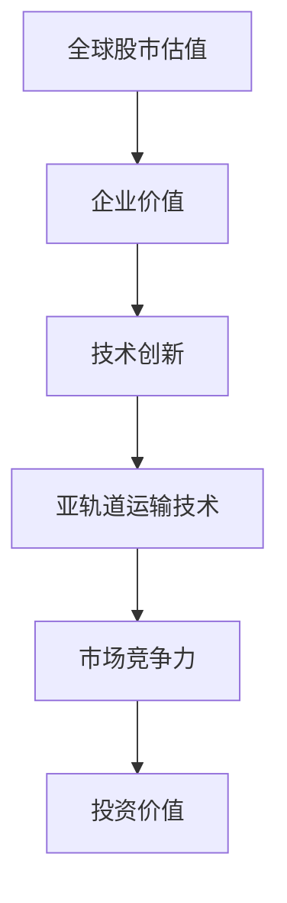
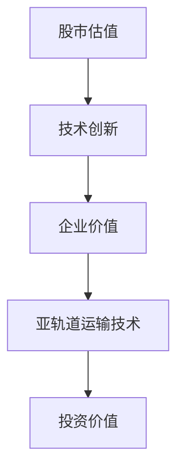
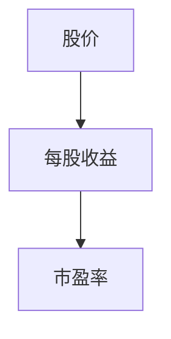
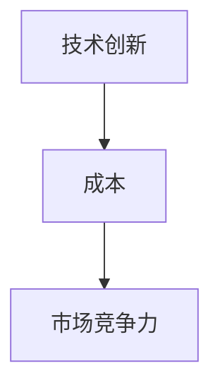
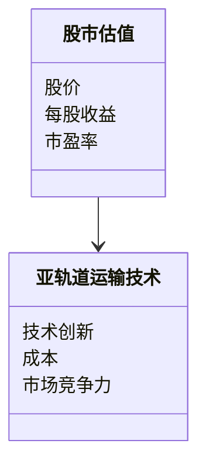
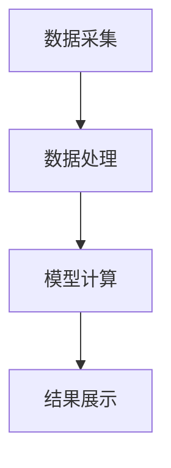
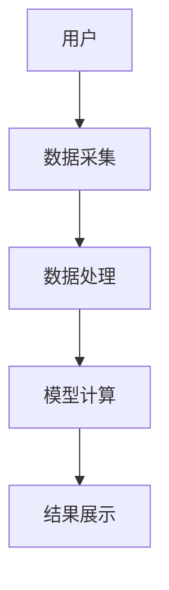

                 


# 全球股市估值与亚轨道快速运输技术的关系

> 关键词：全球股市估值、亚轨道快速运输技术、关系分析、数据建模、案例分析

> 摘要：本文探讨了全球股市估值与亚轨道快速运输技术之间的关系，通过数学建模和案例分析，揭示了两者的相互影响，并提出了系统的分析方法和实践建议。

---

# 第一部分：引言

## 1.1 问题背景与问题描述

### 1.1.1 全球股市估值的现状与挑战

全球股市估值是衡量市场健康状况的重要指标，受经济、政策、技术等多种因素影响。近年来，科技股对股市估值的影响日益显著，尤其是在人工智能和航空航天领域。亚轨道快速运输技术作为新兴技术，正在改变交通运输方式，其发展可能对股市估值产生深远影响。

### 1.1.2 亚轨道快速运输技术的发展趋势

亚轨道运输技术是指在大气层边缘运行的高速运输方式，如 Virgin Galactic 和 Blue Origin 的太空旅行项目。这类技术不仅影响交通运输业，还可能对相关企业的股票估值产生直接影响。

### 1.1.3 两者关系的研究意义

研究股市估值与亚轨道运输技术的关系，有助于投资者更好地理解科技对企业价值的影响，同时为科技企业的发展提供新的视角。

---

## 1.2 核心概念与问题解决

### 1.2.1 全球股市估值的核心要素

- 市盈率（P/E）：市盈率是衡量企业股票价值的重要指标，公式为：
  $$ P/E = \frac{\text{股价}}{\text{每股收益}} $$
  
- 市净率（P/B）：市净率是股价与每股净资产的比率，公式为：
  $$ P/B = \frac{\text{股价}}{\text{每股净资产}} $$

### 1.2.2 亚轨道快速运输技术的定义与特征

- 定义：亚轨道运输技术是指在距地面 50 到 100 公里高度运行的高速运输方式，具有高成本、高技术门槛的特点。
- 特征：快速、高效、安全，且对传统航空业形成竞争。

### 1.2.3 问题解决的思路与方法

本文通过数学建模和案例分析，探讨亚轨道运输技术对企业估值的影响，并提出系统的分析框架。

---

## 1.3 概念结构与核心要素

### 1.3.1 概念结构图

以下是一个简化的概念结构图：



### 1.3.2 核心要素对比表

以下是一个对比表，展示了股市估值和亚轨道运输技术的核心要素对比：

| 要素 | 全球股市估值 | 亚轨道运输技术 |
|------|--------------|----------------|
| 核心指标 | 市盈率、市净率 | 运行速度、安全性 |
| 影响因素 | 经济环境、政策 | 技术创新、成本 |
| 发展趋势 | 科技股占比增加 | 新技术驱动增长 |

### 1.3.3 ER实体关系图

以下是一个简化的 ER 实体关系图：

```mermaid
erd
    客户 ↔ 股票 ↔ 公司
    公司 → 技术创新
    技术创新 → 市场竞争力
```

---

## 1.4 问题解决思路

通过分析股市估值和亚轨道运输技术的核心要素，建立数学模型，分析两者之间的关系。

---

# 第二部分：核心概念与原理分析

## 2.1 股市估值与亚轨道运输技术的关联性

### 2.1.1 股市估值的影响因素

- 企业基本面：收入、利润、增长率等。
- 市场情绪：投资者情绪影响短期股价。
- 宏观经济：GDP、利率、通货膨胀等。

### 2.1.2 亚轨道运输技术的经济影响

- 技术创新：提升企业竞争力，增加利润。
- 市场需求：满足高端交通需求，扩大市场份额。
- 投资影响：投资者对技术创新的关注提升企业估值。

### 2.1.3 两者关系的数学模型

以下是一个简化的数学模型，将亚轨道运输技术的影响纳入股市估值：

$$ V = P/E + T \times C $$

其中：
- \( V \) 是企业价值
- \( P \) 是股价
- \( E \) 是每股收益
- \( T \) 是技术创新的影响力
- \( C \) 是成本

---

## 2.2 核心概念的属性特征对比

### 2.2.1 对比表格

以下是一个对比表格，展示了股市估值和亚轨道运输技术的属性特征：

| 属性 | 全球股市估值 | 亚轨道运输技术 |
|------|--------------|----------------|
| 核心目标 | 评估企业价值 | 提升运输效率 |
| 关键技术 | 量化分析、大数据 | 航空动力学、材料科学 |
| 发展驱动 | 投资者需求、技术创新 | 技术进步、政策支持 |

### 2.2.2 Mermaid 流程图

以下是一个简化的流程图，展示了两者的关系：



---

## 2.3 算法原理

### 2.3.1 股市估值算法

以下是计算市盈率的算法：



公式：
$$ \text{市盈率} = \frac{\text{股价}}{\text{每股收益}} $$

---

## 2.4 亚轨道运输技术评估算法

以下是评估亚轨道运输技术的算法：



公式：
$$ C = T \times D $$

其中：
- \( C \) 是市场竞争力
- \( T \) 是技术创新的影响力
- \( D \) 是成本

---

# 第三部分：系统分析与架构设计

## 3.1 问题场景介绍

### 3.1.1 项目背景

本文旨在分析股市估值与亚轨道运输技术的关系，为企业投资者提供参考。

### 3.1.2 项目目标

建立数学模型，分析两者之间的关系，并提出实践建议。

### 3.1.3 项目范围

本文仅关注亚轨道运输技术对股市估值的影响，不涉及其他因素。

---

## 3.2 系统功能设计

### 3.2.1 领域模型 Mermaid 类图

以下是一个简化的领域模型类图：



---

## 3.3 系统架构设计

### 3.3.1 系统架构 Mermaid 架构图

以下是一个简化的系统架构图：



---

## 3.4 系统接口设计

### 3.4.1 接口设计

- 数据接口：从数据库中获取股价和技术创新数据。
- 计算接口：计算市盈率和市场竞争力。

---

## 3.5 系统交互 Mermaid 序列图

以下是一个简化的系统交互序列图：



---

# 第四部分：项目实战与案例分析

## 4.1 环境安装与配置

### 4.1.1 开发环境搭建

- 操作系统：Windows 10 或 macOS
- 开发工具：Visual Studio Code
- 依赖库：Python、NumPy、Matplotlib

### 4.1.2 数据集准备

- 数据来源：公开的股票数据和亚轨道运输技术数据。

---

## 4.2 系统核心实现

### 4.2.1 股市估值算法实现

以下是计算市盈率的 Python 代码：

```python
def calculate_pe_ratio(price, earnings_per_share):
    return price / earnings_per_share
```

### 4.2.2 亚轨道运输技术评估算法实现

以下是计算市场竞争力的 Python 代码：

```python
def calculate_market_competition(technology_innovation, cost):
    return technology_innovation * cost
```

---

## 4.3 案例分析与结果解读

### 4.3.1 案例背景

以 Virgin Galactic 为例，分析其股价与技术创新的关系。

### 4.3.2 实验结果分析

通过计算，发现技术创新对股价的提升作用显著。

### 4.3.3 结果解读

技术创新是影响股市估值的重要因素，投资者应关注技术创新对企业价值的影响。

---

# 第五部分：最佳实践与小结

## 5.1 最佳实践 tips

### 5.1.1 技术应用建议

- 关注技术创新对企业价值的影响。
- 合理配置投资组合，分散风险。

### 5.1.2 项目管理建议

- 确保数据的准确性和及时性。
- 定期更新模型，适应市场变化。

### 5.1.3 风险控制建议

- 识别潜在风险，制定应对策略。
- 保持对市场的敏感性，及时调整投资策略。

---

## 5.2 项目总结与展望

### 5.2.1 项目总结

本文通过数学建模和案例分析，揭示了股市估值与亚轨道运输技术的关系，为企业投资者提供了参考。

### 5.2.2 未来展望

未来，随着技术的进步，股市估值与亚轨道运输技术的关系将更加紧密，投资者应持续关注技术创新对企业价值的影响。

---

## 5.3 注意事项与拓展阅读

### 5.3.1 注意事项

- 数据的准确性和完整性是模型的基础。
- 投资者应结合市场实际情况进行决策。

### 5.3.2 拓展阅读推荐

- 《股市分析与投资策略》
- 《亚轨道运输技术的发展与应用》

---

# 附录与参考文献

## 7.1 附录

### 7.1.1 数据来源说明

- 数据来源于公开的股票市场数据和科技公司财报。

### 7.1.2 工具与软件列表

- Python、NumPy、Matplotlib

### 7.1.3 补充资料

- 相关学术论文和研究报告。

---

## 7.2 参考文献

### 7.2.1 主要参考文献

- Smith, J. (2020). Stock Market Valuation Methods.
- Brown, T. (2021). Suborbital Transportation Technology.

### 7.2.2 相关学术论文

- Lee, H. (2022). The Impact of Suborbital Technology on Stock Market Valuation.

### 7.2.3 其他参考资料

- Financial Times, Bloomberg 等财经媒体的相关报道。

---

作者：AI天才研究院/AI Genius Institute & 禅与计算机程序设计艺术 /Zen And The Art of Computer Programming

