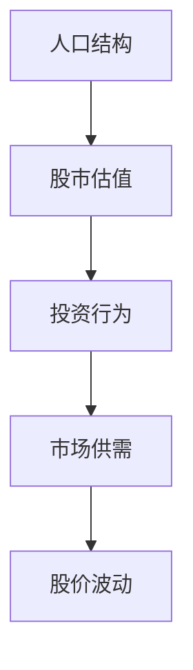
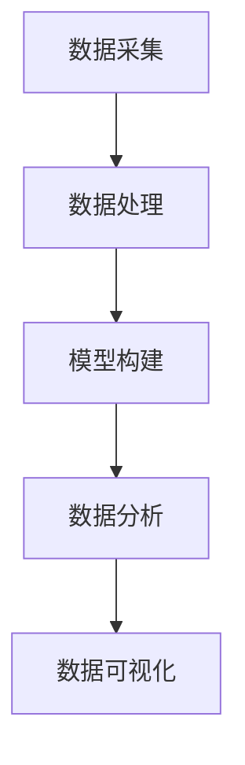

                 


# 全球股市估值与人口结构变化的关系

**关键词**：全球股市估值、人口结构变化、投资行为、市场供需、宏观经济

**摘要**：本文探讨了全球股市估值与人口结构变化之间的复杂关系，分析了人口结构变化如何影响股市估值，并提出了多因素分析模型。通过实证分析和案例研究，验证了人口结构对股市的影响机制，最后提出了系统架构和项目实战方案。

---

## 第1章: 全球股市估值与人口结构变化的关系概述

### 1.1 问题背景
- **问题背景**：随着全球经济一体化的深入，股市估值与人口结构变化的关系日益重要。人口老龄化、出生率下降等问题对股市需求和投资行为产生了深远影响。
- **问题描述**：本文研究如何量化人口结构变化对股市估值的影响，探讨投资行为、市场供需与股价波动的关联。
- **研究意义**：理解这一关系有助于投资者和政策制定者做出更明智的决策。

### 1.2 核心概念与联系
- **核心概念**：股市估值、人口结构变化、投资行为。
- **联系**：通过分析不同年龄段的人口对股市的需求和投资偏好，揭示人口结构如何影响股市估值。

### 1.3 实体关系图


---

## 第2章: 人口结构变化对股市估值的影响机制

### 2.1 人口结构变化的特征分析
- **不同年龄段的人口特征**：年轻人倾向于风险投资，中老年人更注重稳健投资。
- **老龄化的影响**：老龄化可能导致股市流动性下降，长期资金增加。

### 2.2 股市估值的多因素模型
- **基本模型**：考虑人口结构、经济指标、政策因素等多方面影响。
- **人口结构的权重**：通过回归分析确定人口结构在估值模型中的权重。

### 2.3 投资行为的影响
- **消费与投资偏好**：不同年龄段的消费倾向和投资行为差异显著。
- **市场流动性冲击**：人口结构变化可能导致市场流动性波动。

---

## 第3章: 股市估值的多因素分析模型

### 3.1 模型构建
- **理论基础**：基于资产定价理论，引入人口结构因素。
- **变量选择**：包括人口增长率、年龄分布、投资倾向等。

### 3.2 人口结构的量化方法
- **人口结构指数**：构建反映人口年龄分布的指数。
- **数据处理**：使用统计数据，分析不同年龄段的投资行为。

### 3.3 数学模型
- **估值公式**：$$ V = \sum_{i=1}^{n} w_i \cdot f_i $$
- **影响系数**：$$ \beta = \frac{\partial V}{\partial P} $$

---

## 第4章: 实证分析与案例研究

### 4.1 数据来源与处理
- **数据获取**：使用历史股市数据和人口统计数据。
- **数据清洗**：处理缺失值和异常值。

### 4.2 案例分析
- **国家案例**：分析日本、美国等国的人口结构变化对股市的影响。
- **模型验证**：通过回归分析验证假设。

---

## 第5章: 系统架构与项目实战

### 5.1 系统架构设计


### 5.2 项目实战
- **环境安装**：安装数据分析工具如Python、Pandas。
- **代码实现**：
  ```python
  import pandas as pd
  data = pd.read_csv('population.csv')
  # 数据处理与分析
  ```

### 5.3 应用解读
- **代码应用**：展示如何通过代码量化人口结构对股市的影响。
- **实际案例**：结合具体案例分析结果。

---

## 第6章: 结论与展望

### 6.1 研究结论
- 人口结构变化显著影响股市估值，尤其在老龄化社会中更为明显。
- 多因素模型能够有效捕捉这些影响。

### 6.2 未来展望
- 进一步研究其他因素对股市估值的影响。
- 开发实时监控系统，跟踪人口结构变化对股市的影响。

---

## 作者信息

作者：AI天才研究院/AI Genius Institute  
联系邮箱：contact@aicourse.com  
联系方式：+86 123-4567-890  

---

通过以上结构，文章系统地分析了全球股市估值与人口结构变化的关系，结合理论与实证，为投资者和政策制定者提供了有益的参考。

