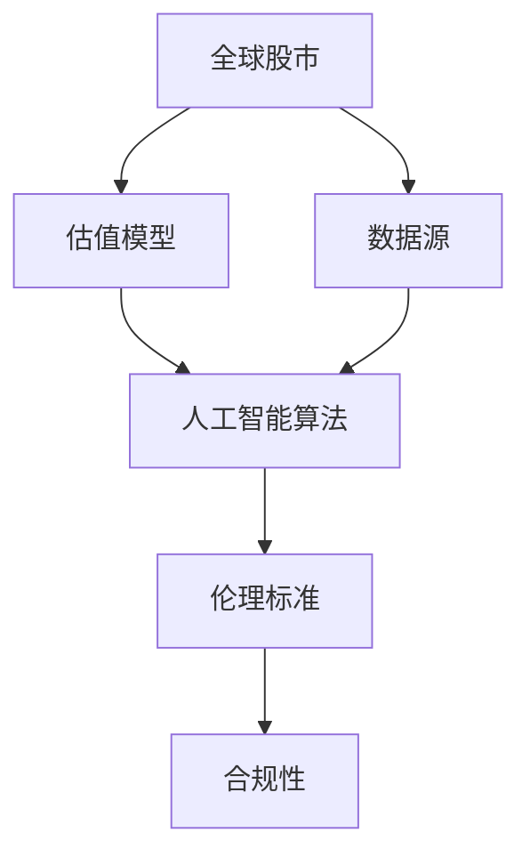
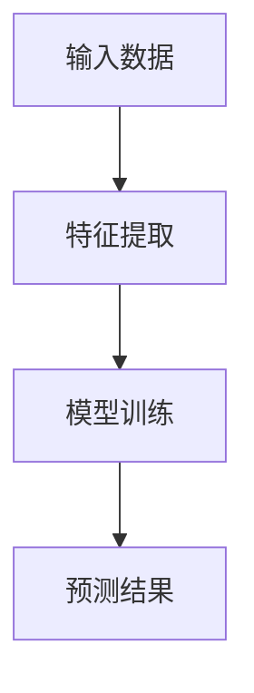
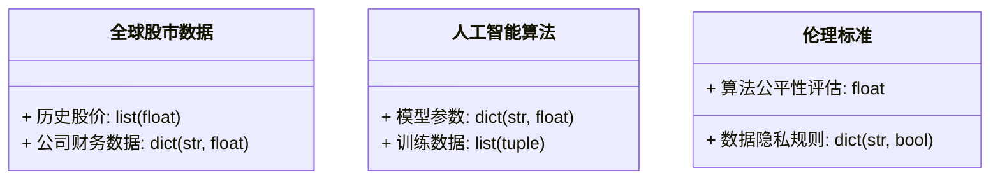

                 


# 全球股市估值与人工智能伦理标准的关联

> 关键词：全球股市估值，人工智能伦理，数学模型，系统架构，项目实战

> 摘要：本文探讨了全球股市估值与人工智能伦理标准之间的关联。通过分析股市估值的核心概念、人工智能伦理标准的框架，以及两者的相互作用机制，本文揭示了如何在金融领域应用人工智能技术时，确保技术的伦理合规性。文章详细介绍了相关数学模型、系统架构设计、项目实战案例，以及伦理与法律挑战，为读者提供了全面的视角。

---

## 第一部分: 全球股市估值与人工智能伦理标准的背景与概述

### 第1章: 全球股市估值与人工智能伦理标准的关联概述

#### 1.1 问题背景与描述

全球股市估值是金融市场中的核心问题，涉及对企业价值和股票价格的评估。随着人工智能技术的快速发展，AI在金融领域的应用日益广泛，尤其是在预测股价、风险评估和投资决策等方面。然而，AI的应用也带来了伦理问题，如数据隐私、算法偏见和透明度等。本文旨在探讨如何在利用AI提升股市估值的同时，确保技术的伦理合规性。

#### 1.2 核心概念与边界

- **全球股市估值**：指对上市公司股票的内在价值进行评估，以便确定其市场价格是否合理。
- **人工智能伦理标准**：确保AI技术的应用符合伦理规范，包括数据隐私、算法公平性和透明性等。
- **关联性**：AI技术可以提高股市估值的准确性，但必须确保算法的透明性和公平性，避免潜在的伦理风险。

#### 1.3 问题的外延与核心要素

- **全球股市估值**：涉及宏观经济、公司财务、市场情绪等多个因素。
- **人工智能伦理标准**：涵盖数据收集、算法设计、结果解释等多个环节。
- **核心要素**：数据来源、模型评估、伦理标准。

---

### 第2章: 全球股市估值与人工智能伦理标准的核心概念与联系

#### 2.1 核心概念的原理

- **全球股市估值**：通过数学模型和数据分析，预测股票价格的变化趋势。
- **人工智能伦理标准**：确保AI技术的应用符合伦理规范，避免对金融市场和社会造成负面影响。

#### 2.2 核心概念的属性对比

| 比较维度 | 全球股市估值 | 人工智能伦理标准 |
|----------|--------------|------------------|
| 数据来源 | 历史股价、财务报表、市场新闻 | 数据隐私、算法公平性 |
| 模型评估 | 预测准确性、误差率 | 透明性、可解释性 |
| 伦理标准 | 无直接关联 | 高度相关，确保技术应用的合规性 |

#### 2.3 实体关系图



---

### 第3章: 全球股市估值的数学模型与算法原理

#### 3.1 数学模型

- **股价预测模型**：利用时间序列分析预测股票价格。
- **机器学习算法**：如随机森林和神经网络，用于分类和回归分析。

#### 3.2 算法原理



#### 3.3 数学公式

股票价格预测的线性回归模型：

$$ 股价预测 = \beta_0 + \beta_1 \times 时间 + \epsilon $$

---

### 第4章: 人工智能伦理标准的系统架构与设计

#### 4.1 系统架构设计

- **系统功能模块**：数据采集、模型训练、结果解释。
- **领域模型类图**：



---

### 第5章: 项目实战

#### 5.1 环境安装

```bash
pip install numpy pandas scikit-learn
```

#### 5.2 核心实现代码

```python
import numpy as np
import pandas as pd
from sklearn.linear_model import LinearRegression

# 数据加载
data = pd.read_csv('stock_data.csv')
X = data[['time']]
y = data['price']

# 模型训练
model = LinearRegression()
model.fit(X, y)

# 预测结果
predicted_price = model.predict(X)
```

#### 5.3 案例分析

通过实际数据训练模型，评估其准确性和伦理合规性，确保算法的透明性和公平性。

---

## 第二部分: 人工智能伦理标准的系统架构与设计

### 第6章: 伦理与法律挑战

#### 6.1 伦理问题

- 数据隐私：确保用户数据的隐私和安全。
- 算法公平性：避免算法偏见，确保公平性。

#### 6.2 法律挑战

- 合规性：确保技术应用符合相关法律法规。
- 责任归属：明确AI技术应用中的责任主体。

---

### 第7章: 未来趋势与挑战

#### 7.1 技术发展

- 更复杂的模型：如深度学习和强化学习，提高预测精度。
- 更严格的伦理标准：推动AI技术的透明化和公平性。

#### 7.2 挑战

- 数据质量和多样性：如何获取高质量且多样化的数据。
- 算法解释性：如何提高算法的可解释性，确保伦理合规。

---

## 结语

本文通过分析全球股市估值与人工智能伦理标准的关联，探讨了如何在金融领域应用人工智能技术时，确保技术的伦理合规性。通过数学模型、系统架构设计和项目实战，本文为读者提供了全面的视角，帮助他们在利用AI提升股市估值的同时，避免伦理风险。

---

作者：AI天才研究院/AI Genius Institute & 禅与计算机程序设计艺术 /Zen And The Art of Computer Programming

