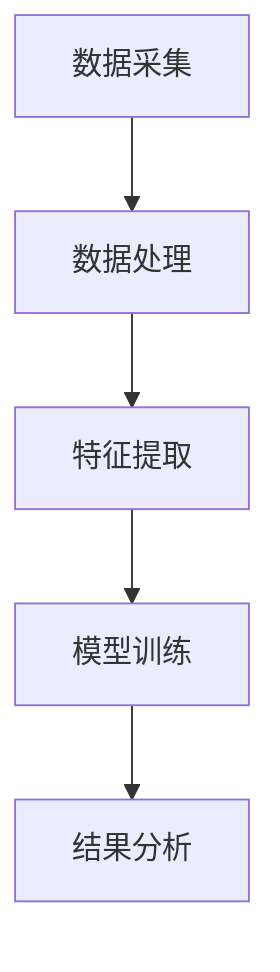

                 


# 全球股市估值与人工智能决策透明度的关联

> **关键词**：股市估值、人工智能、决策透明度、机器学习、深度学习  
> **摘要**：本文探讨了全球股市估值与人工智能决策透明度之间的关联，分析了传统估值方法与AI技术的结合，以及透明度对AI决策的影响。通过实际案例和系统设计，展示了如何提升AI在金融决策中的透明度，从而优化股市估值。

---

## 第一部分：引言

### 1. 问题背景与研究意义

随着全球金融市场的复杂化，股市估值的准确性和效率成为投资者和金融机构的核心关注点。人工智能（AI）技术的引入为股市分析提供了新的可能性，但其决策过程的透明度问题也随之浮现。本文旨在探讨AI在股市估值中的应用及其透明度问题，为优化金融决策提供理论和实践支持。

---

## 第二部分：背景介绍

### 2. 股市估值的基本概念

#### 2.1 传统估值方法

- **市盈率（P/E）**：衡量股票价格与每股收益的比例，公式为：
  $$ P/E = \frac{\text{股价}}{\text{每股收益}} $$
  
- **市净率（P/B）**：衡量股价与每股净资产的比率，公式为：
  $$ P/B = \frac{\text{股价}}{\text{每股净资产}} $$

- **现金流折现模型（DCF）**：通过预测未来现金流的现值来评估股票价值，公式为：
  $$ DCF = \sum_{t=1}^{n} \frac{CF_t}{(1+r)^t} $$

#### 2.2 现代金融理论

现代金融理论强调资产定价的内在因素，如无风险利率、市场风险溢价等。资本资产定价模型（CAPM）是其中的核心工具，公式为：
$$ E(r_i) = r_f + \beta_i (E(r_m) - r_f) $$

---

### 3. 人工智能在金融决策中的应用

#### 3.1 机器学习与深度学习

- **机器学习**：通过训练数据集预测股价，常用算法包括线性回归、支持向量机（SVM）和随机森林。
- **深度学习**：利用神经网络处理复杂数据，如LSTM网络擅长时间序列预测。

#### 3.2 AI在股市估值中的优势

- 高效数据处理能力
- 模式识别的准确性
- 实时分析能力

---

## 第三部分：核心概念与关联分析

### 4. 全球股市估值的核心概念

#### 4.1 估值方法的对比

| 方法       | 优点                           | 缺点                           |
|------------|--------------------------------|--------------------------------|
| 市盈率      | 简单易懂，适合短期分析         | 易受市场情绪影响               |
| 市净率      | 考虑资产价值，适合长期分析     | 忽略收益质量                   |
| DCF模型     | 精确预测未来现金流             | 需准确预测未来现金流           |

#### 4.2 人工智能在估值中的应用

- **特征提取**：从历史数据中提取有用的特征，如波动率、成交量等。
- **模型训练**：使用训练数据训练模型，预测股票未来价格。

---

### 5. 人工智能决策透明度的核心概念

#### 5.1 透明度的定义与分类

- **显式透明度**：决策过程可解释，如线性回归模型。
- **隐式透明度**：决策结果可验证，如神经网络模型。

#### 5.2 透明度的重要性

- 提高用户信任
- 便于监管审查
- 有助于模型优化

---

## 第四部分：算法原理

### 6. 机器学习算法

#### 6.1 线性回归

- **原理**：通过最小化预测值与实际值的平方差之和来拟合数据。
  $$ \text{损失函数} = \sum_{i=1}^{n} (y_i - \hat{y}_i)^2 $$

#### 6.2 LSTM网络

- **结构**：由记忆单元、输入门、遗忘门组成，适合处理时间序列数据。

---

### 7. 深度学习算法

#### 7.1 卷积神经网络（CNN）

- **应用**：用于图像识别，也可用于金融数据的空间模式识别。

---

## 第五部分：系统分析与架构设计

### 8. 系统架构设计

#### 8.1 系统功能设计

- 数据采集模块：从股票数据库获取数据。
- 数据处理模块：清洗和特征提取。
- 模型训练模块：训练机器学习模型。
- 结果分析模块：生成预测结果和透明度报告。

#### 8.2 系统架构图



---

## 第六部分：项目实战

### 9. 项目实现

#### 9.1 环境配置

- **Python**：3.8+
- **库**：Pandas、Scikit-learn、Keras

#### 9.2 核心代码

```python
import pandas as pd
from sklearn.linear_model import LinearRegression

# 数据加载
data = pd.read_csv('stock_data.csv')

# 特征与目标分离
X = data[['open', 'high', 'low', 'volume']]
y = data['close']

# 模型训练
model = LinearRegression()
model.fit(X, y)

# 预测
predicted = model.predict(X)
```

---

## 第七部分：总结与展望

### 10. 研究总结

- 本文探讨了AI在股市估值中的应用及其透明度问题。
- 通过分析传统方法与AI技术的结合，展示了如何优化金融决策。

### 11. 未来展望

- 提升AI决策透明度的技术创新
- 更广泛地应用到金融风险管理等领域

---

## 作者信息

作者：AI天才研究院（AI Genius Institute） & 禅与计算机程序设计艺术（Zen And The Art of Computer Programming）

---

通过以上结构，文章详细阐述了全球股市估值与人工智能决策透明度的关联，结合理论分析和实际案例，为读者提供了全面的理解和深入的见解。

