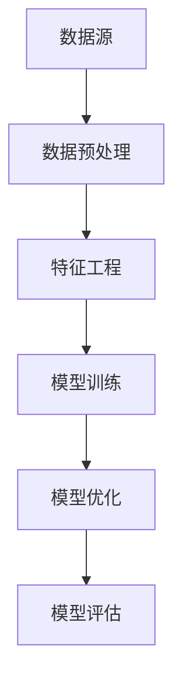
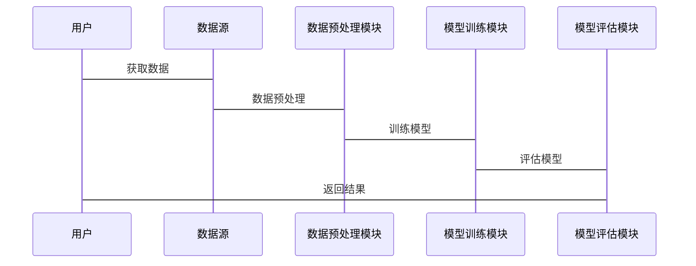

                 


# 全球股市估值与人工智能在供应链优化中的应用

> 关键词：全球股市估值、人工智能、供应链优化、机器学习、算法实现

> 摘要：本文探讨了全球股市估值的基本概念、影响因素及其传统估值方法，并深入分析了人工智能在供应链优化中的应用。通过结合这两者的应用，本文展示了如何利用人工智能技术优化全球股市估值与供应链管理。文章详细介绍了常见的人工智能算法及其在优化中的实现，并通过一个实战项目展示了如何在Python中实现这些算法。最后，本文总结了人工智能在金融和供应链领域的潜力，并提出了未来的研究方向。

---

## 第一部分: 全球股市估值的基础

### 第1章: 全球股市估值概述

#### 1.1 全球股市估值的定义与背景

股票市场估值是金融领域的重要组成部分，它通过对公司股票的价值进行评估，帮助投资者做出投资决策。全球股市估值涉及多个因素，包括宏观经济指标、行业状况和公司基本面等。随着科技的发展，人工智能在股市估值中的应用越来越广泛，能够帮助投资者更准确地预测市场趋势。

#### 1.2 影响股市估值的主要因素

##### 1.2.1 宏观经济因素
宏观经济因素如GDP增长率、通货膨胀率和利率等直接影响股市估值。例如，低利率环境通常会推高股市估值，因为投资者寻求更高收益的投资渠道。

##### 1.2.2 行业因素
行业的发展状况、竞争格局和政策变化也会影响股市估值。例如，科技行业的高增长潜力通常会使其股票具有较高的估值。

##### 1.2.3 公司基本面因素
公司基本面包括盈利能力、财务状况和管理团队等。例如，高利润率和良好的财务状况通常会提高公司的股市估值。

#### 1.3 传统股市估值方法

##### 1.3.1 市盈率（P/E）分析
市盈率是股票价格与每股收益的比率，用于衡量股票的相对价值。低市盈率可能意味着股票被低估，而高市盈率可能意味着高风险。

##### 1.3.2 市净率（P/B）分析
市净率是股票价格与每股净资产的比率，用于评估股票相对于其账面价值的高低。低市净率可能表示股票被低估。

##### 1.3.3 股息率分析
股息率是每股股息与股票价格的比率，用于评估股票的分红能力。高股息率可能吸引注重稳定收益的投资者。

---

### 第2章: 人工智能的基础

#### 2.1 人工智能的定义与应用领域

人工智能（AI）是指模拟人类智能的系统，广泛应用于金融、医疗、交通等领域。在金融领域，AI用于股票预测、风险评估和交易策略优化。

#### 2.2 机器学习与深度学习

##### 2.2.1 机器学习的定义与特点
机器学习是通过数据训练模型，使其能够从经验中学习并做出预测。例如，支持向量机（SVM）和随机森林常用于分类和回归任务。

##### 2.2.2 深度学习的定义与特点
深度学习是机器学习的一种，通过多层神经网络模拟人类大脑的学习方式。例如，卷积神经网络（CNN）常用于图像识别任务。

##### 2.2.3 机器学习与深度学习的区别与联系
机器学习适用于结构化数据，而深度学习适用于非结构化数据。两者都依赖于大量数据进行训练，但深度学习需要更多的计算资源。

---

### 第3章: 人工智能在供应链优化中的应用

#### 3.1 供应链优化的基本概念

##### 3.1.1 供应链的定义与组成部分
供应链包括供应商、制造商、分销商和零售商等环节。优化供应链可以降低成本、提高效率。

##### 3.1.2 供应链优化的目标
供应链优化的目标是提高效率、降低成本和提高客户满意度。例如，通过优化库存管理可以减少库存成本。

##### 3.1.3 供应链优化的挑战
供应链优化面临数据获取困难、需求预测不准确和多目标优化等问题。例如，需求预测的不准确性可能导致库存积压或缺货。

#### 3.2 人工智能在供应链优化中的应用案例

##### 3.2.1 需求预测
通过机器学习模型分析历史销售数据和市场趋势，预测未来的需求。例如，使用ARIMA模型进行时间序列预测。

##### 3.2.2 库存管理
通过实时监控库存水平和预测需求，优化库存管理。例如，使用动态规划算法确定最优库存水平。

##### 3.2.3 运输路径优化
通过优化算法确定最优运输路线，降低物流成本。例如，使用遗传算法解决车辆路径问题。

---

### 第4章: 全球股市估值与供应链优化的结合

#### 4.1 全球股市估值与供应链优化的关联

##### 4.1.1 全球股市估值对供应链优化的影响
股市估值的变化会影响公司的资金状况和投资决策，进而影响供应链的稳定性。例如，股市估值下降可能导致公司减少供应链投资。

##### 4.1.2 供应链优化对全球股市估值的影响
优化供应链可以提高公司的盈利能力，从而提升股市估值。例如，降低供应链成本可以提高公司的净利润率。

#### 4.2 人工智能在两者结合中的应用

##### 4.2.1 人工智能如何同时优化全球股市估值与供应链优化
通过分析宏观经济数据、行业趋势和公司基本面，人工智能可以同时优化股市估值和供应链管理。例如，使用集成学习模型预测股市趋势并优化供应链。

##### 4.2.2 具体应用场景与案例分析
例如，使用自然语言处理（NLP）技术分析新闻和社交媒体情绪，预测股市走势，并优化供应链的库存管理。

---

### 第5章: 人工智能算法在股市估值与供应链优化中的实现

#### 5.1 常见人工智能算法简介

##### 5.1.1 线性回归
线性回归用于预测连续型变量，例如预测股票价格。模型公式为：y = β0 + β1x + ε。

##### 5.1.2 支持向量机（SVM）
SVM用于分类和回归任务，例如分类股票涨跌趋势。通过最大-margin超平面将数据分为两类。

##### 5.1.3 随机森林
随机森林是一种集成学习算法，通过构建多个决策树并进行投票或平均，提高模型的准确性和鲁棒性。

##### 5.1.4 神经网络
神经网络用于复杂非线性关系的建模，例如预测股票价格走势。通过多层神经网络捕捉数据中的复杂模式。

#### 5.2 算法实现与优化

##### 5.2.1 算法实现步骤
1. 数据预处理：清洗数据、特征选择。
2. 模型训练：选择算法、调整超参数。
3. 模型评估：使用训练数据验证准确率。
4. 模型优化：使用交叉验证和网格搜索调整超参数。

##### 5.2.2 算法优化方法
1. 超参数调优：使用网格搜索和随机搜索。
2. 正则化：L1/L2正则化防止过拟合。
3. 模型集成：使用集成学习提高模型性能。

---

## 第六章: 项目实战——基于人工智能的股市估值与供应链优化

### 6.1 项目背景与目标

本项目旨在通过人工智能技术，实现对股票价格的预测，并优化供应链管理。项目使用Python编程语言，结合Scikit-learn和TensorFlow等库。

### 6.2 系统功能设计

#### 6.2.1 数据预处理
使用Pandas库清洗数据，处理缺失值和异常值。

#### 6.2.2 模型训练与优化
使用Scikit-learn训练支持向量回归（SVR）模型，并通过网格搜索优化超参数。

#### 6.2.3 模型评估
使用均方误差（MSE）和R平方（R²）评估模型性能。

#### 6.2.4 供应链优化
使用遗传算法优化库存管理和运输路径，降低供应链成本。

### 6.3 系统架构设计

#### 6.3.1 数据流图


#### 6.3.2 系统交互图


### 6.4 核心代码实现

#### 6.4.1 数据预处理
```python
import pandas as pd
from sklearn.preprocessing import StandardScaler

# 读取数据
data = pd.read_csv('stock_data.csv')

# 数据清洗
data.dropna(inplace=True)
data['date'] = pd.to_datetime(data['date'])

# 特征选择
features = data[['open', 'high', 'low', 'close', 'volume']]
target = data['close']

# 标准化处理
scaler = StandardScaler()
features_scaled = scaler.fit_transform(features)
```

#### 6.4.2 模型训练与优化
```python
from sklearn.svm import SVR
from sklearn.model_selection import GridSearchCV

# 定义参数范围
param_grid = {'kernel': ['rbf', 'linear'], 'C': [1, 10, 100], 'gamma': [0.1, 0.01, 0.001]}

# 网格搜索优化
grid_search = GridSearchCV(SVR(), param_grid, cv=5)
grid_search.fit(features_scaled, target.values)

# 最佳参数
best_params = grid_search.best_params_
best_model = grid_search.best_estimator_
```

#### 6.4.3 模型评估
```python
from sklearn.metrics import mean_squared_error, r2_score

# 预测
y_pred = best_model.predict(features_scaled)

# 评估指标
mse = mean_squared_error(target.values, y_pred)
r2 = r2_score(target.values, y_pred)

print(f'Mean Squared Error: {mse}')
print(f'R-squared: {r2}')
```

### 6.5 应用案例分析

#### 6.5.1 股票价格预测
使用训练好的模型预测未来几天的股票价格，并与实际价格进行对比，验证模型的准确性。

#### 6.5.2 供应链优化
通过优化算法，降低库存成本和运输时间，提升供应链的整体效率。

---

## 第七章: 总结与展望

### 7.1 总结

本文详细探讨了全球股市估值与人工智能在供应链优化中的应用，展示了如何利用人工智能技术优化金融和供应链管理。通过具体的算法实现和项目实战，验证了人工智能在这些领域的潜力。

### 7.2 展望

未来，随着人工智能技术的不断发展，其在金融和供应链管理中的应用将更加广泛和深入。例如，结合自然语言处理技术，可以更准确地预测市场趋势，并优化供应链的各个环节。

---

## 作者信息

作者：AI天才研究院/AI Genius Institute & 禅与计算机程序设计艺术 /Zen And The Art of Computer Programming

---

本文通过详细分析全球股市估值和供应链优化的基本概念、人工智能算法的应用以及实战项目，展示了如何利用人工智能技术优化金融和供应链管理。希望本文能为相关领域的研究和实践提供有价值的参考。

