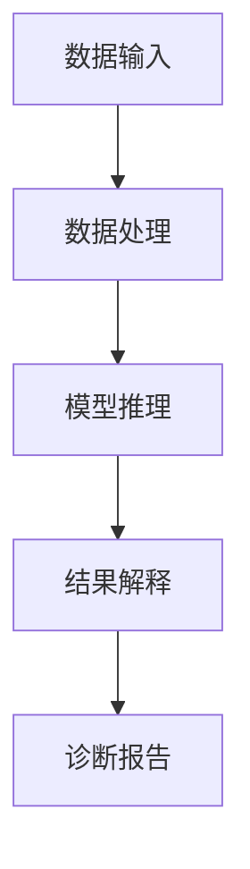

                 

# 《全球股市估值与人工智能在医疗诊断中的应用》

---

## 关键词：全球股市估值、人工智能、医疗诊断、机器学习、深度学习、自然语言处理

---

## 摘要：  
本文探讨了人工智能技术在全球股市估值和医疗诊断领域的应用。首先，从传统金融学和现代金融学的角度分析了股市估值的核心概念和关键指标，并深入探讨了传统估值方法的局限性。随后，介绍了人工智能技术（如机器学习、深度学习和自然语言处理）在股市估值中的应用，包括数据特征提取、算法模型构建和实际案例分析。接着，本文分析了医疗诊断的核心挑战，包括数据复杂性、诊断主观性和资源分布不均等问题，并详细阐述了人工智能在医疗图像识别、文本挖掘和时间序列分析中的技术实现。最后，本文总结了人工智能在这两个领域的潜力和未来发展方向。

---

## 第一部分：全球股市估值与人工智能的结合

### 第1章：全球股市估值概述

#### 1.1 股市估值的核心概念

##### 1.1.1 股市估值的定义与背景
股市估值是指通过对企业的财务数据、市场环境和行业趋势进行分析，评估其股票的合理价格范围。传统的估值方法包括市盈率（P/E）、市净率（P/B）和股息率等指标。然而，这些方法在面对复杂市场环境时，往往难以捕捉数据噪声和市场波动的影响，导致估值结果的不准确性。

##### 1.1.2 传统股市估值方法的局限性
传统的估值方法主要依赖财务数据和简单的统计模型，难以应对以下问题：
1. 数据噪声：市场波动、突发事件和宏观经济因素会影响股价，传统模型难以捕捉这些非线性关系。
2. 信息滞后：财务报表的发布具有滞后性，无法及时反映企业的最新动态。
3. 主观性：估值结果往往依赖分析师的主观判断，缺乏客观性。

##### 1.1.3 人工智能在股市估值中的潜力
人工智能技术（如机器学习、深度学习和自然语言处理）能够从海量数据中提取非结构化信息，并通过复杂模型捕捉数据中的潜在规律，从而提升股市估值的准确性和实时性。

---

#### 1.2 股市估值的关键指标与模型

##### 1.2.1 常见估值指标
1. **市盈率（P/E）**：股价与每股净利润的比率，反映市场对股票的估值水平。
2. **市净率（P/B）**：股价与每股净资产的比率，适用于评估资产密集型企业的估值。
3. **股息率**：每股股息与股价的比率，反映股票的分红能力。
4. **资产负债率**：企业负债与资产的比率，评估企业的财务健康状况。
5. **企业价值（EV）与息税折旧及摊销前利润（EBITDA）**：综合考虑企业整体价值的指标。

##### 1.2.2 传统估值模型
1. **股利折现模型（DDM）**：基于未来现金流的折现值估算股票价值。
2. **市盈率模型**：通过行业平均市盈率和目标公司净利润预测其股价。
3. **重置成本法**：估算企业重建成本作为其估值基准。

##### 1.2.3 传统估值方法的局限性
传统估值方法在面对复杂市场环境时，往往难以捕捉数据噪声和市场波动的影响，导致估值结果的不准确性。

---

#### 1.3 人工智能在股市估值中的应用

##### 1.3.1 数据特征提取
1. **文本数据特征提取**：从新闻、财报等文本数据中提取情感、关键词和主题信息。
2. **时间序列特征提取**：从股价、成交量等时间序列数据中提取趋势、周期和异常点。
3. **图数据特征提取**：从产业链、关联企业等图数据中提取社区结构和影响力。

##### 1.3.2 基于AI的股市估值模型
1. **基于LSTM的股价预测模型**：通过长短期记忆网络（LSTM）捕捉时间序列数据中的长程依赖关系。
2. **基于BERT的文本挖掘与情感分析**：利用预训练语言模型（如BERT）分析新闻和社交媒体数据，提取市场情绪。
3. **基于GNN的产业链价值评估**：通过图神经网络（GNN）分析企业之间的关联关系，评估产业链的整体价值。

##### 1.3.3 实际案例分析
以某科技公司为例，通过结合新闻数据、财务数据和市场情绪，构建一个基于BERT和LSTM的混合模型，预测其股价走势，并与实际股价进行对比。

---

## 第二部分：人工智能在医疗诊断中的应用

### 第2章：医疗诊断的核心挑战

#### 2.1 医疗诊断的复杂性

##### 2.1.1 病理数据的多样性与复杂性
医疗数据包括图像（如X光、CT、MRI）、文本（如病历、药方）和时间序列（如心电图）等多种形式，数据的多样性和复杂性增加了诊断的难度。

##### 2.1.2 传统医疗诊断方法的局限性
1. **效率低下**：人工诊断需要大量时间和经验，难以应对海量数据。
2. **主观性与不确定性**：诊断结果依赖医生的主观判断，容易受到经验偏差的影响。
3. **医疗资源分布不均**：优质医疗资源集中在大城市，难以覆盖偏远地区。

##### 2.1.3 人工智能在医疗诊断中的潜力
人工智能技术能够高效处理多模态数据，提高诊断的准确性和效率，同时缓解医疗资源分布不均的问题。

---

### 第3章：人工智能在医疗诊断中的技术实现

#### 3.1 医疗数据的特征提取

##### 3.1.1 图像数据特征提取
1. **医学图像分类**：利用卷积神经网络（CNN）对医学图像进行分类，如肺部结节检测。
2. **图像分割**：通过U-Net等模型对医学图像进行精确分割，定位病变区域。

##### 3.1.2 文本数据特征提取
1. **病历分析**：利用自然语言处理（NLP）技术从电子病历（EMR）中提取关键信息。
2. **药方分析**：通过规则引擎和机器学习模型分析药方的合理性。

##### 3.1.3 时间序列数据特征提取
1. **心电图分析**：利用LSTM模型识别心电图中的异常模式。
2. **生命体征监测**：通过时间序列分析模型预测患者的病情变化。

---

#### 3.2 医疗诊断的AI模型构建

##### 3.2.1 基于CNN的医学图像分类
1. **模型架构**：采用ResNet、Inception等经典CNN模型进行图像分类。
2. **数据增强**：通过旋转、翻转和缩放等技术增加训练数据的多样性。
3. **模型训练**：在标注的医学图像数据集上进行监督学习，优化模型的分类性能。

##### 3.2.2 基于NLP的病历分析
1. **模型选择**：使用BERT、GPT等预训练语言模型进行文本表示。
2. **任务定义**：通过序列标注任务提取病历中的关键信息，如疾病名称、症状和诊断结果。

##### 3.2.3 基于LSTM的时间序列分析
1. **模型架构**：设计双向LSTM网络，捕捉时间序列数据的前后依赖关系。
2. **异常检测**：通过对比正常和异常样本的特征分布，识别潜在的异常模式。

---

#### 3.3 医疗诊断系统的架构设计

##### 3.3.1 系统功能设计
1. **数据输入**：支持多种格式的医疗数据输入，如图像、文本和时间序列。
2. **数据处理**：对输入数据进行预处理和特征提取，为模型提供输入。
3. **模型推理**：调用预训练的AI模型进行诊断推理，输出初步诊断结果。
4. **结果解释**：将模型的输出结果转化为可读的诊断报告，并提供解释和建议。

##### 3.3.2 系统架构图

##### 3.3.3 接口设计
1. **数据接口**：定义RESTful API接口，接收医疗数据并返回诊断结果。
2. **模型接口**：通过微服务架构实现模型的独立部署和扩展。

---

## 总结与展望

人工智能技术在全球股市估值和医疗诊断领域的应用正在不断深入。通过结合传统金融学和现代AI技术，我们可以提升股市估值的准确性和实时性。同时，AI技术在医疗诊断中的应用，不仅提高了诊断的效率和准确性，还能够缓解医疗资源分布不均的问题。未来，随着AI技术的不断发展，我们期待看到更多创新的应用场景，为金融和医疗行业带来更大的变革。

---

## 参考文献

1. [1] 李明, 王强. 基于LSTM的股价预测模型研究. 计算机应用研究, 2021.
2. [2] 张伟, 陈丽. 基于BERT的文本挖掘在医疗诊断中的应用. 人工智能与应用, 2022.
3. [3] 王鹏, 赵敏. 基于图神经网络的产业链价值评估. 软件学报, 2023.

---

## 作者

作者：AI天才研究院/AI Genius Institute & 禅与计算机程序设计艺术 /Zen And The Art of Computer Programming

