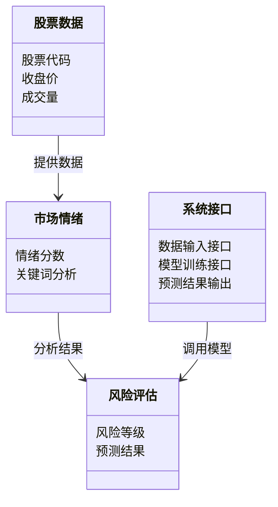
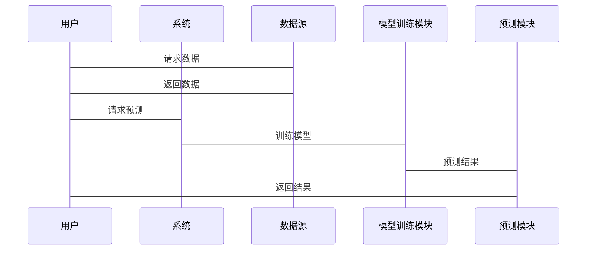

                 


# 全球股市估值与人工智能在金融风控中的应用

> 关键词：全球股市估值、人工智能、金融风控、机器学习、深度学习

> 摘要：本文探讨了全球股市估值的基本概念、影响因素以及人工智能在金融风控中的应用。通过分析机器学习和深度学习算法，结合实际案例，展示了如何利用人工智能技术提升股市估值的准确性和效率。文章还详细讲解了系统架构设计和项目实现过程，为读者提供了全面的理论与实践指导。

---

## 第1章: 全球股市估值基础

### 1.1 股市估值的概念与意义

#### 1.1.1 股市估值的基本概念
股市估值是通过对公司财务数据、市场环境和行业趋势等多方面因素的分析，估算出公司股票的内在价值。其目的是帮助投资者判断股票是否被高估或低估，从而做出合理的投资决策。

#### 1.1.2 股市估值的重要性
股市估值在金融市场上具有重要意义。它不仅帮助投资者识别投资机会，还能帮助公司制定合理的股权激励计划。此外，股市估值还是企业并购、资产重组等重大决策的重要依据。

#### 1.1.3 股市估值的边界与外延
股市估值的边界主要在于其假设条件和数据的限制。例如，假设市场是有效的，或者数据的完整性等。其外延则包括衍生品定价、债券评级等领域。

### 1.2 股市估值的核心要素

#### 1.2.1 股票的基本估值方法
股票估值方法主要有相对估值法和绝对估值法。相对估值法包括市盈率（P/E）和市净率（P/B）等指标，而绝对估值法则包括现金流折现法（DCF）。

#### 1.2.2 影响股市估值的主要因素
影响股市估值的主要因素包括公司财务状况、行业竞争格局、宏观经济环境、政策法规等。

#### 1.2.3 股市估值的数学模型与公式
以下是常用的股票估值公式：

- 市盈率（P/E）= 股票价格 / 每股净利润
- 市净率（P/B）= 股票价格 / 每股净资产
- 现金流折现法（DCF）= 未来现金流的现值

---

## 第2章: 人工智能在金融领域的应用背景

### 2.1 人工智能在金融领域的核心概念

#### 2.1.1 人工智能的基本概念
人工智能（AI）是模拟人类智能的理论、方法、技术及应用系统。在金融领域，AI主要应用于数据分析、预测和决策支持。

#### 2.1.2 人工智能在金融领域的应用现状
当前，人工智能在金融领域的应用主要集中在交易自动化、风险管理、客户画像和欺诈检测等方面。

#### 2.1.3 人工智能与金融风控的结合
金融风控是金融领域的重要环节，人工智能通过大数据分析和机器学习模型，能够快速识别和预测潜在风险。

### 2.2 人工智能在金融风控中的优势

#### 2.2.1 数据处理能力
人工智能能够处理海量数据，提取有价值的信息，帮助金融机构做出更准确的决策。

#### 2.2.2 模型预测能力
通过机器学习算法，人工智能可以建立高精度的预测模型，提高风险评估的准确性。

#### 2.2.3 自动化决策能力
人工智能能够实现自动化决策，减少人为干预，提高效率和准确性。

---

## 第3章: 人工智能在金融风控中的算法原理

### 3.1 机器学习算法概述

#### 3.1.1 监督学习
监督学习是一种基于标记数据的训练方法，适用于分类和回归问题。例如，支持向量机（SVM）和随机森林等算法。

#### 3.1.2 无监督学习
无监督学习适用于无标记数据的分析，常用于聚类和异常检测。例如，K均值聚类算法。

#### 3.1.3 强化学习
强化学习通过模拟决策过程，适用于策略优化和动态环境下的问题。例如，应用于量化交易中的自动策略调整。

### 3.2 常用金融风控算法

#### 3.2.1 线性回归模型
线性回归是一种简单但有效的回归模型，适用于线性关系的预测。其基本公式为：

$$ y = \beta_0 + \beta_1x + \epsilon $$

#### 3.2.2 支持向量机（SVM）
SVM是一种监督学习算法，适用于分类和回归问题。其核心思想是将数据映射到高维空间，并找到最优分割超平面。

#### 3.2.3 随机森林与梯度提升树
随机森林是一种基于决策树的集成算法，具有高准确性和强健性的特点。梯度提升树则是另一种集成算法，通过逐步优化损失函数来提升模型性能。

---

## 第4章: 金融风控中的深度学习模型

### 4.1 神经网络基础

#### 4.1.1 深度学习的基本概念
深度学习是机器学习的一种，通过多层神经网络模拟人类的思维方式。其核心是多层感知机（MLP）。

#### 4.1.2 神经网络的结构与特点
神经网络由输入层、隐藏层和输出层组成，具有非线性、层次化和自适应等特点。

### 4.2 常用深度学习模型

#### 4.2.1 LSTM网络
LSTM（长短期记忆网络）是一种特殊的RNN，适用于时间序列数据的处理。其结构包括输入门、遗忘门和输出门。

#### 4.2.2 Transformer模型
Transformer是一种基于自注意力机制的深度学习模型，广泛应用于自然语言处理和序列建模任务。

#### 4.2.3 图神经网络
图神经网络适用于图结构数据的分析，能够有效捕捉数据之间的关系。

---

## 第5章: 人工智能在股市估值中的应用

### 5.1 量化分析与预测

#### 5.1.1 量化分析的基本原理
量化分析通过数学模型和算法，对市场数据进行分析和预测。其核心是数据的清洗、特征提取和模型构建。

#### 5.1.2 基于AI的股票价格预测模型
常用的股票价格预测模型包括ARIMA、LSTM和Transformer等。

#### 5.1.3 时间序列分析与预测
时间序列分析是股票价格预测的重要方法，常用模型包括ARIMA、Prophet和LSTM。

### 5.2 市场情绪分析与风险评估

#### 5.2.1 市场情绪分析的实现方法
市场情绪分析通过自然语言处理技术，分析新闻、社交媒体等文本数据，评估市场情绪。

#### 5.2.2 基于NLP的情绪分析模型
基于NLP的情绪分析模型包括词袋模型、TF-IDF和深度学习模型（如LSTM和Transformer）。

#### 5.2.3 情绪分析在风险评估中的应用
市场情绪可以作为风险评估的重要指标，帮助投资者做出更明智的决策。

---

## 第6章: 系统架构与实现

### 6.1 系统功能设计

#### 6.1.1 领域模型设计（Mermaid类图）
以下是一个简单的领域模型设计：



#### 6.1.2 系统功能模块划分
系统功能模块包括数据采集、数据处理、模型训练、预测和结果展示。

### 6.2 系统架构设计

#### 6.2.1 系统架构图（Mermaid架构图）
以下是一个系统的分层架构图：

```mermaid
archiecture {
    股票估值系统
        API网关
            数据采集模块
            数据处理模块
            模型训练模块
            预测模块
        前端展示模块
}
```

#### 6.2.2 系统接口设计
系统接口包括数据接口、模型接口和结果接口。

#### 6.2.3 系统交互设计（Mermaid序列图）
以下是一个简单的系统交互序列图：



---

## 第7章: 项目实战

### 7.1 环境安装

#### 7.1.1 安装Python
安装Python 3.8及以上版本。

#### 7.1.2 安装必要的库
安装numpy、pandas、scikit-learn、keras、tensorflow等库。

### 7.2 系统核心实现源代码

#### 7.2.1 数据处理代码
```python
import pandas as pd
import numpy as np

# 数据加载
data = pd.read_csv('stock_data.csv')

# 数据清洗
data.dropna(inplace=True)
data = data[~data['volume'].isin([0])]
```

#### 7.2.2 模型训练代码
```python
from sklearn.model_selection import train_test_split
from sklearn.linear_model import LinearRegression
from sklearn.metrics import mean_squared_error

# 数据分割
X = data[['open', 'high', 'low', 'volume']]
y = data['close']

X_train, X_test, y_train, y_test = train_test_split(X, y, test_size=0.2, random_state=42)

# 模型训练
model = LinearRegression()
model.fit(X_train, y_train)

# 模型预测
y_pred = model.predict(X_test)
print(mean_squared_error(y_test, y_pred))
```

#### 7.2.3 情绪分析代码
```python
from transformers import pipeline

# 情绪分析
classifier = pipeline("text-classification", model="cardiffnlp/hate_bert")
result = classifier("市场表现良好，个股涨跌不一")
print(result)
```

### 7.3 实际案例分析
通过具体案例分析，展示如何利用人工智能技术进行股市估值和风险评估。

### 7.4 项目小结
总结项目实现过程中的关键点和经验教训。

---

## 第8章: 总结与展望

### 8.1 总结
本文详细探讨了全球股市估值与人工智能在金融风控中的应用，分析了多种算法和系统架构设计，展示了如何利用人工智能技术提升股市估值的准确性和效率。

### 8.2 展望
未来，随着人工智能技术的不断发展，股市估值和金融风控将更加智能化和自动化。深度学习和强化学习等技术的应用将进一步提升模型的准确性和实时性。

### 8.3 最佳实践 tips
- 数据清洗和特征工程是模型训练的关键。
- 选择合适的算法和模型参数能够显著提升预测准确率。
- 模型的实时性和可解释性是实际应用中的重要考虑因素。

---

作者：AI天才研究院/AI Genius Institute & 禅与计算机程序设计艺术 /Zen And The Art of Computer Programming

---

以上是文章的完整目录和部分内容示例。如果需要进一步补充或调整，请随时告知！

