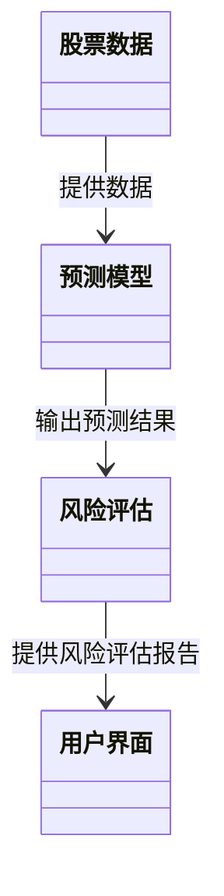
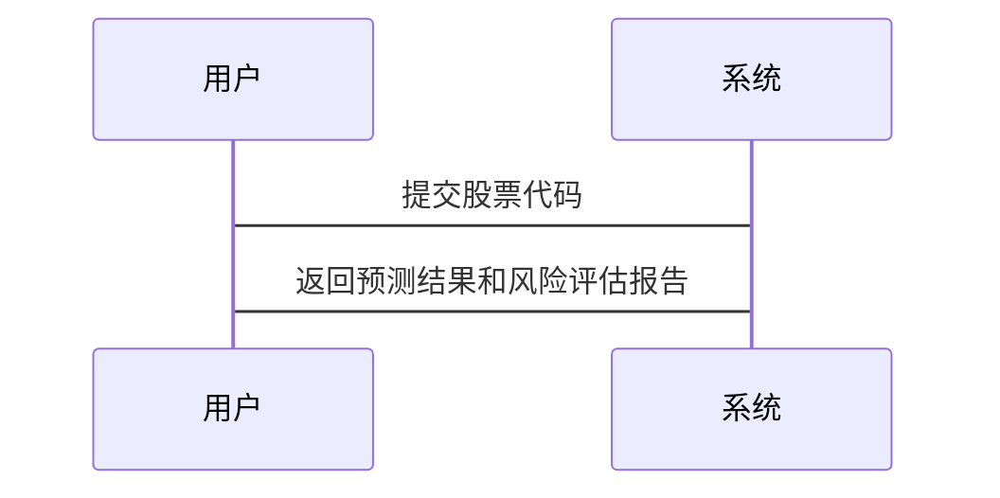

                 


# 全球股市估值与人工智能在金融风险管理中的应用

> **关键词**：全球股市估值，人工智能，金融风险管理，机器学习，深度学习，时间序列分析，大数据金融  
>
> **摘要**：  
> 全球股市估值与人工智能在金融风险管理中的应用是当前金融领域的研究热点。随着人工智能技术的快速发展，其在金融领域的应用越来越广泛，尤其是在股市估值和风险管理方面。本文将从全球股市估值的基本概念出发，探讨人工智能在金融风险管理中的应用基础，详细分析时间序列分析与预测模型、深度学习模型（如LSTM、CNN、RNN等）在股市估值中的应用，结合实际案例，最后总结人工智能在金融风险管理中的优势与未来发展方向。

---

## 第一部分：全球股市估值与人工智能概述

### 第1章：全球股市估值基础

#### 1.1 股市估值的基本概念

##### 1.1.1 股市估值的定义与作用
股市估值是指对股票或股票组合的内在价值进行评估的过程。其作用在于帮助投资者判断股票价格是否合理，从而做出投资决策。股市估值的核心在于分析企业的财务状况、行业地位、盈利能力等因素。

##### 1.1.2 股票定价模型概述
股票定价模型是用于估算股票内在价值的数学模型。常见的模型包括：

- **市盈率（P/E）模型**：通过企业的盈利能力和股票价格之间的关系来估算股票价值。
- **市净率（P/B）模型**：通过企业的净资产与股票价格之间的关系来估算股票价值。
- **股息贴现模型（DDM）**：通过预测企业未来股息的现值来估算股票价值。

##### 1.1.3 市场估值与宏观经济的关系
股市估值不仅受到企业自身经营状况的影响，还受到宏观经济环境的影响。例如，利率水平、通货膨胀、经济周期等因素都会影响股市的整体估值水平。

#### 1.2 传统股市估值方法

##### 1.2.1 市盈率（P/E）分析
市盈率是股票价格与每股净利润的比率。市盈率越低，通常意味着股票的价值被低估的可能性越大。

##### 1.2.2 市净率（P/B）分析
市净率是股票价格与每股净资产的比率。市净率越低，通常意味着股票的价值被低估的可能性越大。

##### 1.2.3 股息率与股息贴现模型（DDM）
股息率是股票的股息与股票价格的比率。股息贴现模型通过预测未来股息的现值来估算股票的内在价值。

#### 1.3 股市估值的挑战与局限性

##### 1.3.1 数据噪声与市场波动
股市数据通常存在噪声，例如市场波动、突发事件等，这些都会影响股市估值的准确性。

##### 1.3.2 人为因素对估值的影响
市场情绪、投资者心理等因素也会对股市估值产生影响，这些因素难以通过传统模型完全捕捉。

##### 1.3.3 传统模型的局限性
传统估值模型通常假设市场是理性的，且忽略了时间序列数据中的复杂关系，例如非线性关系和长记忆特性。

---

### 第2章：人工智能在金融领域的应用基础

#### 2.1 人工智能与金融的结合

##### 2.1.1 AI在金融领域的应用现状
人工智能在金融领域的应用非常广泛，包括股票交易、风险管理、信用评估、欺诈检测等。

##### 2.1.2 机器学习在金融中的作用
机器学习可以通过分析海量数据，发现传统方法难以捕捉的模式和关系，从而提高金融分析的准确性。

##### 2.1.3 大数据在金融分析中的重要性
大数据技术可以处理海量的金融数据，为人工智能模型提供丰富的训练数据。

#### 2.2 金融风险管理的基本概念

##### 2.2.1 风险管理的定义与目标
风险管理是指通过识别、评估和应对风险，以降低潜在损失的过程。其目标是确保金融系统的稳定性和安全性。

##### 2.2.2 常见的金融风险类型
- **市场风险**：由于市场价格波动导致的损失。
- **信用风险**：由于债务人违约导致的损失。
- **流动性风险**：由于资产无法快速变现导致的损失。
- **操作风险**：由于内部操作失误或外部事件导致的损失。

##### 2.2.3 风险管理的流程与方法
风险管理通常包括风险识别、风险评估、风险应对和风险监控四个阶段。

#### 2.3 AI在金融风险管理中的优势

##### 2.3.1 高效的数据处理能力
人工智能可以通过机器学习算法高效处理海量数据，发现潜在的模式和关系。

##### 2.3.2 智能预测与决策支持
人工智能可以通过预测模型提供风险预警和决策支持，帮助投资者做出更明智的投资决策。

##### 2.3.3 实时监控与风险预警
人工智能可以通过实时数据分析，提供风险预警，帮助金融机构及时应对潜在风险。

---

## 第二部分：人工智能在股市估值中的算法原理

### 第3章：时间序列分析与预测模型

#### 3.1 时间序列的基本概念

##### 3.1.1 时间序列的定义与特征
时间序列是指按时间顺序排列的数据序列。其特征包括趋势、周期性、季节性等。

##### 3.1.2 时间序列分析的常见方法
时间序列分析的常见方法包括移动平均法、指数平滑法、ARIMA模型等。

#### 3.2 机器学习在时间序列预测中的应用

##### 3.2.1 线性回归模型在时间序列中的应用
线性回归模型可以用于预测时间序列的趋势，但其效果受到数据线性关系的限制。

##### 3.2.2 支持向量机（SVM）在时间序列预测中的应用
支持向量机可以通过非线性核函数捕捉时间序列中的非线性关系，从而提高预测精度。

##### 3.2.3 随机森林在时间序列预测中的应用
随机森林可以通过集成学习方法捕捉时间序列中的复杂模式，提高预测精度。

#### 3.3 长短期记忆网络（LSTM）在时间序列预测中的应用

##### 3.3.1 LSTM的基本原理
LSTM是一种循环神经网络（RNN）变体，具有长记忆能力，可以捕捉时间序列中的长距离依赖关系。

##### 3.3.2 LSTM在时间序列预测中的优势
LSTM可以有效捕捉时间序列中的非线性关系和长距离依赖，适合用于金融时间序列预测。

##### 3.3.3 LSTM的实际应用案例
案例：使用LSTM模型预测股票价格，通过实验结果验证其优越性。

---

### 第4章：深度学习模型在股市估值中的应用

#### 4.1 卷积神经网络（CNN）在金融时间序列中的应用

##### 4.1.1 CNN的基本原理
卷积神经网络通过卷积操作提取局部特征，适合用于处理时间序列数据中的局部模式。

##### 4.1.2 CNN在金融时间序列分析中的优势
CNN可以捕捉时间序列数据中的空间依赖关系，适合用于金融时间序列分析。

##### 4.1.3 基于CNN的金融时间序列预测案例
案例：使用CNN模型预测股票价格，展示其预测精度和优势。

#### 4.2 循环神经网络（RNN）在金融时间序列中的应用

##### 4.2.1 RNN的基本原理
循环神经网络是一种处理序列数据的神经网络，具有处理序列数据的能力。

##### 4.2.2 RNN在金融时间序列分析中的优势
RNN可以捕捉时间序列数据中的顺序依赖关系，适合用于金融时间序列预测。

##### 4.2.3 基于RNN的金融时间序列预测案例
案例：使用RNN模型预测股票价格，展示其预测效果。

#### 4.3 图神经网络（GNN）在金融网络分析中的应用

##### 4.3.1 GNN的基本原理
图神经网络是一种处理图结构数据的神经网络，适合用于分析金融网络中的关系。

##### 4.3.2 GNN在金融网络分析中的优势
GNN可以捕捉金融网络中的复杂关系，适合用于分析金融市场的相互关联性。

##### 4.3.3 基于GNN的金融网络分析案例
案例：使用GNN模型分析金融市场中的相互关联性，展示其应用价值。

---

## 第三部分：系统分析与架构设计

### 第5章：系统分析与架构设计方案

#### 5.1 问题场景介绍
本文设计了一个基于人工智能的股市估值与风险管理系统，旨在通过机器学习算法对股票价格进行预测，并对投资风险进行评估。

#### 5.2 系统功能设计（领域模型）



#### 5.3 系统架构设计

```mermaid
container 容器
    component 前端
    component 后端
        component 预测模型
        component 风险评估
    component 数据库
    前端 --> 后端: 请求
    后端 --> 数据库: 查询
    预测模型 --> 后端: 返回预测结果
    风险评估 --> 后端: 返回风险评估结果
```

#### 5.4 系统接口设计
系统接口设计包括前端接口和后端接口，用于用户与系统之间的交互。

#### 5.5 系统交互设计



---

## 第四部分：项目实战

### 第6章：项目实战

#### 6.1 环境安装

##### 6.1.1 安装Python
安装Python 3.x及以上版本。

##### 6.1.2 安装机器学习库
安装scikit-learn、Keras、TensorFlow等机器学习库。

##### 6.1.3 安装数据处理库
安装Pandas、NumPy等数据处理库。

#### 6.2 系统核心实现源代码

##### 6.2.1 数据预处理
```python
import pandas as pd
import numpy as np

# 读取股票数据
data = pd.read_csv('stock_data.csv')

# 数据清洗
data = data.dropna()
data = data.reset_index(drop=True)
```

##### 6.2.2 模型训练
```python
from sklearn.model_selection import train_test_split
from sklearn.linear_model import LinearRegression

# 划分训练集和测试集
X_train, X_test, y_train, y_test = train_test_split(data.drop('target', axis=1), data['target'], test_size=0.2, random_state=42)

# 训练线性回归模型
model = LinearRegression()
model.fit(X_train, y_train)

# 预测测试集
y_pred = model.predict(X_test)
```

##### 6.2.3 风险评估
```python
from sklearn.metrics import mean_squared_error

# 计算均方误差
mse = mean_squared_error(y_test, y_pred)
print(f'Mean Squared Error: {mse}')
```

#### 6.3 代码应用解读与分析
代码实现了一个简单的线性回归模型，用于预测股票价格。通过均方误差（MSE）评估模型的预测精度。

#### 6.4 实际案例分析
以某股票为例，展示模型的预测结果和风险评估报告。

#### 6.5 项目小结
总结项目实现过程中的经验和教训，提出改进建议。

---

## 第五部分：总结与展望

### 第7章：总结与展望

#### 7.1 总结
本文详细介绍了全球股市估值的基本概念和人工智能在金融风险管理中的应用，探讨了时间序列分析与预测模型、深度学习模型在股市估值中的应用，并结合实际案例进行了详细分析。

#### 7.2 未来展望
未来，随着人工智能技术的不断发展，其在金融领域的应用将更加广泛和深入。特别是在股市估值和风险管理方面，人工智能将发挥更大的作用，帮助投资者做出更明智的投资决策。

---

## 第六部分：最佳实践与注意事项

### 第8章：最佳实践 tips

#### 8.1 数据预处理的重要性
数据预处理是机器学习项目成功的关键。在处理金融数据时，需要特别注意数据的完整性和准确性。

#### 8.2 模型选择与调优
选择合适的模型并进行参数调优是提高模型预测精度的重要步骤。

#### 8.3 风险管理的重要性
在实际投资中，风险管理是确保投资组合安全性的关键。投资者需要根据市场情况及时调整投资策略。

---

## 第七部分：作者信息

作者：AI天才研究院/AI Genius Institute & 禅与计算机程序设计艺术 /Zen And The Art of Computer Programming

