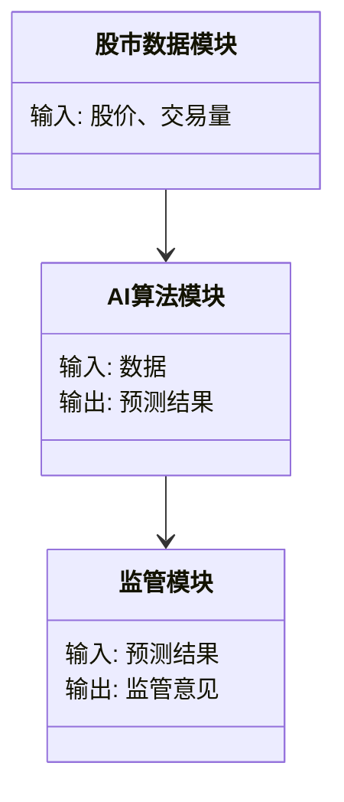

                 


# 全球股市估值与人工智能监管的关系

> 关键词：全球股市估值、人工智能监管、AI算法交易、金融监管框架、市场风险评估

> 摘要：本文探讨了全球股市估值与人工智能监管之间的关系，分析了人工智能在股市估值中的应用，以及监管对人工智能技术的影响。文章从背景、技术原理、系统架构和实际案例等方面展开，结合数学模型和系统设计，深入剖析了人工智能如何改变股市估值，以及监管如何应对这些变化。最后，文章总结了当前的趋势和未来的研究方向。

---

## 第一部分：全球股市估值与人工智能监管的背景与基础

### 第1章：全球股市估值概述

#### 1.1 股市估值的基本概念

股票市场估值是衡量一家公司或整个市场价值的重要指标。常用的估值方法包括市盈率（P/E）、市净率（P/B）和股息率等。这些指标帮助投资者评估股票的合理价格。

- 市盈率（P/E）= 股价 / 每股收益
- 市净率（P/B）= 股价 / 每股净资产
- 股息率 = 每股股息 / 股价

#### 1.2 全球股市的现状与趋势

全球股市分布广泛，主要市场包括纽约证券交易所（NYSE）、纳斯达克（NASDAQ）、伦敦证券交易所（LSE）等。近年来，科技股的崛起和人工智能技术的应用成为股市的重要驱动力。

---

### 第2章：人工智能在金融领域的应用基础

#### 2.1 人工智能的基本概念

人工智能（AI）通过模拟人类学习和推理能力，实现数据处理和决策。在金融领域，AI主要用于数据分析、预测和交易。

- 机器学习（ML）：基于数据训练模型，用于分类和预测。
- 深度学习（DL）：通过多层神经网络处理复杂数据。

#### 2.2 人工智能在金融监管中的作用

AI帮助监管机构提高效率，但同时也带来了数据隐私和算法透明度的挑战。

---

## 第二部分：人工智能在股市估值中的应用

### 第3章：人工智能在股市预测中的应用

#### 3.1 人工智能在股市预测的核心算法

AI算法广泛应用于股市预测，其中时间序列分析和深度学习是主要方法。

- 时间序列分析：使用ARIMA模型预测未来走势。
- 深度学习：通过LSTM网络捕捉长期依赖关系。

#### 3.2 人工智能在股市预测中的实际案例

例如，算法交易公司使用AI模型进行高频交易，通过分析市场情绪和历史数据做出决策。

---

### 第4章：人工智能在风险评估中的应用

#### 4.1 风险评估的核心概念

风险评估旨在识别和量化潜在损失，常用指标包括VaR和CVaR。

- VaR（在险价值）：一定置信水平下的潜在损失。
- CVaR（条件在险价值）：VaR的平均损失。

#### 4.2 人工智能在风险评估中的应用

AI通过构建风险模型，帮助机构识别市场波动和潜在危机。

---

## 第三部分：人工智能监管框架与挑战

### 第5章：人工智能监管的核心框架

#### 5.1 人工智能监管的基本原则

监管框架需要确保AI技术的透明性和合规性，同时保护用户隐私。

#### 5.2 人工智能监管的挑战

包括算法黑箱问题和数据隐私保护等。

---

## 第四部分：系统分析与架构设计

### 第6章：系统功能设计

#### 6.1 领域模型设计

使用Mermaid类图展示系统的模块结构。



### 第7章：系统架构设计

使用Mermaid架构图展示系统的整体架构。

```mermaid
id diagram {
    前端 --> 后端
    后端 --> 数据库
    后端 --> AI算法模块
    数据库 --> 第三方数据源
}
```

---

## 第五部分：项目实战

### 第8章：环境安装与代码实现

#### 8.1 环境安装

安装必要的Python库，如Pandas、NumPy和Scikit-learn。

```bash
pip install pandas numpy scikit-learn
```

#### 8.2 核心代码实现

以下是一个简单的AI预测模型代码示例：

```python
import pandas as pd
from sklearn.model_selection import train_test_split
from sklearn.linear_model import LinearRegression

# 数据加载
data = pd.read_csv('stock_data.csv')

# 特征选择
features = data[['open', 'high', 'low', 'volume']]
target = data['close']

# 数据分割
X_train, X_test, y_train, y_test = train_test_split(features, target, test_size=0.2)

# 模型训练
model = LinearRegression()
model.fit(X_train, y_train)

# 预测与评估
predictions = model.predict(X_test)
print('预测结果:', predictions)
print('均方误差:', metrics.mean_squared_error(y_test, predictions))
```

---

## 第六部分：总结与展望

### 第9章：总结

人工智能正在改变全球股市估值的方式，但监管的缺失可能带来风险。未来需要更加完善的监管框架和技术创新。

### 第10章：展望

未来的挑战在于如何平衡技术创新与监管需求，推动更高效、更安全的股市估值体系。

---

## 作者信息

作者：AI天才研究院/AI Genius Institute & 禅与计算机程序设计艺术 /Zen And The Art of Computer Programming

---

通过本文，读者可以全面理解全球股市估值与人工智能监管的关系，掌握相关的技术原理和系统设计方法。

