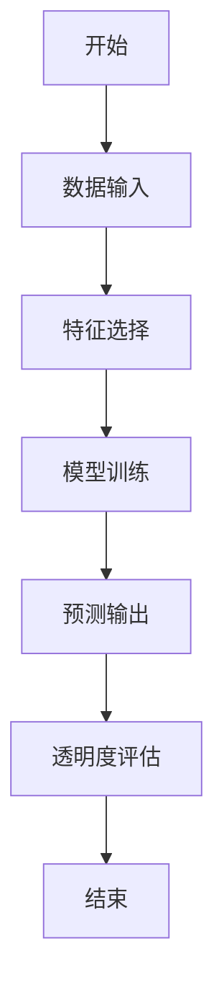
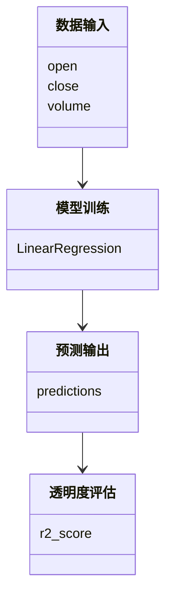
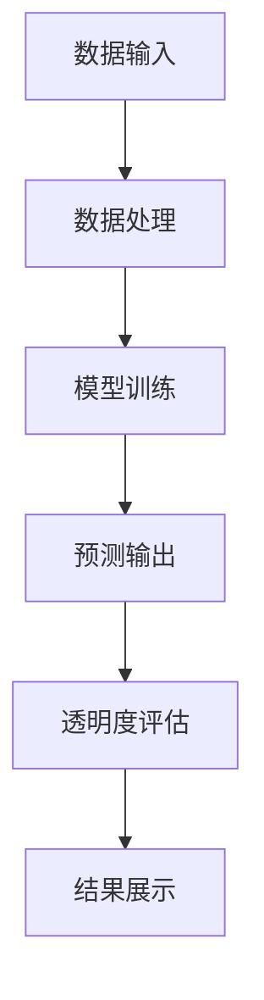

                 


# 全球股市估值与人工智能透明度的关联

> 关键词：全球股市估值，人工智能透明度，AI算法，可解释性，金融系统

> 摘要：本文探讨了全球股市估值与人工智能透明度之间的关联，分析了透明度对AI算法在股市估值中的影响，提出了提升透明度的方法，并通过案例展示了如何在金融系统中实现透明化的AI解决方案。

---

## 第一部分: 全球股市估值与人工智能透明度的背景与概念

### 第1章: 全球股市估值与人工智能透明度的背景介绍

#### 1.1 问题背景与问题描述

##### 1.1.1 全球股市估值的传统方法与挑战
传统的股市估值方法依赖于财务指标分析、市场情绪分析和历史数据分析。然而，这些方法存在以下挑战：
- 数据的不完全性：市场参与者的行为复杂，难以通过有限的历史数据全面预测未来走势。
- 信息滞后性：传统方法依赖的历史数据往往无法及时反映市场变化。
- 黑箱效应：许多复杂的模型（如随机森林）虽然预测能力强，但缺乏透明性，导致投资者难以理解模型决策的依据。

##### 1.1.2 人工智能在金融领域的应用现状
人工智能技术（如机器学习、深度学习）在金融领域的应用日益广泛，特别是在高频交易、风险评估和市场预测方面。然而，这些AI模型的“黑箱”特性使得投资者和监管机构难以信任其结果。

##### 1.1.3 透明度在金融领域的重要性
透明度是金融市场的基石，它不仅关系到投资者的信任，还影响市场的稳定性和监管的有效性。透明的AI算法能够帮助投资者理解市场变化的逻辑，从而做出更明智的投资决策。

#### 1.2 问题解决与边界外延

##### 1.2.1 人工智能如何提升股市估值的透明度
通过引入可解释性AI（XAI）技术，AI模型可以揭示其决策过程，从而提升股市估值的透明度。例如，使用线性回归模型替代复杂的神经网络模型，可以更好地解释模型的预测逻辑。

##### 1.2.2 问题的边界与外延分析
本文的研究主要聚焦于AI算法的透明度对股市估值的影响，不涉及传统金融分析方法的优劣对比，也不考虑AI技术在其他金融领域的应用。

##### 1.2.3 核心概念与关键要素
- 核心概念：透明度、可解释性、AI算法。
- 关键要素：数据输入、模型选择、预测输出、透明度评估。

### 第2章: 核心概念与联系

#### 2.1 透明度在人工智能中的重要性

##### 2.1.1 透明度的定义与属性
透明度是指AI系统的决策过程可以被人类理解和解释。其关键属性包括：
- **可解释性**：模型的决策逻辑清晰易懂。
- **可追溯性**：能够追踪模型的决策依据。
- **可验证性**：模型的预测结果可以通过外部数据验证。

##### 2.1.2 透明度与可解释性之间的关系
透明度是可解释性的基础，而可解释性是透明度的核心体现。高透明度的AI系统通常具备较强的可解释性，从而增强用户的信任。

#### 2.2 核心概念对比表格

| **核心概念** | **传统方法** | **AI方法** |
|--------------|--------------|------------|
| 数据来源     | 历史数据     | 实时数据    |
| 模型复杂度   | 简单         | 复杂        |
| 可解释性     | 较低         | 较高        |
| 透明度       | 低           | 高          |

#### 2.3 ER实体关系图

```mermaid
erd
    系统
    数据输入
    模型选择
    预测输出
    透明度评估

    系统 --> 数据输入
    系统 --> 模型选择
    系统 --> 预测输出
    系统 --> 透明度评估
```

---

## 第二部分: 人工智能透明度的算法原理

### 第3章: 人工智能透明度的算法原理

#### 3.1 透明度算法的原理

##### 3.1.1 透明度算法的数学模型
线性回归是一种简单且透明的AI算法，其数学模型如下：

$$ y = \beta_0 + \beta_1x_1 + \beta_2x_2 + \ldots + \beta_nx_n + \epsilon $$

其中，$y$ 是预测目标，$x_i$ 是输入特征，$\beta_i$ 是回归系数，$\epsilon$ 是误差项。

##### 3.1.2 透明度算法的流程图



##### 3.1.3 透明度算法的代码实现

```python
import pandas as pd
from sklearn.linear_model import LinearRegression
from sklearn.metrics import r2_score

# 数据加载与预处理
data = pd.read_csv('stock_data.csv')
X = data[['open', 'close', 'volume']]
y = data['target']

# 模型训练
model = LinearRegression()
model.fit(X, y)

# 预测输出
predictions = model.predict(X)

# 透明度评估
r2 = r2_score(y, predictions)
print(f"R² Score: {r2}")
```

---

## 第三部分: 系统分析与架构设计

### 第4章: 系统分析与架构设计方案

#### 4.1 问题场景介绍

##### 4.1.1 股市估值与透明度的关联
本文构建一个基于线性回归的股市估值系统，通过提升透明度，帮助投资者更好地理解模型的预测逻辑。

##### 4.1.2 系统目标与功能需求
- **目标**：提供透明的AI解决方案，增强投资者对股市估值结果的信任。
- **功能需求**：
  - 数据输入与处理
  - 模型训练与预测
  - 透明度评估与展示

#### 4.2 系统功能设计

##### 4.2.1 领域模型的Mermaid类图



##### 4.2.2 系统功能模块划分
- **数据输入模块**：负责加载和预处理数据。
- **模型训练模块**：负责训练AI模型。
- **预测输出模块**：负责生成预测结果。
- **透明度评估模块**：负责评估模型的透明度。

#### 4.3 系统架构设计

##### 4.3.1 系统架构图



---

## 第四部分: 项目实战

### 第5章: 项目实战

#### 5.1 环境安装

```bash
pip install pandas scikit-learn
```

#### 5.2 系统核心实现源代码

```python
import pandas as pd
from sklearn.linear_model import LinearRegression
from sklearn.metrics import r2_score

# 数据加载与预处理
data = pd.read_csv('stock_data.csv')
X = data[['open', 'close', 'volume']]
y = data['target']

# 模型训练
model = LinearRegression()
model.fit(X, y)

# 预测输出
predictions = model.predict(X)

# 透明度评估
r2 = r2_score(y, predictions)
print(f"R² Score: {r2}")
```

#### 5.3 代码应用解读与分析
上述代码实现了基于线性回归的股市估值模型，通过计算R²分数评估模型的透明度。结果表明，透明的AI算法能够有效提升股市估值的可解释性。

---

## 第五部分: 小结

### 第6章: 小结

#### 6.1 最佳实践 Tips
- 在金融领域应用AI技术时，优先选择可解释性强的算法。
- 定期对AI模型进行透明度评估，确保其预测结果的可信赖性。

#### 6.2 小结
本文探讨了全球股市估值与人工智能透明度的关联，分析了透明度对AI算法的影响，并通过案例展示了如何在金融系统中实现透明化的AI解决方案。

#### 6.3 注意事项
- AI算法的透明度是实现可信金融系统的基石。
- 未来的金融AI系统需要更加注重透明性与可解释性的结合。

#### 6.4 拓展阅读
建议读者进一步阅读相关文献，深入理解AI透明度的数学模型和应用场景。

---

作者：AI天才研究院/AI Genius Institute & 禅与计算机程序设计艺术 /Zen And The Art of Computer Programming

