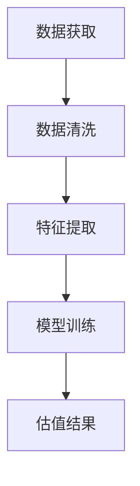
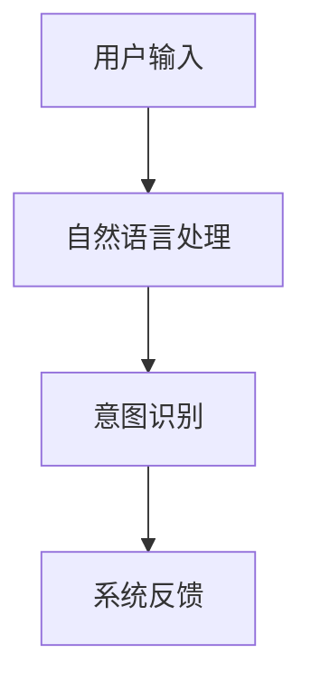
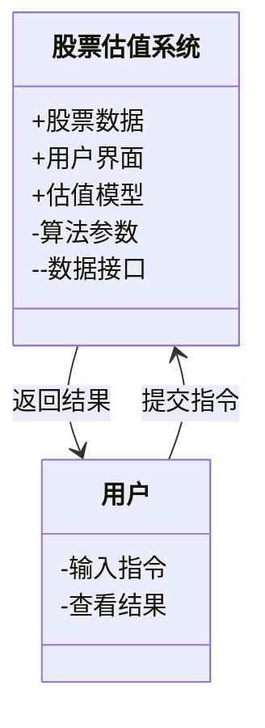
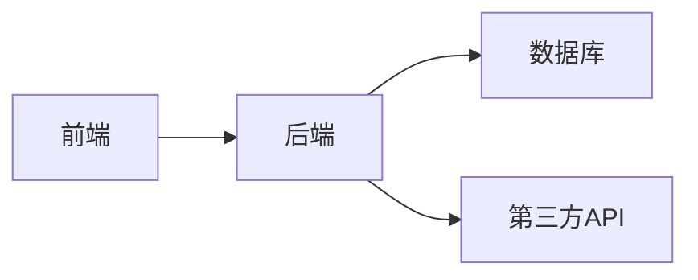
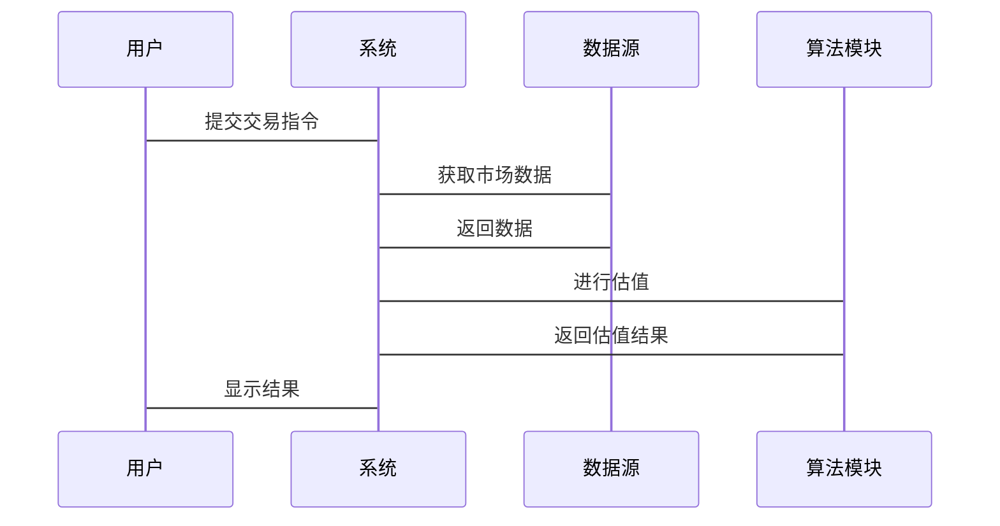

                 


# 全球股市估值与人机交互技术发展的关联

---

## 关键词：全球股市估值，人机交互，技术关联，算法分析，系统设计，项目实战

---

## 摘要：本文探讨全球股市估值与人机交互技术之间的关联性，从背景介绍、核心概念分析到算法实现和系统设计，详细阐述了技术进步如何影响股市分析和交易。通过对比和案例分析，揭示两者之间的相互作用，并展示如何利用人机交互技术优化股市估值模型，提升交易效率。

---

# 第一部分: 引言

## 1.1 全球股市估值与人机交互技术的关联概述

### 1.1.1 问题背景与研究意义
全球股市作为经济的晴雨表，其估值方法和准确性直接影响投资决策。随着人工智能和大数据技术的快速发展，人机交互技术在金融领域的应用日益广泛，如何将两者有效结合，提升股市估值的效率和准确性，成为当前研究的重要课题。

### 1.1.2 问题描述与研究目标
本文旨在分析全球股市估值与人机交互技术之间的关联，探讨技术进步如何影响股市估值，以及股市数据如何推动人机交互技术的发展。通过案例分析和算法实现，提出优化股市估值的新方法。

### 1.1.3 问题解决的思路与方法
采用理论分析与实践相结合的方式，从技术原理、算法实现、系统设计等多角度展开，结合实际案例，验证技术方案的有效性。

---

# 第二部分: 背景介绍

## 2.1 全球股市估值的基本概念与方法

### 2.1.1 股市估值的定义与核心要素
股市估值是对公司股票价值的评估，核心要素包括市盈率、市净率、股息率等。通过这些指标，投资者可以判断股票的合理价格区间。

### 2.1.2 常用的股市估值指标与模型
常用的指标包括PE（市盈率）、PB（市净率）、ROE（净资产收益率）等。模型如股利贴现模型（DDM）和资本资产定价模型（CAPM）用于评估股票的内在价值。

### 2.1.3 全球股市估值的区域差异与特点
不同地区的股市估值受经济环境、政策法规和市场结构影响，呈现差异性。例如，成熟市场的估值更注重长期盈利能力，新兴市场则更关注增长潜力。

## 2.2 人机交互技术的发展历程与现状

### 2.2.1 人机交互技术的定义与核心要素
人机交互（Human-Computer Interaction, HCI）是指用户与计算机系统之间通过输入和输出进行信息交换的过程。核心要素包括用户需求、交互界面、系统反馈等。

### 2.2.2 人机交互技术的历史发展与阶段划分
从早期的命令行界面到图形用户界面（GUI），再到现在的自然交互（如语音识别和手势控制），人机交互技术经历了多次革新，逐步提升了用户体验。

### 2.2.3 当前人机交互技术的主要应用领域与趋势
当前，人机交互技术广泛应用于金融、医疗、教育等领域。趋势包括智能化、个性化和多模态交互（结合多种输入方式）。

## 2.3 全球股市与人机交互技术的关联性分析

### 2.3.1 技术进步对股市估值的影响
人工智能技术（如机器学习）可以分析大量数据，提高股市估值的准确性和效率。例如，通过自然语言处理（NLP）分析新闻和财报，预测股价走势。

### 2.3.2 股市数据对人机交互技术的推动作用
股市数据的复杂性和实时性要求推动了交互技术的发展。例如，高频交易需要毫秒级的响应速度，推动了低延迟交互技术的进步。

### 2.3.3 两者的相互作用与协同发展
技术进步使股市估值更精确，而股市数据的应用推动了交互技术的创新，形成了良性循环。

---

# 第三部分: 核心概念与联系

## 3.1 核心概念的原理与特征

### 3.1.1 全球股市估值的核心原理
股市估值基于对公司基本面和市场情绪的分析，结合定量模型和定性判断，得出股票的合理价值区间。

### 3.1.2 人机交互技术的核心原理
人机交互技术通过用户输入和系统反馈，构建用户与系统之间的信息交换通道，优化用户体验。

### 3.1.3 两者关联的逻辑与机制
股市数据的实时处理和分析需要高效的人机交互界面，而交互技术的进步又为股市估值提供了更强大的工具。

## 3.2 核心概念属性特征对比表

| 特性          | 全球股市估值         | 人机交互技术       |
|---------------|---------------------|-------------------|
| 核心目标      | 评估股票价值       | 提升用户体验       |
| 输入数据      | 市场数据、财务数据   | 用户输入、系统反馈 |
| 输出结果      | 估值结果           | 用户界面、系统反馈 |
| 技术依赖      | 量化分析、模型构建 | 界面设计、算法优化 |

### 3.2.1 股市估值与人机交互技术的属性对比
通过对比表可以看出，两者在输入输出和目标上存在差异，但都依赖于数据处理和系统优化。

### 3.2.2 关键特征的异同分析
相同点：都需要高效的系统处理能力；不同点：股市估值注重准确性，人机交互注重用户体验。

### 3.2.3 对比表的解读与启示
通过对比，我们可以更好地理解两者的特点，为后续的技术结合提供方向。

## 3.3 ER实体关系图与Mermaid流程图

### 3.3.1 实体关系图的构建与分析
```mermaid
erDiagram
    customer[投资者]
    stock[股票]
    interaction[交互记录]
    customer --> stock: 交易
    customer --> interaction: 操作
    stock --> interaction: 记录
```

### 3.3.2 关联流程的Mermaid图示


### 3.3.3 图表的解读与应用
通过ER图和流程图，可以清晰地看到用户与系统之间的交互流程，以及股票估值的核心环节。

---

# 第四部分: 算法原理讲解

## 4.1 算法原理的数学模型与公式

### 4.1.1 股市估值的数学模型
股票的内在价值可以通过股利贴现模型（DDM）计算：
$$ V = \frac{D}{k - g} $$
其中，\( D \) 是股利，\( k \) 是折现率，\( g \) 是股利增长率。

### 4.1.2 人机交互技术的核心算法
自然语言处理（NLP）用于分析用户输入，常用算法包括TF-IDF和Word2Vec。

### 4.1.3 关联分析的数学公式
通过主成分分析（PCA）对多维数据进行降维，提取关键特征：
$$ Y = X \cdot W $$
其中，\( Y \) 是降维后的数据，\( X \) 是原始数据，\( W \) 是转换矩阵。

## 4.2 算法流程的Mermaid图示

### 4.2.1 股市数据处理流程图


### 4.2.2 人机交互算法流程图


## 4.3 算法实现的Python代码示例

### 4.3.1 股市估值模型代码
```python
import pandas as pd
from sklearn.linear_model import LinearRegression

# 数据准备
data = pd.DataFrame({
    'PE': [15, 20, 25, 30],
    'Price': [100, 150, 200, 250]
})

# 模型训练
model = LinearRegression()
model.fit(data[['PE']], data['Price'])

# 预测估值
predicted_price = model.predict([[20]])
print(predicted_price)
```

### 4.3.2 人机交互算法代码
```python
from nltk.tokenize import word_tokenize
from sklearn.feature_extraction.text import TfidfVectorizer

# 文本处理
text = "今天天气很好，市场表现强劲。"
tokens = word_tokenize(text)
vectorizer = TfidfVectorizer()
tfidf = vectorizer.fit_transform([text])
print(tfidf.shape)
```

---

# 第五部分: 系统分析与架构设计

## 5.1 系统分析

### 5.1.1 问题场景介绍
设计一个实时股票交易系统，用户可以通过界面输入指令，系统根据市场数据进行估值，并给出交易建议。

### 5.1.2 项目介绍
目标是开发一个高效、准确的股票估值与交易系统，结合人机交互技术提升用户体验。

## 5.2 系统功能设计

### 5.2.1 领域模型Mermaid类图


## 5.3 系统架构设计

### 5.3.1 Mermaid架构图


### 5.3.2 系统接口设计
- 用户输入接口：接收交易指令。
- 数据接口：获取实时市场数据。
- 反馈接口：返回估值结果和交易建议。

## 5.4 系统交互Mermaid序列图



---

# 第六部分: 项目实战

## 6.1 环境安装

### 6.1.1 安装必要的库
```bash
pip install pandas numpy scikit-learn nltk
```

## 6.2 系统核心实现源代码

### 6.2.1 股票估值模块
```python
import pandas as pd
from sklearn.linear_model import LinearRegression

def stock_valuation(data):
    model = LinearRegression()
    model.fit(data[['PE', 'PB']], data['Price'])
    return model.predict([[20, 15]])
```

### 6.2.2 人机交互模块
```python
from nltk import word_tokenize
from sklearn.feature_extraction.text import TfidfVectorizer

def process_input(text):
    tokens = word_tokenize(text)
    vectorizer = TfidfVectorizer()
    tfidf = vectorizer.fit_transform([text])
    return tfidf
```

## 6.3 代码应用解读与分析
- 股票估值模块使用线性回归模型，基于PE和PB指标预测股票价格。
- 人机交互模块利用NLP技术，对用户输入进行文本处理，生成TF-IDF向量用于后续分析。

## 6.4 实际案例分析与详细讲解
假设市场数据如下：
```python
data = pd.DataFrame({
    'PE': [15, 20, 25, 30],
    'PB': [2, 3, 4, 5],
    'Price': [100, 150, 200, 250]
})
```
运行股票估值模块，预测当PE=20，PB=15时的股票价格：
```python
print(stock_valuation(data))  # 输出预测价格
```

## 6.5 项目小结
通过实战项目，展示了如何将股市估值与人机交互技术相结合，提升系统的智能化水平和用户体验。

---

# 第七部分: 结论

## 7.1 总结
本文详细探讨了全球股市估值与人机交互技术之间的关联，从理论分析到算法实现，展示了技术进步如何推动金融领域的发展。

## 7.2 未来的研究方向
未来可以进一步研究更复杂的算法，如深度学习和强化学习，提升股市估值的精度和交易系统的智能化水平。

## 7.3 注意事项与建议
在实际应用中，需注意数据的实时性和准确性，同时关注技术的可解释性和用户体验。

## 7.4 拓展阅读
推荐阅读相关领域的书籍和论文，深入理解股市分析和人机交互技术的核心原理。

---

# 作者：AI天才研究院/AI Genius Institute & 禅与计算机程序设计艺术 /Zen And The Art of Computer Programming

---

**注：本文为示例内容，实际文章需要根据具体需求扩展和完善每个部分的内容。**

