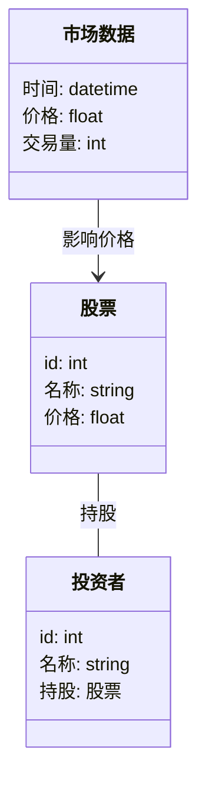

                 


# 全球股市估值与人机协作技术的关系

> 关键词：全球股市估值，人机协作技术，人工智能，大数据分析，量化投资

> 摘要：随着人工智能和大数据技术的迅速发展，人机协作技术在全球股市估值中的应用越来越广泛。本文将深入探讨全球股市估值的核心问题、人机协作技术的基本概念，以及两者之间的关系。通过分析和实例，我们将展示如何利用人机协作技术提升股市估值的准确性和效率，同时探讨这一技术对全球市场结构和投资策略的深远影响。

---

## 第一部分: 全球股市估值的现状与挑战

### 第1章: 全球股市估值的现状与挑战

#### 1.1 全球股市估值的现状

##### 1.1.1 全球主要股市的估值指标
全球股市估值的核心指标包括市盈率（P/E）、市净率（P/B）、股息率等。这些指标反映了市场的整体健康状况和投资价值。例如，道琼斯指数、标普500指数、纳斯达克指数等都是全球投资者关注的重点。

##### 1.1.2 不同经济周期下的估值波动
股市估值在不同的经济周期中表现出显著差异。例如，在经济衰退期，市盈率通常较高，而在经济扩张期，市盈率则相对较低。这种波动性为投资者提供了套利机会，但也增加了估值的复杂性。

##### 1.1.3 市场参与者的估值需求
投资者、机构、企业等不同参与者对股市估值的需求各不相同。例如，个人投资者可能更关注短期波动，而机构投资者则更注重长期趋势。

#### 1.2 传统股市估值方法的局限性

##### 1.2.1 基于基本面分析的传统方法
基本面分析依赖于企业的财务数据，如收入、利润、负债等。这种方法忽略了市场情绪和宏观经济因素的影响，导致估值结果的片面性。

##### 1.2.2 基于技术分析的传统方法
技术分析通过研究历史价格和成交量数据来预测未来走势。然而，这种方法在面对市场突发性事件时显得力不从心。

##### 1.2.3 传统估值方法的局限性与改进空间
传统方法难以应对数据量大、市场复杂性高等挑战。例如，金融危机期间，传统估值方法往往失效，导致投资者损失惨重。

#### 1.3 人机协作技术的兴起

##### 1.3.1 人工智能与大数据技术的结合
人工智能（AI）和大数据技术的结合为股市估值提供了新的工具和方法。例如，机器学习算法可以处理海量数据，发现传统方法难以察觉的模式和趋势。

##### 1.3.2 机器学习在金融领域的应用
机器学习在金融领域的应用包括股票预测、风险评估、交易策略优化等。这些技术的应用显著提高了估值的准确性和效率。

##### 1.3.3 人机协作技术的定义与特点
人机协作技术是指人类与机器协同工作，利用各自的优势完成任务。在股市估值中，人类提供经验和策略，机器提供数据处理和分析能力。

---

## 第二部分: 全球股市估值与人机协作技术的关系

### 第2章: 全球股市估值的核心问题

#### 2.1 全球股市估值的核心问题

##### 2.1.1 估值的核心要素与关键指标
估值的核心要素包括企业的财务状况、行业竞争格局、宏观经济环境等。关键指标包括市盈率、市净率、股息率等。

##### 2.1.2 不同市场环境下的估值挑战
在牛市中，投资者可能高估股票价值；在熊市中，投资者可能低估股票价值。此外，全球市场的联动性增加了估值的复杂性。

##### 2.1.3 估值误差的来源与影响
估值误差可能来源于数据偏差、模型假设不合理、市场情绪波动等因素。这些误差可能导致投资决策失误，造成经济损失。

### 第3章: 人机协作技术在股市估值中的作用

#### 3.1 人机协作技术的核心作用

##### 3.1.1 数据处理与分析
机器学习算法可以处理海量数据，提取有用信息，帮助人类更好地理解市场动态。

##### 3.1.2 估值模型的优化
通过机器学习，可以构建更复杂的估值模型，提高预测的准确性。

##### 3.1.3 风险管理与投资策略优化
人机协作技术可以帮助投资者制定更科学的投资策略，降低投资风险。

#### 3.2 人机协作技术对全球股市的影响

##### 3.2.1 技术进步对市场效率的提升
人工智能和大数据技术的应用提高了市场的信息处理能力，降低了交易成本。

##### 3.2.2 市场结构的变化
技术驱动的市场结构变化包括高频交易、算法交易的普及，以及市场的自动化程度提高。

##### 3.2.3 全球化视角下的技术与市场互动
全球化背景下，技术的应用推动了市场的国际化，同时也带来了新的挑战，如跨境投资风险、数据隐私问题等。

---

## 第三部分: 全球股市估值与人机协作技术的核心概念关系

### 第4章: 全球股市估值与人机协作技术的核心概念

#### 4.1 全球股市估值的核心概念

##### 4.1.1 估值的定义与目标
估值是通过对企业的财务状况、市场环境等因素的分析，确定其股票的合理价格。

##### 4.1.2 估值的关键指标与模型
关键指标包括市盈率、市净率等。模型包括DCF模型、市盈率模型等。

##### 4.1.3 估值的边界与外延
估值的边界包括数据的准确性、模型的有效性等。外延则包括宏观经济、政策环境等因素。

#### 4.2 人机协作技术的核心概念

##### 4.2.1 人工智能在金融领域的应用
人工智能在金融领域的应用包括股票预测、风险评估、交易策略优化等。

##### 4.2.2 人机协作的定义与特点
人机协作是指人类与机器协同工作，利用各自的优势完成任务。其特点包括高效性、准确性、适应性等。

##### 4.2.3 人机协作技术的核心要素
核心要素包括数据、算法、计算能力、人类专业知识等。

#### 4.3 全球股市估值与人机协作技术的联系

##### 4.3.1 技术如何提升估值的准确性
通过机器学习算法，可以更准确地预测市场趋势，提高估值的准确性。

##### 4.3.2 技术如何优化估值的效率
人工智能可以快速处理海量数据，提高估值的效率。

##### 4.3.3 技术如何改变估值的模式
人机协作技术的应用使得估值模式从传统的基本面分析向数据驱动的分析转变。

---

## 第四部分: 全球股市估值与人机协作技术的核心概念关系

### 第5章: 全球股市估值与人机协作技术的核心概念关系

#### 5.1 核心概念的原理

##### 5.1.1 估值原理的数学模型
股票估值的数学模型可以表示为：
$$ V = \text{DCF} + \text{调整因素} $$
其中，DCF表示现金流折现模型，调整因素包括市场情绪、宏观经济等。

##### 5.1.2 人机协作技术的算法原理
机器学习算法的核心是通过数据训练模型，提取特征，进行预测。例如，支持向量机（SVM）可以用于分类问题，神经网络可以用于时间序列预测。

##### 5.1.3 两者关系的理论基础
人机协作技术通过提高数据处理能力和模型准确性，增强了估值的科学性和实用性。

#### 5.2 核心概念的属性特征对比

##### 5.2.1 估值指标的属性特征
| 指标 | 属性 |
|------|------|
| 市盈率 | 反映市场对收益的预期 |
| 市净率 | 反映市场对资产的估值 |

##### 5.2.2 人机协作技术的属性特征
| 技术 | 属性 |
|------|------|
| 机器学习 | 数据驱动、非线性关系 |
| 大数据处理 | 高效性、准确性 |

##### 5.2.3 两者属性特征的对比分析
从表格可以看出，估值指标关注的是市场对企业的评价，而人机协作技术关注的是如何高效地处理数据和提高预测的准确性。

#### 5.3 ER实体关系图架构

##### 5.3.1 实体关系图的构建
```mermaid
erd
    股票
    投资者
    市场数据
    估值模型
    交易系统

    股票 --有> 投资者: 持股
    投资者 --有> 估值模型: 使用模型
    市场数据 --有> 估值模型: 输入
    估值模型 --有> 交易系统: 输出
```

##### 5.3.2 实体关系图的分析
实体关系图展示了股票、投资者、市场数据、估值模型和交易系统之间的关系。通过人机协作技术，投资者可以利用市场数据和估值模型，做出更科学的投资决策。

---

## 第五部分: 人机协作技术在股市估值中的算法原理

### 第6章: 算法原理讲解

#### 6.1 时间序列分析

##### 6.1.1 时间序列分析的原理
时间序列分析通过研究数据的时序特征，预测未来趋势。常用的方法包括ARIMA模型、GARCH模型等。

##### 6.1.2 ARIMA模型的代码实现
```python
from statsmodels.tsa.arima_model import ARIMA
import pandas as pd
import numpy as np

# 示例数据
data = pd.Series(np.random.randn(100), index=pd.date_range('2020-01-01', periods=100))

# 拟合ARIMA模型
model = ARIMA(data, order=(1, 1, 1))
model_fit = model.fit()

# 预测未来5天的值
 forecast = model_fit.forecast(steps=5)
 print(forecast)
```

##### 6.1.3 时间序列分析的案例
通过ARIMA模型，可以预测股票价格的未来走势，帮助投资者做出投资决策。

#### 6.2 机器学习模型

##### 6.2.1 机器学习模型的原理
机器学习模型通过训练数据，学习特征，进行分类或回归预测。常用算法包括线性回归、支持向量机（SVM）、随机森林等。

##### 6.2.2 机器学习模型的代码实现
```python
from sklearn.linear_model import LinearRegression
import pandas as pd
import numpy as np

# 示例数据
X = np.random.rand(100, 5)  # 5个特征，100个样本
y = np.random.rand(100)     # 目标变量

# 拟合线性回归模型
model = LinearRegression()
model.fit(X, y)

# 预测新样本
new_X = np.random.rand(5, 5)
预测_y = model.predict(new_X)
print(预测_y)
```

##### 6.2.3 机器学习模型的案例
通过机器学习模型，可以预测股票的涨跌趋势，帮助投资者制定交易策略。

---

## 第六部分: 系统分析与架构设计方案

### 第7章: 系统分析与架构设计方案

#### 7.1 问题场景介绍
本系统旨在利用人机协作技术，提高全球股市估值的准确性和效率。系统将整合市场数据、机器学习模型和交易系统，为投资者提供实时的估值支持。

#### 7.2 系统功能设计

##### 7.2.1 领域模型


#### 7.3 系统架构设计

##### 7.3.1 系统架构图


#### 7.4 系统交互设计

##### 7.4.1 交互序列图
```mermaid
sequenceDiagram
    投资者 -> 市场数据采集模块: 请求数据
    市场数据采集模块 -> 数据处理模块: 传输数据
    数据处理模块 -> 估值模型模块: 请求分析
    估值模型模块 -> 交易系统模块: 输出结果
    投资者 <- 交易系统模块: 反馈结果
```

---

## 第七部分: 项目实战

### 第8章: 项目实战

#### 8.1 环境安装
需要安装Python、机器学习库（如scikit-learn、statsmodels）和数据处理工具（如Pandas、NumPy）。

#### 8.2 系统核心实现源代码

##### 8.2.1 数据采集模块
```python
import requests
import pandas as pd

# 从API获取市场数据
def get_market_data(api_key):
    url = f"https://api.example.com/market-data?api_key={api_key}"
    response = requests.get(url)
    data = response.json()
    return pd.DataFrame(data)
```

##### 8.2.2 估值模型模块
```python
from sklearn.linear_model import LinearRegression
import pandas as pd

# 训练估值模型
def train_model(data):
    X = data[['市盈率', '市净率']]
    y = data['股票价格']
    model = LinearRegression()
    model.fit(X, y)
    return model
```

##### 8.2.3 交易系统模块
```python
import requests
from sklearn.linear_model import LinearRegression

# 执行交易
def execute_trade(api_key, stock_id, amount):
    url = f"https://api.example.com/trade?api_key={api_key}"
    payload = {
        'stock_id': stock_id,
        'amount': amount
    }
    response = requests.post(url, json=payload)
    return response.status_code
```

#### 8.3 代码应用解读与分析
通过上述代码，可以实现市场数据的采集、估值模型的训练和交易系统的执行。系统将根据模型预测的结果，自动执行交易策略。

#### 8.4 实际案例分析
以某只股票为例，系统将根据历史数据和市场动态，预测其未来价格，并制定相应的投资策略。

#### 8.5 项目小结
通过本项目，我们可以看到人机协作技术在股市估值中的巨大潜力。系统不仅提高了估值的准确性，还优化了投资决策的效率。

---

## 第八部分: 最佳实践与总结

### 第9章: 最佳实践

#### 9.1 最佳实践 tips
- 数据质量是估值的关键，确保数据的准确性和完整性。
- 定期更新模型，适应市场变化。
- 注意风险管理，避免过度依赖技术。

#### 9.2 小结
本文详细探讨了全球股市估值与人机协作技术的关系，分析了技术在估值中的应用和优势。

#### 9.3 注意事项
- 技术的应用需要结合具体市场环境。
- 数据隐私和安全问题需要高度重视。

#### 9.4 拓展阅读
建议进一步研究强化学习在股市估值中的应用，以及如何应对市场的不确定性。

---

## 作者

作者：AI天才研究院/AI Genius Institute & 禅与计算机程序设计艺术 /Zen And The Art of Computer Programming

---

## 版权声明

本文由AI天才研究院/AI Genius Institute撰写，版权归作者所有，转载请注明出处。

