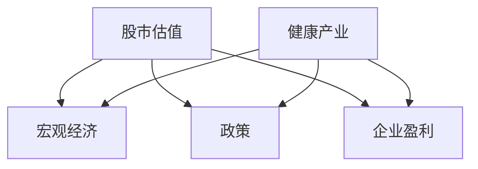
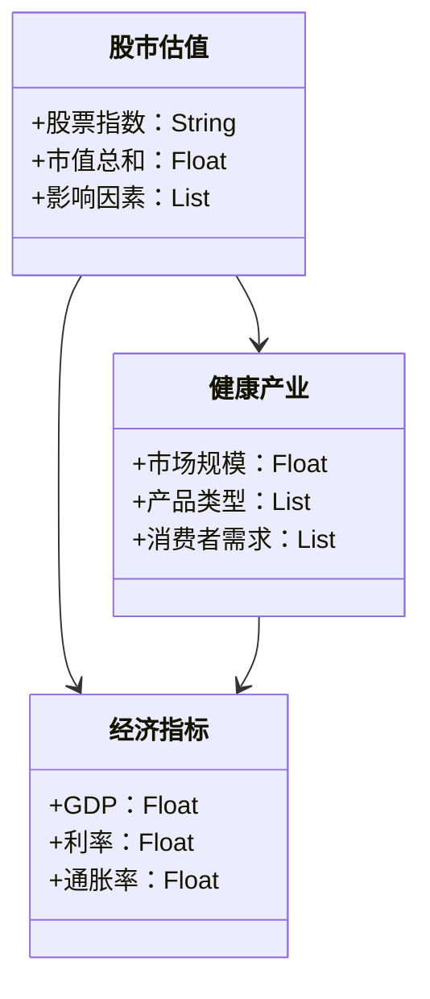
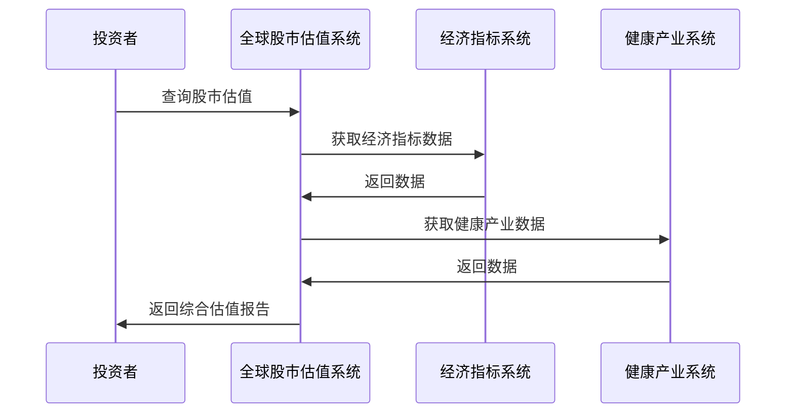

                 


# 全球股市估值与健康产业发展的关系

> **关键词**：全球股市估值、健康发展、健康产业、股市影响、投资分析、经济指标、数学模型

> **摘要**：本文探讨全球股市估值与健康产业发展的相互关系，分析影响股市估值的关键因素，揭示健康产业对股市的影响机制，结合数学模型和实证分析，为投资者和政策制定者提供参考。

---

## 第1章：全球股市估值与健康产业发展的背景介绍

### 1.1 全球股市估值的基本概念

#### 1.1.1 股市估值的定义与计算方法
股市估值是衡量股票市场整体价值的指标，通常通过股票指数来反映。例如，标普500指数代表美国500家大型企业的市值总和。计算方法包括加权平均法和非加权平均法，权重通常基于市值或流动性。

#### 1.1.2 全球股市估值的现状与趋势
近年来，全球股市估值波动较大，受经济周期、政策变化和地缘政治影响显著。健康产业作为重要组成部分，其表现对整体股市估值有重要影响。

#### 1.1.3 健康产业的基本概念与分类
健康产业涵盖医疗、制药、健康食品等领域。分类包括医疗设备制造、医疗服务提供、健康保险等。健康意识提升和老龄化推动了行业需求增长。

### 1.2 问题背景与问题描述

#### 1.2.1 全球股市估值波动的现状
全球股市估值受宏观经济和行业因素影响，波动性大。例如，2020年疫情导致股市大跌，健康产业面临挑战与机遇。

#### 1.2.2 健康产业发展面临的挑战
包括政策监管、技术创新、市场竞争等。例如，药品审批流程复杂，影响企业盈利能力和股市估值。

#### 1.2.3 问题解决的必要性与目标
通过分析两者的互动关系，为投资者提供参考，帮助企业制定战略，推动健康产业可持续发展。

### 1.3 问题背景的边界与外延

#### 1.3.1 全球股市估值的边界条件
考虑主要市场指数，如标普500、纳斯达克、恒生指数等。分析时间范围通常为10年，数据来源包括政府报告和金融数据库。

#### 1.3.2 健康产业发展的核心要素
包括政策支持、技术创新、市场需求。例如，政府政策影响行业扩张，技术创新提升企业竞争力。

#### 1.3.3 问题的外延与相关领域
涉及宏观经济分析、投资策略、风险管理等领域。例如，股市估值与GDP的关系，健康产业与就业增长的联系。

### 1.4 核心概念与联系

#### 1.4.1 核心概念的结构与组成
- 股市估值：宏观经济、政策、企业盈利
- 健康产业：政策、技术、市场需求

#### 1.4.2 核心概念的属性特征对比表
| 特性 | 股市估值 | 健康产业 |
|------|----------|----------|
| 影响因素 | 经济指标、政策 | 技术创新、政策 |
| 发展趋势 | 波动性 | 稳步增长 |
| 关键指标 | 股票指数 | 市场规模 |

#### 1.4.3 ER实体关系图架构（Mermaid流程图）


---

## 第2章：全球股市估值的影响因素

### 2.1 宏观经济指标对股市估值的影响

#### 2.1.1 GDP与股市估值的关系
GDP增长通常带动企业盈利上升，股市估值提升。例如，经济复苏时，股市上涨，健康产业收益增加。

#### 2.1.2 利率与股市估值的关联
低利率环境降低融资成本，刺激投资，抬高股市估值。例如，美联储降息政策促进股市上涨，健康产业获益。

#### 2.1.3 通货膨胀对股市估值的影响
适度通胀提升企业盈利能力，过高通胀引发股市下跌。健康产业在通胀压力下，需调整产品定价策略。

### 2.2 行业政策与股市估值的关系

#### 2.2.1 政府政策对股市的影响
政府出台的政策直接影响股市表现。例如，医保政策调整影响制药企业盈利，进而影响股市估值。

#### 2.2.2 健康产业政策对股市估值的作用
政府支持健康产业发展，相关政策如税收优惠、研发补贴等，推动企业成长，提升股市估值。

#### 2.2.3 行业监管对股市的影响
严格的监管政策可能抑制企业扩张，影响股市表现。例如，药品审批流程延长增加企业成本，影响盈利。

### 2.3 企业盈利与股市估值的关联

#### 2.3.1 企业盈利对股市估值的影响
企业盈利增长直接提升股市估值。例如，制药企业新产品上市增加利润，推动股价上涨。

#### 2.3.2 健康产业企业的盈利模式
健康产业企业通过提供医疗产品和服务获得收入。例如，健身房会员费、药品销售等。

#### 2.3.3 企业盈利与股市估值的数学模型
使用回归模型分析企业盈利与股市估值的关系：
$$ \text{Stock Value} = \beta \times \text{Profit} + \epsilon $$

---

## 第3章：健康产业发展的驱动因素

### 3.1 人口老龄化与健康产业需求

#### 3.1.1 人口老龄化对健康产业的影响
老龄化增加医疗需求，推动健康产业扩张。例如，老年人对医疗设备和药品的需求增加。

#### 3.1.2 健康产业需求的变化趋势
随着人口老龄化，健康产业需求将持续增长，带动股市估值上升。

#### 3.1.3 人口结构对股市估值的影响
老龄化可能导致投资需求下降，但健康产业需求增加，两者相互作用影响股市整体估值。

### 3.2 健康意识与消费习惯的变迁

#### 3.2.1 健康意识的提升对健康产业的影响
健康意识增强推动健康食品和健身器材需求增长，带动相关企业盈利和股市估值上升。

#### 3.2.2 消费习惯的变化对股市估值的影响
消费者倾向于购买健康产品，推动企业收入增长，股市估值提升。

#### 3.2.3 健康产业消费行为的数学模型
$$ \text{Consumption} = \alpha \times \text{Health Awareness} + \beta \times \text{Price} + \epsilon $$

### 3.3 技术创新与健康产业发展的关系

#### 3.3.1 技术创新对健康产业的影响
技术创新提升产品附加值，增强企业竞争力。例如，新型医疗设备的开发提高企业收入，推动股价上涨。

#### 3.3.2 技术创新对股市估值的影响
技术创新使企业更具市场竞争力，提升股市估值。例如，生物技术突破推动制药企业股价上涨。

#### 3.3.3 技术创新与股市估值的数学模型
$$ \text{Stock Price} = \gamma \times \text{Innovation} + \delta \times \text{Market Demand} + \epsilon $$

---

## 第4章：全球股市估值与健康产业发展的互动关系

### 4.1 健康产业发展的驱动因素对股市估值的影响

#### 4.1.1 人口老龄化驱动健康产业扩张
老龄化增加医疗需求，推动健康产业企业发展，提升股市估值。

#### 4.1.2 健康意识提升推动消费增长
健康消费增长带动企业收入和盈利，提升股市估值。

### 4.2 股市估值波动对健康产业的影响

#### 4.2.1 股市波动对健康产业投资的影响
股市下跌可能减少健康产业投资，影响企业扩张和创新。

#### 4.2.2 股市估值对健康产业融资的影响
股市融资为健康企业提供资金支持，促进企业发展，进一步提升股市估值。

### 4.3 两者关系的数学模型与实证分析

#### 4.3.1 回归模型
$$ \text{Stock Value} = \beta_1 \times \text{Health Industry} + \beta_2 \times \text{Economic Indicators} + \epsilon $$

#### 4.3.2 数据来源与分析方法
使用全球主要股市数据和健康产业经济指标，进行回归分析，验证两者关系。

---

## 第5章：系统分析与架构设计方案

### 5.1 问题场景介绍
分析股市估值与健康产业发展的互动关系，构建数学模型进行预测和投资决策。

### 5.2 系统功能设计（领域模型mermaid类图）


### 5.3 系统架构设计（mermaid架构图）
```mermaid
context diagram
    actor 投资者
    actor 政府
    actor 企业
    system 全球股市估值系统
    system 健康产业发展系统
    投资者 --> 全球股市估值系统
    政府 --> 健康产业发展系统
    企业 --> 全球股市估值系统
    全球股市估值系统 --> 健康产业发展系统
```

### 5.4 系统接口设计
- 投资者查询股市估值
- 政府发布政策影响
- 企业报告盈利情况

### 5.5 系统交互（mermaid序列图）


---

## 第6章：项目实战

### 6.1 环境安装
- 数据库：MySQL或PostgreSQL
- 开发工具：Python、Jupyter Notebook
- 数据库连接库：pymysql

### 6.2 系统核心实现源代码

#### 数据获取与处理
```python
import pandas as pd
import numpy as np
from sklearn.linear_model import LinearRegression

# 数据获取
def get_stock_data():
    # 获取全球股市数据
    pass

def get_health_data():
    # 获取健康产业数据
    pass

# 数据清洗
def preprocess_data(stock_data, health_data):
    # 合并数据
    df = pd.merge(stock_data, health_data, on='date')
    return df

# 数据分析
def analyze_relation(df):
    model = LinearRegression()
    model.fit(df[['health_market_size']], df['stock_value'])
    return model.coef_[0], model.intercept_
```

#### 代码应用解读与分析
- 数据获取：从金融数据库获取全球股市和健康产业数据。
- 数据清洗：合并数据并处理缺失值。
- 模型训练：使用线性回归分析两者关系。

### 6.3 实际案例分析和详细讲解剖析
以2020年为例，分析疫情对股市估值和健康产业的影响。健康产业在疫情中需求激增，推动股市估值上升。

### 6.4 项目小结
总结项目成果，强调分析方法的应用价值，提出未来研究方向。

---

## 第7章：最佳实践 tips、小结、注意事项、拓展阅读

### 7.1 最佳实践 tips
- 定期更新数据，保持分析模型的准确性。
- 结合宏观经济指标，全面评估影响因素。

### 7.2 小结
本文系统分析了全球股市估值与健康产业发展的关系，提供了理论和实践指导，为投资者和政策制定者提供参考。

### 7.3 注意事项
- 数据质量和完整性影响分析结果。
- 模型假设需合理，避免偏差。

### 7.4 拓展阅读
建议阅读相关文献，深入了解健康产业的细分领域和股市估值的高级分析方法。

---

## 附录

### 附录A：数据来源
- 全球股市数据：世界银行、金融数据库
- 健康产业数据：市场研究报告、政府统计

### 附录B：工具与库
- 数据分析工具：Python、R
- 可视化工具：Matplotlib、Tableau

### 附录C：参考文献
- 文献1：某健康产业发展报告
- 文献2：某股市估值分析论文

---

**作者：AI天才研究院/AI Genius Institute & 禅与计算机程序设计艺术/Zen And The Art of Computer Programming**

