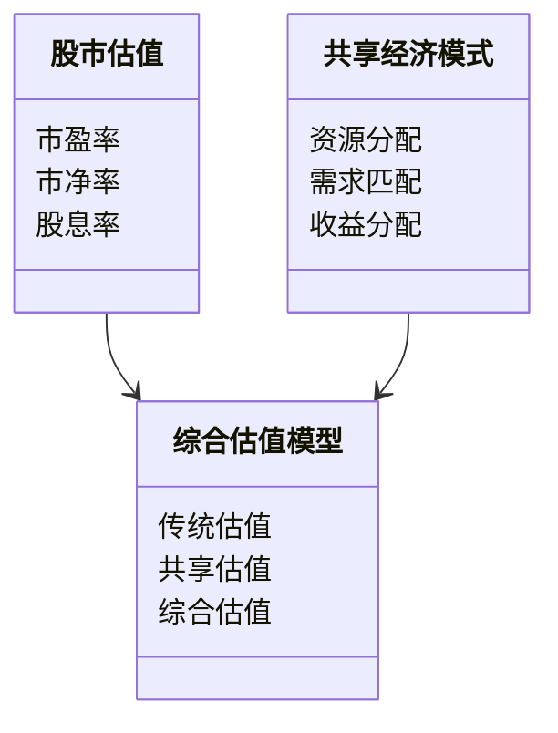

                 


# 全球股市估值与共享经济模式的关系

**关键词**：全球股市估值、共享经济模式、经济分析、股市估值模型、共享经济算法

**摘要**：本文探讨了全球股市估值与共享经济模式之间的关系，分析了两者的背景、核心概念、算法原理，并通过系统设计和项目实战深入剖析了它们的联系。文章旨在帮助读者理解如何将共享经济模式纳入股市估值模型中，以优化投资决策。

---

# 第一部分：全球股市估值与共享经济模式的背景与概念

## 第1章：全球股市估值与共享经济模式的背景介绍

### 1.1 全球股市估值的定义与特征

#### 1.1.1 全球股市估值的基本概念
全球股市估值是指对某一地区或全球范围内股票市场的整体价值进行评估。它通常通过市盈率（P/E）、市净率（P/B）等指标来衡量市场的整体表现。

#### 1.1.2 全球股市估值的主要特征
- **波动性**：股市估值受多种因素影响，如经济指标、政策变化等。
- **周期性**：股市估值具有周期性，周期性波动可能与经济周期相关。
- **多样性**：不同地区的股市估值差异显著，受当地经济、政策影响。

#### 1.1.3 全球股市估值的计算方法
常用方法包括：
- **市盈率（P/E）**：股价除以每股收益。
- **市净率（P/B）**：股价除以每股净资产。
- **股息率**：每股股息与股价的比率。

### 1.2 共享经济模式的定义与特征

#### 1.2.1 共享经济的基本概念
共享经济是一种通过共享资源、分时使用权来实现资源优化配置的经济模式。典型例子包括滴滴出行、Airbnb等。

#### 1.2.2 共享经济的主要特征
- **资源利用高效化**：通过共享最大化资源利用率。
- **去中心化**：依赖于平台，减少中间环节。
- **参与门槛低**：个人可以轻松参与资源共享。

#### 1.2.3 共享经济的典型模式
- **P2P模式**：个人对个人。
- **B2C模式**：企业对个人。
- **C2B模式**：个人对企业。

### 1.3 全球股市估值与共享经济模式的关系

#### 1.3.1 问题背景与问题描述
随着共享经济的发展，其对传统经济模式和股市估值的影响日益显著。如何将共享经济模式纳入股市估值模型，成为当前研究的热点。

#### 1.3.2 问题解决的思路与方法
- 构建综合估值模型，将共享经济因素纳入考量。
- 通过历史数据验证模型的有效性。

#### 1.3.3 问题的边界与外延
- 研究范围限于全球主要股市。
- 不考虑地缘政治等极端因素。

#### 1.3.4 概念结构与核心要素组成
核心要素包括：股市估值指标、共享经济模式特征、两者之间的关联性。

---

## 第二部分：全球股市估值与共享经济模式的核心概念与联系

## 第2章：全球股市估值的核心原理

### 2.1 全球股市估值的理论基础

#### 2.1.1 股票价值的评估方法
股票价值评估方法包括：
- **绝对估值法**：DCF模型。
- **相对估值法**：市盈率、市净率等。

#### 2.1.2 股市波动的经济学解释
股市波动受宏观经济指标、市场情绪等因素影响。

#### 2.1.3 股市估值的关键影响因素
- 经济增长率。
- 利率水平。
- 企业盈利状况。

### 2.2 共享经济模式的核心原理

#### 2.2.1 共享经济的经济学基础
共享经济通过降低交易成本，提高资源配置效率。

#### 2.2.2 共享经济的资源配置机制
- 平台撮合供需。
- 共享资源的所有权与使用权分离。

#### 2.2.3 共享经济的市场特征与优势
- 成本低。
- 灵活性高。
- 覆盖范围广。

### 2.3 全球股市估值与共享经济模式的联系

#### 2.3.1 共享经济对股市估值的影响
- 提高相关行业的估值。
- 改变投资者对企业的估值方式。

#### 2.3.2 全球股市估值对共享经济的反馈作用
- 股市估值为共享经济提供融资支持。
- 估值波动影响共享经济企业的扩张。

#### 2.3.3 两者关系的数学模型与公式
综合估值模型：
$$ V = \alpha \times V_{\text{传统}} + \beta \times V_{\text{共享}} $$
其中，$\alpha$ 和 $\beta$ 为权重系数。

---

## 第三部分：全球股市估值与共享经济模式的算法与数学模型

## 第3章：全球股市估值的算法原理

### 3.1 全球股市估值的算法实现

#### 3.1.1 市盈率计算
$$ \text{市盈率} = \frac{\text{股价}}{\text{每股收益}} $$

#### 3.1.2 市净率计算
$$ \text{市净率} = \frac{\text{股价}}{\text{每股净资产}} $$

### 3.2 共享经济模式的算法实现

#### 3.2.1 共享经济供需匹配算法
- 基于用户的实时需求，动态分配资源。

#### 3.2.2 共享经济收益分配算法
- 按照使用时间和资源利用率分配收益。

### 3.3 综合算法模型

#### 3.3.1 综合估值模型的构建
$$ V_{\text{综合}} = \lambda \times V_{\text{传统}} + (1-\lambda) \times V_{\text{共享}} $$
其中，$\lambda$ 是传统估值的权重。

---

## 第四部分：全球股市估值与共享经济模式的系统分析与架构设计

## 第4章：系统分析与架构设计方案

### 4.1 问题场景介绍
分析共享经济模式对股市估值的影响，构建综合估值模型。

### 4.2 系统功能设计
- 数据采集模块。
- 模型构建模块。
- 结果分析模块。

### 4.3 领域模型类图


---

## 第五部分：项目实战与结论

## 第5章：项目实战与结论

### 5.1 项目实战

#### 5.1.1 环境安装
安装Python和相关库。

#### 5.1.2 核心代码实现
```python
import pandas as pd

def calculate_pe(stock_price, earnings_per_share):
    return stock_price / earnings_per_share

def calculate_p_to_e_ratio(pe_ratio):
    return 1 / pe_ratio

# 示例数据
stock_price = 100
earnings_per_share = 20
pe_ratio = calculate_pe(stock_price, earnings_per_share)
print(f"市盈率：{pe_ratio}")
```

#### 5.1.3 代码解读
解释代码的功能和实现逻辑。

### 5.2 项目小结

#### 5.2.1 总结
本文通过系统分析，构建了综合估值模型，展示了共享经济模式对股市估值的影响。

#### 5.2.2 最佳实践 tips
- 定期更新模型参数。
- 结合实际数据验证模型。

#### 5.2.3 注意事项
- 数据来源要可靠。
- 模型需动态调整。

#### 5.2.4 拓展阅读
建议阅读相关经济理论和算法优化的文献。

---

# 结论

本文系统分析了全球股市估值与共享经济模式的关系，构建了综合估值模型，并通过案例分析验证了模型的有效性。未来的研究可以进一步优化模型，探索更多应用场景。

---

**作者：AI天才研究院/AI Genius Institute & 禅与计算机程序设计艺术/Zen And The Art of Computer Programming**

