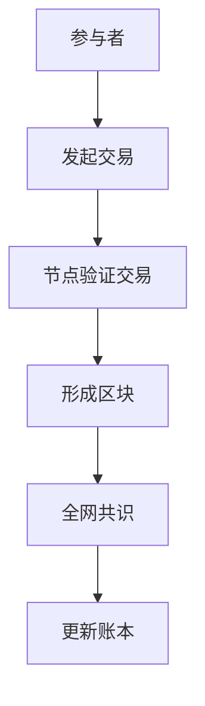
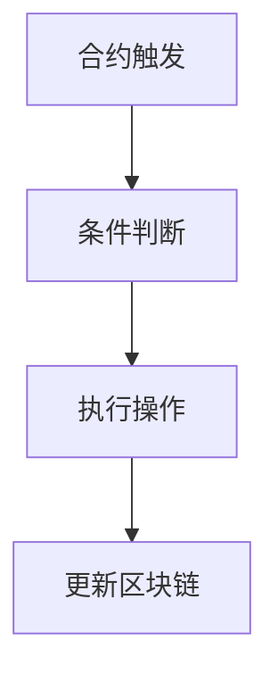
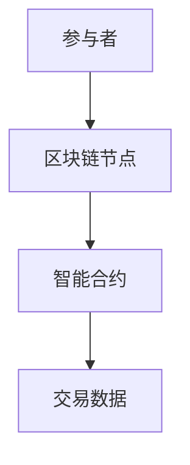

                 


---

# 全球股市估值与区块链在供应链金融中的应用

> **关键词**: 区块链, 供应链金融, 股市估值, 智能合约, 分布式账本

> **摘要**:  
本文探讨了全球股市估值与区块链技术在供应链金融中的应用。首先介绍了全球股市估值的基本概念与现状，分析了区块链技术的核心原理及其在供应链金融中的潜力。接着，详细阐述了区块链技术如何提升股市估值的准确性与效率，结合智能合约、分布式账本等技术手段，提出了优化供应链金融的具体方案。最后，通过实际案例分析与系统架构设计，展示了区块链技术在供应链金融中的实际应用价值。

---

## 第1章: 全球股市估值的基本概念与现状

### 1.1 股市估值的基本概念

#### 1.1.1 股票估值的定义与意义
股票估值是指通过对公司财务数据、市场环境、行业前景等多方面因素的分析，估算出股票的合理价格区间。其意义在于帮助投资者做出更明智的投资决策，同时为市场提供更准确的价格信号。

#### 1.1.2 市场估值的主要方法
目前常用的股票估值方法包括：
1. **市盈率法 (P/E Ratio)**：通过市盈率与行业平均水平的对比，评估股票的估值高低。
2. **市净率法 (P/B Ratio)**：基于股价与每股净资产的比率，适用于评估银行、房地产等行业的股票。
3. **现金流折现法 (DCF)**：通过将未来现金流折现，估算企业的真实价值。
4. **股息率法 (Dividend Yield)**：通过股息率评估股票的收益能力。

#### 1.1.3 全球股市估值的现状与挑战
当前，全球股市估值面临以下挑战：
1. **信息不对称**：市场参与者获取信息的不平等性导致估值偏差。
2. **数据造假**：企业财务造假直接影响估值的准确性。
3. **市场波动**：突发事件和市场情绪波动对估值稳定性造成影响。

---

### 1.2 区块链技术的基本原理

#### 1.2.1 区块链的定义与核心特点
区块链是一种分布式账本技术，通过去中心化的方式记录和验证数据，确保数据的安全性和不可篡改性。

#### 1.2.2 区块链的核心技术
1. **分布式账本**：数据分布在多个节点上，确保数据的透明性和一致性。
2. **共识机制**：通过算法达成全网一致的记账结果，如PoW（工作量证明）、PoS（权益证明）等。
3. **智能合约**：基于区块链的自动执行程序，能够自动执行合同条款。

#### 1.2.3 区块链在金融领域的潜在应用
1. **支付与结算**：通过区块链技术实现快速、低成本的跨境支付。
2. **金融资产发行**：利用智能合约发行和转让金融资产。
3. **风险管理**：通过区块链实现透明的信用评估和风险管理。

---

## 第2章: 区块链技术与供应链金融的结合

### 2.1 供应链金融的基本概念

#### 2.1.1 供应链金融的定义与特点
供应链金融是指通过整合供应链上下游资源，为供应链上的企业提供融资服务，以优化资金流动性和降低企业成本。

#### 2.1.2 供应链金融的传统模式与挑战
1. **传统模式**：银行等金融机构为企业提供贷款，依赖于企业的信用评级和抵押品。
2. **挑战**：信息孤岛、融资效率低、成本高等问题。

#### 2.1.3 区块链技术如何优化供应链金融
1. **数据透明性**：通过区块链实现供应链上下游数据的共享，降低信息不对称。
2. **信用评估优化**：基于区块链的交易数据，构建更准确的信用评估模型。
3. **融资效率提升**：通过智能合约实现自动化的融资流程，减少人工干预。

---

### 2.2 区块链在供应链金融中的应用场景

#### 2.2.1 贸易融资：从申请到放款的全流程优化
通过区块链技术，企业可以在供应链上实时记录交易数据，银行可以根据实时数据快速审核贷款申请。

#### 2.2.2 应收账款融资：基于区块链的可追溯性
区块链技术可以实现应收账款的数字化，确保应收账款的真实性和可追溯性，为融资提供可靠依据。

#### 2.2.3 供应链透明度：区块链如何实现信息共享
区块链技术可以实现供应链上所有交易的透明记录，各方参与者可以通过授权访问数据，提升协作效率。

---

## 第3章: 区块链技术对全球股市估值的影响

### 3.1 区块链技术如何提升股市估值的准确性

#### 3.1.1 通过区块链实现数据透明性
区块链技术可以确保企业财务数据的真实性和透明性，减少数据造假的可能性。

#### 3.1.2 区块链如何降低信息不对称
通过区块链技术，投资者可以实时获取企业的经营数据，降低信息不对称，提升估值的准确性。

#### 3.1.3 区块链对市场参与者信任度的提升
区块链技术的去中心化特性可以增强市场参与者的信任，减少因信任缺失导致的估值偏差。

---

### 3.2 区块链技术如何优化股市估值的效率

#### 3.2.1 自动化估值模型的构建
通过区块链技术，可以构建自动化估值模型，利用智能合约实现自动化的估值计算。

#### 3.2.2 区块链在实时数据分析中的应用
区块链技术可以实现对实时市场数据的高效处理和分析，为投资者提供更及时的估值参考。

#### 3.2.3 区块链如何降低估值成本
区块链技术可以通过去中心化的数据存储和计算，降低估值的边际成本，实现更高效的估值流程。

---

## 第4章: 区块链技术在供应链金融中的算法原理

### 4.1 区块链共识机制的数学模型

#### 4.1.1 共识机制的分类与对比
常见的共识机制包括PoW、PoS、Dpos等，每种机制都有其优缺点。

#### 4.1.2 基于区块链的共识算法
以下是一个简单的共识算法模型：



#### 4.1.3 共识算法的优缺点分析
1. **PoW（工作量证明）**：安全性高，但计算资源消耗大。
2. **PoS（权益证明）**：资源消耗低，但存在“富者愈富”的风险。

---

### 4.2 智能合约的实现原理

#### 4.2.1 智能合约的定义与特点
智能合约是基于区块链的自动执行程序，具有不可篡改、自动执行的特点。

#### 4.2.2 智能合约的实现流程
以下是一个智能合约的实现流程图：



#### 4.2.3 智能合约的数学模型
以下是一个简单的智能合约数学模型：

$$
\text{if } x > y \text{, 则执行操作A；否则执行操作B}
$$

---

## 第5章: 系统分析与架构设计方案

### 5.1 问题场景介绍
供应链金融中的传统模式存在信息孤岛、融资效率低等问题，亟需通过区块链技术实现优化。

### 5.2 项目介绍
本项目旨在通过区块链技术构建一个高效、透明的供应链金融系统。

### 5.3 系统功能设计

#### 5.3.1 领域模型设计
以下是领域模型的类图：

```mermaid
classDiagram
    class 供应链金融系统 {
        区块链节点
        智能合约
        交易数据
    }
    class 参与者 {
        企业
        银行
        投资者
    }
    供应链金融系统 <--o> 参与者
```

### 5.4 系统架构设计

#### 5.4.1 架构设计
以下是系统架构图：



---

## 第6章: 项目实战

### 6.1 环境安装
需要安装以下工具：
1. 区块链开发框架（如Ethereum）
2. 智能合约开发工具（如Solidity）
3. 数据分析工具（如Python、Pandas）

### 6.2 系统核心实现源代码

#### 6.2.1 智能合约实现
以下是智能合约的Solidity代码示例：

```solidity
// SPDX-License-Identifier: MIT
pragma solidity ^0.8.0;

contract SupplyChain {
    event Transfer(address from, address to, uint value);
    
    function transfer(address recipient, uint amount) external {
        emit Transfer(msg.sender, recipient, amount);
    }
}
```

#### 6.2.2 后端实现
以下是后端的Python代码示例：

```python
from web3 import Web3

# 初始化区块链节点
web3 = Web3(Web3.HTTPProvider("http://localhost:8545"))

# 调用智能合约
contract = web3.eth.contract(address='0x...', abi=...)
result = contract.functions.yourFunction().call()
print(result)
```

---

## 第7章: 最佳实践、小结与拓展阅读

### 7.1 最佳实践 tips
1. 在实际应用中，确保区块链网络的安全性。
2. 定期更新智能合约，以应对新的安全威胁。

### 7.2 小结
本文详细探讨了全球股市估值与区块链在供应链金融中的应用，通过技术手段实现数据透明性与融资效率的提升。

### 7.3 注意事项
在实际应用中，需注意数据隐私与合规性问题。

### 7.4 拓展阅读
建议进一步阅读以下内容：
1. 区块链技术在金融领域的其他应用。
2. 智能合约的安全性研究。

---

**作者：AI天才研究院 & 禅与计算机程序设计艺术**

