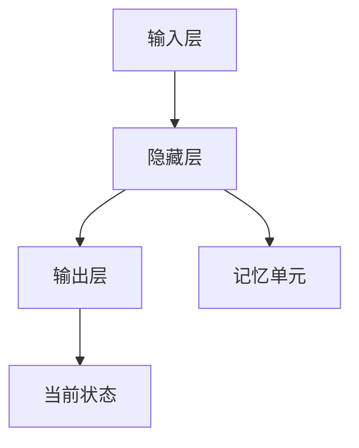
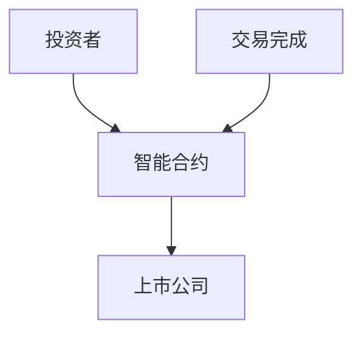
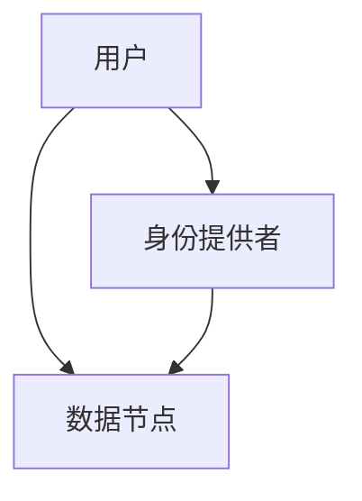
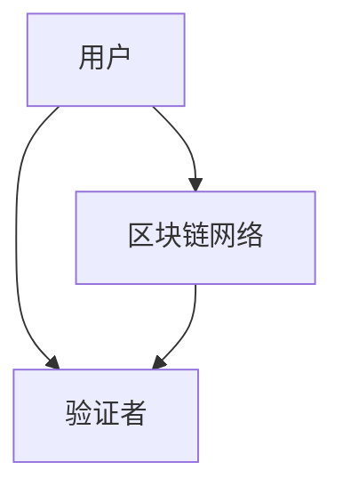
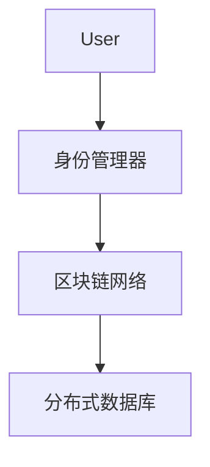
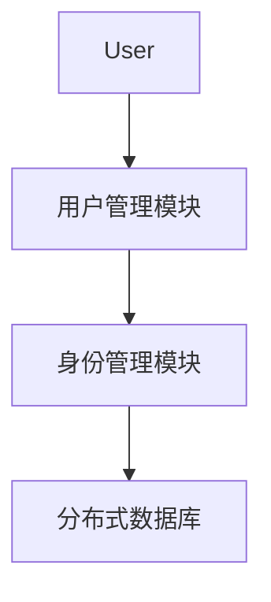
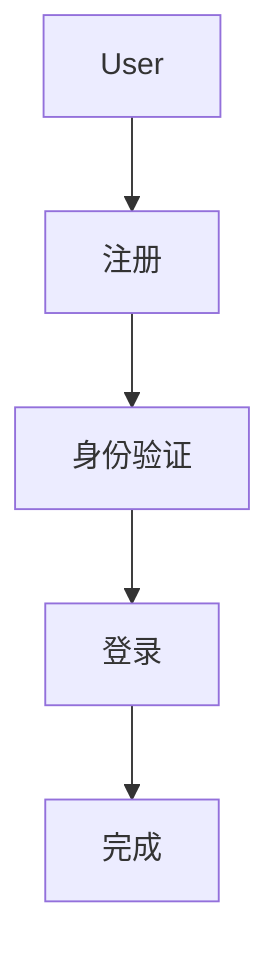
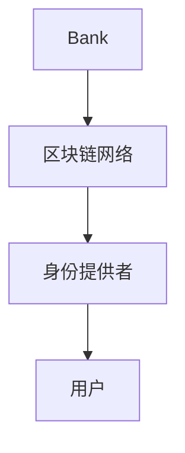

                 


# 全球股市估值与区块链在数字身份管理中的应用

> 关键词：全球股市估值，区块链技术，数字身份管理，智能合约，去中心化身份认证

> 摘要：本文将探讨全球股市估值的传统方法与现代技术结合的应用，以及区块链技术在数字身份管理中的创新应用。通过分析股市估值的数学模型和区块链技术的基本原理，结合实际案例，详细阐述区块链如何提升股市估值的准确性和效率，同时解决数字身份管理中的安全与隐私问题。

---

## 第一部分: 全球股市估值与区块链技术基础

### 第1章: 全球股市估值的基础知识

#### 1.1 股市估值的基本概念
股市估值是通过对公司财务数据、市场环境和行业趋势的分析，来确定股票的合理价格范围。传统的估值方法包括市盈率（P/E）、市净率（P/B）和现金流折现模型（DCF）。然而，这些方法在面对市场波动和复杂数据时，往往显得力不从心。近年来，大数据和人工智能技术的兴起为股市估值提供了新的思路。

**市盈率公式：**
$$ P/E = \frac{\text{股价}}{\text{每股净利润}} $$

**市净率公式：**
$$ P/B = \frac{\text{股价}}{\text{每股净资产}} $$

#### 1.2 区块链技术的基本原理
区块链是一种分布式账本技术，通过去中心化的方式记录和验证数据。其核心特点包括：

1. **分布式账本**：数据分布在多个节点上，确保数据的透明性和不可篡改性。
2. **共识机制**：通过特定算法（如POW、POS）确保所有节点达成一致。
3. **智能合约**：自动执行预设的代码逻辑，实现无需信任的自动化交易。

#### 1.3 数字身份管理的定义与挑战
数字身份管理是指通过数字技术对个人或机构的身份进行识别、认证和管理。传统身份管理方式存在数据孤岛、隐私泄露和中心化风险等问题。区块链的去中心化特性为数字身份管理提供了新的解决方案。

---

### 第2章: 全球股市估值的数学模型与算法

#### 2.1 股市估值的数学模型
股市估值的核心在于预测股票的内在价值。以下是几种常用的数学模型：

1. **市盈率模型**：通过公司净利润和行业平均市盈率来估算股票价值。
2. **现金流折现模型（DCF）**：基于自由现金流的现值计算股票价值。
3. **机器学习模型**：利用历史数据训练预测模型，捕捉非线性关系。

**现金流折现模型公式：**
$$ \text{股票价值} = \sum_{t=1}^{n} \frac{\text{现金流}_t}{(1+r)^t} $$

#### 2.2 AI在股市估值中的应用
人工智能技术在股市估值中的应用主要体现在以下几个方面：

1. **时间序列分析**：利用LSTM（长短期记忆网络）预测股价走势。
2. **情绪分析**：通过自然语言处理技术分析新闻和社交媒体情绪，影响估值。
3. **因子分析**：提取影响股价的关键因子，构建预测模型。

**LSTM网络结构示意图：**



#### 2.3 区块链技术在股市估值中的潜在应用
区块链技术可以为股市估值提供以下优势：

1. **数据共享**：通过区块链实现财务数据的透明共享，减少信息不对称。
2. **智能合约**：自动执行投资协议，降低交易成本。
3. **去中心化估值模型**：利用分布式计算提升估值效率。

**智能合约流程图：**



---

## 第二部分: 区块链在数字身份管理中的应用

### 第3章: 区块链在数字身份管理中的核心应用

#### 3.1 数字身份管理的实体关系图
数字身份管理涉及多个实体，包括用户、认证机构、数据存储节点等。通过ER图可以清晰地展示实体之间的关系。

**实体关系图（ER图）：**



#### 3.2 区块链在数字身份管理中的技术实现
区块链通过以下方式实现数字身份管理：

1. **去中心化存储**：用户身份信息分散存储在多个节点，避免单点故障。
2. **零知识证明**：用户可以在不泄露真实身份的情况下完成认证。
3. **智能合约**：自动执行身份验证逻辑，确保安全性。

**零知识证明流程图：**



#### 3.3 数字身份管理的系统架构设计
数字身份管理系统架构包括以下几个部分：

1. **用户模块**：负责用户身份的注册和登录。
2. **认证模块**：通过区块链实现身份验证。
3. **数据存储模块**：分布式存储用户信息和交易记录。

**系统架构图：**



### 第4章: 系统分析与架构设计方案

#### 4.1 问题场景介绍
在数字身份管理中，传统中心化系统存在以下问题：

1. **数据泄露风险**：中心化存储容易被攻击。
2. **隐私保护不足**：用户信息可能被滥用。
3. **效率低下**：多次认证流程复杂。

#### 4.2 项目介绍
本项目旨在通过区块链技术构建一个去中心化的数字身份管理系统，实现以下目标：

1. **用户隐私保护**：通过零知识证明实现无泄露认证。
2. **高效身份验证**：利用区块链的分布式特性提升效率。
3. **可扩展性**：支持大规模用户和应用场景。

#### 4.3 系统功能设计
系统功能模块包括：

1. **用户管理模块**：注册、登录、信息更新。
2. **身份认证模块**：基于区块链的认证流程。
3. **数据存储模块**：分布式存储用户信息和交易记录。

**系统功能模块图：**



#### 4.4 系统交互设计
系统交互流程包括用户注册、登录和身份验证三个主要环节。

**系统交互流程图：**



---

## 第三部分: 项目实战与实现

### 第5章: 项目实战与实现

#### 5.1 环境安装与配置
项目实战需要以下环境：

1. **区块链框架**：以太坊、Hyperledger等。
2. **开发工具**：Solidity、Web3.js等。
3. **开发环境**：Node.js、Python、IDE工具。

#### 5.2 核心实现
以下是数字身份管理系统的核心实现代码：

```python
# 智能合约部署示例
from web3 import Web3, HTTPProvider

# 初始化区块链节点
web3 = Web3(HTTPProvider('http://localhost:8545'))

# 定义智能合约地址和ABI
contract_address = '0x123...'
contract_abi = [...]

# 创建合约实例
contract = web3.eth.contract(contract_address, abi=contract_abi)

# 调用智能合约方法
tx_hash = contract.functions.registerIdentity('用户名', '密码').transact({'from': '地址'})
web3.eth.waitForTransactionReceipt(tx_hash)
```

#### 5.3 实际案例分析
以下是一个实际案例分析：

**案例：某银行的数字身份管理系统**

1. **需求分析**：客户身份认证、交易授权。
2. **系统设计**：基于区块链实现去中心化认证。
3. **实现过程**：部署智能合约，对接银行系统。
4. **测试与优化**：确保系统安全性和效率。

**案例分析图：**



#### 5.4 项目小结
通过区块链技术实现数字身份管理，可以显著提升系统的安全性、隐私保护能力和运行效率。然而，区块链技术的引入也带来了新的挑战，如网络延迟和计算资源消耗。

---

## 第四部分: 总结与展望

### 第6章: 总结与展望

#### 6.1 最佳实践 tips
- 在实施区块链项目前，需充分评估技术可行性和成本效益。
- 确保团队具备区块链开发和运维能力。
- 注重用户隐私保护，避免数据滥用。

#### 6.2 小结
本文详细探讨了全球股市估值的传统方法与现代技术结合的应用，以及区块链技术在数字身份管理中的创新应用。通过分析股市估值的数学模型和区块链技术的基本原理，结合实际案例，详细阐述了区块链如何提升股市估值的准确性和效率，同时解决数字身份管理中的安全与隐私问题。

#### 6.3 注意事项
- 区块链技术的引入需要考虑性能和安全性。
- 智能合约开发需谨慎，避免逻辑错误导致损失。
- 数据隐私保护是数字身份管理的核心。

#### 6.4 拓展阅读
- 推荐阅读《区块链：重新定义价值交换的未来》。
- 关注行业动态，了解最新的区块链应用场景。

---

## 作者：AI天才研究院 & 禅与计算机程序设计艺术

感谢您的阅读！如需进一步了解，请关注我们的后续文章或联系我们。

