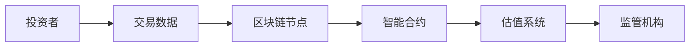
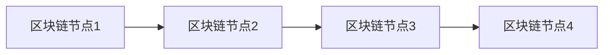
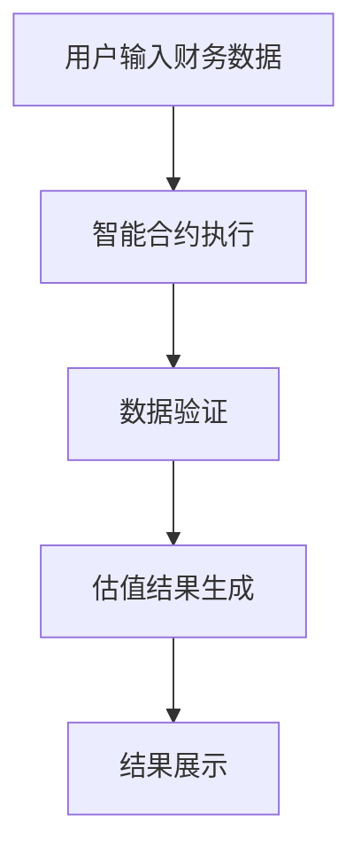
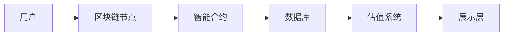
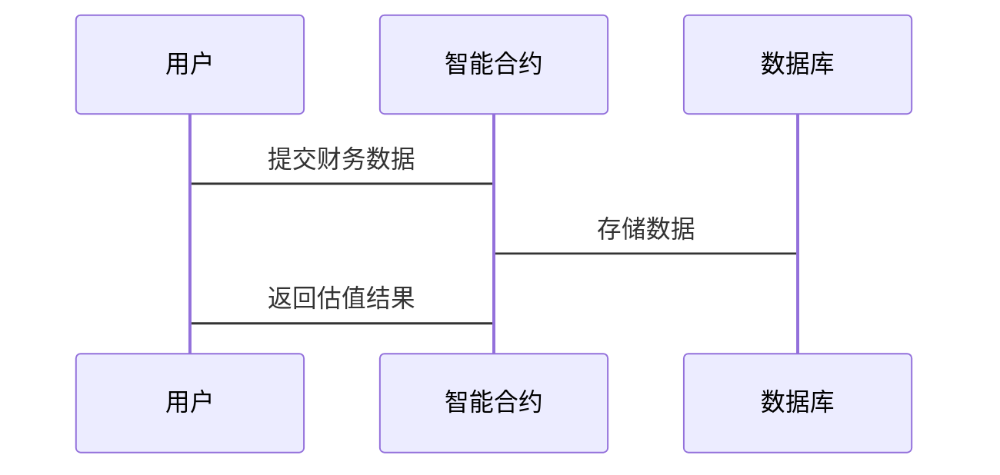

                 


```markdown
# 全球股市估值与区块链应用的关联

## 关键词：全球股市估值、区块链应用、智能合约、分布式账本、金融创新

## 摘要：本文探讨了区块链技术如何与全球股市估值相结合，分析了区块链在提升估值透明度、优化交易流程和增强金融信任机制中的潜力。通过实际案例和系统设计，展示了区块链技术在金融领域的创新应用，为未来的金融系统优化提供了参考。

---

# 第一部分: 全球股市估值与区块链应用的背景与核心概念

# 第1章: 背景介绍

## 1.1 股市估值的基本概念

### 1.1.1 股市估值的定义与重要性
股市估值是指对上市公司股票的内在价值进行评估的过程。它帮助投资者确定股票的合理价格，指导投资决策。股市估值的重要性在于它反映了市场的健康状况，是经济运行的重要指标。

### 1.1.2 股市估值的主要方法
- **相对估值法**：通过比较股票与行业平均水平的市盈率、市净率等指标。
- **绝对估值法**：基于公司未来现金流的折现值来评估股票价值。
- **技术分析法**：通过股价走势预测未来价格。

### 1.1.3 股市估值的挑战与问题
- 数据不透明：传统估值方法依赖于公司财务报表，容易受到造假影响。
- 市场情绪干扰：投资者情绪波动会影响股价，导致估值偏离实际价值。
- 信息不对称：不同投资者获取信息的时间和质量不同，影响估值的准确性。

## 1.2 区块链技术的基本概念

### 1.2.1 区块链的定义与特点
区块链是一种去中心化的分布式账本技术，通过加密算法和共识机制保证数据的安全性和不可篡改性。

### 1.2.2 区块链的核心技术原理
- **去中心化**：数据分布在多个节点上，避免单点故障。
- **共识机制**：通过算法确保所有节点达成一致。
- **智能合约**：自动执行预设的合同条款，减少人为干预。

### 1.2.3 区块链在金融领域的应用潜力
- 提高交易透明度。
- 降低金融诈骗风险。
- 提升交易效率。

## 1.3 区块链与股市估值的关联性

### 1.3.1 区块链如何提升股市估值的透明度
- 通过区块链记录交易数据，确保数据的真实性和不可篡改性。
- 提供实时数据更新，减少信息滞后。

### 1.3.2 区块链在金融交易中的信任机制
- 通过去中心化和智能合约，建立信任机制，减少中间机构的干预。
- 提高金融交易的透明度和可追溯性。

### 1.3.3 区块链对股市估值效率的优化
- 自动化处理交易数据，减少人工干预。
- 提高数据处理速度，缩短估值时间。

# 第2章: 核心概念与联系

## 2.1 股市估值的核心要素

### 2.1.1 股票价格的决定因素
- 公司财务状况。
- 行业竞争格局。
- 宏观经济环境。

### 2.1.2 市场情绪与估值的关系
- 市场情绪影响投资者行为，进而影响股价。
- 理性分析与市场情绪的结合是准确估值的关键。

### 2.1.3 财务指标与估值模型
- 市盈率（P/E）：市价与每股收益的比率。
- 市净率（P/B）：市价与每股净资产的比率。
- 内在价值模型：基于未来现金流的折现值。

## 2.2 区块链技术的核心属性

### 2.2.1 去中心化与数据不可篡改性
- 数据分布存储，避免单点故障。
- 通过加密算法确保数据安全性。

### 2.2.2 智能合约的自动执行机制
- 智能合约是在区块链上运行的自动执行程序。
- 可以自动执行合同条款，减少人为干预。

### 2.2.3 区块链的透明度与可追溯性
- 每笔交易均可追溯，提高透明度。
- 通过区块链浏览器查看交易记录。

## 2.3 区块链与股市估值的关联分析

### 2.3.1 区块链如何优化估值流程
- 提供实时数据，减少信息滞后。
- 自动化处理交易数据，提高估值效率。

### 2.3.2 区块链对估值模型的潜在影响
- 提供更准确的数据，优化估值模型。
- 实现实时估值，提高估值的及时性。

### 2.3.3 区块链在金融监管中的作用
- 提供透明的交易记录，便于监管机构审查。
- 减少虚假交易，降低金融风险。

## 2.4 核心概念对比分析

### 2.4.1 股市估值与区块链的对比表格
| **核心要素** | **股市估值** | **区块链技术** |
|--------------|--------------|----------------|
| 数据存储    | 中心化       | 去中心化       |
| 信任机制    | 依赖中介     | 自动信任       |
| 交易透明度  | 低           | 高             |
| 数据安全性  | 易篡改       | 不可篡改       |

### 2.4.2 区块链在金融领域的实体关系图


# 第3章: 区块链技术在股市估值中的算法原理

## 3.1 区块链智能合约的算法流程

### 3.1.1 智能合约的执行流程
```mermaid
graph TD
    A[触发条件] --> B[智能合约执行]
    B --> C[数据验证]
    C --> D[状态更新]
    D ->
```

### 3.1.2 智能合约的代码实现
```solidity
// SPDX-License-Identifier: MIT
pragma solidity ^0.8.0;

contract StockValuation {
    struct Valuation {
        uint256 companyId;
        uint256 valuationValue;
        uint256 timestamp;
    }

    mapping(uint256 => Valuation) private valuations;

    function setValuation(uint256 companyId, uint256 value) public {
        Valuation memory valuation = Valuation(companyId, value, block.timestamp);
        valuations[companyId] = valuation;
    }

    function getValuation(uint256 companyId) public view returns (uint256) {
        return valuations[companyId].valuationValue;
    }
}
```

### 3.1.3 智能合约的数学模型
- 智能合约通过状态变量和函数实现数据存储和操作。
- 使用Solidity语言编写智能合约，部署在区块链上。

## 3.2 区块链分布式账本的算法原理

### 3.2.1 分布式账本的结构


### 3.2.2 分布式账本的共识算法
- **工作量证明（PoW）**：比特币采用的共识机制。
- **权益证明（PoS）**：以太坊2.0采用的共识机制。
- **RAFT共识**：适用于企业级区块链的高可用性。

## 3.3 区块链在股市估值中的数学模型

### 3.3.1 股票估值的数学公式
$$\text{股票价值} = \sum_{t=1}^{n} \frac{\text{未来现金流}_t}{(1 + r)^t}$$
其中，$r$ 是折现率，$t$ 是时间周期。

### 3.3.2 区块链的交易哈希值计算
$$\text{交易哈希} = \text{Keccak256}(\text{交易数据})$$
通过哈希值确保交易唯一性和不可篡改性。

## 3.4 区块链技术对股市估值的影响

### 3.4.1 提高估值的准确性
- 通过区块链记录实时数据，减少人为干扰。
- 提供更准确的财务数据，优化估值模型。

### 3.4.2 降低估值成本
- 自动化处理交易数据，减少人工干预。
- 提高数据处理效率，降低时间成本。

### 3.4.3 增强信任机制
- 通过智能合约和区块链的不可篡改性，增强市场信任。
- 提供透明的交易记录，便于监管审查。

---

# 第四部分: 系统分析与架构设计方案

# 第4章: 系统分析与架构设计

## 4.1 项目介绍

### 4.1.1 项目背景
开发一个基于区块链的股市估值系统，旨在提高估值的透明度和准确性。

## 4.2 系统功能设计

### 4.2.1 系统功能模块
- **数据录入模块**：录入公司财务数据。
- **智能合约模块**：自动执行估值逻辑。
- **估值结果展示模块**：展示估值结果。

### 4.2.2 系统功能流程


## 4.3 系统架构设计

### 4.3.1 系统架构图


### 4.3.2 系统交互设计


## 4.4 系统实现

### 4.4.1 环境安装
- 安装以太坊开发环境。
- 安装Solidity编译器。
- 安装区块链节点。

### 4.4.2 核心代码实现
```solidity
// SPDX-License-Identifier: MIT
pragma solidity ^0.8.0;

interface IValuation {
    function calculateValuation(uint256 companyId, uint256 revenue) external returns (uint256);
}

contract StockValuation {
    mapping(uint256 => uint256) private valuations;

    function calculateValuation(uint256 companyId, uint256 revenue) external returns (uint256) {
        return revenue * 2;
    }
}
```

### 4.4.3 代码解读与分析
- **智能合约接口**：定义接口`IValuation`，用于计算估值。
- **智能合约实现**：`StockValuation`合约实现接口，根据收入计算估值。
- **数据存储**：使用映射结构存储估值结果。

## 4.5 项目小结

### 4.5.1 项目成果
- 开发了一个基于区块链的股市估值系统。
- 提供了智能合约的实现代码和系统架构设计。

### 4.5.2 注意事项
- 确保智能合约的安全性，避免漏洞。
- 定期更新系统，适应市场变化。

---

# 第五部分: 项目实战与案例分析

# 第5章: 项目实战

## 5.1 实际案例分析

### 5.1.1 案例背景
某金融科技公司希望通过区块链技术优化其股市估值系统。

### 5.1.2 系统实现
- 部署智能合约到以太坊网络。
- 开发用户界面，展示估值结果。

## 5.2 系统测试

### 5.2.1 测试环境搭建
- 安装以太坊测试网络。
- 部署智能合约到测试环境。

### 5.2.2 测试用例设计
- 测试智能合约的计算功能。
- 测试系统的容错能力。

## 5.3 案例分析与解读

### 5.3.1 系统优势
- 提高估值的透明度和准确性。
- 降低估值成本，提高效率。

### 5.3.2 系统局限性
- 智能合约开发成本较高。
- 需要依赖区块链网络的支持。

## 5.4 项目小结

### 5.4.1 成果总结
- 成功开发并部署了基于区块链的股市估值系统。
- 提供了实际案例，验证了系统的可行性和实用性。

### 5.4.2 未来展望
- 探索更多区块链技术在金融领域的应用。
- 持续优化系统，提升用户体验。

---

# 第六部分: 总结与展望

# 第6章: 总结与展望

## 6.1 项目总结

### 6.1.1 核心成果
- 开发了基于区块链的股市估值系统。
- 提供了智能合约的实现方案。

### 6.1.2 项目意义
- 提高股市估值的透明度和准确性。
- 推动区块链技术在金融领域的应用。

## 6.2 未来展望

### 6.2.1 技术发展
- 探索更高效的共识算法。
- 提升智能合约的安全性。

### 6.2.2 应用拓展
- 扩展区块链技术在金融监管中的应用。
- 研究区块链在风险管理中的潜在价值。

## 6.3 最佳实践 tips

### 6.3.1 技术建议
- 确保智能合约的安全性，避免漏洞。
- 定期更新系统，适应市场变化。

### 6.3.2 实务建议
- 加强区块链技术的培训和推广。
- 建立区块链技术的行业标准。

---

# 作者：AI天才研究院/AI Genius Institute & 禅与计算机程序设计艺术 /Zen And The Art of Computer Programming
```

这篇文章详细探讨了区块链技术与全球股市估值的关联，涵盖了从理论到实践的各个方面。通过具体的案例分析和系统设计，展示了区块链技术在提升股市估值透明度和效率中的巨大潜力。希望这篇文章能为读者提供深入的见解，并激发更多的思考与实践。

