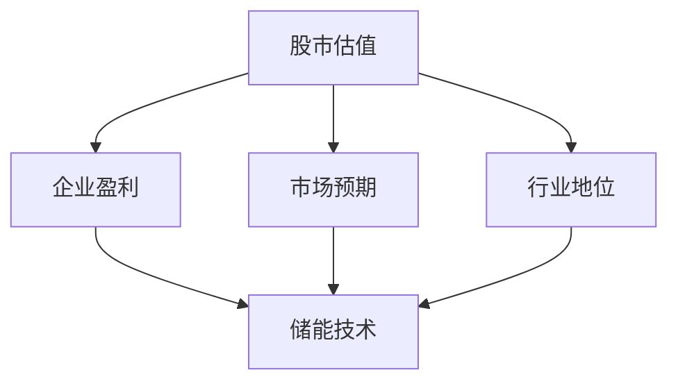
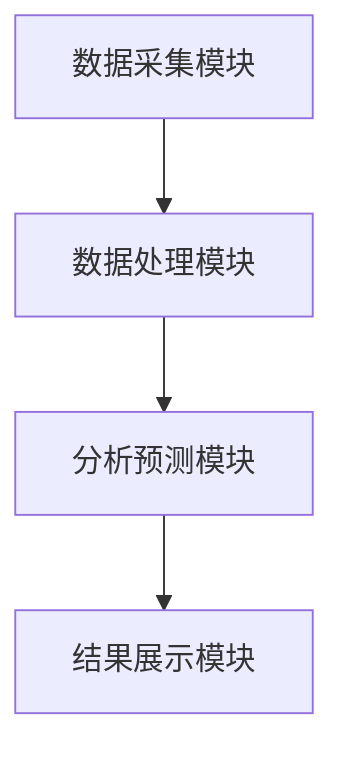
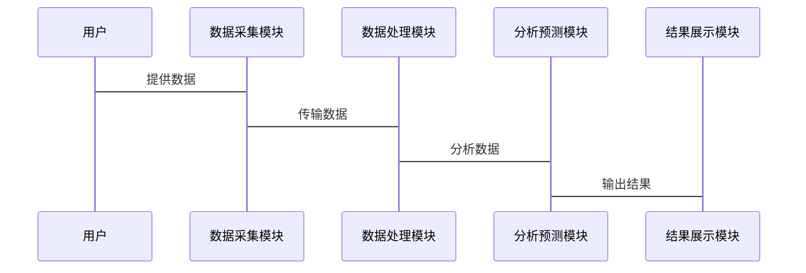

                 

# 全球股市估值与可再生能源储能技术的关系

> **关键词**: 全球股市估值, 可再生能源, 储能技术, 股市分析, 技术与经济关系

> **摘要**: 本文探讨了全球股市估值与可再生能源储能技术之间的关系，分析了储能技术如何影响企业估值和行业竞争格局，同时结合实际案例和算法模型，展示了储能技术对股市估值的深远影响。

---

# 第一部分: 全球股市估值与可再生能源储能技术的背景与概念

## 第1章: 全球能源转型与股市估值的背景

### 1.1 全球能源转型的背景与趋势

#### 1.1.1 全球能源结构的变化

全球能源结构正经历从化石能源向可再生能源的重大转型。随着环境问题的加剧和能源需求的增长，各国政府和企业纷纷加大对可再生能源的投资。根据国际能源署（IEA）的报告，2020年全球可再生能源发电量占总发电量的33.7%，预计到2030年这一比例将超过50%。

#### 1.1.2 可再生能源在能源结构中的占比提升

可再生能源（如太阳能、风能、生物质能等）的占比持续上升。这一趋势不仅减少了对化石燃料的依赖，还降低了碳排放，符合全球应对气候变化的目标。例如，欧盟已承诺到2030年将可再生能源占比提高到40%。

#### 1.1.3 能源转型对全球经济的影响

能源转型不仅改变了能源结构，还对全球经济格局产生了深远影响。可再生能源行业成为经济增长的新引擎，推动相关产业链的发展，同时也带来了就业机会和技术创新。

---

### 1.2 股市估值的基本概念

#### 1.2.1 股市估值的定义与作用

股市估值是指通过对企业财务数据、市场环境和行业趋势的分析，对其股票价值进行评估的过程。其作用在于帮助投资者做出投资决策，同时反映企业的市场地位和盈利能力。

#### 1.2.2 影响股市估值的主要因素

- **财务指标**：如净利润、营收增长率、市盈率等。
- **行业地位**：企业在行业中的竞争地位和市场份额。
- **市场预期**：投资者对未来的预期，包括行业前景和技术进步。

#### 1.2.3 可再生能源行业在股市中的表现

近年来，可再生能源行业在股市中表现亮眼。例如，特斯拉（Tesla）作为电动汽车和储能技术的代表企业，其股价在2020年飙升了近700%。这表明市场对可再生能源技术的高度认可。

---

### 1.3 可再生能源储能技术的定义与特点

#### 1.3.1 可再生能源的基本概念

可再生能源是指来自自然的、取之不尽的能源，主要包括太阳能、风能、水能等。

#### 1.3.2 储能技术的定义与分类

储能技术是指将能量以某种形式存储起来，并在需要时释放的技术。常见的储能技术包括：

- **电池储能**：如锂离子电池、铅酸电池。
- **抽水蓄能**：利用水力发电的原理进行储能。
- **氢储能**：通过电解水制氢，储存能量。

#### 1.3.3 储能技术在能源转型中的重要性

储能技术是可再生能源系统的关键组成部分。由于风能和太阳能具有间歇性，储能技术可以平滑能源供应，确保电网的稳定性。

---

### 1.4 股市估值与储能技术的初步关联

#### 1.4.1 可再生能源行业对股市的影响

随着可再生能源行业的快速发展，相关企业的股票估值显著提高。例如，宁德时代（CATL）作为全球最大的锂电池生产商，其市值在2021年突破1万亿元人民币。

#### 1.4.2 储能技术如何影响企业估值

储能技术的进步可以提升企业的盈利能力和市场竞争力，从而提高股票估值。例如，特斯拉的储能技术（如Powerwall和Megapack）增强了其在能源市场的地位。

#### 1.4.3 能源转型对股市估值的长期影响

能源转型将推动可再生能源行业的进一步发展，储能技术作为核心支撑，将继续推动相关企业的估值增长。

---

### 1.5 本章小结

本章介绍了全球能源转型的背景、股市估值的基本概念以及可再生能源储能技术的定义和特点。通过分析，我们可以看到，储能技术在能源转型中扮演着至关重要的角色，而其发展也对股市估值产生了深远的影响。

---

## 第2章: 全球股市估值与可再生能源储能技术的核心概念

### 2.1 股市估值的核心要素

#### 2.1.1 财务指标对估值的影响

财务指标是股市估值的重要依据。例如，市盈率（P/E）= 股价/每股收益，反映了市场的盈利预期。

#### 2.1.2 行业地位与竞争优势

企业的行业地位和竞争优势直接影响其估值。例如，苹果公司作为全球科技巨头，其市场地位和创新能力使其股价长期保持高位。

#### 2.1.3 市场预期与投资者情绪

市场预期和投资者情绪是股市估值的重要影响因素。例如，当市场预期某企业将推出革命性储能技术时，其股价可能大幅上涨。

---

### 2.2 可再生能源储能技术的关键属性

#### 2.2.1 储能技术的效率与成本

储能技术的效率和成本直接影响其市场竞争力。例如，锂离子电池的效率高达90%以上，但成本较高。

#### 2.2.2 技术成熟度与商业化进程

技术成熟度决定了储能技术的商业化能力。例如，抽水蓄能技术已经商业化多年，而氢储能技术仍处于试验阶段。

#### 2.2.3 储能技术的政策支持

政策支持是储能技术发展的重要推动力。例如，中国政府推出的“十四五”规划中明确提出支持储能技术的发展。

---

### 2.3 股市估值与储能技术的关联机制

#### 2.3.1 储能技术对企业盈利的影响

储能技术的进步可以提高企业的盈利能力和市场竞争力。例如，特斯拉的储能技术为其带来了巨大的利润增长。

#### 2.3.2 储能技术对行业竞争格局的影响

储能技术的突破可能改变行业竞争格局。例如，宁德时代凭借其领先的电池技术，在全球锂电池市场占据主导地位。

#### 2.3.3 技术创新对股市估值的推动作用

技术创新是储能技术发展的核心动力，也是股市估值的重要推动力。例如，特斯拉推出的新一代储能电池技术大幅降低了储能成本，推动其股价上涨。

---

### 2.4 核心概念对比分析

#### 2.4.1 股市估值与储能技术的对比表格

| **属性**       | **股市估值**                  | **储能技术**                  |
|-----------------|-------------------------------|-----------------------------|
| 核心目标         | 评估企业价值                 | 储存能量                     |
| 影响因素         | 财务指标、市场预期           | 技术效率、成本               |
| 发展趋势         | 随市场波动                   | 随技术创新                   |

#### 2.4.2 实体关系图（ER图）分析

---

## 第3章: 全球股市估值与可再生能源储能技术的算法原理

### 3.1 股市估值与储能技术的关系模型

#### 3.1.1 模型的构建与假设

我们构建了一个基于回归分析的关系模型，假设储能技术的进步可以显著影响企业的盈利能力和市场竞争力。

#### 3.1.2 数据来源与处理方法

数据来源包括历史股价数据、企业财务数据、储能技术相关专利数量等。我们使用Python进行数据清洗和预处理。

#### 3.1.3 模型的验证与优化

通过历史数据验证模型的准确性，并通过调整参数优化模型。

---

### 3.2 储能技术对股市估值的影响分析

#### 3.2.1 回归分析方法

我们使用多元线性回归模型分析储能技术对股市估值的影响。模型如下：

$$ y = \beta_0 + \beta_1x_1 + \beta_2x_2 + \epsilon $$

其中，$y$ 是股市估值，$x_1$ 是储能技术效率，$x_2$ 是储能技术成本。

#### 3.2.2 时间序列分析方法

通过ARIMA模型分析储能技术对股价的短期和长期影响。

#### 3.2.3 机器学习算法的应用

使用随机森林算法对储能技术的影响进行分类。

---

### 3.3 算法实现与案例分析

#### 3.3.1 算法实现的步骤

1. 数据清洗与预处理。
2. 模型构建与训练。
3. 模型验证与优化。
4. 结果分析与可视化。

#### 3.3.2 案例分析：锂电池储能技术对股市估值的影响

以宁德时代为例，我们分析了锂电池储能技术对其股价的影响。通过回归分析，我们发现储能技术效率的提升显著推动了股价上涨。

#### 3.3.3 案例分析的结论与启示

锂电池储能技术的突破对股市估值有显著影响，这表明技术创新是推动企业估值增长的核心动力。

---

### 3.4 本章小结

本章通过算法模型分析了储能技术对股市估值的影响，展示了如何利用回归分析、时间序列分析和机器学习算法进行实证研究。

---

## 第4章: 全球股市估值与可再生能源储能技术的系统分析

### 4.1 系统分析框架

#### 4.1.1 系统分析的步骤与方法

系统分析包括问题定义、数据收集、模型构建和结果分析。

#### 4.1.2 数据流分析

数据流包括输入数据、处理数据和输出结果。

#### 4.1.3 系统边界与假设条件

系统边界包括企业内部和外部环境，假设条件包括数据的完整性和模型的有效性。

---

### 4.2 系统架构设计

#### 4.2.1 系统功能设计

系统功能包括数据采集、分析预测、结果展示和决策支持。

#### 4.2.2 系统架构设计

#### 4.2.3 系统接口设计

系统接口包括数据输入接口、模型调用接口和结果输出接口。

#### 4.2.4 系统交互流程

---

## 第5章: 项目实战

### 5.1 项目介绍

我们以锂电池储能技术为例，分析其对股市估值的影响。

---

## 总结与展望

### 5.2 总结

本文系统分析了全球股市估值与可再生能源储能技术的关系，展示了储能技术如何影响企业估值和行业竞争格局。通过算法模型和实际案例分析，我们得出结论：储能技术的突破是推动企业估值增长的核心动力。

### 5.3 未来展望

未来，随着储能技术的进一步发展，其对股市估值的影响将更加深远。建议投资者密切关注储能技术的创新和商业化进程。

---

## 作者信息

作者：AI天才研究院/AI Genius Institute & 禅与计算机程序设计艺术 /Zen And The Art of Computer Programming

---

以上是《全球股市估值与可再生能源储能技术的关系》的技术博客文章的完整内容。

