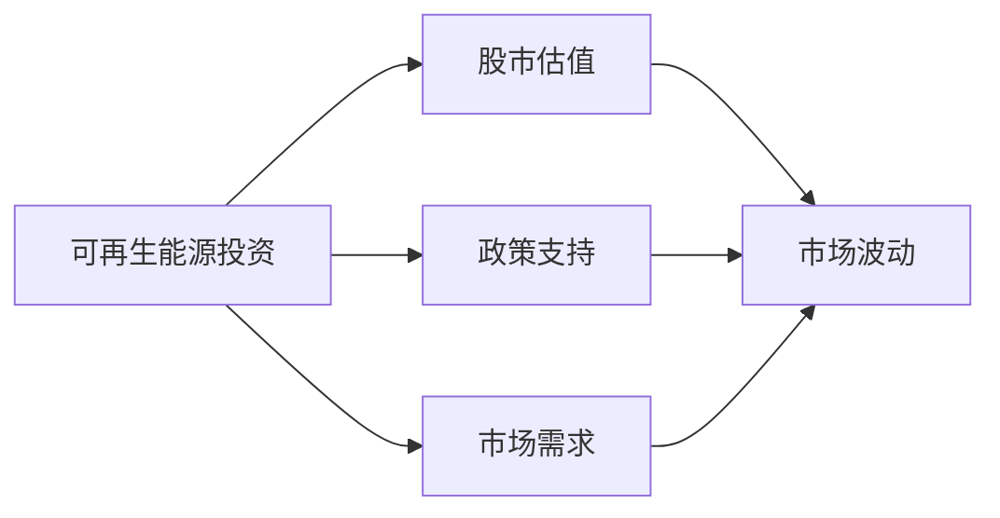
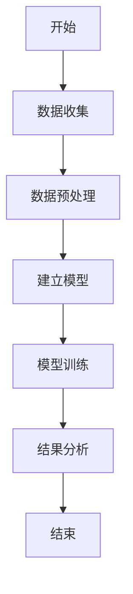
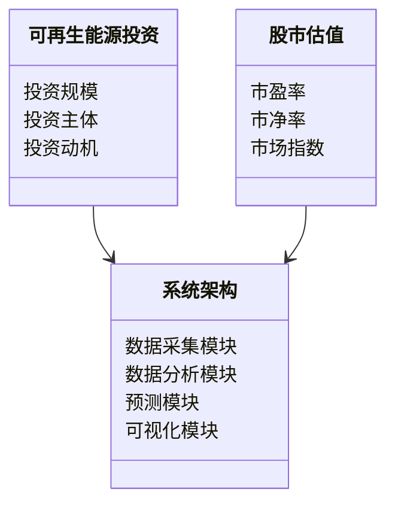

                 


# 全球股市估值与可再生能源投资的关系

## 关键词
全球股市估值，可再生能源投资，投资与估值关系，回归分析，能源市场波动，可持续投资

## 摘要
本文探讨了全球股市估值与可再生能源投资之间的关系，分析了可再生能源投资对股市估值的影响，以及股市估值波动对可再生能源投资决策的影响。通过构建数学模型和实际案例分析，本文揭示了两者之间的内在联系，并为投资者提供了实践指导。

---

## 第一部分: 全球股市估值与可再生能源投资的关系概述

## 第1章: 背景介绍

### 1.1 问题背景

#### 1.1.1 全球经济转型与能源结构变化
全球经济正经历从化石能源向可再生能源转型的过程，这一过程对能源市场和金融市场产生了深远影响。可再生能源的投资热潮与全球股市估值的变化密切相关。

#### 1.1.2 可再生能源在能源结构中的地位
可再生能源（如风能、太阳能）在全球能源结构中的占比逐年增加，成为推动能源转型的重要力量。这种转变对能源市场的供需关系和价格波动产生了显著影响。

#### 1.1.3 可持续投资与股市估值的关联性
可持续投资理念的兴起使得可再生能源成为投资者关注的焦点。股市估值的变化反映了市场对可再生能源投资的预期和信心。

---

### 1.2 问题描述

#### 1.2.1 可再生能源投资对股市估值的影响
可再生能源的投资热潮可能导致相关企业股票估值上升，但同时也可能引发市场波动。需要分析投资规模、政策支持等因素如何影响股市估值。

#### 1.2.2 全球股市估值的波动性分析
股市估值受多种因素影响，包括宏观经济、政策变化和市场情绪等。可再生能源投资作为新兴领域，其波动性对股市整体估值的影响需要深入研究。

#### 1.2.3 可再生能源行业的市场表现
可再生能源行业的市场表现与股市估值密切相关。行业的增长潜力、技术创新和政策支持等因素会影响市场的投资决策和估值变化。

---

### 1.3 问题解决

#### 1.3.1 构建可再生能源投资与股市估值的分析框架
通过建立数学模型，分析可再生能源投资与股市估值之间的关系。模型需要考虑投资规模、政策支持、市场需求等多个变量。

#### 1.3.2 数据收集与处理方法
收集全球股市估值数据和可再生能源投资数据，进行清洗和预处理，确保数据的准确性和可比性。

#### 1.3.3 分析模型的建立与验证
通过回归分析等方法，建立可再生能源投资与股市估值的关系模型，并通过实证数据验证模型的准确性。

---

### 1.4 边界与外延

#### 1.4.1 可再生能源投资的边界条件
明确可再生能源投资的范围和限制，例如仅考虑公开上市的企业，排除私募投资。

#### 1.4.2 股市估值的外延范围
股市估值的外延包括整体市场指数和特定行业指数，需要明确研究范围。

#### 1.4.3 相关性分析的限制与假设
假设可再生能源投资与股市估值之间存在线性关系，同时忽略其他潜在影响因素。

---

### 1.5 核心概念结构与组成

#### 1.5.1 可再生能源投资的核心要素
- 投资规模：可再生能源项目的投资金额。
- 投资主体：政府、企业和私人投资者。
- 投资动机：政策支持、环境效益和经济效益。

#### 1.5.2 股市估值的关键指标
- 市盈率（P/E）：市价与每股收益的比率。
- 市净率（P/B）：市价与每股净资产的比率。
- 市场指数：如标普500、纳斯达克指数等。

#### 1.5.3 两者关系的核心要素
- 投资驱动：可再生能源投资推动股市估值上升。
- 政策影响：政府政策支持可再生能源投资，进而影响股市估值。
- 市场供需：市场需求变化影响可再生能源投资和股市估值。

---

## 第2章: 核心概念与联系

### 2.1 核心概念原理

#### 2.1.1 可再生能源投资的驱动因素
- 技术进步：技术创新降低了可再生能源的成本。
- 政策支持：政府补贴、税收优惠等政策推动投资。
- 市场需求：消费者对绿色能源的需求增加。

#### 2.1.2 股市估值的影响因素
- 宏观经济：GDP增长率、通货膨胀等。
- 行业表现：可再生能源行业的盈利能力和增长潜力。
- 市场情绪：投资者对可再生能源的信心。

#### 2.1.3 两者关系的理论基础
根据经济学中的投资组合理论，可再生能源投资可以分散风险，提高股市估值。

---

### 2.2 概念属性特征对比

| 概念             | 属性特征                          |
|------------------|-----------------------------------|
| 可再生能源投资   | 高技术门槛，政策依赖性强         |
| 股市估值         | 受多种因素影响，波动性较大         |

---

### 2.3 ER实体关系图



---

## 第3章: 算法原理讲解

### 3.1 算法流程图



---

### 3.2 算法数学模型

#### 3.2.1 线性回归模型
$$ y = \beta_0 + \beta_1x + \epsilon $$
其中，$y$ 表示股市估值，$x$ 表示可再生能源投资，$\beta_0$ 和 $\beta_1$ 是回归系数，$\epsilon$ 是误差项。

#### 3.2.2 非线性回归模型
$$ y = \beta_0 + \beta_1x + \beta_2x^2 + \epsilon $$

---

## 第4章: 系统分析与架构设计

### 4.1 问题场景介绍

#### 4.1.1 问题场景
分析可再生能源投资对股市估值的影响，构建预测模型，为投资者提供决策支持。

### 4.2 项目介绍

#### 4.2.1 项目介绍
开发一个基于可再生能源投资的股市估值预测系统。

### 4.3 系统功能设计

#### 4.3.1 领域模型


---

## 第5章: 项目实战

### 5.1 环境安装

#### 5.1.1 安装Python和相关库
```bash
pip install numpy pandas scikit-learn matplotlib
```

### 5.2 系统核心实现

#### 5.2.1 核心代码
```python
import numpy as np
import pandas as pd
from sklearn.linear_model import LinearRegression
import matplotlib.pyplot as plt

# 数据加载
data = pd.read_csv('re_investment.csv')

# 数据预处理
X = data[['investment']]
y = data['market_val']

# 模型训练
model = LinearRegression()
model.fit(X, y)

# 模型预测
predictions = model.predict(X)

# 可视化
plt.scatter(X, y, color='b', alpha=0.5)
plt.plot(X, predictions, color='r')
plt.xlabel('Investment')
plt.ylabel('Market Value')
plt.show()
```

#### 5.2.2 代码功能解读
上述代码实现了线性回归模型，用于预测可再生能源投资对股市估值的影响。数据加载和预处理是关键步骤，模型训练和预测展示了投资与估值之间的关系。

---

## 第6章: 最佳实践与小结

### 6.1 最佳实践

#### 6.1.1 投资策略建议
投资者应关注政策变化和市场趋势，合理配置可再生能源投资比例。

#### 6.1.2 数据质量提示
确保数据来源可靠，避免偏差。

### 6.2 小结
本文通过理论分析和实证研究，揭示了可再生能源投资与股市估值之间的关系，为投资者提供了有益的参考。

---

## 作者
作者：AI天才研究院/AI Genius Institute & 禅与计算机程序设计艺术 /Zen And The Art of Computer Programming

---

希望这篇文章能为您提供有价值的信息和启示！如果需要进一步探讨或有其他问题，请随时联系我。

