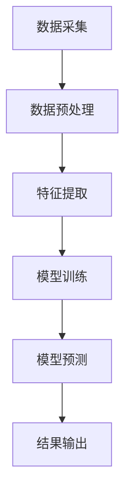
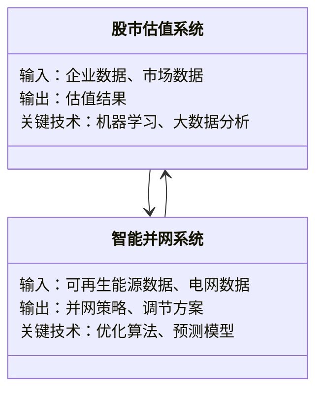
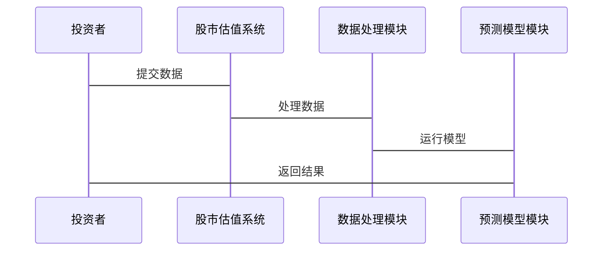

                 


# 全球股市估值与可再生能源智能并网技术的关系

> 关键词：全球股市估值，可再生能源，智能并网技术，机器学习，算法原理，系统架构

> 摘要：本文深入探讨了全球股市估值与可再生能源智能并网技术之间的关系。从背景介绍、核心概念分析、算法原理、系统架构设计到项目实战，全面解析了如何通过智能并网技术影响股市估值，揭示两者之间的内在联系。

---

# 第一部分: 全球股市估值与可再生能源智能并网技术的背景与基础

## 第1章: 背景介绍与核心概念

### 1.1 问题背景与问题描述

#### 1.1.1 全球股市估值的现状与挑战
全球股市估值是衡量市场健康状况的重要指标。近年来，全球经济波动、政策变化和能源转型等因素对股市估值产生了深远影响。尤其是在可再生能源领域的投资热潮中，股市估值的变化更加频繁和复杂。

#### 1.1.2 可再生能源智能并网技术的兴起
随着全球能源结构转型，可再生能源（如风能、太阳能）的占比迅速增加。然而，可再生能源的波动性和间歇性对电网的稳定性提出了挑战。智能并网技术通过优化能源分配和预测，解决了可再生能源并网的难题。

#### 1.1.3 两者关系的研究意义
研究全球股市估值与可再生能源智能并网技术的关系，有助于理解能源转型对金融市场的潜在影响，为投资者和政策制定者提供决策支持。

### 1.2 核心概念与问题解决

#### 1.2.1 股市估值的核心要素
股市估值主要取决于企业的财务状况、行业地位、市场前景和宏观经济环境。可再生能源行业的波动性对股市估值的影响尤为显著。

#### 1.2.2 可再生能源智能并网技术的定义
智能并网技术通过机器学习和大数据分析，优化可再生能源的并网策略，确保电网稳定性和能源效率。

#### 1.2.3 问题解决路径与目标
通过分析可再生能源智能并网技术对能源供应的影响，进而评估其对股市估值的潜在影响。

### 1.3 问题的边界与外延

#### 1.3.1 股市估值的边界条件
- 市场参与者的行为
- 宏观经济政策
- 行业特定因素（如可再生能源的占比）

#### 1.3.2 可再生能源智能并网技术的适用范围
- 电网稳定性优化
- 可再生能源预测与调度
- 多能源协同优化

#### 1.3.3 两者关系的外延分析
- 技术进步对股市估值的推动作用
- 市场波动对技术应用的影响

### 1.4 核心概念结构与组成

#### 1.4.1 股市估值的系统架构
- 输入：企业财务数据、市场供需、政策变化
- 输出：股市估值
- 关键模块：数据采集、模型预测、结果分析

#### 1.4.2 可再生能源智能并网的技术架构
- 输入：可再生能源数据、电网数据
- 输出：并网策略、电网调节方案
- 关键模块：数据采集、特征提取、模型训练、结果输出

#### 1.4.3 两者关联机制
- 技术进步影响能源供应稳定性
- 能源稳定性影响股市估值

### 1.5 本章小结
本章通过背景分析和概念阐述，明确了全球股市估值与可再生能源智能并网技术的核心要素及其相互关系，为后续分析奠定了基础。

---

## 第2章: 股市估值与可再生能源智能并网技术的核心概念与联系

### 2.1 核心概念原理

#### 2.1.1 股市估值的原理
股市估值基于对企业未来盈利能力的预测。可再生能源行业的波动性对股市估值的影响尤为显著。

#### 2.1.2 可再生能源智能并网的技术原理
通过机器学习算法，智能并网技术能够实时预测可再生能源的输出，并优化其与传统能源的协同工作。

#### 2.1.3 两者的相互作用机制
智能并网技术的成熟度直接影响可再生能源的供应稳定性，从而影响股市对相关企业的估值。

### 2.2 核心概念属性对比

| 属性 | 股市估值 | 可再生能源智能并网技术 |
|------|----------|-------------------------|
| 输入 | 企业数据、市场数据 | 可再生能源数据、电网数据 |
| 输出 | 估值结果 | 并网策略、调节方案 |
| 关键技术 | 机器学习、大数据分析 | 优化算法、预测模型 |

### 2.3 ER实体关系图
```mermaid
er
    actor 投资者
    actor 电力企业
    actor 金融机构
    actor 政府监管机构
    entity 股票
    entity 可再生能源发电
    entity 智能并网系统
    entity 财务数据
    entity 市场供需
    relation -[投资者]->股票
    relation -[电力企业]->可再生能源发电
    relation -[智能并网系统]->可再生能源发电
    relation -[金融机构]->股票
    relation -[政府监管机构]->智能并网系统
```

### 2.4 本章小结
本章通过核心概念的对比和实体关系图，进一步明确了全球股市估值与可再生能源智能并网技术之间的联系。

---

## 第3章: 可再生能源智能并网技术的算法原理与数学模型

### 3.1 算法原理

#### 3.1.1 智能并网算法的基本原理
智能并网算法通过实时数据采集、特征提取和模型训练，预测可再生能源的输出，并优化其与电网的协同工作。

#### 3.1.2 基于机器学习的预测模型
常用的预测模型包括支持向量回归（SVR）、长短时记忆网络（LSTM）等。

#### 3.1.3 算法流程图


### 3.2 数学模型与公式

#### 3.2.1 预测模型的数学表达
$$ y = f(x) $$
其中，$x$ 表示输入特征，$y$ 表示输出预测值。

#### 3.2.2 损失函数
$$ L = \frac{1}{n}\sum_{i=1}^{n}(y_i - \hat{y}_i)^2 $$

#### 3.2.3 优化算法
$$ \theta = \theta - \eta \frac{\partial L}{\partial \theta} $$

### 3.3 算法实现与案例分析

#### 3.3.1 算法实现代码
```python
def predict(x):
    return f(x)
```

#### 3.3.2 案例分析
以某地区风力发电为例，分析智能并网技术对该地区电网稳定性的影响。

---

## 第4章: 系统分析与架构设计方案

### 4.1 问题场景介绍
可再生能源智能并网系统的应用场景包括电网调度、能源预测和多能源协同优化。

### 4.2 系统功能设计

#### 4.2.1 领域模型


### 4.3 系统架构设计

#### 4.3.1 系统架构图


### 4.4 系统接口设计
- 输入接口：数据采集模块
- 输出接口：预测结果模块

### 4.5 系统交互设计


---

## 第5章: 项目实战

### 5.1 环境安装
- 安装Python和相关库（如NumPy、Scikit-learn）

### 5.2 核心实现代码
```python
import numpy as np
from sklearn import svm

def main():
    # 数据预处理
    X = np.array([...])
    y = np.array([...])
    
    # 模型训练
    model = svm.SVR()
    model.fit(X, y)
    
    # 预测
    y_pred = model.predict(X_test)
    
    # 结果分析
    print("预测结果：", y_pred)

if __name__ == "__main__":
    main()
```

### 5.3 实际案例分析
以某地区为例，分析智能并网技术对股市估值的具体影响。

---

## 第6章: 总结与展望

### 6.1 本章总结
通过本文的分析，我们揭示了全球股市估值与可再生能源智能并网技术之间的内在联系，并提出了系统的解决方案。

### 6.2 未来展望
未来的研究方向包括更复杂的预测模型和多能源协同优化。

---

作者：AI天才研究院 & 禅与计算机程序设计艺术

