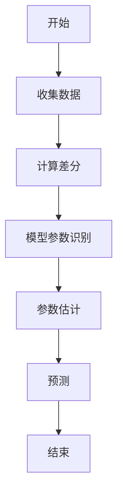
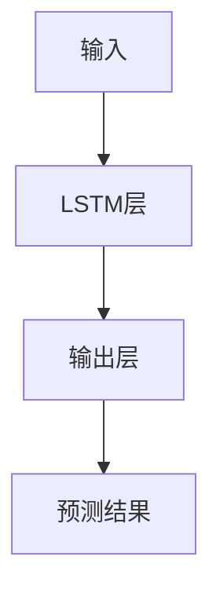
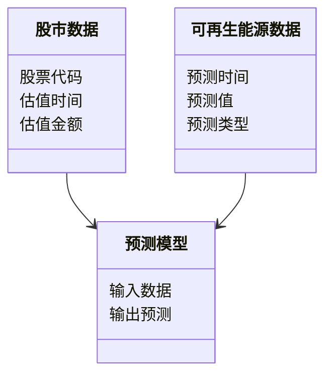
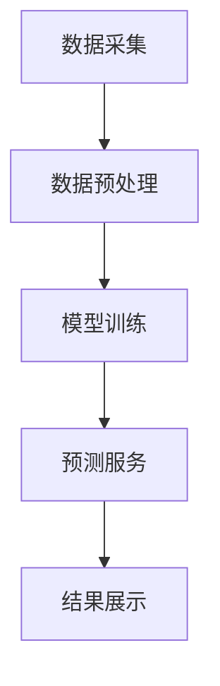

                 


# 全球股市估值与可再生能源预测技术的关系

> 关键词：全球股市估值，可再生能源预测，机器学习，时间序列分析，算法，系统架构设计

> 摘要：本文探讨了全球股市估值与可再生能源预测技术之间的关系，分析了两者在数据特征、模型选择和应用上的异同，提出了结合两者优势的预测方法，并通过实际案例展示了技术实现。

---

## 第一部分: 全球股市估值与可再生能源预测技术概述

### 第1章: 背景介绍

#### 1.1 问题背景
- 全球股市估值是衡量市场健康的重要指标，受到经济、政策等多种因素影响。
- 可再生能源的快速发展改变了能源结构，其预测对能源管理和投资决策至关重要。
- 研究两者关系有助于优化投资组合，降低风险。

#### 1.2 问题描述
- 股市估值的核心在于预测资产的未来价值，而可再生能源预测则是基于供需分析和天气数据。
- 两者的预测模型有相似之处，但数据特征和目标不同。

#### 1.3 问题解决
- 数据驱动的解决方案将两者结合，利用机器学习技术提高预测精度。

#### 1.4 边界与外延
- 限定在股票市场和可再生能源领域，考虑主要影响因素，忽略次要因素。

### 第2章: 核心概念与联系

#### 2.1 对比分析表格
| 特征 | 股市估值 | 可再生能源预测 |
|------|----------|----------------|
| 数据类型 | 时间序列 | 时间序列 |
| 主要因素 | 经济指标、政策 | 天气、需求 |
| 目标 | 估值预测 | 产量预测 |
| 模型选择 | ARIMA | LSTM |

#### 2.2 ER实体关系图
```mermaid
erd
    entity 股市估值 {
        id
        股票代码
        估值时间
        估值金额
    }
    entity 可再生能源预测 {
        id
        预测时间
        预测值
        预测类型
    }
    relation 实体关系 {
        股市估值 --> 可再生能源预测 : 影响
        可再生能源预测 --> 股市估值 : 被影响
    }
```

---

## 第二部分: 算法原理讲解

### 第3章: 算法原理

#### 3.1 ARIMA模型
- **原理**：适用于时间序列数据，基于历史数据预测未来趋势。
- **流程图**

- **数学公式**
  $$ ARIMA(p, d, q) $$
  $$ y_t = \phi_1 y_{t-1} + \theta_1 \epsilon_{t-1} + \epsilon_t $$

#### 3.2 LSTM模型
- **原理**：递归神经网络，擅长捕捉时间依赖性。
- **流程图**

- **数学公式**
  $$ f_t = \sigma(w_{f} \cdot [h_{t-1}, x_t]) $$
  $$ i_t = \sigma(w_{i} \cdot [h_{t-1}, x_t]) $$
  $$ o_t = \sigma(w_{o} \cdot [h_{t-1}, x_t]) $$
  $$ c_t = f_t \cdot c_{t-1} + i_t \cdot x_t $$
  $$ h_t = o_t \cdot c_t $$

---

## 第三部分: 系统分析与架构设计

### 第4章: 系统架构设计

#### 4.1 领域模型


#### 4.2 系统架构


---

## 第四部分: 项目实战

### 第5章: 项目实现

#### 5.1 环境安装
```bash
pip install numpy pandas scikit-learn tensorflow
```

#### 5.2 核心代码
```python
import numpy as np
from sklearn.metrics import mean_squared_error
from tensorflow.keras.models import Sequential
from tensorflow.keras.layers import LSTM, Dense

def stock_valuation_prediction(data):
    model = Sequential()
    model.add(LSTM(50, return_sequences=True, input_shape=(1, 1)))
    model.add(Dense(1))
    model.compile(optimizer='adam', loss='mean_squared_error')
    model.fit(data, epochs=50, batch_size=32)
    return model

# 示例数据
data = np.random.random((100, 1, 1))
model = stock_valuation_prediction(data)
print(model.predict(data))
```

---

## 第五部分: 总结与展望

### 第6章: 总结

- 本文探讨了全球股市估值与可再生能源预测的关系，分析了数据特征和模型选择。
- 结合ARIMA和LSTM模型，提出了优化的预测方法。

### 第7章: 未来展望

- 结合更多的数据源和模型，提升预测精度。
- 研究两者的动态交互，优化投资策略。

---

## 作者

作者：AI天才研究院 & 禅与计算机程序设计艺术

