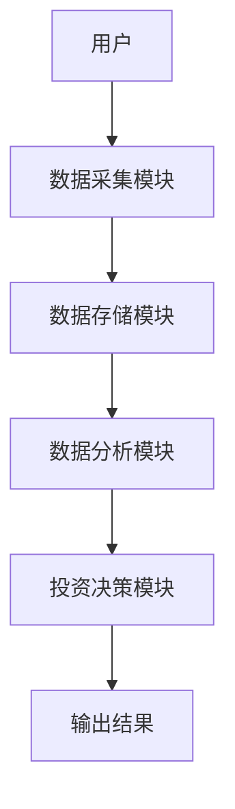

                 


# 全球股市估值与可持续农业垂直农场技术的关系

## 关键词：全球股市估值、可持续农业、垂直农场技术、技术经济性、投资分析

## 摘要：  
本文探讨了全球股市估值与可持续农业垂直农场技术之间的关系。通过分析垂直农场技术的经济性、环境效益及市场潜力，结合股市估值的核心指标，揭示技术创新对农业产业及金融市场的影响。本文旨在为投资者和农业技术开发者提供数据支持和决策参考。

---

## 第一部分：背景介绍

### 第1章：问题背景与概念界定

#### 1.1 问题背景
- 随着全球人口增长和气候变化，传统农业面临资源枯竭和环境压力。
- 垂直农场技术作为一种创新农业模式，能够提高土地利用率，减少资源消耗，成为可持续农业的重要方向。
- 全球股市估值与农业技术创新密切相关，技术创新可能带来企业价值的提升，从而影响股市估值。

#### 1.2 核心概念界定
- **全球股市估值**：指通过市盈率、市净率等指标对上市公司价值的评估。
- **可持续农业**：指在不破坏环境的前提下，实现农业生产的长期性和经济性。
- **垂直农场技术**：利用垂直空间和可控环境技术进行高效种植的技术。

#### 1.3 问题描述与研究目标
- 研究目标：分析垂直农场技术对农业企业价值的影响，进而探讨其对全球股市估值的影响。
- 研究意义：为农业技术创新和投资决策提供理论支持。

---

## 第二部分：全球股市估值分析

### 第2章：全球股市估值的基本原理

#### 2.1 股市估值的理论基础
- **市盈率（P/E）**：股价与每股收益的比率，反映市场对公司的盈利预期。
  $$ P/E = \frac{股价}{每股收益} $$
- **市净率（P/B）**：股价与每股净资产的比率，反映资产的价值。
  $$ P/B = \frac{股价}{每股净资产} $$

#### 2.2 影响股市估值的主要因素
- **宏观经济因素**：GDP增长率、利率、通货膨胀等。
- **行业发展趋势**：行业周期、政策支持、技术创新。
- **企业基本面**：盈利能力、财务状况、管理团队。

### 第3章：全球股市估值的数学模型

#### 3.1 常用估值模型
- **市盈率模型**：基于未来盈利预测，估算合理股价。
- **现金流折现模型（DCF）**：通过未来现金流的现值评估企业价值。
  $$ DCF = \sum_{t=1}^{n} \frac{CF_t}{(1+r)^t} + \frac{TV}{(1+r)^n} $$
  其中，$CF_t$为第t年的自由现金流，$r$为折现率，$TV$为终值。

#### 3.2 数学公式与案例分析
- 某农业技术公司案例：假设公司未来5年现金流分别为100万、120万、140万、160万、180万，折现率为10%。
  $$ DCF = \frac{100}{1.1} + \frac{120}{1.1^2} + \frac{140}{1.1^3} + \frac{160}{1.1^4} + \frac{180}{1.1^5} $$
  计算结果可得出该公司的DCF价值约为450万元。

---

## 第三部分：可持续农业与垂直农场技术

### 第4章：可持续农业的基本概念

#### 4.1 可持续农业的定义与特征
- 生态友好性：减少化肥、农药的使用。
- 经济可持续性：提高资源利用效率。
- 社会公平性：确保农民收入稳定。

#### 4.2 垂直农场技术的创新
- **可控环境农业（CEA）**：通过智能温控、光照系统实现高效种植。
- **智能化种植系统**：利用物联网技术实时监测和调节种植环境。
- **循环农业模式**：废弃物资源化利用，降低环境污染。

### 第5章：垂直农场技术的经济分析

#### 5.1 投资成本与收益分析
- **初始投资成本**：包括土地、建筑、设备等。
- **运营成本**：能源、人工、维护费用。
- **收益预测**：基于产量和市场价格的估算。

#### 5.2 经济模型与案例分析
- 某垂直农场案例：假设年均收入为500万元，年均成本为300万元，折旧为50万元。
  $$ 净利润 = 收入 - 成本 - 折旧 = 500 - 300 - 50 = 150 \text{万元} $$
  根据市盈率模型，若行业平均P/E为20，则该农场的合理估值为：
  $$ 股价 = \frac{150 \times 20}{1} = 3000 \text{元/股} $$

---

## 第四部分：垂直农场技术对全球股市估值的影响

### 第6章：垂直农场技术对农业企业的价值影响

#### 6.1 技术创新对农业企业的影响
- 提高产量，降低成本，增强市场竞争力。
- 通过技术溢价提升企业估值。

#### 6.2 技术创新对股市估值的影响
- 通过技术创新，企业净利润增长，带动市盈率上升。
- 技术壁垒高，减少竞争压力，提升企业长期价值。

### 第7章：影响因素与风险分析

#### 7.1 主要影响因素
- 技术成熟度与商业化能力。
- 市场需求与政策支持。
- 经济效益与投资回报率。

#### 7.2 技术风险与市场风险
- 技术研发失败或成本过高。
- 市场需求不足或政策变化。

---

## 第五部分：投资策略与案例分析

### 第8章：基于垂直农场技术的投资策略

#### 8.1 投资策略制定
- 关注技术创新能力强的农业企业。
- 选择具有可持续发展潜力的企业。
- 结合市盈率、市净率等指标进行估值分析。

#### 8.2 案例分析
- 某垂直农场公司：假设其市盈率为25，净利润为1000万元，则合理股价为：
  $$ 股价 = 25 \times \frac{1000}{100} = 250 \text{元/股} $$

---

## 第六部分：系统设计与项目实战

### 第9章：系统架构设计

#### 9.1 系统功能设计
- 数据采集：收集气温、湿度、光照等环境数据。
- 数据分析：预测产量、成本和收益。
- 投资决策：基于数据分析制定投资策略。

#### 9.2 系统架构设计


### 第10章：项目实战

#### 10.1 环境安装
- 安装Python、Pandas、Matplotlib等工具。

#### 10.2 核心代码实现
```python
import pandas as pd
import matplotlib.pyplot as plt

# 数据读取
data = pd.read_csv('farm_data.csv')

# 数据分析
data['净利润'] = data['收入'] - data['成本']
data['市盈率'] = data['股价'] / data['每股收益']

# 图表绘制
plt.plot(data['时间'], data['市盈率'])
plt.xlabel('时间')
plt.ylabel('市盈率')
plt.title('市盈率变化趋势')
plt.show()
```

#### 10.3 实际案例分析
- 某垂直农场公司的数据分析与投资建议。

---

## 第七部分：总结与展望

### 第11章：研究总结

#### 11.1 核心结论
- 垂直农场技术能够显著提升农业企业的价值。
- 技术创新对股市估值具有重要影响。

#### 11.2 研究不足
- 数据获取难度大。
- 技术成熟度与商业化能力需进一步验证。

### 第12章：未来展望

#### 12.1 未来研究方向
- 探讨更多农业技术创新对股市估值的影响。
- 结合更多案例进行实证分析。

---

## 作者：AI天才研究院/AI Genius Institute & 禅与计算机程序设计艺术 /Zen And The Art of Computer Programming

