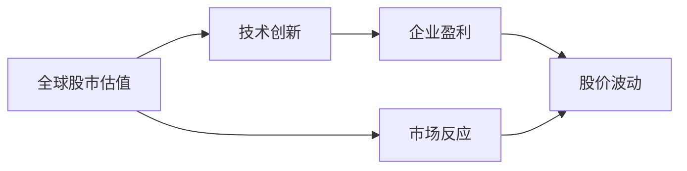
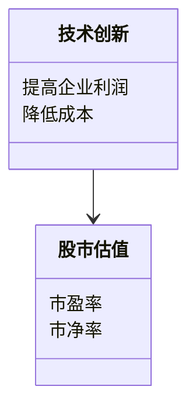

                 


# 全球股市估值与可持续农业垂直种植技术的关系

## 关键词：全球股市估值, 可持续农业, 垂直种植技术, 经济影响, 技术创新

## 摘要：  
本文探讨了全球股市估值与可持续农业垂直种植技术之间的关系，分析了垂直种植技术对股市估值的影响，包括技术创新、经济效应和市场反应等方面。通过理论分析和案例研究，本文揭示了技术进步如何推动股市估值的变化，并提出了相应的投资策略和系统设计方案。

---

# 第一部分: 全球股市估值与可持续农业垂直种植技术的背景与关系

## 第1章: 背景介绍

### 1.1 问题背景
#### 1.1.1 全球股市估值的定义与现状
- 全球股市估值是指对上市公司股票价格的综合评估，通常通过市盈率（P/E）、市净率（P/B）等指标衡量。
- 当前全球股市面临经济不确定性、技术变革和环境问题等多重挑战。

#### 1.1.2 可持续农业与垂直种植技术的兴起
- 可持续农业强调生态友好和资源高效利用。
- 垂直种植技术通过立体空间利用和智能控制，显著提高了农业效率。

#### 1.1.3 问题解决：技术与经济的结合
- 垂直种植技术为农业现代化提供了新路径，同时也对股市估值产生了潜在影响。

### 1.2 核心概念
#### 1.2.1 全球股市估值的核心要素
- 宏观经济指标：GDP、利率、通胀等。
- 行业发展趋势：科技、能源、农业等领域。
- 企业基本面：盈利能力、成长性、财务健康。

#### 1.2.2 可持续农业与垂直种植技术的关键属性
- 垂直种植技术：空间利用率高、资源消耗低、生产效率高。
- 可持续农业：生态友好、资源高效、抗风险能力强。

#### 1.2.3 问题的边界与外延
- 研究范围：全球主要股市与农业技术企业。
- 外延：技术创新对经济的影响，政策对市场的调节作用。

### 1.3 核心概念结构与组成
#### 1.3.1 核心概念的组成要素
- 技术创新：垂直种植技术的突破。
- 经济效应：股市估值的变化。
- 市场反应：投资者对技术的敏感度。

#### 1.3.2 概念之间的关系与互动
- 技术创新推动企业盈利增长，进而影响股市估值。
- 市场对技术的认知和接受度影响股价波动。

#### 1.3.3 概念结构的可视化


### 1.4 本章小结
- 本章介绍了全球股市估值和垂直种植技术的基本概念，明确了研究的背景和意义。

---

## 第2章: 股市估值与垂直种植技术的关系分析

### 2.1 股市估值的影响因素
#### 2.1.1 宏观经济因素
- 经济周期、利率水平、通货膨胀对股市估值的影响。

#### 2.1.2 行业发展趋势
- 科技创新、政策支持对农业技术企业的推动作用。

#### 2.1.3 企业基本面分析
- 盈利能力、成长性、财务状况是影响股价的核心因素。

### 2.2 垂直种植技术对股市的影响
#### 2.2.1 技术创新对股价的推动作用
- 技术突破带来的成本降低和效率提升直接增加企业利润。

#### 2.2.2 技术成熟度与市场反应
- 技术成熟度越高，市场反应越积极，股价波动越小。

#### 2.2.3 技术商业化对估值的影响
- 技术商业化阶段的不同会影响投资者对企业的估值预期。

### 2.3 技术与经济的相互作用
#### 2.3.1 技术进步与股市估值的关系
- 技术进步通过提高企业盈利能力间接推动股价上涨。

#### 2.3.2 经济周期与技术发展的互动
- 经济繁荣期技术发展快，经济衰退期技术应用受限。

#### 2.3.3 市场预期与技术潜力的结合
- 投资者对技术未来潜力的预期影响当前股价。

### 2.4 本章小结
- 本章分析了股市估值与垂直种植技术之间的相互作用，揭示了技术创新对股市的影响路径。

---

## 第3章: 垂直种植技术的原理与应用

### 3.1 技术原理
#### 3.1.1 垂直种植的核心技术
- 立体种植、智能温控、精准灌溉。

#### 3.1.2 智能化与自动化在种植中的应用
- 自动化控制系统、物联网技术、数据分析。

#### 3.1.3 节能与环保的技术特点
- 节能高效、减少资源消耗、降低环境影响。

### 3.2 技术优势与局限性
#### 3.2.1 技术优势分析
- 高效利用空间、资源节约、生产周期短。

#### 3.2.2 技术局限性探讨
- 初始投资高、技术门槛高、维护成本高。

#### 3.2.3 技术改进方向
- 降低成本、提高稳定性、优化用户体验。

### 3.3 技术应用案例
#### 3.3.1 典型案例分析
- 某垂直种植企业的成功经验。

#### 3.3.2 应用效果评估
- 生产效率提升、成本降低、市场竞争力增强。

#### 3.3.3 案例对股市的影响
- 技术应用推动股价上涨、吸引更多投资者。

### 3.4 本章小结
- 本章详细介绍了垂直种植技术的原理和应用，分析了其优势与局限性。

---

## 第4章: 全球股市的现状与趋势

### 4.1 全球主要股市估值分析
#### 4.1.1 美国股市
- 美国股市的估值水平、主要指数（如标普500）。

#### 4.1.2 欧洲股市
- 欧洲股市的行业分布和估值特点。

#### 4.1.3 亚洲股市
- 亚洲股市的增长潜力和区域差异。

### 4.2 股市估值的区域差异
#### 4.2.1 经济发展水平对估值的影响
- 高收入国家股市估值较高，新兴市场估值较低。

#### 4.2.2 行业分布对估值的影响
- 高科技行业估值高，传统行业估值低。

### 4.3 股市波动与稳定性
#### 4.3.1 市场波动的周期性
- 经济周期对股市波动的影响。

#### 4.3.2 市场稳定性与政策支持
- 政策干预对股市稳定的作用。

### 4.4 本章小结
- 本章分析了全球主要股市的估值现状和趋势，揭示了区域差异和市场波动的特点。

---

## 第5章: 垂直种植技术对股市的影响

### 5.1 直接影响
#### 5.1.1 技术创新带来的利润增长
- 技术创新提高企业盈利能力，直接推动股价上涨。

#### 5.1.2 技术成熟度与市场竞争力
- 技术成熟度高的企业更具市场竞争力，估值更高。

### 5.2 间接影响
#### 5.2.1 技术溢出效应
- 技术创新带动相关行业的发展，间接影响股市整体估值。

#### 5.2.2 市场预期的变化
- 投资者对技术未来潜力的预期影响股价波动。

### 5.3 投资机会与风险
#### 5.3.1 投资机会分析
- 垂直种植技术企业的投资价值。

#### 5.3.2 技术风险与市场风险
- 技术失败、政策变化等风险因素。

### 5.4 案例分析
#### 5.4.1 某垂直种植企业的股价波动
- 技术创新推动股价上涨的案例。

#### 5.4.2 市场反应与投资策略
- 投资者如何根据技术进展调整投资策略。

### 5.5 本章小结
- 本章分析了垂直种植技术对股市的直接影响和间接影响，揭示了投资机会与风险。

---

## 第6章: 技术与经济的关系模型

### 6.1 关系模型构建
#### 6.1.1 模型假设
- 技术创新与企业利润成正比。

#### 6.1.2 数学模型
$$ \text{股价} = \text{企业利润} \times \text{市盈率} $$

#### 6.1.3 模型验证
- 通过历史数据验证模型的准确性。

### 6.2 技术与经济的互动机制
#### 6.2.1 技术推动经济发展的路径
- 技术创新→企业利润→股价上涨。

#### 6.2.2 经济环境对技术的影响
- 经济繁荣期技术发展快，经济衰退期技术应用受限。

### 6.3 案例分析与模型应用
#### 6.3.1 某垂直种植企业的股价波动
- 通过模型分析股价波动的原因。

#### 6.3.2 模型的局限性
- 数据不足、假设过于简化等问题。

### 6.4 本章小结
- 本章构建了技术与经济的关系模型，并通过案例分析验证了模型的有效性。

---

## 第7章: 系统设计与架构

### 7.1 系统需求分析
#### 7.1.1 问题场景介绍
- 如何通过技术手段提升股市估值。

#### 7.1.2 项目介绍
- 垂直种植技术的应用与股市估值的关系。

### 7.2 系统功能设计
#### 7.2.1 领域模型


#### 7.2.2 系统架构设计


#### 7.2.3 系统接口设计
- 数据接口：技术创新数据、股市估值数据。
- 用户接口：投资者、企业用户。

#### 7.2.4 系统交互设计
```mermaid
sequenceDiagram
    投资者 -> 数据采集层: 获取技术创新数据
    数据采集层 -> 数据处理层: 处理数据
    数据处理层 -> 数据分析层: 分析数据
    数据分析层 -> 用户界面层: 显示结果
    投资者 <- 用户界面层: 结果展示
```

### 7.3 本章小结
- 本章详细设计了系统的功能架构，明确了各模块之间的关系。

---

## 第8章: 项目实战

### 8.1 环境搭建
#### 8.1.1 开发环境
- Python、Jupyter Notebook、数据库。

#### 8.1.2 工具安装
- 数据分析工具：Pandas、Matplotlib。
- 可视化工具：Tableau。

### 8.2 核心代码实现
#### 8.2.1 数据采集与处理
```python
import pandas as pd
data = pd.read_csv('stock_data.csv')
data.head()
```

#### 8.2.2 技术创新分析
```python
import matplotlib.pyplot as plt
plt.plot(data['股价'], label='股价')
plt.plot(data['技术创新'], label='技术创新')
plt.legend()
plt.show()
```

#### 8.2.3 模型实现
```python
def calculate_profit(profits, market_valuation):
    return profits * market_valuation
```

### 8.3 案例分析与结果解读
#### 8.3.1 案例分析
- 某垂直种植企业的数据分析。

#### 8.3.2 结果解读
- 技术创新对股价的具体影响。

### 8.4 本章小结
- 本章通过实战项目，展示了如何利用技术手段分析股市估值与垂直种植技术的关系。

---

## 第9章: 总结与展望

### 9.1 总结
- 本文探讨了全球股市估值与可持续农业垂直种植技术的关系，揭示了技术创新对股市的影响路径。

### 9.2 启示与建议
- 投资者应关注技术创新对企业利润的影响。
- 企业应注重技术商业化和成本控制。

### 9.3 未来展望
- 技术创新对股市估值的影响将更加显著。
- 综合分析技术、经济和政策因素的重要性。

### 9.4 本章小结
- 本章总结了全文，并提出了未来研究的方向。

---

## 第10章: 最佳实践与投资策略

### 10.1 最佳实践
#### 10.1.1 投资策略
- 选择技术创新能力强的企业。
- 关注技术商业化进程。

#### 10.1.2 风险管理
- 分散投资、设置止损点。

### 10.2 实用工具与资源
#### 10.2.1 数据来源
- 金融数据库（如 Bloomberg）、学术论文。

#### 10.2.2 工具推荐
- 数据分析工具：Python、R。
- 可视化工具：Tableau、Power BI。

### 10.3 案例分析与经验分享
#### 10.3.1 投资成功案例
- 某垂直种植企业的投资经验。

#### 10.3.2 经验教训
- 技术创新周期长，需耐心等待。

### 10.4 本章小结
- 本章提供了最佳实践和投资策略，帮助读者更好地理解如何应用技术分析股市估值。

---

## 附录

### 附录A: 数据来源与参考文献
- 数据来源：全球股市数据、学术论文、行业报告。

### 附录B: 工具推荐
- 数据分析工具：Pandas、NumPy。
- 可视化工具：Matplotlib、Seaborn。

### 附录C: 术语表
- 定义关键术语，如市盈率、垂直种植技术等。

---

## 作者：AI天才研究院 & 禅与计算机程序设计艺术

