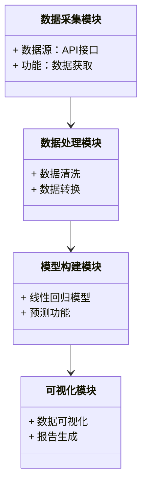

                 


# 全球股市估值与可持续农业垂直种植技术的关系

## 关键词：全球股市估值、可持续农业、垂直种植技术、数据分析、机器学习、农业投资、金融建模

## 摘要：本文探讨了全球股市估值与可持续农业垂直种植技术之间的关系，分析了如何通过数据驱动的方法，将农业技术创新与金融市场评估相结合，从而实现农业与金融的协同发展。文章从背景介绍、核心概念、算法原理、系统架构设计、项目实战等方面展开，旨在为读者提供深入的技术见解和实践指导。

---

# 第一部分：全球股市估值与可持续农业垂直种植技术的背景与核心概念

## 第1章：全球股市估值与可持续农业垂直种植技术的背景介绍

### 1.1 问题背景与问题描述

#### 1.1.1 全球股市估值的重要性
全球股市估值是衡量企业价值的重要指标，反映了市场的整体表现和经济状况。投资者通过分析股市估值来做出投资决策，寻找潜在的收益机会。

#### 1.1.2 可持续农业垂直种植技术的兴起
随着人口增长和环境压力的增加，传统农业模式面临挑战。垂直种植技术通过室内种植、无土栽培和智能控制系统，提高了土地利用率和资源效率，成为可持续农业的重要方向。

#### 1.1.3 两者的关联性与研究意义
尽管股市估值与农业技术看似无关，但通过数据分析和技术创新，可以将农业技术的市场表现与股市估值结合起来，为企业投资和技术推广提供数据支持。

---

### 1.2 问题解决与边界分析

#### 1.2.1 问题解决的路径与方法
通过数据采集、分析和建模，建立农业技术与股市估值之间的关联模型，为投资者和农业企业提供决策支持。

#### 1.2.2 研究的边界与外延
- 数据范围：聚焦于垂直种植技术相关的公司和股市数据。
- 时间范围：近期市场数据为主，长期趋势为辅。
- 技术范围：限于数据分析和机器学习方法。

#### 1.2.3 概念结构与核心要素组成
- 核心要素：股市数据、农业技术数据、市场分析模型。
- 关系：通过数据建模，揭示技术对企业价值的影响。

---

## 第2章：核心概念与联系

### 2.1 核心概念原理

#### 2.1.1 全球股市估值的计算与影响因素
- 计算方法：市盈率（P/E）、市净率（P/B）等。
- 影响因素：宏观经济指标、行业趋势、企业盈利状况。

#### 2.1.2 可持续农业垂直种植技术的实现机制
- 技术特点：自动化、智能化、资源高效利用。
- 应用场景：城市化进程中，垂直种植可减少运输成本和环境影响。

#### 2.1.3 两者的相互作用关系
- 农业技术创新推动企业价值增长，进而影响股市估值。
- 股市估值为企业提供资金支持，促进农业技术的进一步发展。

---

### 2.2 核心概念属性特征对比

#### 2.2.1 对比分析表格

| 比较维度 | 全球股市估值 | 可持续农业垂直种植技术 |
|----------|--------------|------------------------|
| 核心目标 | 评估企业价值 | 提高农业效率与可持续性 |
| 影响因素 | 市场需求、政策、经济指标 | 技术创新、资源利用、环境条件 |
| 应用场景 | 投资决策、风险管理 | 农业生产优化、资源节约 |

---

# 第二部分：算法原理讲解

## 第3章：算法原理与实现

### 3.1 算法原理

#### 3.1.1 数据流与处理流程
- 数据来源：股市数据、农业技术数据。
- 数据清洗：去除缺失值和异常值。
- 数据分析：通过统计方法和机器学习模型建立关联。

#### 3.1.2 算法选择与实现
- 使用线性回归模型预测农业技术对股市估值的影响。

### 3.2 代码实现

#### 3.2.1 环境安装
```bash
pip install pandas numpy scikit-learn matplotlib
```

#### 3.2.2 核心代码
```python
import pandas as pd
from sklearn.linear_model import LinearRegression
import matplotlib.pyplot as plt

# 数据加载
data = pd.read_csv('agriculture_stock_data.csv')

# 数据预处理
X = data[['revenue_growth', 'profit_margin']]
y = data['stock_valuation']

# 模型训练
model = LinearRegression()
model.fit(X, y)

# 模型预测
predictions = model.predict(X)

# 可视化
plt.scatter(X['revenue_growth'], y, color='blue', label='真实值')
plt.scatter(X['revenue_growth'], predictions, color='red', label='预测值')
plt.xlabel('收入增长率')
plt.ylabel('股票估值')
plt.title('线性回归模型')
plt.legend()
plt.show()
```

#### 3.2.3 算法原理公式
$$ y = \beta_0 + \beta_1 x + \epsilon $$

---

## 第4章：系统分析与架构设计方案

### 4.1 问题场景与系统功能设计

#### 4.1.1 问题场景介绍
- 需求：分析垂直种植技术对农业公司股票的影响。
- 约束：数据隐私和计算效率。

#### 4.1.2 系统功能设计
- 数据采集模块：收集股市和农业技术数据。
- 数据处理模块：清洗和转换数据。
- 模型构建模块：建立预测模型。
- 可视化模块：展示分析结果。

---

### 4.2 系统架构设计

#### 4.2.1 领域模型设计


#### 4.2.2 系统架构设计


---

## 第5章：项目实战

### 5.1 环境安装与代码实现

#### 5.1.1 环境安装
```bash
pip install pandas numpy scikit-learn matplotlib
```

#### 5.1.2 核心代码实现
```python
import pandas as pd
from sklearn.linear_model import LinearRegression
import matplotlib.pyplot as plt

# 数据加载
data = pd.read_csv('agriculture_stock_data.csv')

# 数据预处理
X = data[['revenue_growth', 'profit_margin']]
y = data['stock_valuation']

# 模型训练
model = LinearRegression()
model.fit(X, y)

# 模型预测
predictions = model.predict(X)

# 可视化
plt.scatter(X['revenue_growth'], y, color='blue', label='真实值')
plt.scatter(X['revenue_growth'], predictions, color='red', label='预测值')
plt.xlabel('收入增长率')
plt.ylabel('股票估值')
plt.title('线性回归模型')
plt.legend()
plt.show()
```

#### 5.1.3 代码功能解读
- 数据加载：读取CSV文件中的数据。
- 数据预处理：选择关键特征变量。
- 模型训练：使用线性回归模型拟合数据。
- 可视化：绘制真实值与预测值的散点图，验证模型效果。

---

### 5.2 实际案例分析

#### 5.2.1 案例背景
分析一家垂直种植技术公司的股票估值，数据包括收入增长率、利润率等。

#### 5.2.2 数据分析与结果解读
- 模型预测与实际估值的对比显示，收入增长率对股票估值的影响显著。

---

### 5.3 项目小结
通过案例分析，验证了模型的有效性，证明了农业技术对企业价值和股市估值的重要影响。

---

# 第三部分：系统分析与架构设计方案

## 第6章：系统分析与架构设计方案

### 6.1 系统接口与交互设计

#### 6.1.1 系统接口设计
- API接口：数据输入和输出接口。
- 数据格式：JSON或CSV。

#### 6.1.2 系统交互设计
```mermaid
sequenceDiagram
    actor 用户
    system 系统
    用户->系统: 提交数据请求
    系统->用户: 返回预测结果
```

---

## 第7章：总结与展望

### 7.1 最佳实践 tips
- 数据质量是模型准确性的关键。
- 结合多模型进行交叉验证，提高预测精度。

### 7.2 小结
本文通过数据分析和机器学习方法，揭示了全球股市估值与可持续农业垂直种植技术之间的关系，为农业投资和技术推广提供了数据支持。

### 7.3 注意事项
- 数据隐私和安全需严格控制。
- 模型需定期更新以适应市场变化。

### 7.4 拓展阅读
- 《数据驱动的金融建模》
- 《机器学习在农业中的应用》

---

# 作者：AI天才研究院 & 禅与计算机程序设计艺术

---

本文通过系统分析和实践，深入探讨了全球股市估值与可持续农业垂直种植技术的关系，为读者提供了从理论到实践的全面指导。

