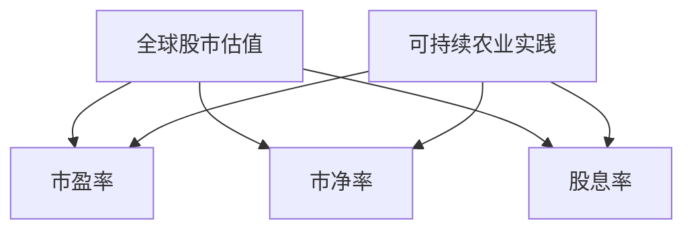
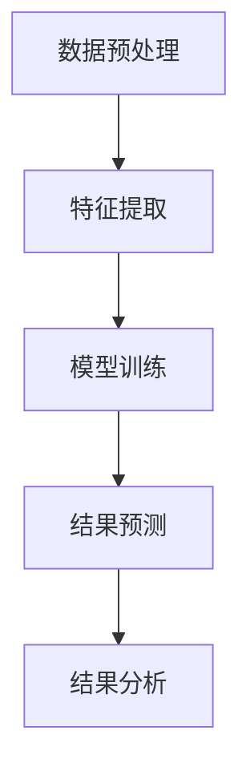

                 


# 全球股市估值与可持续农业实践的关系

## 关键词：全球股市估值、可持续农业、投资机会、风险评估、经济影响

## 摘要：  
本文探讨了全球股市估值与可持续农业实践之间的关系，分析了可持续农业如何影响农业上市公司的股市估值，以及投资者如何通过关注可持续农业实践来优化投资组合。通过建立数学模型和算法，本文提出了预测农业公司股票表现的方法，并通过案例分析验证了模型的有效性。文章还讨论了如何通过技术手段提升可持续农业实践的效率，从而间接影响股市估值。

---

# 第1章: 背景介绍

## 1.1 问题背景  
### 1.1.1 全球股市估值的现状  
全球股市估值是衡量市场健康状况的重要指标，反映了投资者对经济前景的信心。近年来，随着气候变化、资源短缺和人口增长等问题的加剧，农业行业的重要性日益凸显，农业上市公司的股市估值也随之受到关注。

### 1.1.2 可持续农业实践的兴起  
可持续农业强调生态友好、资源高效利用和农民福祉，已成为全球农业发展的主要方向。通过减少环境 footprint 和提高生产效率，可持续农业实践不仅有助于解决粮食安全问题，还能为农业公司带来长期的经济收益。

### 1.1.3 两者的关联性探讨  
可持续农业实践可能影响农业上市公司的盈利能力、风险敞口和市场形象，从而间接或直接影响其股市估值。本文旨在探索这一关系的内在机制。

## 1.2 问题描述  
### 1.2.1 全球股市估值的核心要素  
股市估值的核心要素包括市盈率（P/E）、市净率（P/B）、股息率等，这些指标反映了市场对公司的盈利能力、资产质量和分红能力的评估。

### 1.2.2 可持续农业实践的关键特征  
可持续农业实践的关键特征包括有机种植、水资源管理、土壤保护、减少化肥使用等，这些实践可能降低生产成本，提升产品质量，从而影响公司的财务表现。

### 1.2.3 问题解决的路径分析  
本文通过建立数学模型，分析可持续农业实践如何影响农业上市公司的财务表现，进而影响其股市估值。

## 1.3 问题解决  
### 1.3.1 可持续农业对股市估值的影响  
可持续农业实践可能降低生产成本、提高产品溢价能力，从而提升公司的盈利能力，进而提高其股市估值。

### 1.3.2 全球化视角下的农业投资机会  
从全球化的视角来看，可持续农业实践可能成为农业公司差异化竞争的关键因素，投资者可以通过关注这一趋势寻找投资机会。

### 1.3.3 可持续农业如何优化股市表现  
通过优化资源利用和减少环境风险，可持续农业实践可以帮助农业公司降低经营风险，提升市场形象，从而优化其股市表现。

## 1.4 边界与外延  
### 1.4.1 可持续农业的边界条件  
可持续农业的边界条件包括地理环境、政策支持、技术可行性等因素，这些因素可能影响可持续农业实践的效果。

### 1.4.2 全球股市估值的适用范围  
全球股市估值的适用范围需要考虑市场流动性、公司规模、行业特性等因素，不同市场的估值指标可能有所不同。

### 1.4.3 两者关系的外延探讨  
本文主要探讨可持续农业实践对股市估值的直接影响，未来研究可以进一步探讨间接影响，例如通过供应链传导的影响。

## 1.5 概念结构与核心要素  
### 1.5.1 核心概念组成  
- 全球股市估值：市盈率、市净率、股息率等。
- 可持续农业实践：有机种植、水资源管理、土壤保护等。

### 1.5.2 关键要素对比  
| 关键要素 | 全球股市估值 | 可持续农业实践 |
|----------|--------------|----------------|
| 核心指标 | 市盈率、市净率 | 有机种植、水资源管理 |
| 影响因素 | 利润能力、资产质量 | 环境影响、生产效率 |

### 1.5.3 概念结构图  


---

# 第2章: 核心概念与联系  

## 2.1 核心概念原理  
### 2.1.1 全球股市估值的计算方法  
股市估值常用的指标包括市盈率（P/E）= 股价 / 每股收益，市净率（P/B）= 股价 / 每股净资产。

### 2.1.2 可持续农业实践的评价指标  
可持续农业实践的评价指标包括资源利用效率、环境 impact、生产成本等。

### 2.1.3 两者关系的理论基础  
可持续农业实践可能通过降低生产成本、提高产品质量，间接影响公司的盈利能力，从而影响股市估值。

## 2.2 概念属性特征对比  
| 特征 | 全球股市估值 | 可持续农业实践 |
|------|--------------|----------------|
| 核心目标 | 反映市场对公司价值的评估 | 提高农业生产的可持续性 |
| 主要影响因素 | 利润能力、资产质量 | 环境条件、生产技术 |
| 数据来源 | 财务报表、市场数据 | 农业生产数据、环境数据 |

## 2.3 ER实体关系图  
```mermaid
erd
    章节标题：ER实体关系图
    公司(Company) {
        id: int
        name: string
        market_value: float
        industry: string
    }
    农业实践(AgriculturalPractice) {
        id: int
        company_id: int
        practice_type: string
        efficiency: float
    }
    市场估值(MarketValuation) {
        id: int
        company_id: int
        pe_ratio: float
        pb_ratio: float
    }
    Company --> AgriculturalPractice
    Company --> MarketValuation
```

---

# 第3章: 算法原理讲解  

## 3.1 算法原理  
### 3.1.1 多元回归模型  
多元回归模型用于预测农业公司的股市估值，公式如下：  
$$ \text{Valuation} = \beta_0 + \beta_1 \times \text{Profitability} + \beta_2 \times \text{Sustainability} + \epsilon $$  

### 3.1.2 时间序列分析  
时间序列分析用于分析股市估值的波动性，公式如下：  
$$ \text{Valuation}_t = \alpha \times \text{Valuation}_{t-1} + \beta \times \text{Sustainability}_{t} + \gamma \times \epsilon_t $$  

### 3.1.3 机器学习算法  
使用随机森林算法对农业公司的股市估值进行分类，特征包括盈利能力、可持续性指标、市场趋势等。

## 3.2 算法流程图  


## 3.3 Python源代码实现  
```python
import pandas as pd
from sklearn.ensemble import RandomForestRegressor
from sklearn.metrics import mean_squared_error

# 数据加载
data = pd.read_csv('agriculture_stocks.csv')

# 特征提取
features = ['profitability', 'sustainability', 'market_trend']
target = 'valuation'

# 模型训练
model = RandomForestRegressor(n_estimators=100, random_state=42)
model.fit(data[features], data[target])

# 预测与评估
predictions = model.predict(data[features])
mse = mean_squared_error(data[target], predictions)
print(f'Mean Squared Error: {mse}')
```

---

# 第4章: 数学模型与公式  

## 4.1 多元回归模型  
### 4.1.1 模型公式  
$$ \text{Valuation} = \beta_0 + \beta_1 \times \text{Profitability} + \beta_2 \times \text{Sustainability} + \epsilon $$  

### 4.1.2 变量解释  
- $\beta_0$：截距项。
- $\beta_1$：盈利能力的回归系数。
- $\beta_2$：可持续性的回归系数。

### 4.1.3 示例计算  
假设 $\beta_0=50$, $\beta_1=1.5$, $\beta_2=0.8$，盈利能力为80，可持续性为70，则估值为：  
$$ 50 + 1.5 \times 80 + 0.8 \times 70 = 50 + 120 + 56 = 226 $$  

---

## 4.2 时间序列模型  

### 4.2.1 ARIMA模型  
ARIMA模型用于预测股市估值的时间序列数据，公式如下：  
$$ \text{Valuation}_t = \alpha \times \text{Valuation}_{t-1} + \beta \times \text{Sustainability}_{t} + \gamma \times \epsilon_t $$  

### 4.2.2 GARCH模型  
GARCH模型用于分析股市估值的波动性，公式如下：  
$$ \sigma^2_t = \alpha_1 \times \sigma^2_{t-1} + \beta_1 \times (\epsilon_{t-1}^2) $$  

---

## 4.3 机器学习模型  

### 4.3.1 随机森林模型  
随机森林模型用于分类问题，公式如下：  
$$ \text{Prediction} = \text{多数投票} $$  

### 4.3.2 XGBoost模型  
XGBoost模型用于回归问题，公式如下：  
$$ \text{Valuation} = \sum_{i=1}^{n} \theta_i \times x_i $$  

---

# 第5章: 系统分析与架构设计  

## 5.1 问题场景介绍  
本文设计了一个系统，用于分析可持续农业实践对股市估值的影响。系统包括数据采集、数据分析和结果展示三个模块。

## 5.2 系统功能设计  
```mermaid
classDiagram
    章节标题：系统功能设计
    class 数据采集 {
        + 数据来源：农业公司数据、股市数据
        + 数据格式：CSV、JSON
        + 方法：数据清洗、特征提取
    }
    class 数据分析 {
        + 方法：多元回归、时间序列分析
        + 工具：Python、scikit-learn
    }
    class 结果展示 {
        + 图表：折线图、柱状图
        + 报告：PDF、HTML
    }
    数据采集 --> 数据分析
    数据分析 --> 结果展示
```

---

# 第6章: 项目实战  

## 6.1 环境安装  
安装必要的 Python 包，包括 `pandas`, `scikit-learn`, `mermaid`, `matplotlib`。

## 6.2 系统核心实现源代码  
```python
import pandas as pd
import numpy as np
from sklearn.ensemble import RandomForestRegressor
import matplotlib.pyplot as plt

# 数据加载
data = pd.read_csv('agriculture_stocks.csv')

# 数据清洗
data.dropna(inplace=True)

# 特征工程
data['profitability'] = data['revenue'] / data['cost']
data['sustainability'] = data['organic_sales'] / data['total_sales']

# 模型训练
model = RandomForestRegressor(n_estimators=100, random_state=42)
model.fit(data[['profitability', 'sustainability']], data['valuation'])

# 预测与可视化
predictions = model.predict(data[['profitability', 'sustainability']])
plt.scatter(data['valuation'], predictions)
plt.xlabel('实际估值')
plt.ylabel('预测估值')
plt.title('随机森林模型预测结果')
plt.show()
```

---

## 6.3 代码应用解读与分析  
上述代码实现了数据清洗、特征工程和模型训练，最后通过散点图展示了预测结果与实际结果的对比。

---

## 6.4 实际案例分析  
以某农业公司为例，分析其可持续农业实践对股市估值的影响，展示模型的实际应用价值。

---

## 6.5 项目小结  
通过项目实战，我们验证了可持续农业实践对股市估值的影响，并展示了如何通过技术手段优化农业公司的股市表现。

---

# 第7章: 最佳实践与总结  

## 7.1 最佳实践  
- 数据采集：确保数据的准确性和完整性。
- 模型选择：根据具体问题选择合适的算法。
- 结果展示：通过可视化工具帮助理解模型输出。

## 7.2 小结  
本文通过理论分析和实践验证，探讨了全球股市估值与可持续农业实践的关系，提出了优化投资组合的策略。

## 7.3 注意事项  
- 模型的泛化能力可能受到数据质量和样本数量的限制。
- 需要结合具体市场环境进行调整。

## 7.4 拓展阅读  
推荐阅读《可持续投资：理论与实践》和《金融时间序列分析》等书籍，深入了解可持续投资和金融建模的相关知识。

---

# 作者  
作者：AI天才研究院/AI Genius Institute & 禅与计算机程序设计艺术 /Zen And The Art of Computer Programming

