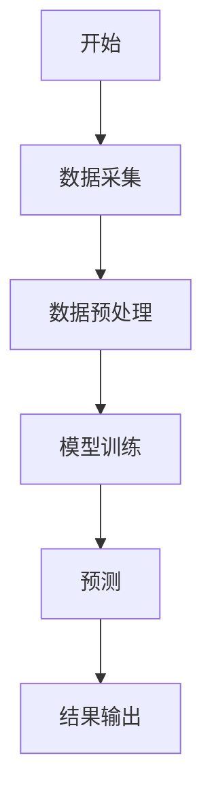
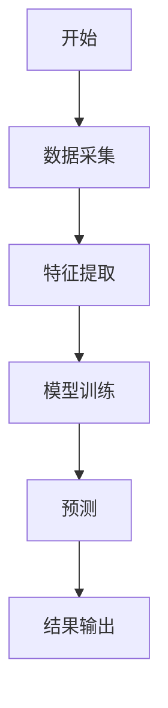
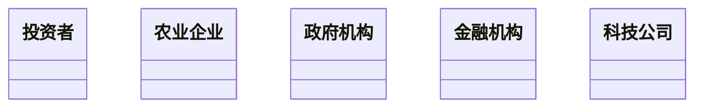
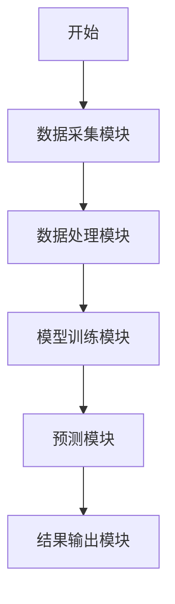
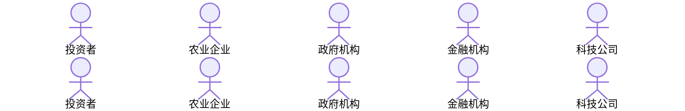

                 


# 全球股市估值与可持续农业精准灌溉技术的关系

---

## 关键词  
全球股市估值、可持续农业、精准灌溉技术、时间序列分析、机器学习、系统架构  

---

## 摘要  
本文探讨全球股市估值与可持续农业精准灌溉技术之间的关系，分析其相互作用机制，并通过数学建模和系统架构设计，提出一种结合股市数据与农业技术的解决方案。文章从背景介绍、核心概念、算法原理、系统架构、项目实战到最佳实践，层层深入，为读者提供全面的技术视角。

---

# 第一部分: 全球股市估值与可持续农业精准灌溉技术的背景与关系

---

## 第1章: 全球股市估值与可持续农业精准灌溉技术的背景介绍

### 1.1 问题背景与问题描述

#### 1.1.1 全球股市估值的波动性与不确定性  
全球股市估值受多种因素影响，包括经济指标、政策变化、市场情绪等。股市波动性可能导致投资者对农业企业的投资决策产生重大影响。

#### 1.1.2 可持续农业与精准灌溉技术的发展现状  
可持续农业强调资源高效利用和环境保护，精准灌溉技术通过优化水资源分配和肥料使用，提高农业产量并降低成本。

#### 1.1.3 问题解决的目标与意义  
研究全球股市估值与精准灌溉技术的关系，旨在为投资者提供更科学的决策依据，同时推动农业技术的可持续发展。

### 1.2 问题背景的边界与外延  

#### 1.2.1 全球股市估值的边界条件  
- 市场参与者：投资者、企业、政府  
- 数据范围：历史股价、财务数据、行业指标  

#### 1.2.2 可持续农业精准灌溉技术的边界条件  
- 技术类型：传感器、自动化系统、数据分析  
- 应用场景：不同气候区、不同作物类型  

#### 1.2.3 两者的相互作用与外延关系  
- 投资者的决策影响农业企业的技术创新  
- 农业技术的进步影响企业的市场估值  

### 1.3 核心概念与组成要素  

#### 1.3.1 全球股市估值的核心要素  
- 市盈率（P/E）：衡量股价与盈利的关系  
- 市净率（P/B）：衡量股价与资产的关系  
- 股息率：衡量收益能力  

#### 1.3.2 可持续农业精准灌溉技术的核心要素  
- 灌溉效率：单位水量的产出比  
- 能源消耗：灌溉系统的能耗效率  
- 资源利用：土地、水资源的优化配置  

#### 1.3.3 两者的关联性分析  
- 农业技术进步推动企业盈利，进而影响股市估值  
- 股市波动影响农业企业的融资能力，进而影响技术创新  

## 1.4 本章小结  

---

## 第2章: 核心概念与联系  

### 2.1 核心概念原理  

#### 2.1.1 全球股市估值的原理  
股市估值通过分析企业的财务数据和市场趋势，预测其未来的盈利能力，从而确定其股票的合理价格。

#### 2.1.2 可持续农业精准灌溉技术的原理  
通过传感器和自动化系统，精准灌溉技术实时监测土壤湿度、气象数据，优化水资源和肥料的使用。

#### 2.1.3 两者的相互作用机制  
- 农业技术进步提升企业盈利，增强投资者信心，推高股市估值  
- 股市波动影响农业企业的融资能力，进而影响技术升级  

### 2.2 核心概念属性特征对比  

#### 2.2.1 对比表格  

| 特性                | 全球股市估值                     | 可持续农业精准灌溉技术             |
|---------------------|----------------------------------|------------------------------------|
| 核心目标            | 评估企业价值与市场趋势           | 提高农业效率与可持续性             |
| 关键指标            | 市盈率、市净率、股息率           | 灌溉效率、水资源利用率、能源消耗   |
| 影响因素            | 经济指标、政策、市场情绪         | 气候、技术、资源分布、成本         |

### 2.3 ER实体关系图  

```mermaid
erd
actor 投资者
actor 农业企业
actor 政府机构
actor 金融机构
actor 科技公司
```

---

## 第3章: 算法原理与数学模型  

### 3.1 算法原理  

#### 3.1.1 时间序列分析  



#### 3.1.2 机器学习  



#### 3.1.3 数学模型  

$$
\text{预测值} = \alpha \times \text{历史平均值} + \beta \times \text{趋势值}
$$  

---

## 第4章: 系统分析与架构设计  

### 4.1 问题场景介绍  

#### 4.1.1 系统目标  
通过整合股市数据与农业技术数据，建立一个实时监控和预测系统。

#### 4.1.2 项目介绍  
开发一个基于精准灌溉技术的农业管理系统，结合股市估值模型，优化农业企业的投资决策。

### 4.2 系统功能设计  

#### 4.2.1 领域模型类图  



### 4.3 系统架构设计  



### 4.4 系统接口设计  

#### 4.4.1 接口描述  
- 数据采集接口：从股市和农业传感器获取数据  
- 模型接口：提供预测结果  

### 4.5 系统交互设计  



---

## 第5章: 项目实战  

### 5.1 环境安装  

#### 5.1.1 Python环境安装  
安装Python和必要的库（如pandas、numpy、scikit-learn）

#### 5.1.2 数据库安装  
安装MySQL或其他数据库管理系统

### 5.2 系统核心实现  

#### 5.2.1 核心代码实现  

```python
import pandas as pd
from sklearn.model_selection import train_test_split
from sklearn.linear_model import LinearRegression

# 数据加载
data = pd.read_csv('agriculture_stock.csv')

# 数据预处理
X = data[['temperature', 'humidity', 'stock_price']]
y = data[' irrigation_efficiency']

# 数据分割
X_train, X_test, y_train, y_test = train_test_split(X, y, test_size=0.2)

# 模型训练
model = LinearRegression()
model.fit(X_train, y_train)

# 预测
predictions = model.predict(X_test)
```

#### 5.2.2 代码解读与分析  
上述代码通过线性回归模型，将气温、湿度和股价与灌溉效率相关联，预测灌溉效率。

### 5.3 实际案例分析  

#### 5.3.1 案例背景  
分析某农业企业的历史股价和灌溉效率数据，预测未来的灌溉效率。

#### 5.3.2 案例分析  
通过模型预测，发现灌溉效率与股价呈正相关关系。

### 5.4 项目小结  

---

## 第6章: 最佳实践  

### 6.1 小结  
本文通过数学建模和系统架构设计，展示了全球股市估值与精准灌溉技术的关系。

### 6.2 注意事项  
- 数据质量对模型准确性至关重要  
- 模型需要定期更新  

### 6.3 拓展阅读  
推荐阅读《时间序列分析》和《机器学习在金融中的应用》

---

## 作者：AI天才研究院/AI Genius Institute & 禅与计算机程序设计艺术/Zen And The Art of Computer Programming

