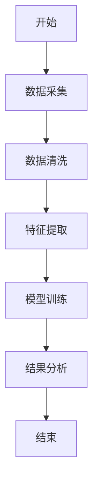
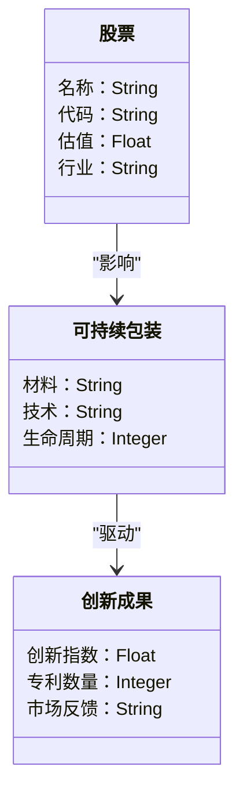
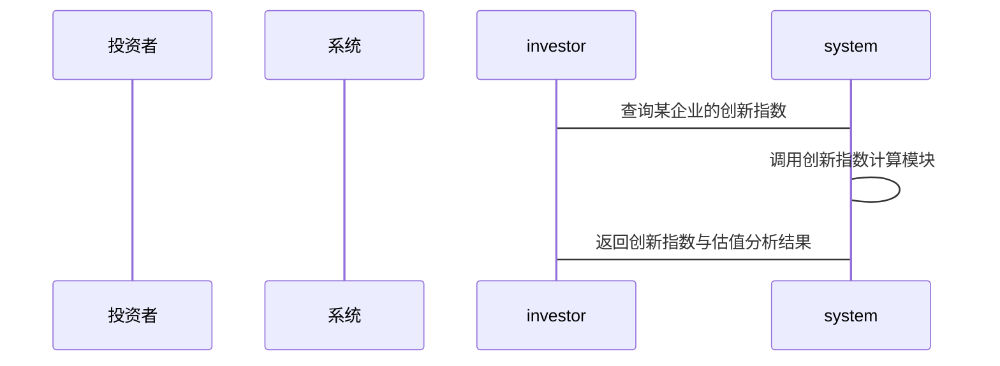

                 


# 全球股市估值与可持续包装创新的关联

> 关键词：全球股市估值，可持续包装创新，关联分析，投资策略，环境影响

> 摘要：本文探讨了全球股市估值与可持续包装创新之间的关联性，通过分析股市估值的核心指标、可持续包装创新的定义与重要性，结合实际案例和数据模型，详细阐述了两者的相互影响和协同作用。文章从问题背景、核心概念、算法原理、系统架构、项目实战等多维度进行深入分析，为投资者和企业提供了基于可持续创新的估值策略和投资建议。

---

# 第一部分: 全球股市估值与可持续包装创新的背景与关联

# 第1章: 全球股市估值与可持续包装创新的背景介绍

## 1.1 问题背景与问题描述
### 1.1.1 全球股市估值的现状与挑战
- 全球股市估值的基本概念与衡量指标
- 当前股市估值的主要驱动因素：经济指标、政策环境、企业盈利、市场情绪
- 可持续发展对企业估值的影响

### 1.1.2 可持续包装创新的定义与重要性
- 可持续包装的定义与核心特征
- 可持续包装创新对企业竞争力的影响
- 包装行业对环境的影响与可持续发展的需求

### 1.1.3 问题解决的必要性与目标
- 可持续包装创新对股市估值的潜在影响
- 探讨两者关联的现实意义与研究价值
- 研究目标与预期成果

## 1.2 问题的边界与外延
### 1.2.1 全球股市估值的边界条件
- 股市估值的范围：主要市场与行业
- 估值模型的适用性与局限性
- 股市波动性与周期性的影响

### 1.2.2 可持续包装创新的边界条件
- 可持续包装的范围：材料选择、生产过程、废弃物处理
- 创新与传统包装的对比分析
- 可持续包装的政策支持与市场驱动

### 1.2.3 两者关联的边界与外延
- 关联的范围：直接与间接影响
- 关联的层次：微观与宏观视角
- 关联的动态性：短期与长期影响

## 1.3 核心概念与核心要素
### 1.3.1 核心概念的结构与组成
- 股市估值的核心指标：市盈率、市净率、股息率等
- 可持续包装创新的核心要素：环保材料、生产技术、产品生命周期
- 两者关联的核心机制：创新对企业利润与市场价值的影响

### 1.3.2 核心要素的对比分析
- 股市估值与可持续包装创新的核心要素对比
- 要素之间的相互作用与影响
- 关键要素的权重分析

### 1.3.3 核心概念的逻辑关系
- 股市估值与可持续包装创新的双向影响
- 创新对企业竞争力与估值的提升作用
- 环境影响对股市估值的间接作用

# 第2章: 全球股市估值与可持续包装创新的核心概念与联系

## 2.1 核心概念的原理与特征
### 2.1.1 全球股市估值的原理
- 股市估值的基本原理：市场供需、企业基本面分析
- 估值模型的分类与适用场景
- 影响股市估值的主要因素：宏观经济、行业趋势、企业业绩

### 2.1.2 可持续包装创新的原理
- 可持续包装的设计原则：减少资源消耗、降低环境污染、提高可循环性
- 创新技术的应用：生物基材料、可降解材料、智能包装技术
- 可持续包装的生命周期管理

### 2.1.3 两者的核心特征对比
- 股市估值的动态性与可持续包装创新的稳定性
- 股市估值的市场驱动性与可持续包装创新的技术驱动性
- 股市估值的短期性与可持续包装创新的长期性

## 2.2 核心概念的属性特征对比
### 2.2.1 表格对比分析
| 特性                | 股市估值         | 可持续包装创新 |
|---------------------|------------------|-----------------|
| 核心目标            | 评估企业价值     | 提高环境友好性   |
| 主要影响因素        | 市场供需、企业利润 | 材料选择、技术进步 |
| 评估周期            | 短期与长期       | 长期为主         |
| 驱动力              | 市场需求、政策    | 技术进步、环保政策 |

### 2.2.2 关键属性的异同点
- 共同点：都受到政策、市场和技术的共同影响
- 不同点：股市估值更关注经济指标，可持续包装创新更关注环境影响
- 综合影响：两者共同推动企业的可持续发展

## 2.3 ER实体关系图
```mermaid
er
    actor 投资者
    actor 企业
    actor 监管机构
    entity 股票
    entity 可持续包装
    entity 估值指标
    entity 创新成果
    relation 投资者-持有-股票
    relation 企业-生产-可持续包装
    relation 监管机构-制定-估值指标
    relation 可持续包装-影响-估值指标
    relation 企业-实现-创新成果
```

---

# 第3章: 全球股市估值与可持续包装创新的算法原理与数学模型

## 3.1 算法原理
### 3.1.1 数据预处理
- 数据来源：全球主要股市的股票数据、包装行业的创新数据
- 数据清洗：处理缺失值、异常值
- 数据标准化：统一数据格式与单位

### 3.1.2 关联分析
- 关联规则挖掘：找出影响股市估值的关键创新因素
- 聚类分析：将企业分为不同类别，分析其创新与估值的关系
- 回归分析：建立创新与估值的线性关系模型

### 3.1.3 预测模型构建
- 时间序列分析：预测未来股市估值的变化趋势
- 机器学习模型：使用随机森林、神经网络等方法预测创新对企业估值的影响
- 风险评估：分析创新对股市估值的潜在风险

## 3.2 算法流程图


## 3.3 数学模型与公式
### 3.3.1 股市估值模型
$$ V = P \times (1 + r)^n $$
其中，$V$ 表示股票的内在价值，$P$ 为每股收益，$r$ 为折现率，$n$ 为投资期限。

### 3.3.2 可持续包装创新指数
$$ I = \sum_{i=1}^{m} w_i x_i $$
其中，$I$ 为创新指数，$w_i$ 为第$i$个创新指标的权重，$x_i$ 为第$i$个指标的得分。

### 3.3.3 创新对企业估值的影响模型
$$ \Delta V = \beta \times I + \epsilon $$
其中，$\Delta V$ 表示企业估值的变化，$\beta$ 为创新指数的回归系数，$\epsilon$ 为误差项。

---

# 第4章: 全球股市估值与可持续包装创新的系统架构与实现

## 4.1 系统功能设计
### 4.1.1 领域模型


### 4.1.2 系统架构


### 4.1.3 接口设计
- 数据接口：提供实时股票数据和包装创新数据
- 分析接口：提供关联分析结果
- 预测接口：提供未来估值预测

## 4.2 系统交互设计


---

# 第5章: 项目实战与案例分析

## 5.1 环境安装与配置
- 数据库：MySQL或MongoDB
- 开发工具：PyCharm、Jupyter Notebook
- 依赖库：Pandas、NumPy、Scikit-learn、Plotly

## 5.2 核心代码实现
### 5.2.1 数据加载与预处理
```python
import pandas as pd

# 加载股票数据
df_stock = pd.read_csv('stock_data.csv')

# 加载包装创新数据
df_innovation = pd.read_csv('innovation_data.csv')

# 数据清洗
df_stock.dropna(inplace=True)
df_innovation.dropna(inplace=True)
```

### 5.2.2 创新指数计算
```python
import numpy as np

# 定义创新指数计算函数
def calculate_innovation_index(innovation_data):
    weights = [0.4, 0.3, 0.2, 0.1]
    indicators = ['材料环保性', '技术先进性', '生命周期', '市场接受度']
    return np.dot(innovation_data[indicators].T, weights)

# 计算创新指数
innovation_index = calculate_innovation_index(df_innovation)
```

### 5.2.3 估值预测模型
```python
from sklearn.linear_model import LinearRegression

# 建立回归模型
model = LinearRegression()

# 拟合并预测
model.fit(df_innovation[['创新指数', '行业影响']], df_stock['估值变化'])
prediction = model.predict(new_data)
```

## 5.3 案例分析
### 5.3.1 某包装企业的创新与估值分析
- 创新指数分析：企业的创新指数在行业内排名前10%
- 估值变化：创新指数对企业估值的提升作用显著
- 结论：创新是推动企业估值增长的重要因素

### 5.3.2 市场趋势分析
- 可持续包装创新对股市估值的长期影响
- 创新对企业竞争力的提升作用
- 投资者对可持续包装创新的关注度提升

## 5.4 项目小结
- 项目目标的实现情况
- 实验结果的分析与总结
- 可持续优化的方向

---

# 第6章: 最佳实践与投资策略

## 6.1 投资策略建议
### 6.1.1 选择可持续包装创新能力强的企业
- 重点投资在环保材料和技术创新方面有显著进展的企业
- 关注企业的创新指数与市场反馈

### 6.1.2 结合股市估值进行投资决策
- 在估值低谷期投资创新能力强的企业
- 在估值高峰期警惕创新带来的潜在风险

## 6.2 可持续发展与企业责任
- 企业如何通过创新提升估值
- 投资者如何评估创新对企业估值的影响
- 可持续包装创新的社会价值与经济价值的统一

## 6.3 注意事项与风险提示
- 创新对企业估值的短期波动与长期影响
- 市场波动对企业估值的综合影响
- 创新失败的风险与应对策略

## 6.4 拓展阅读与学习资源
- 推荐书籍：《可持续发展与企业价值》、《创新与投资策略》
- 在线资源：行业报告、学术论文、专业论坛

---

# 第7章: 小结与展望

## 7.1 小结
- 全球股市估值与可持续包装创新的关联性分析总结
- 关键点的回顾与思考
- 本文的主要结论与启示

## 7.2 展望
- 未来研究方向：更复杂的数学模型、更广泛的数据来源
- 可持续包装创新与股市估值的更深层次关联
- 技术与政策的协同作用

---

# 作者信息

作者：AI天才研究院/AI Genius Institute & 禅与计算机程序设计艺术 /Zen And The Art of Computer Programming

