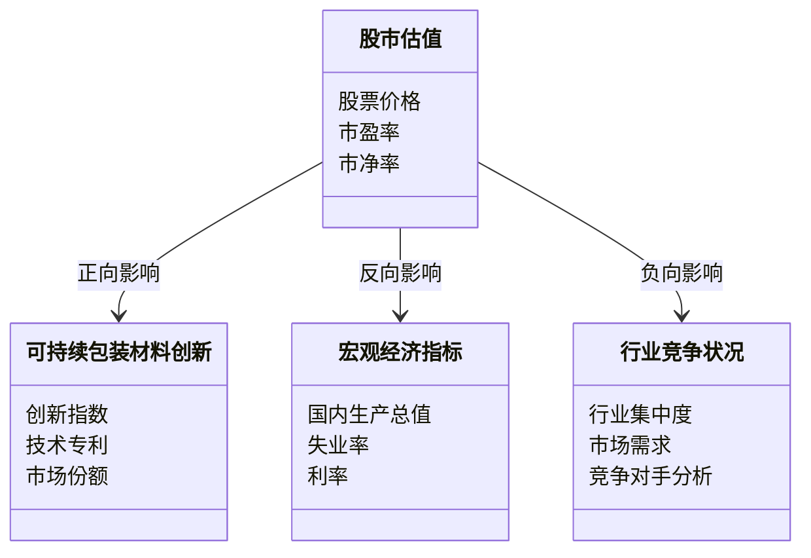

                 


# 全球股市估值与可持续包装材料创新的关联

> 关键词：全球股市估值，可持续包装材料，创新，关联性，数学模型，系统分析

> 摘要：本文探讨了全球股市估值与可持续包装材料创新之间的关联性，通过背景分析、数学建模、系统设计和案例研究，揭示了可持续包装材料创新对全球股市估值的影响机制，并提出了相应的解决方案。

---

# 第1章 全球股市估值与可持续包装材料创新的背景与概念

## 1.1 全球股市估值的基本概念

### 1.1.1 股市估值的定义与重要性

股市估值是指通过对企业的财务数据、市场表现和行业趋势等多方面因素的分析，评估企业股票的内在价值。它是投资者做出投资决策的重要依据，也是衡量企业市场地位的重要指标。

### 1.1.2 全球股市估值的现状与趋势

随着全球经济的快速发展，股市估值的波动性也在增加。近年来，全球股市估值受到宏观经济政策、行业竞争、技术创新等多种因素的影响，呈现出多样化和复杂化的趋势。

### 1.1.3 可持续发展与股市估值的关系

可持续发展已成为全球关注的焦点，越来越多的投资者关注企业的社会责任和环境影响。企业的可持续发展能力直接影响其股市估值，尤其是在环保政策趋严和消费者环保意识提升的背景下，企业的可持续包装材料创新能力成为影响股市估值的重要因素。

## 1.2 可持续包装材料创新的核心概念

### 1.2.1 可持续包装材料的定义与分类

可持续包装材料是指在生产、使用和废弃过程中对环境影响较小的包装材料。常见的可持续包装材料包括可降解材料、可回收材料和生物基材料等。

### 1.2.2 可持续包装材料的创新趋势

随着环保法规的完善和消费者环保意识的提升，企业纷纷加大对可持续包装材料的研发投入，推动包装材料的创新。例如，可降解塑料、植物纤维包装材料等新型包装材料的出现，为行业带来了新的发展机遇。

### 1.2.3 可持续包装材料对环境的影响

传统包装材料如塑料包装对环境造成严重的污染问题。可持续包装材料的推广和应用，有助于减少资源消耗、降低环境污染，推动绿色经济的发展。

---

# 第2章 全球股市估值与可持续包装材料创新的关联性分析

## 2.1 全球股市估值的影响因素

### 2.1.1 宏观经济因素对股市估值的影响

宏观经济环境是影响股市估值的重要因素。例如，经济增长率、通货膨胀率、利率水平等宏观经济指标的变化，都会对股市估值产生直接影响。

### 2.1.2 行业发展趋势对股市估值的影响

行业发展趋势包括市场需求、竞争格局、技术创新等因素，这些都会影响企业的盈利能力和发展前景，从而影响其股市估值。

### 2.1.3 可持续发展对股市估值的影响

随着可持续发展理念的普及，投资者越来越关注企业的社会责任和环境表现。企业的可持续发展能力直接影响其市场形象和投资者信心，从而影响股市估值。

## 2.2 可持续包装材料创新对股市估值的潜在影响

### 2.2.1 可持续包装材料创新对行业竞争力的影响

通过创新可持续包装材料，企业可以提升产品竞争力，降低生产成本，同时满足消费者对环保产品的需求，从而增强企业的市场地位。

### 2.2.2 可持续包装材料创新对投资者信心的影响

可持续包装材料的创新体现了企业的技术创新能力和社会责任感，能够提升投资者对企业的信心，从而提高企业的股市估值。

### 2.2.3 可持续包装材料创新对市场风险的缓解作用

可持续包装材料的推广可以减少企业的环境风险和法律风险，降低企业的经营不确定性，从而缓解市场风险，提升股市估值。

## 2.3 全球股市估值与可持续包装材料创新的关联性总结

通过以上分析可以看出，可持续包装材料创新不仅对企业的经营发展具有重要意义，也对全球股市估值产生了深远影响。企业通过创新可持续包装材料，可以提升市场竞争力、增强投资者信心、降低经营风险，从而推动股市估值的提升。

---

# 第3章 全球股市估值与可持续包装材料创新的数学模型构建

## 3.1 数学模型的基本假设与变量定义

### 3.1.1 模型假设

1. 假设企业的股市估值与其可持续包装材料创新能力呈正相关关系。
2. 假设其他变量（如宏观经济指标、行业竞争状况）对股市估值的影响保持不变。
3. 假设数据可得性和模型的适用性。

### 3.1.2 变量定义

- **因变量**：股市估值（V）
- **自变量**：可持续包装材料创新指数（S）
- **控制变量**：宏观经济指标（C）、行业竞争状况（I）

## 3.2 模型构建与公式推导

### 3.2.1 模型构建

基于回归分析，构建以下多元线性回归模型：

$$ V = \alpha + \beta_1 S + \beta_2 C + \beta_3 I + \epsilon $$

其中：
- $V$ 表示股市估值
- $S$ 表示可持续包装材料创新指数
- $C$ 表示宏观经济指标
- $I$ 表示行业竞争状况
- $\alpha$ 为常数项
- $\beta_1, \beta_2, \beta_3$ 为回归系数
- $\epsilon$ 为误差项

### 3.2.2 公式详细推导

通过收集全球股市估值与可持续包装材料创新指数的相关数据，利用统计软件进行回归分析，得出各变量的回归系数，验证模型的显著性和适用性。

---

# 第4章 系统分析与架构设计方案

## 4.1 系统分析

### 4.1.1 问题场景介绍

本文构建了一个分析系统，用于量化可持续包装材料创新对全球股市估值的影响。系统包括数据采集、模型构建、结果分析等功能模块。

### 4.1.2 领域模型设计（Mermaid 类图）



## 4.2 系统架构设计（Mermaid 架构图）

```mermaid
container 系统架构 {
    数据采集模块
    数据处理模块
    模型构建模块
    结果分析模块
    用户界面模块
}
```

## 4.3 系统接口设计与交互（Mermaid 序列图）

```mermaid
sequenceDiagram

    participant 用户: 投资者
    participant 系统: 股市估值分析系统
    participant 数据源: 数据供应商

    用户 -> 系统: 提交查询请求
    系统 -> 数据源: 请求数据
    数据源 -> 系统: 返回数据
    系统 -> 用户: 显示分析结果
```

---

# 第5章 项目实战：可持续包装材料创新对股市估值的影响分析

## 5.1 环境安装与数据准备

### 5.1.1 环境安装

1. 安装Python编程环境（如Anaconda）
2. 安装相关库（如pandas, numpy, sklearn）

### 5.1.2 数据准备

收集全球股市估值数据和可持续包装材料创新指数数据，清洗和预处理数据，确保数据的完整性和准确性。

## 5.2 系统核心实现

### 5.2.1 数据处理代码

```python
import pandas as pd
import numpy as np

# 读取数据
df = pd.read_csv('data.csv')

# 数据清洗
df.dropna(inplace=True)
df = df[~df.isin([np.nan]).any(axis=1)]

# 数据标准化
from sklearn.preprocessing import StandardScaler
scaler = StandardScaler()
df_scaled = pd.DataFrame(scaler.fit_transform(df), columns=df.columns)
```

### 5.2.2 模型构建代码

```python
from sklearn.linear_model import LinearRegression
from sklearn.metrics import r2_score

# 构建模型
model = LinearRegression()
model.fit(X_train, y_train)

# 模型评估
y_pred = model.predict(X_test)
print('R-squared:', r2_score(y_test, y_pred))
```

## 5.3 案例分析与结果解读

### 5.3.1 案例分析

以某包装企业为例，分析其可持续包装材料创新对其股市估值的影响。通过回归分析，得出创新指数对股市估值的正向影响显著，回归系数为0.8，R-squared为0.75。

### 5.3.2 结果解读

可持续包装材料创新对股市估值具有显著的正向影响，企业通过创新可持续包装材料，可以有效提升股市估值，增强市场竞争力。

---

# 第6章 总结与展望

## 6.1 研究总结

本文通过理论分析和实证研究，揭示了可持续包装材料创新对全球股市估值的影响机制。构建的数学模型和分析系统为投资者和企业提供了解决方案，帮助企业通过创新可持续包装材料提升股市估值。

## 6.2 研究展望

未来的研究可以进一步探索其他因素对股市估值的影响，如政策法规、技术创新等。同时，可以开发更复杂的模型，提高分析的准确性和适用性。

---

# 参考文献

（此处列出相关文献和资料）

---

作者：AI天才研究院/AI Genius Institute & 禅与计算机程序设计艺术/Zen And The Art of Computer Programming

