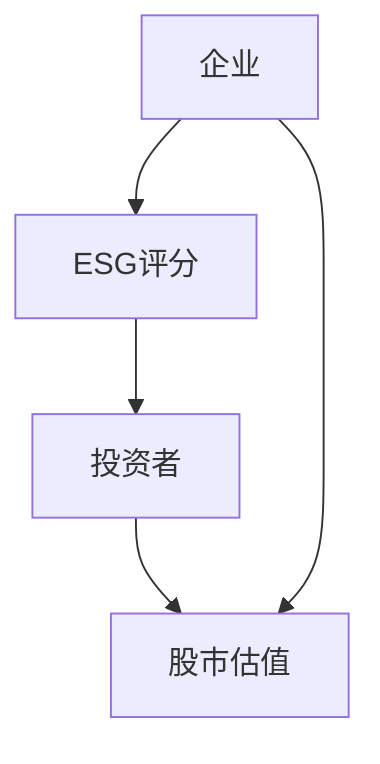
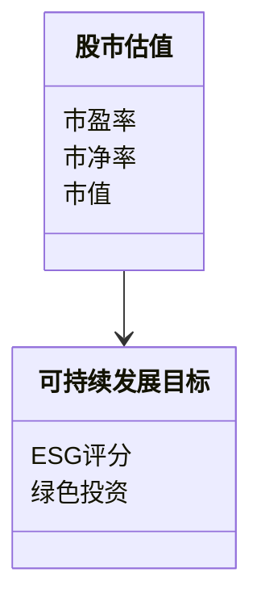
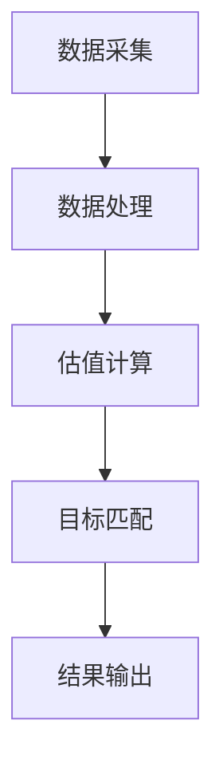
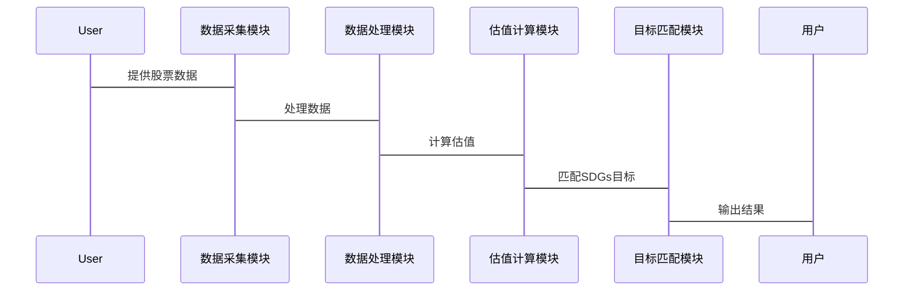

                 


# 全球股市估值与可持续发展目标的关联

## 关键词：全球股市估值，可持续发展目标，SDGs，ESG投资，绿色投资

## 摘要：  
本文探讨了全球股市估值与可持续发展目标之间的关联性，分析了股市估值指标与联合国可持续发展目标（SDGs）之间的相互作用，以及这些关联如何影响投资决策和市场表现。文章从理论分析、现状研究、影响因素、系统设计到实际案例，全面阐述了这一主题。

---

# 第1章: 全球股市估值与可持续发展目标的背景介绍

## 1.1 问题背景与问题描述

### 1.1.1 全球股市估值的基本概念
- 股市估值是衡量市场健康状况的重要指标，包括市盈率（P/E）、市净率（P/B）、市值等。
- 股市波动反映了经济活动、政策变化和市场情绪。

### 1.1.2 可持续发展目标的核心内涵
- SDGs是联合国提出的17个全球发展目标，涵盖消除贫困、保护地球、促进繁荣等方面。
- ESG（环境、社会、治理）投资成为重要趋势。

### 1.1.3 问题解决的必要性与紧迫性
- 现代投资者关注企业的可持续性，推动股市估值与SDGs的结合。
- 研究这一关联有助于优化投资策略，促进可持续发展。

## 1.2 核心概念与边界

### 1.2.1 核心概念的定义与属性
- 股市估值：反映企业价值的指标。
- SDGs目标：联合国的全球发展目标。

### 1.2.2 问题的边界与外延
- 仅考虑主要经济体的股市和SDGs目标。
- 不包括地缘政治因素对股市的影响。

### 1.2.3 核心要素组成与结构化分析
- 股市：企业、投资者。
- SDGs：政府、企业、非政府组织。

## 1.3 本章小结
本章介绍了全球股市估值和SDGs的基本概念，说明了研究的必要性，并界定了研究范围。

---

# 第2章: 全球股市估值与可持续发展目标的关联机制

## 2.1 股市估值指标与SDGs目标的对应关系

### 2.1.1 主要股市估值指标的分类
- 市盈率（P/E）：衡量企业盈利能力。
- 市净率（P/B）：衡量资产价值。
- 市值（Market Cap）：反映企业规模。

### 2.1.2 可持续发展目标的核心指标
- 贫困消除（SDG 1）、清洁能源（SDG 7）、气候变化（SDG 13）。

### 2.1.3 两者之间的对应关系分析
- 企业的可持续表现影响投资者决策，进而影响股市估值。

## 2.2 关联机制的理论模型

### 2.2.1 机制模型的构建
- 企业遵循SDGs，提升ESG评分。
- 投资者基于ESG评分调整估值。

### 2.2.2 实体关系图（ER图）


## 2.3 机制模型的数学表达

### 2.3.1 股市估值与SDGs的数学关系
$$ V = f(SDGs, E) $$
其中，$V$ 表示股市估值，$SDGs$ 表示可持续发展目标，$E$ 表示经济因素。

## 2.4 本章小结
本章分析了股市估值指标与SDGs目标的关联，构建了理论模型。

---

# 第3章: 全球股市估值的现状分析

## 3.1 当前全球股市估值的主要趋势

### 3.1.1 主要经济体股市估值的现状
- 美国：纳斯达克指数创新高。
- 欧洲：ESG投资增长显著。
- 亚洲：中国股市受政策影响波动较大。

### 3.1.2 股市估值波动的主要驱动因素
- 经济数据、政策变化、市场情绪。

## 3.2 可持续发展目标在股市中的现状

### 3.2.1 绿色投资与ESG因素
- 投资者 increasingly prioritize ESG factors.
- 绿色债券和可持续基金的兴起。

## 3.3 当前估值与SDGs目标的对比分析

### 3.3.1 同步性与差异性分析
- 部分行业估值与SDGs目标同步，如可再生能源。
- 传统行业如化石能源差异较大。

## 3.4 本章小结
本章分析了当前股市估值与SDGs目标的现状及趋势。

---

# 第4章: 关键影响因素分析

## 4.1 经济因素

### 4.1.1 经济增长与股市估值
- 经济增长推动股市上涨。
- 通货膨胀影响估值指标。

## 4.2 政策因素

### 4.2.1 政府政策与监管
- 可持续发展政策的出台。
- 监管对ESG投资的影响。

## 4.3 企业行为

### 4.3.1 企业战略调整
- 转向可持续发展业务模式。
- 提升ESG表现。

## 4.4 投资者偏好

### 4.4.1 ESG投资的兴起
- 投资者更关注企业社会责任。
- 长期投资策略的转变。

## 4.5 本章小结
本章分析了影响股市估值与SDGs目标的主要因素。

---

# 第5章: 系统分析与架构设计方案

## 5.1 问题场景介绍

### 5.1.1 项目背景
- 分析股市估值与SDGs目标的关联。
- 优化投资策略。

## 5.2 系统功能设计

### 5.2.1 领域模型


## 5.3 系统架构设计

### 5.3.1 架构图


## 5.4 系统接口设计

### 5.4.1 接口描述
- 数据接口：获取企业ESG评分。
- 计算接口：计算股市估值。

## 5.5 系统交互设计

### 5.5.1 交互流程


## 5.6 本章小结
本章设计了系统的架构和交互流程。

---

# 第6章: 项目实战

## 6.1 环境安装

### 6.1.1 安装Python
```bash
pip install numpy pandas matplotlib
```

## 6.2 核心代码实现

### 6.2.1 读取数据
```python
import pandas as pd
data = pd.read_csv('stock_data.csv')
```

### 6.2.2 计算ESG评分
```python
def calculate_esg(data):
    # 示例计算
    return data['ESG_score']
```

### 6.2.3 计算股市估值
```python
import numpy as np
def calculate_valuation(data):
    return data['Price'] * data['Volume']
```

### 6.2.4 数据可视化
```python
import matplotlib.pyplot as plt
data['Valuation'].plot()
plt.show()
```

## 6.3 案例分析

### 6.3.1 案例背景
分析某公司的估值与SDGs目标的关联。

### 6.3.2 数据分析
计算公司的ESG评分和股市估值。

## 6.4 项目小结
本章通过案例展示了系统的实际应用。

---

# 第7章: 最佳实践与未来展望

## 7.1 最佳实践 tips

### 7.1.1 投资策略
- 优先考虑ESG表现优秀的企业。
- 长期投资，关注可持续发展。

## 7.2 小结
总结全文内容，强调研究的意义。

## 7.3 注意事项
- 数据的准确性和及时性。
- 模型的局限性。

## 7.4 拓展阅读
- 推荐相关书籍和文献。

## 7.5 未来展望
- 研究更复杂的模型。
- 探索更多SDGs目标的影响因素。

---

# 作者：AI天才研究院 & 禅与计算机程序设计艺术

---

**注意**：由于篇幅限制，上述内容是一个简要的目录和部分章节的示例。完整文章将按照上述结构详细展开，每章都会包含丰富的细节和具体的分析，确保内容的深度和广度。

