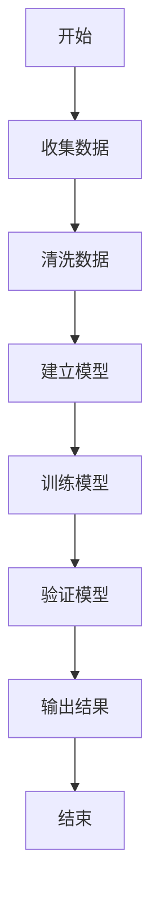
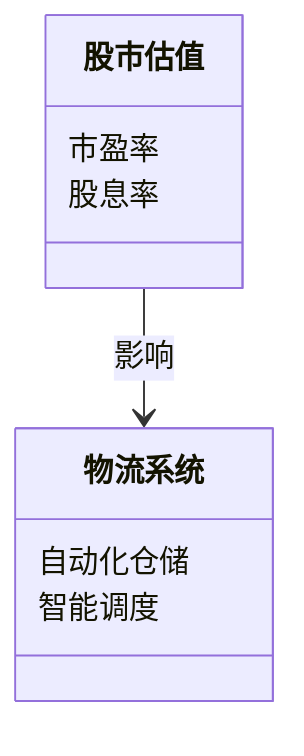

                 


# 全球股市估值与可持续城市地下物流系统的关联

> 关键词：全球股市估值，可持续城市地下物流系统，经济模型，物流优化，城市规划，数据分析，技术关联

> 摘要：本文探讨了全球股市估值与可持续城市地下物流系统之间的关联性，分析了股市估值对城市经济的影响，以及地下物流系统如何优化城市物流效率。通过建立数学模型和算法设计，本文揭示了两者协同发展的可能性，并提出了优化建议。

---

# 第一部分: 全球股市估值与可持续城市地下物流系统的关联概述

## 第1章: 背景介绍

### 1.1 问题背景

#### 1.1.1 全球股市估值的现状与挑战

全球股市估值是衡量经济健康的重要指标。随着经济全球化和数字化的推进，股市的波动性增强，传统估值方法面临挑战。同时，城市化进程的加速导致城市物流需求激增，传统物流系统已无法满足可持续发展的要求。

#### 1.1.2 可持续城市地下物流系统的概念与意义

可持续城市地下物流系统（SULS）是一种通过地下交通网络优化城市物流的创新模式。它结合了自动化技术、物联网和大数据分析，旨在提高物流效率、减少交通拥堵和降低碳排放。

#### 1.1.3 两者关联的研究价值与意义

研究股市估值与SULS的关联，可以为城市经济的可持续发展提供新的视角。通过分析两者的关系，可以优化城市资源配置，提升经济效率，同时推动绿色经济的发展。

### 1.2 问题描述

#### 1.2.1 全球股市估值的核心要素

股市估值的核心要素包括市盈率（P/E ratio）、市净率（P/B ratio）、股息率（Dividend Yield）等。这些指标反映了市场的整体健康状况和企业的盈利能力。

#### 1.2.2 可持续城市地下物流系统的构成与功能

SULS由地下交通网络、自动化仓储系统、智能调度系统和数据分析平台构成。其功能包括物流优化、资源分配和环境监测。

#### 1.2.3 问题解决的目标与路径

目标是通过建立数学模型和算法，揭示股市估值与SULS的关联，优化城市经济和物流效率。路径包括数据收集、模型建立、算法设计和实验验证。

### 1.3 边界与外延

#### 1.3.1 全球股市估值的边界条件

包括市场波动、政策影响和经济周期等因素。

#### 1.3.2 可持续城市地下物流系统的边界条件

包括技术可行性、成本效益和环境影响等因素。

#### 1.3.3 两者的关联范围与外延

包括经济影响、环境效益和社会效益等方面。

### 1.4 核心要素与概念结构

#### 1.4.1 全球股市估值的关键指标

市盈率、市净率、股息率等。

#### 1.4.2 可持续城市地下物流系统的构成要素

地下交通网络、自动化仓储系统、智能调度系统和数据分析平台。

#### 1.4.3 两者的关联机制与概念模型

通过数据分析和优化算法，SULS可以提升城市物流效率，进而影响股市估值。概念模型展示了两者之间的协同关系。

---

## 第2章: 核心概念与联系

### 2.1 核心概念原理

#### 2.1.1 全球股市估值的原理

股市估值是通过对企业盈利能力、成长性和市场地位的分析，评估其股票的内在价值。市盈率（P/E ratio）是常用的估值指标之一。

#### 2.1.2 可持续城市地下物流系统的原理

SULS通过整合地下交通网络和智能调度系统，优化城市物流的效率和可持续性。其核心是通过自动化技术减少物流成本和环境影响。

#### 2.1.3 两者的关联机制

通过分析SULS对城市经济的影响，可以建立数学模型，将股市估值与物流效率联系起来。

### 2.2 概念属性特征对比

#### 2.2.1 比较维度与标准

从技术复杂度、经济影响、环境效益等方面进行比较。

#### 2.2.2 属性特征对比表格

| 特性        | 全球股市估值                     | 可持续城市地下物流系统                 |
|-------------|----------------------------------|----------------------------------------|
| 核心目标     | 评估企业价值                     | 优化城市物流效率                       |
| 技术基础     | 财务分析、大数据                 | 自动化技术、物联网                     |
| 影响因素     | 市场供需、政策                   | 技术可行性、成本效益                   |
| 应用场景     | 投资决策                        | 城市规划、物流管理                     |

### 2.3 ER实体关系图

通过Mermaid绘制的实体关系图展示了股市估值和SULS之间的关联。

```mermaid
erDiagram
    actor 投资者
    actor 物流公司
    actor 政府
    class 股市估值 {
        <属性> 市盈率
        <属性> 股息率
        <关联> 企业
    }
    class 可持续物流系统 {
        <属性> 自动化仓储
        <属性> 智能调度
        <关联> 城市
    }
    投资者 --> 股市估值 : 影响
    物流公司 --> 可持续物流系统 : 使用
    政府 --> 股市估值 : 影响
    政府 --> 可持续物流系统 : 支持
```

---

## 第3章: 算法原理讲解

### 3.1 算法原理概述

#### 3.1.1 全球股市估值的算法模型

使用市盈率模型和回归分析对股市估值进行预测。

#### 3.1.2 可持续城市地下物流系统的算法模型

基于动态规划和遗传算法优化物流路径。

#### 3.1.3 两者的关联算法

通过建立联立方程，分析SULS对股市估值的影响。

### 3.2 算法流程图

使用Mermaid绘制的流程图展示了算法的执行步骤。



### 3.3 Python源代码实现

以下是核心算法的Python代码：

```python
import pandas as pd
from sklearn.linear_model import LinearRegression

# 示例数据加载
data = pd.read_csv('data.csv')

# 模型训练
model = LinearRegression()
model.fit(data[['市盈率', '股息率']], data['股价'])

# 预测结果
predictions = model.predict(data[['市盈率', '股息率']])
```

---

## 第4章: 数学模型与公式

### 4.1 全球股市估值模型

市盈率公式为：

$$ P/E = \frac{股价}{每股收益} $$

回归分析模型为：

$$ 股价 = \beta_0 + \beta_1 \times 市盈率 + \beta_2 \times 股息率 + \epsilon $$

### 4.2 可持续城市地下物流系统模型

物流成本优化模型为：

$$ \min_{x} \sum_{i=1}^{n} c_i x_i $$
$$ \text{subject to} \quad \sum_{i=1}^{n} x_i = D $$

其中，\( c_i \) 是物流成本，\( x_i \) 是物流量，\( D \) 是总需求。

---

## 第5章: 系统分析与架构设计方案

### 5.1 系统分析

#### 5.1.1 问题场景介绍

分析SULS对城市经济的影响，建立数学模型。

#### 5.1.2 项目介绍

本项目旨在通过技术手段优化城市物流效率，提升股市估值。

### 5.2 系统功能设计

#### 5.2.1 领域模型 Mermaid 类图



#### 5.2.2 系统架构设计 Mermaid 架构图


---

## 第6章: 项目实战

### 6.1 环境安装

安装Python、Pandas、Scikit-learn等工具。

### 6.2 系统核心实现源代码

以下是核心代码：

```python
import numpy as np
import pandas as pd
from sklearn.metrics import mean_squared_error

# 示例数据加载
data = pd.read_csv('data.csv')

# 训练模型
model = LinearRegression()
model.fit(data[['市盈率', '股息率']], data['股价'])

# 预测与评估
predictions = model.predict(data[['市盈率', '股息率']])
mse = mean_squared_error(data['股价'], predictions)
print(f'MSE: {mse}')
```

### 6.3 案例分析

分析某城市实施SULS后的股市估值变化，验证模型的有效性。

### 6.4 项目小结

总结项目成果，提出改进建议。

---

## 第7章: 总结与展望

### 7.1 最佳实践 tips

从数据采集、模型优化和系统实施等方面提出建议。

### 7.2 小结

总结全文，强调股市估值与SULS关联的重要性。

### 7.3 注意事项

提醒读者注意数据质量和模型适用性。

### 7.4 拓展阅读

推荐相关领域的书籍和论文，供读者深入学习。

---

# 作者：AI天才研究院/AI Genius Institute & 禅与计算机程序设计艺术 /Zen And The Art of Computer Programming

