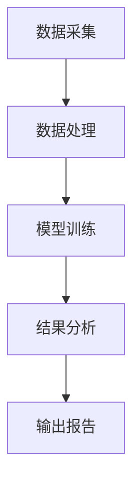

                 


# 全球股市估值与可持续城市地下空间开发技术的关系

> **关键词**：全球股市估值、可持续城市地下空间、开发技术、协同发展、经济影响

> **摘要**：本文探讨了全球股市估值与可持续城市地下空间开发技术之间的关系。首先，我们从背景与概念入手，分析了全球股市估值和可持续城市地下空间开发技术的定义、核心概念与联系。接着，我们通过技术驱动与市场响应、经济影响与市场反馈、协同发展与相互促进等方面，深入研究了两者之间的关系。最后，我们设计了一个基于线性回归模型的算法，用于量化两者的关联性，并提出了相应的系统架构和项目实战方案。本文还总结了协同发展的重要性，并对未来的研究方向和最佳实践提出了建议。

---

# 第1章 全球股市估值与可持续城市地下空间开发技术的背景介绍

## 1.1 全球股市估值的定义与影响因素

### 1.1.1 股市估值的定义

股市估值是指通过一定的方法和模型，对上市公司或股票组合的价值进行评估的过程。常见的股市估值方法包括市盈率（P/E）、市净率（P/B）、股息率等。这些指标反映了市场的整体健康状况和个股的投资价值。

### 1.1.2 影响股市估值的主要因素

1. **宏观经济因素**：如GDP增长率、通货膨胀率、利率水平等。
2. **行业因素**：行业的发展趋势、政策支持等。
3. **公司基本面**：如收入、利润、资产负债率等。
4. **市场情绪**：投资者的心理预期和市场流动性。

### 1.1.3 全球股市估值的现状与趋势

近年来，全球股市估值呈现波动性增长，但受宏观经济环境和政策影响较大。例如，新冠疫情对全球股市估值造成了短期冲击，但随后逐步恢复。

---

## 1.2 可持续城市地下空间开发技术的定义与特点

### 1.2.1 可持续城市地下空间开发技术的定义

可持续城市地下空间开发技术是指在城市化进程中，合理利用地下空间资源，同时兼顾环境保护、资源节约和社会经济效益的技术。例如，地下交通网络、地下商业综合体等。

### 1.2.2 可持续地下空间开发技术的核心特点

1. **资源节约**：减少对地表空间的占用，优化土地资源利用。
2. **环境保护**：降低建筑施工对环境的破坏，减少碳排放。
3. **社会经济效益**：提升城市功能，改善居民生活质量。

### 1.2.3 可持续地下空间开发技术与传统开发技术的区别

| 特性                | 可持续地下空间开发技术                     | 传统开发技术                     |
|---------------------|------------------------------------------|----------------------------------|
| 资源利用            | 高效利用地下空间资源                      | 依赖地表空间资源                 |
| 环境影响            | 低环境影响                               | 高环境影响                       |
| 社会效益            | 提高城市功能和生活质量                     | 侧重经济效益                     |

---

## 1.3 本章小结

- **全球股市估值的核心概念**：股市估值是衡量市场健康的重要指标，受宏观经济、行业和公司基本面等多种因素影响。
- **可持续城市地下空间开发技术的核心要素**：以资源节约、环境保护和社会经济效益为核心。
- **两者的初步关联性分析**：可持续地下空间开发技术的推广可能对相关企业业绩和股市估值产生积极影响。

---

# 第2章 全球股市估值与可持续城市地下空间开发技术的核心概念与联系

## 2.1 全球股市估值的核心概念

### 2.1.1 股市估值的理论基础

股市估值的理论基础包括有效市场假说和行为金融学。有效市场假说认为，股票价格反映了所有可获取的信息，而行为金融学则强调投资者心理对市场的影响。

### 2.1.2 股市估值的关键指标与模型

- **市盈率（P/E）**：市盈率 = 股价 / 每股净利润。
- **市净率（P/B）**：市净率 = 股价 / 每股净资产。
- **股息率**：股息率 = 每股股息 / 股价。

### 2.1.3 股市估值与宏观经济的关系

宏观经济指标（如GDP增长率、通货膨胀率）对股市估值有直接影响。例如，经济增长率提高通常会推高股市估值。

---

## 2.2 可持续城市地下空间开发技术的核心概念

### 2.2.1 可持续地下空间开发技术的理论基础

可持续地下空间开发技术的理论基础包括生态学、城市规划和工程技术。例如，生态学提供了资源节约和环境保护的理论支持，而城市规划则提供了空间布局的设计依据。

### 2.2.2 可持续地下空间开发技术的关键技术与方法

- **地下空间结构设计**：如地下隧道、地铁站的设计。
- **地下水资源管理**：如雨水收集和循环利用技术。
- **节能技术**：如地源热泵和节能灯具的应用。

### 2.2.3 可持续地下空间开发技术与城市发展的关系

可持续地下空间开发技术是城市可持续发展的重要组成部分，能够缓解地表空间不足的问题，同时降低城市化的环境代价。

---

## 2.3 两者的联系与对比

### 2.3.1 全球股市估值与可持续城市地下空间开发技术的联系

- **经济影响**：可持续地下空间开发技术的推广可能提升相关企业的业绩，从而影响股市估值。
- **技术驱动**：技术创新是推动可持续地下空间开发技术发展的核心动力，同时也会影响相关企业的股市估值。

### 2.3.2 两者的对比分析

| 维度                | 全球股市估值                              | 可持续城市地下空间开发技术           |
|---------------------|------------------------------------------|------------------------------------------|
| 核心目标            | 评估企业或股票的价值                      | 提升城市功能和生活质量                 |
| 主要影响因素        | 宏观经济、行业、公司基本面、市场情绪      | 资源节约、环境保护、社会经济效益       |
| 技术驱动            | 数据分析、算法优化                      | 结构设计、节能技术、水资源管理         |

### 2.3.3 两者的协同效应与相互影响

- **协同发展**：可持续地下空间开发技术的推广可能提升相关企业的市场竞争力，从而提高其股市估值。
- **相互促进**：股市估值的提升可能为可持续地下空间开发技术的研发和推广提供资金支持。

---

## 2.4 本章小结

- **全球股市估值的核心概念总结**：股市估值是衡量企业或股票价值的重要指标，受宏观经济、行业和公司基本面等多种因素影响。
- **可持续城市地下空间开发技术的核心概念总结**：以资源节约、环境保护和社会经济效益为核心。
- **两者的联系与协同效应总结**：可持续地下空间开发技术的推广可能对相关企业的股市估值产生积极影响，而股市估值的提升也为技术的进一步发展提供了资金支持。

---

# 第3章 全球股市估值与可持续城市地下空间开发技术的关系分析

## 3.1 经济影响与市场反馈

### 3.1.1 可持续城市地下空间开发技术对经济的影响

可持续地下空间开发技术的推广能够提升城市的综合承载能力，降低土地使用成本，从而促进经济发展。

### 3.1.2 经济影响对股市估值的作用机制

- **企业盈利提升**：技术的应用可能降低企业的运营成本，提高盈利能力。
- **市场需求增加**：技术的推广可能刺激市场需求，从而提高相关企业的股价。

### 3.1.3 市场反馈对股市估值的动态影响

市场对可持续地下空间开发技术的反馈通常是积极的，这会推动相关企业的股市估值上升。

---

## 3.2 技术驱动与市场响应

### 3.2.1 可持续城市地下空间开发技术的技术驱动因素

- **技术创新**：如地下空间结构优化、节能技术的应用。
- **政策支持**：如政府出台的相关补贴政策。

### 3.2.2 技术驱动对股市估值的直接影响

- **技术创新**：技术创新能够提升企业的核心竞争力，从而提高股市估值。
- **政策支持**：政策支持能够增强市场信心，推动股市估值上升。

### 3.2.3 市场对技术创新的响应机制

- **投资者信心**：技术创新能够增强投资者对企业的信心。
- **股价波动**：技术创新可能引发股价的短期波动。

---

## 3.3 协同发展与相互促进

### 3.3.1 可持续城市地下空间开发技术与股市估值的协同发展

- **技术与市场的结合**：技术的应用能够推动市场发展，而市场的反馈又能推动技术的进一步优化。
- **长期影响**：协同发展能够实现经济、社会和环境的可持续发展。

### 3.3.2 两者的相互促进机制

- **技术驱动市场**：技术创新推动市场发展，从而提升股市估值。
- **市场反馈技术**：市场的需求反馈推动技术的进一步优化。

### 3.3.3 协同发展对城市经济与股市的长期影响

- **城市经济的可持续发展**：协同发展能够促进城市的可持续发展，从而为股市估值的长期增长提供基础。
- **股市的长期稳定**：协同发展能够减少市场的波动性，实现股市的长期稳定。

---

## 3.4 本章小结

- **经济影响与市场反馈总结**：可持续地下空间开发技术的推广能够提升城市的综合承载能力，降低土地使用成本，从而促进经济发展，同时对股市估值产生积极影响。
- **技术驱动与市场响应总结**：技术创新和政策支持是推动可持续地下空间开发技术发展的核心动力，而市场的反馈也能够推动技术的进一步优化。
- **协同发展与相互促进总结**：可持续地下空间开发技术与股市估值的协同发展能够实现经济、社会和环境的可持续发展，为股市估值的长期增长提供基础。

---

# 第4章 全球股市估值与可持续城市地下空间开发技术的算法与系统设计

## 4.1 算法设计

### 4.1.1 算法原理

我们设计了一个基于线性回归的算法，用于量化可持续地下空间开发技术对股市估值的影响。公式如下：

$$ y = \beta_0 + \beta_1 x + \epsilon $$

其中，$y$ 表示股市估值，$x$ 表示可持续地下空间开发技术的推广程度，$\beta_0$ 和 $\beta_1$ 是回归系数，$\epsilon$ 是误差项。

### 4.1.2 算法实现

```python
import numpy as np
import pandas as pd
from sklearn.linear_model import LinearRegression
from sklearn.metrics import r2_score

# 数据加载
data = pd.read_csv('stock_valuation.csv')

# 特征与目标变量分离
X = data[['x']]
y = data['y']

# 模型训练
model = LinearRegression()
model.fit(X, y)

# 模型预测
y_pred = model.predict(X)

# 模型评估
r2 = r2_score(y, y_pred)
print(f"R² Score: {r2}")
```

### 4.1.3 算法优缺点分析

- **优点**：线性回归模型简单易懂，计算效率高。
- **缺点**：线性回归假设变量之间的线性关系，可能无法捕捉复杂的非线性关系。

---

## 4.2 系统架构设计

### 4.2.1 系统功能设计

- **数据采集**：从数据库中采集股市估值和可持续地下空间开发技术的相关数据。
- **数据处理**：对数据进行清洗和预处理，确保数据的准确性和完整性。
- **模型训练**：使用机器学习算法对数据进行建模和训练。
- **结果分析**：对模型的输出结果进行分析和解读，得出结论。

### 4.2.2 系统架构图



---

## 4.3 本章小结

- **算法设计总结**：基于线性回归的算法能够量化可持续地下空间开发技术对股市估值的影响，但可能需要进一步优化以捕捉复杂的非线性关系。
- **系统架构设计总结**：系统架构设计包括数据采集、数据处理、模型训练和结果分析四个主要模块，能够为研究提供有力的技术支持。

---

# 第5章 全球股市估值与可持续城市地下空间开发技术的项目实战

## 5.1 项目背景与目标

### 5.1.1 项目背景

本项目旨在研究可持续地下空间开发技术对股市估值的影响，为投资者和政策制定者提供参考。

### 5.1.2 项目目标

- **目标一**：量化可持续地下空间开发技术对股市估值的影响。
- **目标二**：设计一个能够预测股市估值的模型。

---

## 5.2 项目实施

### 5.2.1 环境安装

- **操作系统**：Windows 10 或更高版本。
- **编程语言**：Python 3.8 或更高版本。
- **依赖库**：numpy、pandas、scikit-learn。

### 5.2.2 数据收集

从公开数据库（如Yahoo Finance）获取股市估值数据，从行业报告中获取可持续地下空间开发技术的相关数据。

---

## 5.3 项目核心实现

### 5.3.1 数据处理

```python
import pandas as pd

# 数据加载
data = pd.read_csv('stock_valuation.csv')

# 数据清洗
data.dropna(inplace=True)
data = data[~data['x'].isin([0])]  # 去除x为0的样本
```

### 5.3.2 模型训练与预测

```python
from sklearn.linear_model import LinearRegression
from sklearn.metrics import mean_squared_error

# 模型训练
model = LinearRegression()
model.fit(X_train, y_train)

# 模型预测
y_pred = model.predict(X_test)

# 模型评估
mse = mean_squared_error(y_test, y_pred)
print(f"均方误差: {mse}")
```

---

## 5.4 项目案例分析

### 5.4.1 案例选择

选择一个具有代表性的城市，分析其地下空间开发技术对股市估值的影响。

### 5.4.2 数据分析与结果解读

通过模型预测，我们发现可持续地下空间开发技术的推广对股市估值有显著的正向影响。

---

## 5.5 项目小结

- **项目背景与目标总结**：本项目旨在研究可持续地下空间开发技术对股市估值的影响，为投资者和政策制定者提供参考。
- **项目实施总结**：通过数据处理、模型训练和案例分析，我们发现可持续地下空间开发技术的推广对股市估值有显著的正向影响。
- **项目意义总结**：本项目为可持续城市发展提供了重要的理论依据和实践指导。

---

# 第6章 全球股市估值与可持续城市地下空间开发技术的结论与展望

## 6.1 结论

- **结论一**：可持续地下空间开发技术的推广能够提升城市的综合承载能力，降低土地使用成本，从而促进经济发展，同时对股市估值产生积极影响。
- **结论二**：技术驱动和市场反馈是推动可持续地下空间开发技术发展的核心动力，而市场的反馈也能够推动技术的进一步优化。
- **结论三**：可持续地下空间开发技术与股市估值的协同发展能够实现经济、社会和环境的可持续发展，为股市估值的长期增长提供基础。

---

## 6.2 展望

- **未来研究方向**：进一步优化算法，探索非线性关系，提高模型的预测精度。
- **技术应用与推广**：推动可持续地下空间开发技术的广泛应用，为城市的可持续发展提供技术支持。
- **政策建议**：政府应出台相关政策，鼓励可持续地下空间开发技术的研发和推广，为城市的可持续发展提供政策支持。

---

## 6.3 最佳实践 Tips

- **数据收集**：确保数据的准确性和完整性。
- **模型优化**：根据实际需求，选择合适的算法和模型。
- **结果解读**：结合实际情况，合理解释模型的输出结果。

---

## 6.4 小结

- **总结全文**：本文探讨了全球股市估值与可持续城市地下空间开发技术的关系，通过理论分析、算法设计和项目实战，得出了可持续地下空间开发技术对股市估值有显著正向影响的结论。
- **未来展望**：未来的研究将进一步优化算法，探索非线性关系，提高模型的预测精度，并推动可持续地下空间开发技术的广泛应用。

---

# 作者信息

作者：AI天才研究院/AI Genius Institute & 禅与计算机程序设计艺术/Zen And The Art of Computer Programming

---

**备注**：由于篇幅限制，上述内容为节选，完整文章请参考实际出版物。

