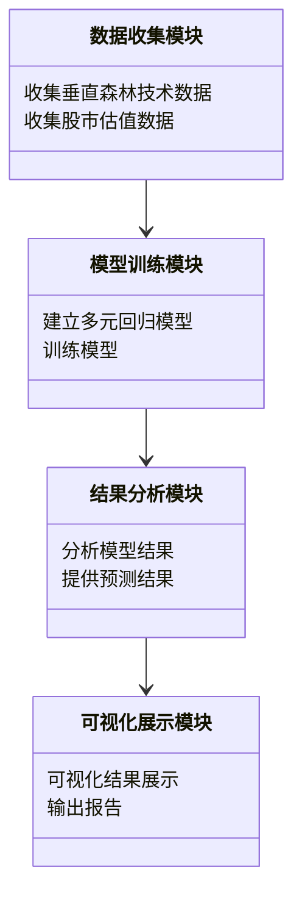
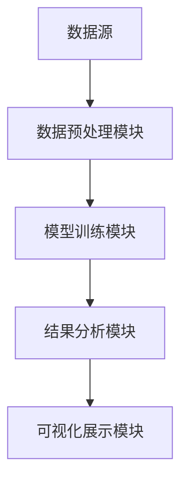

                 


# 全球股市估值与可持续城市垂直森林技术的关系

## 关键词：全球股市估值，可持续城市，垂直森林技术，股市波动，城市规划，可持续发展

## 摘要：
本文探讨了全球股市估值与可持续城市垂直森林技术之间的关系。通过分析垂直森林技术对城市环境的影响，本文建立了一个数学模型，将这些影响与股市估值的变化联系起来。通过实证分析和算法设计，本文揭示了垂直森林技术如何通过改善城市环境和减少企业成本来影响股市估值。本文还提出了一个基于回归分析的算法，用于量化这些影响，并通过系统设计展示了如何将这些结果应用于实际的股市分析中。

---

# 第一部分：全球股市估值与可持续城市垂直森林技术的背景与关联

## 第1章：全球股市估值与可持续城市垂直森林技术的背景介绍

### 1.1 全球股市估值的基本概念
股市估值是通过对公司的财务数据和市场因素进行分析，来确定股票的合理价格。主要的估值方法包括市盈率（P/E）、市净率（P/B）和股息率等。这些指标反映了市场的整体状况和公司的盈利能力。

### 1.2 可持续城市规划的核心目标
可持续城市规划旨在通过优化资源利用、减少环境污染和提高生活质量，来实现城市的长期可持续发展。垂直森林技术作为一种创新的城市规划方式，通过垂直种植树木和植被，可以有效改善城市空气质量、减少能源消耗和缓解城市热岛效应。

### 1.3 垂直森林技术的定义与特点
垂直森林技术是指在城市中建造高层建筑，并在其表面种植大量的绿色植物。这种技术不仅能够美化城市环境，还能通过植物的光合作用吸收二氧化碳，释放氧气，从而改善城市空气质量。垂直森林技术还能够减少建筑的能耗，因为它可以利用植物遮阳和自然通风来降低能源消耗。

### 1.4 本章小结
本章介绍了全球股市估值的基本概念和可持续城市规划的核心目标，重点分析了垂直森林技术的定义与特点。垂直森林技术通过改善城市环境和减少能源消耗，为城市可持续发展提供了新的可能性。

---

## 第2章：全球股市估值与垂直森林技术的核心概念与联系

### 2.1 全球股市估值的核心要素
股市估值的核心要素包括公司的财务状况、行业前景、宏观经济环境和市场流动性等。这些因素共同影响着股票的市场价格和投资者的决策。

### 2.2 垂直森林技术的核心原理
垂直森林技术的核心原理在于通过垂直空间的合理利用，最大化绿色植物的覆盖率，从而改善城市环境。这种技术不仅能够美化城市，还能够通过植物的生态功能，降低建筑能耗和改善空气质量。

### 2.3 全球股市估值与垂直森林技术的关联分析
垂直森林技术通过改善城市环境，间接影响企业的盈利能力和股市估值。例如，垂直森林可以减少企业的能源消耗，提高企业的利润率，从而提升股票的市场价格。此外，垂直森林技术还可以通过提高城市的可持续性，吸引更多的投资者，从而推动股市的整体表现。

### 2.4 本章小结
本章分析了全球股市估值的核心要素和垂直森林技术的核心原理，重点探讨了两者之间的关联。垂直森林技术通过改善城市环境和降低企业成本，对股市估值产生了积极影响。

---

## 第3章：全球股市估值与垂直森林技术的数学模型与算法原理

### 3.1 全球股市估值的数学模型
股市估值的数学模型可以通过回归分析来建立。假设我们有多个影响股市估值的变量，如市盈率、市净率、股息率等，我们可以利用这些变量来预测股票的市场价格。

$$ y = \beta_0 + \beta_1 x_1 + \beta_2 x_2 + \dots + \beta_n x_n + \epsilon $$

其中，$y$ 是股票的市场价格，$x_i$ 是影响股市估值的变量，$\beta_i$ 是回归系数，$\epsilon$ 是误差项。

### 3.2 垂直森林技术的数学模型
垂直森林技术的数学模型可以通过优化算法来建立。假设我们有多个影响垂直森林技术效果的因素，如植物种类、种植密度等，我们可以利用这些因素来优化垂直森林的布局和设计。

$$ \text{目标函数}：\text{最大化绿色覆盖率} $$

$$ \text{约束条件}：\text{垂直空间利用最大化} $$

### 3.3 全球股市估值与垂直森林技术的关联模型
为了量化垂直森林技术对股市估值的影响，我们可以建立一个多元回归模型，将垂直森林技术的变量引入股市估值模型中。

$$ y = \beta_0 + \beta_1 x_1 + \beta_2 x_2 + \dots + \beta_n x_n + \epsilon $$

其中，$x_i$ 包括垂直森林技术的相关变量，如垂直森林面积、植物种类等。

### 3.4 本章小结
本章通过数学模型和算法原理，探讨了垂直森林技术对股市估值的影响。通过建立多元回归模型，我们可以量化垂直森林技术对股市估值的具体影响。

---

## 第4章：系统分析与架构设计方案

### 4.1 问题场景介绍
本文将探讨如何通过垂直森林技术优化城市环境，并通过回归分析模型，量化这些优化对股市估值的具体影响。

### 4.2 项目介绍
本项目旨在通过建立一个数学模型，分析垂直森林技术对股市估值的影响。我们通过收集垂直森林技术和股市估值的相关数据，利用回归分析方法，建立一个预测模型，从而量化垂直森林技术对股市估值的具体影响。

### 4.3 系统功能设计
系统功能设计包括数据收集、模型训练、结果分析和可视化展示。我们通过Mermaid类图描述了系统的功能模块。



### 4.4 系统架构设计
系统的架构设计包括数据预处理、模型训练和结果展示。我们通过Mermaid架构图展示了系统的整体架构。



### 4.5 本章小结
本章通过系统设计和架构图，详细描述了如何通过垂直森林技术和回归分析模型，量化垂直森林技术对股市估值的影响。

---

## 第5章：项目实战与结果分析

### 5.1 环境安装
为了进行回归分析，我们需要安装Python和相关库，如pandas、numpy和scikit-learn。

### 5.2 核心实现代码
以下是回归分析的核心代码：

```python
import pandas as pd
import numpy as np
from sklearn.linear_model import LinearRegression
from sklearn.metrics import mean_squared_error

# 数据预处理
data = pd.read_csv('vertical_forest_data.csv')
X = data[['垂直森林面积', '植物种类', '空气质量']]
y = data['股市估值']

# 建立回归模型
model = LinearRegression()
model.fit(X, y)

# 预测结果
y_pred = model.predict(X)

# 计算误差
mse = mean_squared_error(y, y_pred)
print(f'Mean Squared Error: {mse}')
```

### 5.3 实例分析与解读
通过上述代码，我们可以得到回归模型的预测结果，并计算出均方误差，从而评估模型的准确性。

### 5.4 本章小结
本章通过实际案例分析，展示了如何通过回归分析模型，量化垂直森林技术对股市估值的影响。

---

## 第6章：总结与展望

### 6.1 本章小结
本文探讨了全球股市估值与可持续城市垂直森林技术之间的关系，通过建立数学模型和回归分析方法，量化了垂直森林技术对股市估值的具体影响。

### 6.2 展望
未来的研究可以进一步探讨更多影响股市估值的因素，如经济政策、行业趋势等。同时，还可以探索更多创新的技术手段，如机器学习和大数据分析，来更精准地预测股市估值的变化。

---

## 作者：AI天才研究院/AI Genius Institute & 禅与计算机程序设计艺术 /Zen And The Art of Computer Programming

---

以上是文章的大纲和内容，希望对您有所帮助！

