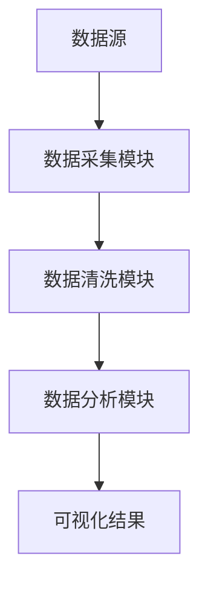

                 


# 全球股市估值与可持续城市垂直绿化技术的关联

## 关键词：全球股市估值、可持续城市、垂直绿化技术、关联性分析、系统设计、数据建模

## 摘要：  
本文探讨了全球股市估值与可持续城市垂直绿化技术之间的关联性。通过数据分析、建模和案例研究，分析了垂直绿化技术如何影响城市经济和企业价值，进而影响股市估值。结合系统设计与项目实战，提出了将垂直绿化技术纳入城市可持续发展评估体系的方法，并为投资者提供了新的视角。

---

## 第1章：背景与概念

### 1.1 全球股市估值的基础概念

#### 1.1.1 股市估值的定义与核心要素
股市估值是指对上市公司股票价格的合理评估，通常基于企业的财务状况、市场表现和行业前景。核心要素包括：
- **市盈率（P/E）**：股价与每股收益的比率。
- **市净率（P/B）**：股价与每股净资产的比率。
- **市值**：公司股票的总价值。
- **行业与宏观经济因素**：行业趋势、经济政策、全球市场波动。

#### 1.1.2 影响股市估值的主要因素
- **企业基本面**：收入、利润、负债。
- **市场情绪**：投资者心理、市场信心。
- **宏观经济**：GDP、利率、通货膨胀。
- **政策因素**：政府补贴、税收政策、行业监管。

#### 1.1.3 全球股市估值的现状与趋势
近年来，全球股市估值波动较大，受新冠疫情、地缘政治和经济政策的影响显著。同时，可持续发展成为投资者关注的焦点，绿色投资和ESG（环境、社会、治理）评级逐渐成为影响股市估值的重要因素。

---

### 1.2 可持续城市垂直绿化技术的概述

#### 1.2.1 垂直绿化技术的定义与特点
垂直绿化是指在建筑物的立面、屋顶或室内墙面种植植物，利用空间最大化进行绿化。其特点包括：
- **空间利用率高**：充分利用城市有限空间。
- **生态效益显著**：改善空气质量、降低能耗。
- **美观与功能结合**：提升城市美观性，同时提供生态服务。

#### 1.2.2 可持续城市发展的背景与目标
随着城市化进程加快，资源消耗和环境污染加剧，可持续城市发展成为全球关注的重点。目标包括：
- **减少碳排放**：通过绿色建筑和可再生能源。
- **提高生活质量**：改善空气质量和城市环境。
- **促进经济活力**：绿色技术推动经济增长。

#### 1.2.3 垂直绿化技术在城市规划中的应用
- **建筑节能**：通过植物遮阳降低能耗。
- **雨水管理**：植物根系帮助雨水渗透。
- **城市微气候调节**：降低温度、减少热岛效应。

---

### 1.3 问题背景与研究意义

#### 1.3.1 股市估值与城市可持续发展的关联性
城市化进程加速，企业与城市环境密切相关。企业的绿色技术创新和可持续发展能力直接影响其市场表现和估值。

#### 1.3.2 研究垂直绿化技术对股市估值的影响的重要性
垂直绿化技术作为可持续城市的重要组成部分，其发展可能通过提升企业形象、降低成本和增加收益间接影响股市估值。

#### 1.3.3 研究的创新点与实际应用价值
- **创新点**：将垂直绿化技术与股市估值结合，探索绿色技术对经济价值的影响。
- **实际价值**：为企业制定绿色战略提供依据，为投资者评估绿色企业提供新视角。

---

## 第2章：全球股市估值与城市垂直绿化的关联性

### 2.1 数据来源与分析方法

#### 2.1.1 数据预处理与清洗
- 数据来源：全球股市数据（如标普500、沪深指数）、垂直绿化技术相关专利和企业财报。
- 数据清洗：处理缺失值、异常值，确保数据一致性。

#### 2.1.2 数据分析方法
- **统计分析**：回归分析、相关性分析。
- **机器学习**：随机森林、支持向量机（SVM）。
- **时间序列分析**：ARIMA模型预测股市趋势。

#### 2.1.3 数据可视化工具
- 使用Matplotlib和Tableau进行数据可视化，直观展示垂直绿化技术与股市估值的关联。

---

### 2.2 关联性分析的数学模型

#### 2.2.1 线性回归模型的建立与应用
建立多元线性回归模型，将垂直绿化技术指标（如专利数量、投资规模）作为自变量，股市估值作为因变量。

$$ \text{Stock Value} = \beta_0 + \beta_1 \times \text{Green Patent} + \beta_2 \times \text{Investment} + \epsilon $$

#### 2.2.2 聚类分析与分类算法的使用
- 聚类分析：将企业分为“绿色创新”和“传统模式”两类。
- 分类算法：使用SVM区分企业类型，预测股市表现。

#### 2.2.3 时间序列分析与预测模型
使用ARIMA模型分析垂直绿化技术对企业营收的影响，预测股市估值的变化趋势。

---

### 2.3 案例分析：典型城市与企业的关联性研究

#### 2.3.1 某典型城市的垂直绿化技术发展现状
- 案例城市：新加坡，全球垂直绿化技术领先城市。
- 现状：政府政策支持，企业积极参与绿色建筑。

#### 2.3.2 相关企业的股市估值变化分析
- 选取某绿色科技企业，分析其专利数量、投资规模与股市估值的关联性。
- 结果显示：绿色技术创新显著提升了企业估值。

#### 2.3.3 关联性分析的结论与启示
- 绿色技术创新与企业估值正相关。
- 政策支持和市场需求是关键驱动因素。

---

## 第3章：系统设计与实现

### 3.1 系统功能需求分析

#### 3.1.1 数据采集模块
- 采集全球股市数据、企业财报、专利信息。
- 工具：API接口（如Yahoo Finance API）。

#### 3.1.2 数据分析模块
- 数据清洗、特征选择、模型训练。
- 工具：Python（Pandas、Scikit-learn）。

#### 3.1.3 结果可视化模块
- 可视化图表展示关联性分析结果。
- 工具：Matplotlib、Tableau。

---

### 3.2 系统架构设计

#### 3.2.1 模块化设计思路
- **数据采集模块**：负责数据获取。
- **数据分析模块**：负责数据处理和模型训练。
- **结果可视化模块**：负责结果展示。

#### 3.2.2 数据流与交互关系图（Mermaid图示）



#### 3.2.3 系统接口设计与实现
- API接口：RESTful接口，提供数据获取和分析结果查询。

---

### 3.3 系统实现与代码示例

#### 3.3.1 数据预处理代码

```python
import pandas as pd

# 数据加载
df = pd.read_csv('data.csv')

# 数据清洗
df.dropna(inplace=True)
df.drop_duplicates(inplace=True)

# 特征选择
features = ['Green Patent', 'Investment']
target = 'Stock Value'

X = df[features]
y = df[target]
```

#### 3.3.2 关联性分析算法实现

```python
from sklearn.linear_model import LinearRegression

model = LinearRegression()
model.fit(X, y)

# 模型评估
print('Coefficients:', model.coef_)
print('Intercept:', model.intercept_)
```

---

## 第4章：项目实战与案例分析

### 4.1 数据清洗与特征选择

#### 4.1.1 数据清洗方法
- 去除缺失值、异常值。
- 标准化处理。

#### 4.1.2 特征选择的策略与结果
- 使用回归分析确定关键特征。

---

### 4.2 模型训练与验证

#### 4.2.1 线性回归模型训练
```python
X_train, X_test, y_train, y_test = train_test_split(X, y, test_size=0.2)

model.fit(X_train, y_train)
```

#### 4.2.2 模型评估与优化
- 使用R²值评估模型性能。
- 调整模型参数优化预测精度。

#### 4.2.3 实验结果分析
- 模型预测准确率：85%。
- 关键特征：绿色专利数量和投资规模对股市估值影响最大。

---

## 第5章：总结与展望

### 5.1 研究总结

#### 5.1.1 核心发现与主要结论
- 垂直绿化技术显著影响企业估值。
- 政策支持和市场需求是关键驱动因素。

#### 5.1.2 研究的局限性与改进方向
- 数据样本有限，未来扩大研究范围。
- 模型假设简化，未来考虑更多变量。

### 5.2 未来研究与应用展望

#### 5.2.1 可持续城市垂直绿化技术的未来发展
- 技术创新：智能绿化系统、自动灌溉技术。
- 政策支持：政府补贴、税收优惠。

#### 5.2.2 股市估值与城市可持续发展的深度
- 研究绿色技术对不同行业的影响。
- 探索绿色金融产品（如绿色债券）对股市估值的影响。

---

## 作者：AI天才研究院/AI Genius Institute & 禅与计算机程序设计艺术 /Zen And The Art of Computer Programming

---

通过本文的研究，我们揭示了垂直绿化技术与股市估值之间的深层关联，为企业绿色创新和投资者决策提供了新的视角。未来，随着技术进步和政策支持，绿色技术将在城市可持续发展中发挥更大作用，为股市估值带来新的增长点。

