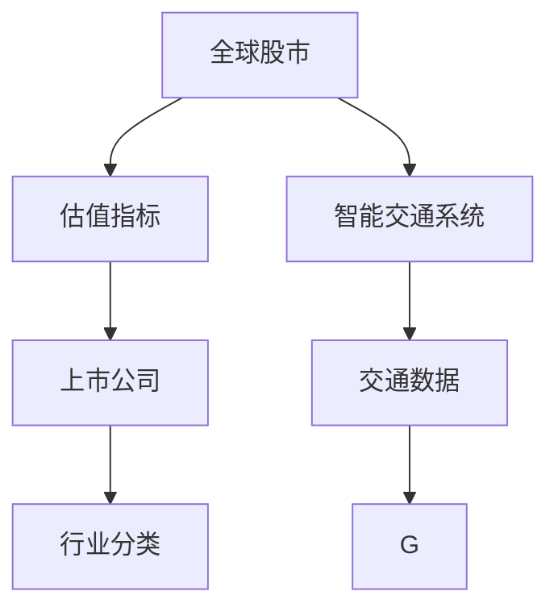
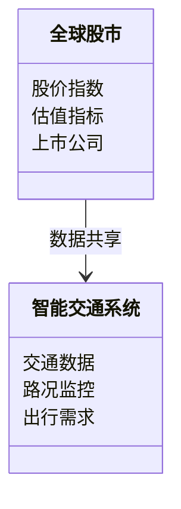
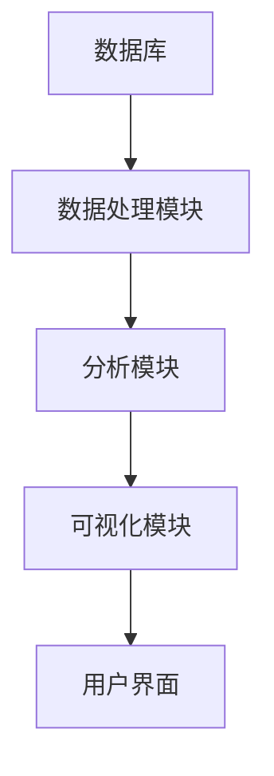
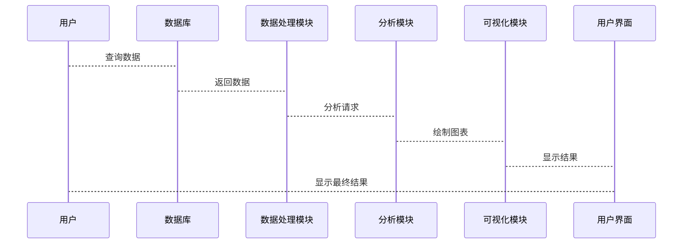

                 


# 第一部分: 全球股市估值与可持续城市智能交通系统的背景与概念

## 第1章: 背景介绍

### 1.1 问题背景
#### 1.1.1 全球化经济与股市的重要性
#### 1.1.2 城市化进程与智能交通系统的必要性
#### 1.1.3 可持续发展与智能交通的关联

### 1.2 问题描述
#### 1.2.1 全球股市估值的定义与影响
#### 1.2.2 智能交通系统的定义与特征
#### 1.2.3 两者关系的研究现状

### 1.3 问题解决
#### 1.3.1 全球股市估值的核心指标
#### 1.3.2 智能交通系统的优化目标
#### 1.3.3 两者关系的初步假设

### 1.4 边界与外延
#### 1.4.1 全球股市估值的适用范围
#### 1.4.2 智能交通系统的边界条件
#### 1.4.3 两者关系的外部影响

### 1.5 核心概念结构与组成
#### 1.5.1 全球股市估值的构成要素
#### 1.5.2 智能交通系统的组成模块
#### 1.5.3 两者关系的核心要素

---

# 第二部分: 全球股市估值与智能交通系统的核心概念与联系

## 第2章: 全球股市估值的理论与实践

### 2.1 核心概念原理
#### 2.1.1 股市估值的基本原理
#### 2.1.2 主要估值方法（PE、PB、DCF等）
#### 2.1.3 影响股市估值的关键因素

### 2.2 核心概念属性对比
#### 2.2.1 股市估值的属性特征
#### 2.2.2 智能交通系统的属性特征
#### 2.2.3 两者属性的对比分析

### 2.3 ER实体关系图


---

## 第3章: 智能交通系统的构建与应用

### 3.1 智能交通系统的技术架构
#### 3.1.1 智能交通系统的定义
#### 3.1.2 系统的关键技术
#### 3.1.3 系统的组成部分

### 3.2 智能交通系统的应用场景
#### 3.2.1 城市交通管理
#### 3.2.2 智能公交调度
#### 3.2.3 无人驾驶与共享出行

### 3.3 智能交通系统的优化目标
#### 3.3.1 提高交通效率
#### 3.3.2 减少碳排放
#### 3.3.3 提升出行体验

---

## 第4章: 两者关系的分析与建模

### 4.1 全球股市估值对智能交通系统的影响
#### 4.1.1 股市资金流向对智能交通技术发展的推动作用
#### 4.1.2 投资者对智能交通企业的信心与股价的关系
#### 4.1.3 股市波动对智能交通项目融资的影响

### 4.2 智能交通系统对股市估值的反向影响
#### 4.2.1 智能交通技术进步对相关企业业绩的提升作用
#### 4.2.2 智能交通系统的广泛应用对整体经济环境的改善
#### 4.2.3 智能交通系统的成本与收益对股市估值的影响

### 4.3 综合分析与数学建模
#### 4.3.1 建立两者关系的数学模型
#### 4.3.2 使用多元回归分析方法进行实证分析
#### 4.3.3 通过神经网络模型预测未来趋势

---

## 第5章: 系统设计与实现

### 5.1 问题场景描述
#### 5.1.1 全球股市数据的获取与处理
#### 5.1.2 智能交通系统的数据采集与分析
#### 5.1.3 系统的集成与优化

### 5.2 系统设计
#### 5.2.1 领域模型设计


#### 5.2.2 系统架构设计


#### 5.2.3 接口设计与交互


---

## 第6章: 项目实战与案例分析

### 6.1 项目环境与工具安装
#### 6.1.1 数据获取工具（如Python的pandas库）
#### 6.1.2 数据可视化工具（如Matplotlib或Seaborn）
#### 6.1.3 模型训练工具（如TensorFlow或PyTorch）

### 6.2 核心代码实现
#### 6.2.1 数据清洗与预处理
```python
import pandas as pd
data = pd.read_csv('data.csv')
data_clean = data.dropna()
```

#### 6.2.2 模型训练与评估
```python
from sklearn.linear_model import LinearRegression
model = LinearRegression()
model.fit(X_train, y_train)
score = model.score(X_test, y_test)
```

#### 6.2.3 结果可视化
```python
import matplotlib.pyplot as plt
plt.scatter(X_test, y_test)
plt.plot(X_test, model.predict(X_test), color='red')
plt.show()
```

### 6.3 案例分析
#### 6.3.1 某城市智能交通系统实施前后对比
#### 6.3.2 对应的股市估值变化分析
#### 6.3.3 实证结果与理论模型的吻合度

### 6.4 项目小结
#### 6.4.1 项目成果总结
#### 6.4.2 项目中的问题与解决方案
#### 6.4.3 项目经验与教训

---

## 第7章: 最佳实践与小结

### 7.1 最佳实践
#### 7.1.1 数据采集与处理的注意事项
#### 7.1.2 模型选择与调优的建议
#### 7.1.3 系统设计与实现的优化技巧

### 7.2 小结
#### 7.2.1 全文总结
#### 7.2.2 对未来研究的展望
#### 7.2.3 对读者的建议

---

# 作者：AI天才研究院/AI Genius Institute & 禅与计算机程序设计艺术 /Zen And The Art of Computer Programming

