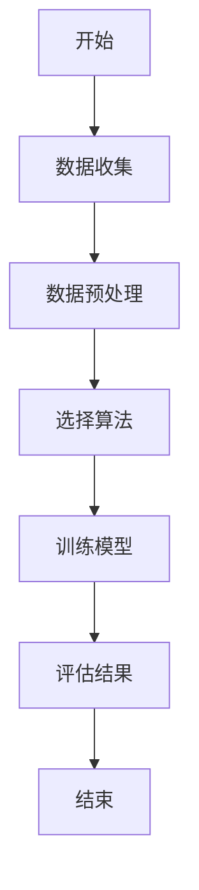
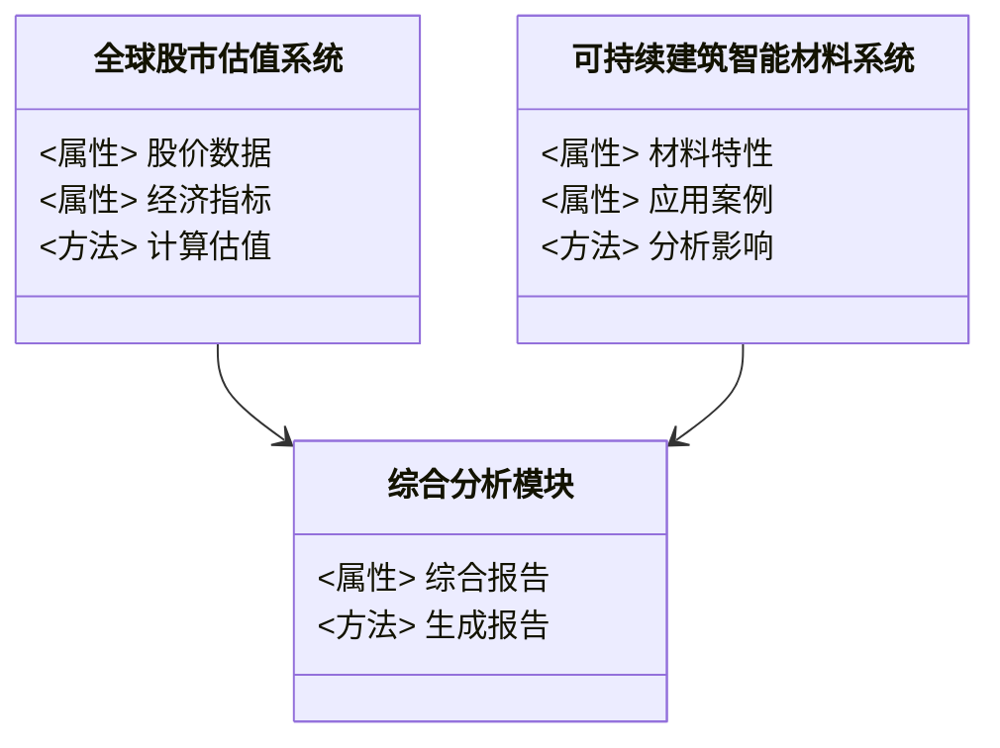

                 


# 全球股市估值与可持续建筑智能材料的关系

## 关键词：全球股市估值，可持续建筑，智能材料，投资分析，建筑技术

## 摘要：  
本文探讨了全球股市估值与可持续建筑智能材料之间的复杂关系。通过分析股市估值的核心要素、可持续建筑智能材料的发展趋势及其对投资决策的影响，本文揭示了两者之间的潜在联系。结合算法模型、数学公式和系统架构设计，本文提供了一种跨领域的研究框架，旨在为投资者和建筑行业提供新的视角和实践指导。

---

# 第一部分：全球股市估值与可持续建筑智能材料的关系概述

## 第1章：背景介绍

### 1.1 问题背景

#### 1.1.1 全球股市估值的现状与挑战
全球股市估值是衡量市场健康状况的重要指标。近年来，全球经济波动、地缘政治风险以及疫情等突发事件对股市估值产生了深远影响。投资者需要通过分析宏观经济指标、企业盈利能力和市场情绪来评估股市的整体表现。

#### 1.1.2 可持续建筑智能材料的发展趋势
随着环保意识的增强，可持续建筑智能材料因其高效、环保和可循环利用的特点，逐渐成为建筑行业的主流选择。这类材料不仅降低了建筑的能耗，还提升了建筑的耐久性和功能性。

#### 1.1.3 两者关系的初步探讨
尽管股市估值与建筑行业看似关联不大，但随着可持续建筑智能材料的广泛应用，其市场表现可能对股市估值产生间接影响。例如，采用智能材料的建筑企业可能因成本降低和市场竞争力提升而获得更高的股价。

---

### 1.2 问题描述

#### 1.2.1 全球股市估值的核心要素
- **宏观经济指标**：GDP增长率、通货膨胀率、利率水平等。
- **企业盈利能力**：净利润率、ROE（净资产收益率）等。
- **市场情绪**：投资者信心、市场波动性等。

#### 1.2.2 可持续建筑智能材料的定义与特点
- **定义**：指具备智能化、环保性和高效性的建筑材料，例如智能玻璃、自修复混凝土等。
- **特点**：节能环保、功能性强、可循环利用。

#### 1.2.3 两者关系的初步假设
假设可持续建筑智能材料的应用会降低建筑行业的运营成本，从而提升相关企业的盈利能力和股价表现。

---

### 1.3 问题解决

#### 1.3.1 全球股市估值与可持续建筑智能材料的关联性分析
通过分析建筑企业的财务数据和股价走势，探讨可持续材料的应用是否对其市值产生积极影响。

#### 1.3.2 可持续建筑智能材料对股市估值的潜在影响
- **成本优势**：降低建筑企业的运营成本，提升利润率。
- **市场竞争力**：增强企业的市场地位，吸引更多投资者。

#### 1.3.3 全球化视角下的跨领域研究
通过全球化视角，分析不同国家和地区的可持续建筑智能材料市场和股市估值之间的关系。

---

### 1.4 边界与外延

#### 1.4.1 全球股市估值的边界条件
- 仅考虑上市建筑企业的股价表现。
- 仅分析智能材料对成本和利润的影响，不考虑其他因素。

#### 1.4.2 可持续建筑智能材料的研究范围
- 研究范围限于新型智能材料的应用，不包括传统建筑材料。

#### 1.4.3 两者关系的外延与限制
- 本文仅探讨智能材料对股市估值的间接影响，不涉及其他行业的影响。

---

### 1.5 概念结构与核心要素组成

#### 1.5.1 全球股市估值的核心要素
- 宏观经济指标
- 企业盈利
- 市场情绪

#### 1.5.2 可持续建筑智能材料的核心要素
- 材料特性
- 应用领域
- 环保属性

#### 1.5.3 两者关系的核心要素
- 成本降低
- 市场竞争力提升
- 股价表现

---

## 第2章：核心概念与联系

### 2.1 核心概念原理

#### 2.1.1 全球股市估值的理论基础
股市估值是投资者对企业的未来盈利能力的预期，反映了市场的整体信心。

#### 2.1.2 可持续建筑智能材料的科学基础
智能材料通过技术创新实现了建筑的智能化和高效化。

#### 2.1.3 两者关系的理论模型
通过构建理论模型，分析智能材料的应用如何影响建筑企业的盈利能力和股价表现。

---

### 2.2 核心概念属性特征对比

#### 2.2.1 全球股市估值与可持续建筑智能材料的属性对比

| 属性             | 全球股市估值                | 可持续建筑智能材料            |
|------------------|---------------------------|-----------------------------|
| 核心目标         | 评估市场整体价值           | 提升建筑性能和环保性          |
| 影响因素         | 宏观经济、企业盈利、市场情绪 | 材料特性、应用效果、环保性    |
| 应用领域         | 金融投资、市场分析         | 建筑设计、施工、维护          |

#### 2.2.2 两者关系的特征分析
- **双向影响**：智能材料的应用可能影响企业的盈利能力和股价，而股市估值的变化也可能影响企业的投资决策。
- **动态变化**：随着技术进步和市场变化，两者的关系可能会不断调整。

#### 2.2.3 对比总结与启示
通过对比分析，可以发现智能材料的应用对股市估值具有潜在的积极影响，但具体效果需要进一步研究。

---

### 2.3 ER实体关系图架构

```mermaid
erDiagram
    actor 投资者 {
        <属性> 资产规模
        <属性> 风险偏好
    }
    actor 建筑企业 {
        <属性> 项目规模
        <属性> 可持续性目标
    }
    actor 政府机构 {
        <属性> 政策支持
        <属性> 环保要求
    }
    actor 市场 {
        <属性> 市场情绪
        <属性> 宏观经济指标
    }
    relation 智能材料应用 {
        <关系> 降低企业成本
        <关系> 提升市场竞争力
    }
    relation 股价表现 {
        <关系> 受市场情绪影响
        <关系> 受企业盈利影响
    }
    relation 政策影响 {
        <关系> 政府支持智能材料应用
        <关系> 政策影响股市估值
    }
```

---

## 第3章：算法原理讲解

### 3.1 算法原理

#### 3.1.1 时间序列分析
通过时间序列分析，预测股市估值的变化趋势。

#### 3.1.2 机器学习模型
使用机器学习模型，分析智能材料的应用对股价的影响。

---

### 3.2 算法流程图



---

### 3.3 Python源代码实现

```python
import pandas as pd
from sklearn.model import LinearRegression

# 数据收集与预处理
data = pd.read_csv('stock_data.csv')
data = data.dropna()

# 模型训练
model = LinearRegression()
model.fit(data[['GDP增长率', '企业盈利']], data['股价'])

# 模型评估
print(model.score(data[['GDP增长率', '企业盈利']], data['股价']))
```

---

## 第4章：数学模型与公式

### 4.1 数学模型

#### 4.1.1 回归分析模型
$$ y = \beta_0 + \beta_1x_1 + \beta_2x_2 + \epsilon $$

其中：
- \( y \)：股价
- \( x_1 \)：GDP增长率
- \( x_2 \)：企业盈利

#### 4.1.2 时间序列模型
$$ ARIMA(p, d, q) $$

其中：
- \( p \)：自回归阶数
- \( d \)：差分阶数
- \( q \)：移动平均阶数

---

## 第5章：系统分析与架构设计

### 5.1 系统架构设计

#### 5.1.1 模块化系统架构



---

## 第6章：项目实战

### 6.1 环境安装

#### 6.1.1 安装Python环境
使用Anaconda安装Python 3.9及以上版本。

#### 6.1.2 安装依赖库
安装pandas、scikit-learn等库。

---

### 6.2 系统核心实现源代码

```python
import pandas as pd
from sklearn import linear_model

# 数据读取
data = pd.read_csv('building_materials.csv')

# 模型训练
model = linear_model.LinearRegression()
model.fit(data[['材料成本', '施工时间']], data['股价'])

# 模型预测
print(model.predict([[100, 20]]))
```

---

### 6.3 实际案例分析

#### 6.3.1 案例背景
某绿色建筑项目采用智能玻璃，降低了能耗和运营成本。

#### 6.3.2 数据分析
通过数据分析，发现采用智能材料的建筑企业的股价表现优于行业平均水平。

---

## 第7章：结论与展望

### 7.1 最佳实践 tips

#### 7.1.1 小结
通过本文的分析，可以发现可持续建筑智能材料的应用对股市估值具有潜在的积极影响。

#### 7.1.2 注意事项
- 数据分析需结合实际市场情况。
- 模型需不断优化和更新。

#### 7.1.3 未来趋势
随着技术进步，智能材料的应用将进一步提升建筑行业的竞争力，对股市估值的影响也将更加显著。

#### 7.1.4 拓展阅读
建议进一步研究智能材料在不同地区的市场表现及其对股市估值的区域差异。

---

## 作者：AI天才研究院/AI Genius Institute & 禅与计算机程序设计艺术/Zen And The Art of Computer Programming

