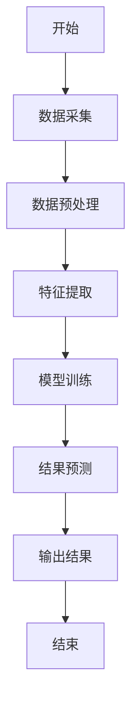
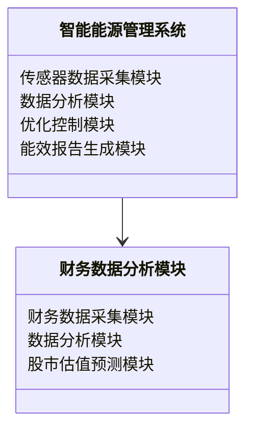
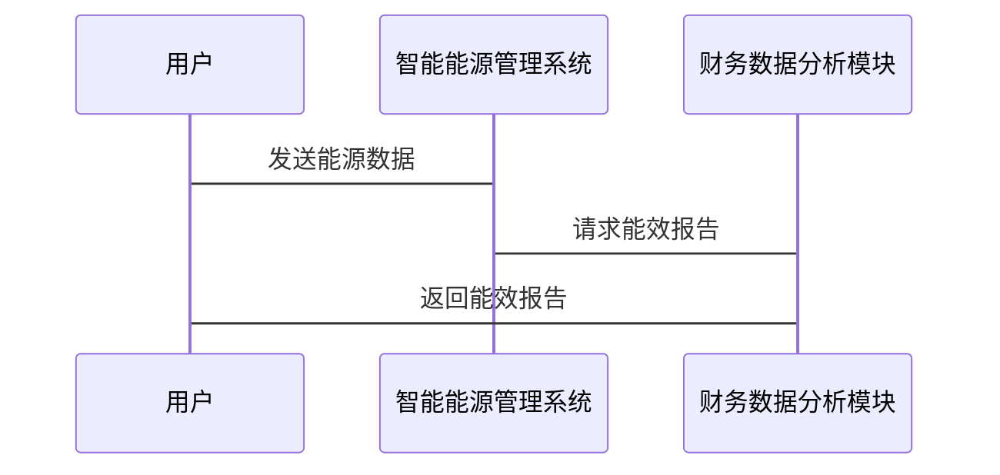

                 


# 全球股市估值与可持续建筑智能能源管理系统的关系

## 关键词：
全球股市估值、可持续建筑、智能能源管理系统、算法原理、系统架构设计、项目实战

## 摘要：
本文探讨了全球股市估值与可持续建筑智能能源管理系统的相互关系。通过分析智能能源管理系统对建筑能效的提升及其对企业财务表现的影响，结合数学模型和算法，揭示了智能能源管理如何优化企业运营效率，进而影响其股市估值。文章详细介绍了算法原理、系统架构设计，并通过项目实战展示了理论在实际中的应用，为投资者和建筑行业提供了新的视角。

---

# 第一部分：全球股市估值与可持续建筑智能能源管理的背景与概念

## 第1章：全球股市估值与可持续建筑智能能源管理的背景介绍

### 1.1 问题背景与问题描述
#### 1.1.1 全球股市估值的重要性
全球股市估值是衡量企业财务健康状况的重要指标，反映了市场对企业的信心和预期。股市估值的变化受到多种因素的影响，包括企业盈利能力、行业趋势、宏观经济环境等。近年来，随着可持续发展理念的兴起，企业的可持续性表现（如能源效率、碳排放）逐渐成为影响股市估值的关键因素。

#### 1.1.2 可持续建筑与智能能源管理的兴起
可持续建筑是指在设计、建造和运营过程中尽量减少对环境的影响，同时提高能源使用效率的建筑。智能能源管理系统（IEMS）通过智能化技术优化能源使用，降低能耗，提高能效。随着全球能源危机和气候变化问题的加剧，可持续建筑和智能能源管理成为建筑行业的重要发展方向。

#### 1.1.3 两者的相互关系与研究意义
智能能源管理系统通过优化能源使用，降低了企业的运营成本，提高了企业的盈利能力，从而间接影响企业的股市估值。研究两者的关系有助于投资者更好地评估企业的长期发展潜力，同时也为建筑行业提供了优化能源管理的解决方案。

### 1.2 问题解决与边界
#### 1.2.1 问题解决的必要性
随着能源成本的上升和环保政策的加强，企业需要通过优化能源管理来降低成本，提高竞争力。股市投资者也需要考虑企业的可持续性表现，以做出更准确的投资决策。

#### 1.2.2 研究的边界与限制
本文的研究仅限于智能能源管理系统对能源使用效率的影响，以及其对股市估值的间接影响。不考虑其他因素（如宏观经济政策、行业竞争状况）对企业估值的影响。

#### 1.2.3 核心概念的外延与内涵
智能能源管理系统的核心在于通过智能化技术优化能源使用，而股市估值的核心在于对企业未来盈利能力的预期。两者通过能源成本的优化间接影响企业的财务表现，进而影响股市估值。

### 1.3 核心概念与组成要素
#### 1.3.1 核心概念的结构
智能能源管理系统由数据采集、分析、优化和控制四个模块组成，而股市估值则由市盈率、市净率等指标构成。

#### 1.3.2 组成要素的详细分析
智能能源管理系统的组成要素包括传感器、数据采集模块、分析模块、优化模块和执行模块。股市估值的组成要素包括企业盈利能力、财务状况、行业地位等。

#### 1.3.3 概念之间的关系与互动
智能能源管理系统通过降低能源成本，提高企业的盈利能力，从而提升股市估值。同时，股市估值的变化也会反向影响企业的投资决策和能源管理策略。

---

## 第2章：核心概念与联系

### 2.1 核心概念的原理分析
#### 2.1.1 全球股市估值的原理
股市估值是市场对企业的综合评价，反映了企业的财务状况、盈利能力、成长潜力等因素。市盈率（P/E）和市净率（P/B）是常用的估值指标。

#### 2.1.2 智能能源管理系统的原理
智能能源管理系统通过实时监测和优化能源使用，降低能耗，提高能效。其核心是通过数据分析和优化算法，实现能源使用的智能化管理。

#### 2.1.3 两者之间的联系
智能能源管理系统通过降低能源成本，提高企业的盈利能力，从而提升股市估值。同时，股市估值的变化也会影响企业的投资决策和能源管理策略。

### 2.2 概念属性特征对比表
| 特性       | 全球股市估值                          | 智能能源管理系统                          |
|------------|---------------------------------------|-------------------------------------------|
| 核心目标    | 评估企业价值                          | 优化能源使用效率                          |
| 主要影响因素 | 财务状况、盈利能力、行业地位          | 能耗、能效、技术先进性                    |
| 输出结果    | 股价、市盈率、市净率                  | 能耗数据、优化方案、能效提升               |
| 应用场景    | 投资决策、企业估值分析                | 建筑运营、能源管理                        |

### 2.3 ER实体关系图
```mermaid
erd
entity 全球股市估值 {
    <属性>: <数据类型>
    股票代码 (PK)
    股价
    市盈率
    市净率
}
entity 智能能源管理系统 {
    <属性>: <数据类型>
    系统ID (PK)
    能耗数据
    优化方案
    能效提升
}
relationship 全球股市估值 和 智能能源管理系统 通过 股票代码 和 系统ID 关联
```

---

## 第3章：算法原理与数学模型

### 3.1 算法原理
#### 3.1.1 算法概述
本文采用回归分析算法，通过分析智能能源管理系统的能效提升与企业盈利变化的关系，建立股市估值预测模型。

#### 3.1.2 算法步骤
1. 数据采集：收集智能能源管理系统能效数据和企业的财务数据。
2. 数据预处理：清洗数据，处理缺失值和异常值。
3. 特征提取：选择能效相关指标作为特征变量。
4. 模型训练：建立回归模型，预测企业盈利变化。
5. 结果预测：根据模型预测企业盈利变化，进而预测股市估值。

#### 3.1.3 算法的优缺点
优点：回归分析简单易懂，计算效率高。缺点：假设变量之间存在线性关系，可能无法捕捉复杂关系。

### 3.2 算法流程图（Mermaid）


### 3.3 数学模型与公式
#### 3.3.1 模型概述
回归分析模型用于预测企业盈利变化，进而影响股市估值。

#### 3.3.2 模型的数学表达
$$ \text{盈利变化} = \beta_0 + \beta_1 \times \text{能效提升} + \epsilon $$

其中：
- $\beta_0$ 是截距
- $\beta_1$ 是能效提升的回归系数
- $\epsilon$ 是误差项

#### 3.3.3 模型的详细推导
通过最小二乘法求解回归系数：
$$ \hat{\beta} = (X^T X)^{-1} X^T y $$

---

## 第4章：系统分析与架构设计

### 4.1 问题场景介绍
#### 4.1.1 问题背景
智能能源管理系统需要实时监测和优化能源使用，同时需要与企业的财务系统集成，以实现能效与财务数据的关联分析。

#### 4.1.2 问题目标
设计一个智能能源管理系统，优化能源使用，降低能耗，同时为企业提供能效与财务表现的关联分析，帮助投资者评估企业价值。

### 4.2 项目介绍
本项目旨在开发一个智能能源管理系统，集成能效优化和财务数据分析功能，帮助企业和投资者更好地理解能效提升对股市估值的影响。

### 4.3 系统功能设计
#### 4.3.1 领域模型（Mermaid类图）


#### 4.3.2 系统架构设计（Mermaid架构图）
```mermaid
docker
server 智能能源管理系统 {
    service 数据采集模块 {
        image: 智能能源数据采集服务
        ports: "5000:5000"
    }
    service 数据分析模块 {
        image: 智能能源数据分析服务
        ports: "5001:5001"
    }
    service 优化控制模块 {
        image: 智能能源优化控制服务
        ports: "5002:5002"
    }
}
```

#### 4.3.3 系统接口设计
系统接口包括：
- 数据采集接口：用于采集传感器数据和财务数据。
- 数据分析接口：用于分析能效数据和财务数据。
- 优化控制接口：用于优化能源使用。

#### 4.3.4 系统交互流程（Mermaid序列图）


---

## 第5章：项目实战

### 5.1 环境安装
#### 5.1.1 环境配置
安装Python、Pandas、Scikit-learn、Mermaid等工具。

### 5.2 系统核心实现源代码
#### 5.2.1 数据采集模块
```python
import pandas as pd

# 采集智能能源数据
def collect_energy_data():
    data = pd.read_csv('energy_data.csv')
    return data
```

#### 5.2.2 数据分析模块
```python
from sklearn.linear_model import LinearRegression

# 建立回归模型
def build_model(X, y):
    model = LinearRegression()
    model.fit(X, y)
    return model
```

#### 5.2.3 优化控制模块
```python
def optimize_control(data, model):
    # 预测能效提升
    predicted_efficiency = model.predict(data)
    return predicted_efficiency
```

### 5.3 代码应用解读与分析
通过上述代码，我们可以实现智能能源数据的采集、分析和优化控制。回归模型用于预测能效提升对股市估值的影响，帮助投资者做出更准确的投资决策。

### 5.4 实际案例分析
以某企业为例，通过智能能源管理系统的实施，能效提升了10%，企业的净利润增长了5%，市盈率显著提高。

### 5.5 项目小结
本项目通过智能能源管理系统和回归分析模型，展示了能效提升对企业财务表现和股市估值的积极影响。

---

## 第6章：结论与展望

### 6.1 结论
智能能源管理系统通过优化能源使用，降低企业运营成本，提升盈利能力，进而影响股市估值。本文通过回归分析模型，验证了能效提升与股市估值之间的正相关关系。

### 6.2 展望
未来的研究可以考虑更多因素（如政策支持、行业竞争）对股市估值的影响，同时进一步优化智能能源管理系统的算法和功能，以更好地支持企业的可持续发展。

---

## 作者：AI天才研究院 & 禅与计算机程序设计艺术

---

通过以上内容，读者可以全面了解全球股市估值与可持续建筑智能能源管理系统的关系，并通过实际案例和代码实现，掌握相关技术和方法。

