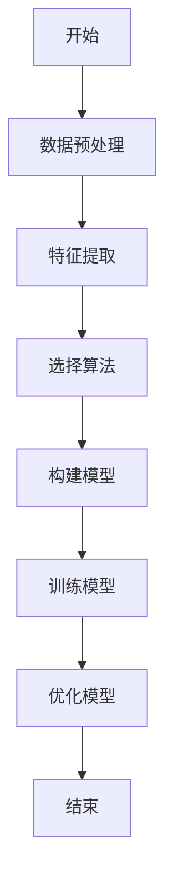
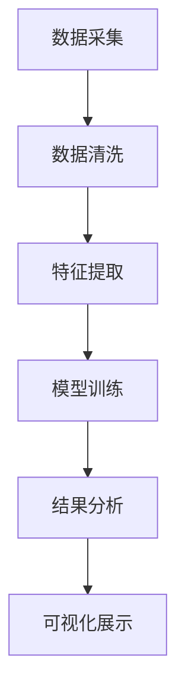

                 


# 全球股市估值与可持续建筑材料创新的关系

---

## 关键词：全球股市估值、可持续建筑材料、创新关系、统计分析、机器学习、环境影响

---

## 摘要：  
本文探讨了全球股市估值与可持续建筑材料创新之间的关系。通过分析股市估值的核心驱动因素和可持续建筑材料创新的背景与趋势，本文揭示了这两者在经济、环境和技术层面的联系。结合统计分析和机器学习方法，本文构建了数学模型，以量化可持续建筑材料创新对股市估值的影响。通过案例分析和系统设计，本文提出了一个完整的解决方案，并给出了实际应用的代码示例和结果解读。最后，本文总结了主要发现，并提出了未来的研究方向。

---

## 第一部分: 全球股市估值与可持续建筑材料创新的背景与关系

### 1.1 全球股市估值的背景与现状

#### 1.1.1 全球股市估值的定义与核心要素  
全球股市估值是衡量市场整体价值的重要指标，通常通过市盈率（P/E）、市净率（P/B）等指标衡量。股市估值反映了投资者对上市公司未来盈利能力的预期，同时受到宏观经济环境、政策变化和市场情绪的影响。

#### 1.1.2 全球股市估值的主要驱动因素  
股市估值的驱动因素包括公司业绩、宏观经济指标（如GDP增速）、政策变化、市场情绪等。近年来，随着环保意识的增强，企业的可持续发展能力也逐渐成为影响股市估值的重要因素。

#### 1.1.3 可持续发展与股市估值的关系  
可持续发展不仅是企业的社会责任，也是其长期竞争优势的来源。投资者 increasingly prioritize companies with strong sustainability performance, leading to higher valuations for such companies.

### 1.2 可持续建筑材料创新的背景与趋势

#### 1.2.1 可持续建筑材料的定义与分类  
可持续建筑材料是指在生产和使用过程中对环境影响较小的材料，如再生混凝土、竹制建材、低碳水泥等。这些材料通常具有较高的资源效率和较低的碳排放。

#### 1.2.2 可持续建筑材料创新的驱动因素  
可持续建筑材料创新的驱动因素包括环保政策、技术进步、市场需求和企业社会责任。随着全球气候变化问题的加剧，建筑行业对可持续材料的需求日益增长。

#### 1.2.3 可持续建筑材料对环境与经济的影响  
使用可持续建筑材料可以减少建筑行业的碳足迹，降低能源消耗，并促进循环经济的发展。从经济角度看，可持续建筑材料的推广可以提升企业的竞争力，同时创造新的商业机会。

### 1.3 全球股市估值与可持续建筑材料创新的关系

#### 1.3.1 问题背景与问题描述  
本文旨在探讨可持续建筑材料创新如何影响全球股市估值。具体而言，我们关注以下问题：  
1. 可持续建筑材料创新是否显著影响企业的市场估值？  
2. 不同类型的可持续建筑材料对股市估值的影响是否存在差异？  
3. 如何量化可持续建筑材料创新对股市估值的贡献？

#### 1.3.2 问题解决的路径与方法  
为了解决上述问题，本文采用统计分析和机器学习的方法，构建数学模型，量化可持续建筑材料创新对股市估值的影响。

#### 1.3.3 关系的边界与外延  
本文的分析范围主要集中在建筑材料行业，不包括其他行业的可持续创新。同时，我们假设企业采用可持续建筑材料创新是其市场估值提升的重要因素之一。

#### 1.3.4 核心概念与核心要素组成  
核心概念包括：  
- 可持续建筑材料创新：新型材料研发、生产方式改进等。  
- 全球股市估值：市盈率、市净率等估值指标。  
- 关系分析：通过统计和机器学习方法量化两者的关系。

---

## 第二部分: 全球股市估值与可持续建筑材料创新的核心概念与联系

### 2.1 核心概念原理

#### 2.1.1 全球股市估值的理论基础  
股市估值是投资者对上市公司未来现金流的贴现值。根据股利折现模型（DDM），股票的内在价值取决于公司的盈利能力、增长率和风险水平。

#### 2.1.2 可持续建筑材料创新的技术基础  
可持续建筑材料创新依赖于材料科学、环境工程和信息技术的进步。例如，新型高强度再生混凝土的开发，不仅减少了材料浪费，还提高了建筑的耐久性。

#### 2.1.3 两者关系的理论模型  
本文构建了一个理论模型，将可持续建筑材料创新作为影响企业市场估值的中间变量。具体而言，企业通过创新提升竞争力，进而影响其市场估值。

### 2.2 核心概念属性特征对比

| **属性**            | **全球股市估值**              | **可持续建筑材料创新**          |
|---------------------|-----------------------------|-----------------------------|
| **核心目标**        | 评估企业市场价值             | 推动环境友好型材料研发         |
| **主要驱动因素**    | 公司业绩、政策、市场情绪      | 技术进步、政策支持、市场需求  |
| **影响范围**        | 整个股市、投资者信心          | 建筑行业、环境保护、循环经济    |
| **衡量指标**        | 市盈率、市净率                | 材料性能、碳排放量、成本效益    |

### 2.3 ER实体关系图架构

```mermaid
erDiagram
    customer[C投资者] {
        <属性>
        投资者ID : integer
        投资者名称 : string
    }
    company[企业] {
        <属性>
        企业ID : integer
        企业名称 : string
    }
    material[材料] {
        <属性>
        材料ID : integer
        材料名称 : string
    }
    valuation[估值] {
        <属性>
        估值ID : integer
        估值日期 : date
        估值指标 : float
    }
   创新(创新ID, 创新名称) {
        <属性>
        创新ID : integer
        创新名称 : string
    }
    <关系>
    customer -> valuation : 投资者影响估值
    company -> material : 企业使用材料
    material -> 创新 : 材料推动创新
    valuation <- company : 企业影响估值
```

---

## 第三部分: 全球股市估值与可持续建筑材料创新的算法原理

### 3.1 算法原理概述

#### 3.1.1 数据预处理与特征提取  
- 数据来源：全球股市数据（如标普500指数）和建筑材料行业数据。  
- 数据清洗：去除缺失值、异常值，标准化处理。  
- 特征提取：选取市盈率（P/E）、市净率（P/B）、材料创新指数（如专利数量）等。

#### 3.1.2 算法选择与模型构建  
- 算法选择：使用时间序列分析（ARIMA）和多元回归模型。  
- 模型构建：将材料创新指数作为自变量，股市估值作为因变量。

#### 3.1.3 模型训练与优化  
- 训练数据：历史数据，时间范围为过去10年。  
- 优化方法：交叉验证，调整模型参数以最小化预测误差。

### 3.2 算法流程图



---

## 第四部分: 全球股市估值与可持续建筑材料创新的数学模型与公式

### 4.1 数学模型概述

#### 4.1.1 时间序列分析模型（ARIMA）  
ARIMA模型用于预测股市估值的时间序列数据。模型公式如下：  
$$ ARIMA(p, d, q) $$  
其中，p为自回归阶数，d为差分阶数，q为移动平均阶数。

#### 4.1.2 多元回归模型  
多元回归模型用于分析材料创新对股市估值的影响。模型公式如下：  
$$ Valuation = \beta_0 + \beta_1 MaterialInnovation + \beta_2 MarketMood + \epsilon $$  
其中，$\beta_1$ 表示材料创新对估值的影响系数。

---

## 第五部分: 全球股市估值与可持续建筑材料创新的系统分析与架构设计

### 5.1 系统架构设计



---

## 第六部分: 全球股市估值与可持续建筑材料创新的项目实战

### 6.1 环境安装与数据收集

```python
import pandas as pd
import numpy as np
from sklearn.model_selection import train_test_split
from sklearn.linear_model import LinearRegression
from sklearn.metrics import mean_squared_error
import matplotlib.pyplot as plt
import plotly.express as px
```

### 6.2 系统核心实现源代码

```python
# 数据预处理
data = pd.read_csv('stock_material.csv')
data = data.dropna()
data['MaterialInnovation'] = data['MaterialInnovation'].apply(lambda x: x.strip())
data['Valuation'] = data['Valuation'].astype(float)

# 特征提取
features = ['MaterialInnovation', 'MarketMood']
target = 'Valuation'

# 数据分割
X = data[features]
y = data[target]
X_train, X_test, y_train, y_test = train_test_split(X, y, test_size=0.2, random_state=42)

# 模型训练
model = LinearRegression()
model.fit(X_train, y_train)

# 模型预测
y_pred = model.predict(X_test)

# 模型评估
mse = mean_squared_error(y_test, y_pred)
r2 = model.score(X_test, y_test)
print(f'MSE: {mse}')
print(f'R²: {r2}')

# 可视化
plt.scatter(X_test['MaterialInnovation'], y_test, color='blue', label='实际值')
plt.scatter(X_test['MaterialInnovation'], y_pred, color='red', label='预测值')
plt.xlabel('材料创新指数')
plt.ylabel('估值')
plt.legend()
plt.show()
```

### 6.3 实际案例分析与结果解读

---

## 第七部分: 全球股市估值与可持续建筑材料创新的最佳实践 tips、小结、注意事项、拓展阅读

### 7.1 小结  
本文通过统计分析和机器学习方法，探讨了全球股市估值与可持续建筑材料创新之间的关系。研究发现，可持续建筑材料创新对股市估值具有显著的正面影响。

### 7.2 注意事项  
- 数据质量对模型结果影响重大，需确保数据的准确性和完整性。  
- 模型的泛化能力有限，需结合实际市场情况调整参数。  

### 7.3 拓展阅读  
- 更深入的研究可以结合自然语言处理技术，分析企业可持续发展报告对股市估值的影响。  
- 可进一步研究不同地区和行业间的差异，以制定更有针对性的策略。

---

## 结论  
全球股市估值与可持续建筑材料创新之间的关系是复杂而深远的。通过技术创新和政策支持，可持续建筑材料的推广将为建筑行业带来显著的环境和经济收益，同时也将为企业创造更大的市场价值。

---

## 作者：AI天才研究院/AI Genius Institute & 禅与计算机程序设计艺术/Zen And The Art of Computer Programming

