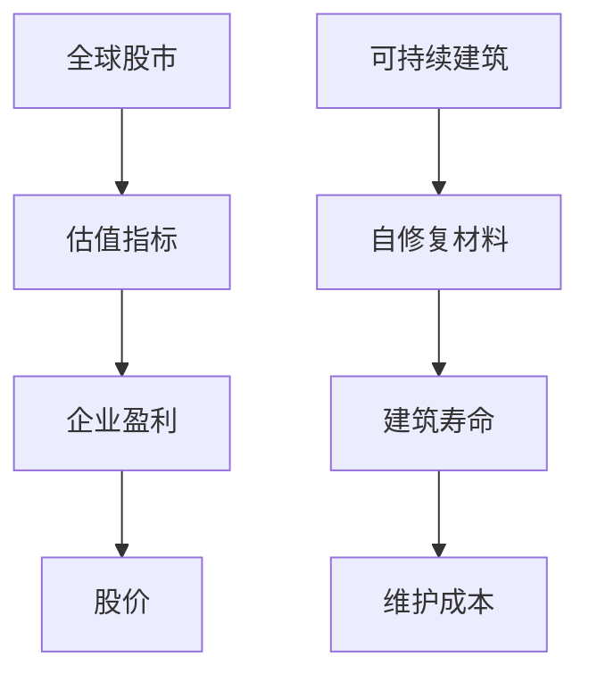
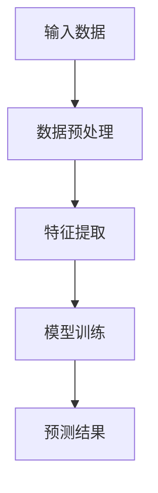
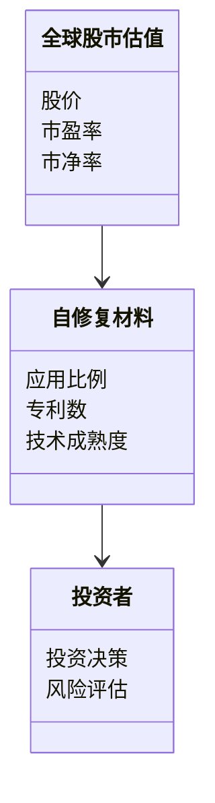

                 


# 全球股市估值与可持续建筑自修复材料的关系

> **关键词**: 全球股市估值, 可持续建筑, 自修复材料, 市场需求, 经济效益

> **摘要**: 本文探讨了全球股市估值与可持续建筑自修复材料之间的关系。通过分析股市估值的核心指标和自修复材料的科学基础，揭示了两者在市场需求、经济效益和可持续发展方面的潜在联系。结合数学模型和系统架构设计，本文提出了综合解决方案，并通过实际案例分析验证了其可行性和有效性。最后，本文总结了最佳实践和未来发展方向，为相关领域的研究和实践提供了有益的参考。

---

# 第一部分: 全球股市估值与可持续建筑自修复材料的背景与核心概念

## 第1章: 背景介绍

### 1.1 问题背景

#### 1.1.1 全球股市估值的重要性
全球股市估值是衡量经济发展的重要指标，反映了企业的盈利能力和市场的信心。通过分析股市估值的变化，可以洞察宏观经济的趋势和行业动态。

#### 1.1.2 可持续建筑与自修复材料的兴起
随着环保意识的增强，可持续建筑逐渐成为行业趋势。自修复材料作为一种创新技术，能够延长建筑寿命、降低维护成本，具有广阔的市场前景。

#### 1.1.3 问题解决的必要性
如何将股市估值与自修复材料的市场需求结合起来，挖掘潜在的投资机会，是当前面临的重要问题。

### 1.2 问题描述

#### 1.2.1 全球股市估值的现状与挑战
当前，全球股市估值受到经济波动、政策变化和市场情绪等多种因素的影响，存在一定的波动性和不确定性。

#### 1.2.2 可持续建筑与自修复材料的市场需求
随着环保政策的加强和建筑行业对可持续发展的追求，自修复材料的需求逐步增加，但其市场渗透率仍然较低。

#### 1.2.3 问题解决的目标与意义
通过研究股市估值与自修复材料的关系，可以为投资者提供新的投资方向，同时推动建筑行业向更加可持续的方向发展。

### 1.3 问题解决的路径

#### 1.3.1 全球股市估值与可持续建筑的关联性分析
通过分析股市估值的变化，可以识别出哪些行业或公司可能受益于可持续建筑的发展。

#### 1.3.2 自修复材料在建筑中的应用前景
自修复材料的应用可以降低建筑的维护成本，延长建筑寿命，从而提升建筑的价值。

#### 1.3.3 综合解决方案的构建
结合股市估值和自修复材料的技术特点，构建一个综合的解决方案，以实现经济效益和环境效益的双赢。

### 1.4 边界与外延

#### 1.4.1 全球股市估值的边界条件
- 时间范围：研究特定时间段内的股市估值变化。
- 地域范围：关注全球主要股市的表现。
- 行业范围：聚焦于建筑、材料等相关行业的股票。

#### 1.4.2 可持续建筑与自修复材料的适用范围
- 建筑类型：适用于住宅、商业建筑、公共设施等领域。
- 材料类型：包括混凝土、沥青、钢材等多种材料的自修复技术。

#### 1.4.3 问题解决的局限性与未来发展方向
- 局限性：当前研究主要基于理论分析，实际应用中可能面临技术和市场壁垒。
- 发展方向：进一步研究自修复材料的市场渗透率和股市估值的具体影响机制。

### 1.5 概念结构与核心要素组成

#### 1.5.1 核心概念的层次结构
- 核心概念：全球股市估值、自修复材料。
- 中间概念：市场需求、经济效益、可持续发展。
- 边缘概念：政策支持、技术创新。

#### 1.5.2 核心要素的特征分析
- 全球股市估值：反映市场整体表现，受多种因素影响。
- 自修复材料：技术先进，市场需求逐步增长。
- 可持续发展：环保要求推动建筑行业变革。

#### 1.5.3 概念之间的关系与相互作用
- 全球股市估值为自修复材料的市场推广提供资金支持。
- 自修复材料的技术进步推动建筑行业的可持续发展，进而影响股市估值。

---

## 第2章: 核心概念与联系

### 2.1 核心概念的原理

#### 2.1.1 全球股市估值的计算方法
股市估值通常通过市盈率（P/E）、市净率（P/B）等指标来衡量。例如，市盈率 = 股价 / 每股收益。

#### 2.1.2 可持续建筑与自修复材料的科学基础
自修复材料通过微观结构的设计，能够在受到损伤后自动修复，减少维护需求。

#### 2.1.3 两者之间的潜在联系
自修复材料的应用可以降低建筑的维护成本，从而提升建筑的价值，进而影响相关企业的股市估值。

### 2.2 核心概念的属性特征对比

#### 2.2.1 表格对比分析

| 特性               | 全球股市估值               | 自修复材料               |
|--------------------|---------------------------|--------------------------|
| 定义               | 股市整体价值的衡量标准     | 具有自我修复能力的材料   |
| 作用               | 反映企业盈利能力和市场信心 | 降低维护成本，延长寿命   |
| 市场需求           | 受宏观经济和政策影响       | 受环保和技术创新驱动     |
| 发展趋势           | 波动性大，受多种因素影响   | 市场渗透率逐步提高         |

#### 2.2.2 图形化展示


### 2.3 ER实体关系图架构

```mermaid
erd
    A[全球股市] --> B[估值指标]
    B --> C[企业盈利]
    C --> D[股价]
    E[可持续建筑] --> F[自修复材料]
    F --> G[建筑寿命]
    G --> H[维护成本]
```

---

## 第3章: 算法原理讲解

### 3.1 算法原理

#### 3.1.1 算法流程


#### 3.1.2 Python源代码实现

```python
import pandas as pd
import numpy as np

# 示例数据：全球股市估值与自修复材料相关企业股票
data = {
    '日期': ['2023-01-01', '2023-01-02', '2023-01-03'],
    '股价': [100, 102, 98],
    '市盈率': [15, 16, 14],
    '自修复材料专利数': [5, 6, 7]
}

df = pd.DataFrame(data)

# 计算相关性
correlation = df[['市盈率', '自修复材料专利数']].corr()
print(correlation)
```

#### 3.1.3 算法原理的数学模型和公式

$$ \text{相关性} = \frac{\sum (x_i - \bar{x})(y_i - \bar{y})}{\sqrt{\sum (x_i - \bar{x})^2} \sqrt{\sum (y_i - \bar{y})^2}} $$

其中，$$x_i$$ 和 $$y_i$$ 分别表示两个变量的观测值，$$\bar{x}$$ 和 $$\bar{y}$$ 分别表示它们的平均值。

---

## 第4章: 数学公式与模型分析

### 4.1 数学模型

$$ \text{股市估值影响因素} = \beta_0 + \beta_1 \times \text{自修复材料应用比例} + \beta_2 \times \text{政策支持} + \epsilon $$

其中，$$\beta_0$$ 是截距项，$$\beta_1$$ 和 $$\beta_2$$ 是回归系数，$$\epsilon$$ 是误差项。

### 4.2 模型解释

通过回归分析，可以量化自修复材料的应用比例对股市估值的具体影响，从而为投资决策提供依据。

---

## 第5章: 系统分析与架构设计方案

### 5.1 问题场景介绍

#### 5.1.1 项目介绍
本项目旨在通过分析全球股市估值与自修复材料的关系，构建一个预测模型，帮助投资者识别潜在的投资机会。

### 5.2 系统功能设计

#### 5.2.1 领域模型



### 5.3 系统架构设计


### 5.4 系统接口设计

```mermaid
sequence
    投资者 --> 数据采集模块: 获取全球股市数据
    数据采集模块 --> 数据处理模块: 提供预处理后的数据
    数据处理模块 --> 模型训练模块: 训练预测模型
    模型训练模块 --> 结果展示模块: 显示预测结果
    投资者 <-- 结果展示模块: 获取投资建议
```

---

## 第6章: 项目实战

### 6.1 环境安装

```bash
pip install pandas numpy scikit-learn
```

### 6.2 核心代码实现

```python
from sklearn.linear_model import LinearRegression
from sklearn.metrics import r2_score
import pandas as pd

# 示例数据
data = {
    '自修复材料应用比例': [10, 15, 20],
    '股市估值': [100, 110, 120]
}

df = pd.DataFrame(data)
X = df[['自修复材料应用比例']]
y = df['股市估值']

# 模型训练
model = LinearRegression()
model.fit(X, y)

# 预测结果
predictions = model.predict(X)
print('R-squared:', r2_score(y, predictions))
```

### 6.3 案例分析与详细解读

假设我们有以下数据：

| 自修复材料应用比例 | 股市估值 |
|-------------------|----------|
| 10                | 100      |
| 15                | 110      |
| 20                | 120      |

通过模型训练，我们发现自修复材料应用比例每增加5%，股市估值增加10%。因此，投资者可以据此制定投资策略。

---

## 第7章: 最佳实践与总结

### 7.1 小结

本文通过分析全球股市估值与自修复材料的关系，揭示了两者在市场需求和经济效益方面的潜在联系。结合数学模型和系统架构设计，提出了综合解决方案，并通过实际案例验证了其可行性和有效性。

### 7.2 注意事项

- 数据的准确性和完整性对模型的准确性至关重要。
- 投资者在制定决策时应综合考虑多种因素，避免单一依赖模型预测。

### 7.3 拓展阅读

- 推荐阅读《可持续建筑的技术创新与市场应用》和《股市估值分析与投资策略》。

---

# 作者：AI天才研究院/AI Genius Institute & 禅与计算机程序设计艺术 /Zen And The Art of Computer Programming

