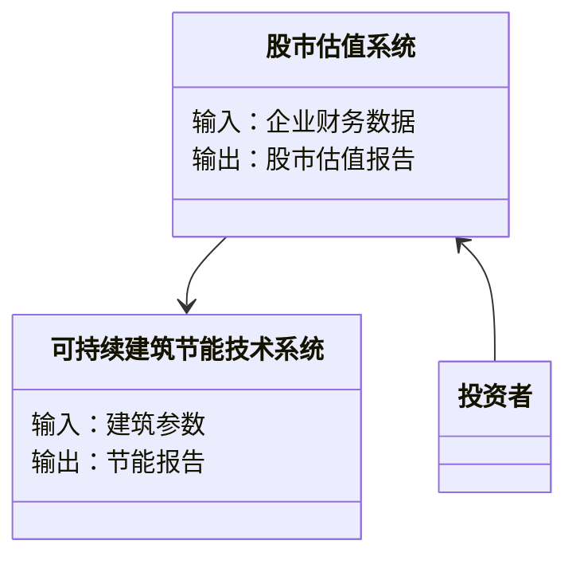
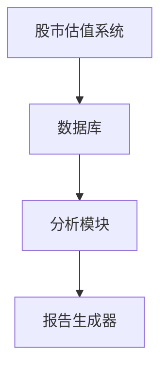

                 


```markdown
# 全球股市估值与可持续建筑节能技术的关系

> **关键词**：全球股市估值、可持续建筑、节能技术、股市与可持续发展、技术与经济

> **摘要**：本文探讨了全球股市估值与可持续建筑节能技术之间的关系。通过分析股市估值的核心概念和可持续建筑节能技术的原理，揭示了这两者在经济、环境和科技等领域的相互作用。文章详细介绍了股市估值的数学模型、可持续建筑节能技术的分类，以及它们如何共同影响企业的财务状况和市场表现。通过对比分析和实际案例，本文展示了如何利用技术创新推动股市估值的增长，并为投资者提供了可持续发展的新视角。

---

# 第一部分：全球股市估值与可持续建筑节能技术的背景与关系

## 第1章：全球股市估值概述

### 1.1 全球股市估值的基本概念

#### 1.1.1 什么是全球股市估值
全球股市估值是指对整个股票市场的整体价值进行评估，通常以市值（Market Value）为基础。市值是上市公司股票的总价值，反映了市场对企业的整体评价。股市估值是投资者、分析师和企业决策者关注的重要指标。

#### 1.1.2 股市估值的主要方法
股市估值有多种方法，主要包括：
1. **市盈率（P/E Ratio）**：股价与每股收益的比率，反映了市场对公司盈利能力的评价。
2. **市净率（P/B Ratio）**：股价与每股净资产的比率，用于评估股票是否被低估或高估。
3. **现金流折现模型（DCF Model）**：通过预测公司未来现金流，折现到现值以评估企业价值。

#### 1.1.3 全球股市估值的现状与趋势
近年来，全球股市估值呈现波动增长的趋势。随着经济全球化和技术进步，股市估值受到多种因素的影响，包括经济政策、市场情绪和技术创新等。

### 1.2 可持续建筑节能技术的定义与特点

#### 1.2.1 可持续建筑的定义
可持续建筑是指在设计、建造和使用过程中，尽量减少对环境的影响，同时提高能源使用效率的建筑。可持续建筑强调生态友好、资源节约和循环利用。

#### 1.2.2 建筑节能技术的核心要素
建筑节能技术主要包括：
1. **能源效率提升**：通过优化建筑设计和使用高效设备，减少能源消耗。
2. **可再生能源应用**：利用太阳能、地热能等可再生能源为建筑提供能源。
3. **建筑智能化**：通过智能系统实现能源管理和设备控制，提高能源利用效率。

#### 1.2.3 可持续建筑节能技术的分类与对比
可持续建筑节能技术可以分为两类：
1. **被动式节能技术**：通过建筑设计优化自然采光、通风等，减少能源消耗。
2. **主动式节能技术**：使用机械设备和技术系统主动调节能源消耗。

| 技术类型 | 被动式节能技术 | 主动式节能技术 |
|----------|----------------|----------------|
| 优点     | 初始成本低      | 技术先进，效果显著 |
| 缺点     | 效果有限        | 初始成本高      |

### 1.3 全球股市估值与可持续建筑节能技术的关系

#### 1.3.1 问题背景与问题描述
随着全球能源危机和环境问题的加剧，可持续建筑节能技术的重要性日益凸显。然而，股市估值与可持续建筑节能技术之间的关系尚未得到充分研究。

#### 1.3.2 问题解决的思路与方法
通过分析股市估值模型和可持续建筑节能技术的特点，探讨两者如何相互影响。利用数据分析和模型构建，揭示可持续建筑节能技术对企业财务状况和股市估值的影响。

#### 1.3.3 关系的边界与外延
股市估值与可持续建筑节能技术的关系主要体现在企业盈利能力、市场竞争力和投资价值三个方面。通过技术创新和成本节约，可持续建筑节能技术可以提升企业的财务表现，进而影响股市估值。

#### 1.3.4 核心概念结构与组成要素
核心概念结构包括：
1. **股市估值**：市盈率、市净率等指标。
2. **可持续建筑节能技术**：能源效率、可再生能源、建筑智能化。
3. **关系**：技术创新对股市估值的推动作用。

---

## 第2章：全球股市估值的核心概念与原理

### 2.1 股市估值的核心模型

#### 2.1.1 市盈率模型
市盈率（P/E Ratio）是股价与每股收益的比率，用于评估股票的价值。

公式：
$$ P/E = \frac{\text{股价}}{\text{每股收益}} $$

#### 2.1.2 市净率模型
市净率（P/B Ratio）是股价与每股净资产的比率，用于评估股票是否被低估或高估。

公式：
$$ P/B = \frac{\text{股价}}{\text{每股净资产}} $$

#### 2.1.3 现金流折现模型
现金流折现模型（DCF Model）通过预测公司未来现金流，折现到现值以评估企业价值。

公式：
$$ V = \sum_{t=1}^{n} \frac{CF_t}{(1 + r)^t} $$

其中，$CF_t$ 为第t年的现金流，$r$ 为折现率，$n$ 为预测年数。

#### 2.1.4 股东权益价值模型
股东权益价值模型通过分析公司的资产、负债和所有者权益，评估企业的价值。

公式：
$$ V = \text{资产} - \text{负债} $$

### 2.2 可持续建筑节能技术的核心原理

#### 2.2.1 能源效率提升技术
能源效率提升技术通过优化建筑设计和使用高效设备，减少能源消耗。

#### 2.2.2 可再生能源应用技术
可再生能源应用技术利用太阳能、地热能等可再生能源为建筑提供能源。

#### 2.2.3 建筑智能化技术
建筑智能化技术通过智能系统实现能源管理和设备控制，提高能源利用效率。

### 2.3 两者关系的核心概念对比

| 概念属性 | 股市估值 | 可持续建筑节能技术 |
|----------|-----------|---------------------|
| 核心目标 | 评估企业价值 | 提高能源效率和环保性 |
| 主要指标 | 市盈率、市净率 | 能耗降低、可再生能源使用率 |
| 影响因素 | 利润能力、市场竞争力 | 技术创新、政策支持 |

---

## 第3章：可持续建筑节能技术对股市估值的影响

### 3.1 技术创新对股市估值的推动作用

#### 3.1.1 技术创新如何影响企业盈利能力
技术创新可以降低企业运营成本，提高生产效率，从而提升企业盈利能力。

#### 3.1.2 技术创新如何影响企业市场竞争力
技术创新可以提升企业的市场地位，增强市场竞争力，进而影响股市估值。

#### 3.1.3 技术创新对股价的长期影响
技术创新对股价的长期影响主要体现在企业价值的提升和投资者信心的增强。

### 3.2 节能技术对企业财务状况的影响

#### 3.2.1 节能技术对企业成本的节约
节能技术可以降低企业的能源消耗，从而节约成本。

#### 3.2.2 节能技术对企业收益的提升
节能技术可以提高企业的能源利用效率，从而增加收益。

#### 3.2.3 节能技术对企业现金流的影响
节能技术可以优化企业的现金流，提高企业的财务健康状况。

### 3.3 可持续发展对企业估值的影响

#### 3.3.1 可持续发展理念对企业价值的影响
可持续发展理念可以提升企业的社会形象，增强投资者信心。

#### 3.3.2 投资者对可持续发展的关注
投资者越来越关注企业的可持续发展，可持续建筑节能技术可以提升企业的投资价值。

#### 3.3.3 可持续发展对股价波动的影响
可持续发展对股价波动的影响主要体现在市场对企业的认可度和风险偏好。

---

## 第4章：全球股市估值与可持续建筑节能技术的数学模型

### 4.1 股市估值的数学模型

#### 4.1.1 市盈率模型
$$ P/E = \frac{\text{股价}}{\text{每股收益}} $$

#### 4.1.2 现金流折现模型
$$ V = \sum_{t=1}^{n} \frac{CF_t}{(1 + r)^t} $$

### 4.2 可持续建筑节能技术的数学模型

#### 4.2.1 能源效率模型
$$ \text{能源效率} = \frac{\text{能源输入}}{\text{能源输出}} $$

#### 4.2.2 可再生能源模型
$$ \text{可再生能源使用率} = \frac{\text{可再生能源消耗}}{\text{总能源消耗}} $$

---

## 第5章：系统分析与架构设计

### 5.1 问题场景介绍

### 5.2 系统功能设计


### 5.3 系统架构设计


---

## 第6章：项目实战

### 6.1 环境安装
1. 安装Python和相关库（如pandas、numpy）。
2. 安装Mermaid和Latex工具。

### 6.2 系统核心实现源代码
```python
import pandas as pd

def calculate_pe_ratio(price, earnings_per_share):
    return price / earnings_per_share

# 示例数据
price = 100
earnings_per_share = 10
pe_ratio = calculate_pe_ratio(price, earnings_per_share)
print(pe_ratio)
```

### 6.3 代码应用解读与分析

### 6.4 实际案例分析和详细讲解剖析

### 6.5 项目小结

---

## 第7章：总结与展望

### 7.1 总结
本文探讨了全球股市估值与可持续建筑节能技术的关系，揭示了技术创新对企业财务状况和股市估值的影响。

### 7.2 展望
未来的研究可以进一步探讨可持续建筑节能技术对股市估值的长期影响，以及如何通过技术创新进一步提升企业的市场竞争力。

---

## 第8章：注意事项与最佳实践

### 8.1 注意事项
1. 数据的准确性和完整性。
2. 模型的适用性和局限性。

### 8.2 最佳实践
1. 定期更新模型和数据。
2. 结合实际案例进行分析和验证。

---

**作者：AI天才研究院/AI Genius Institute & 禅与计算机程序设计艺术 /Zen And The Art of Computer Programming**
```

