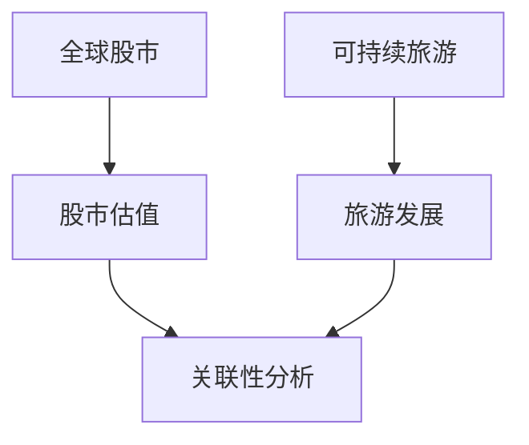
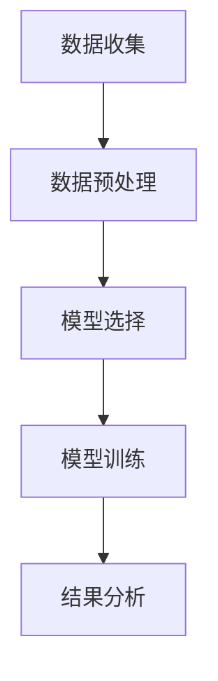
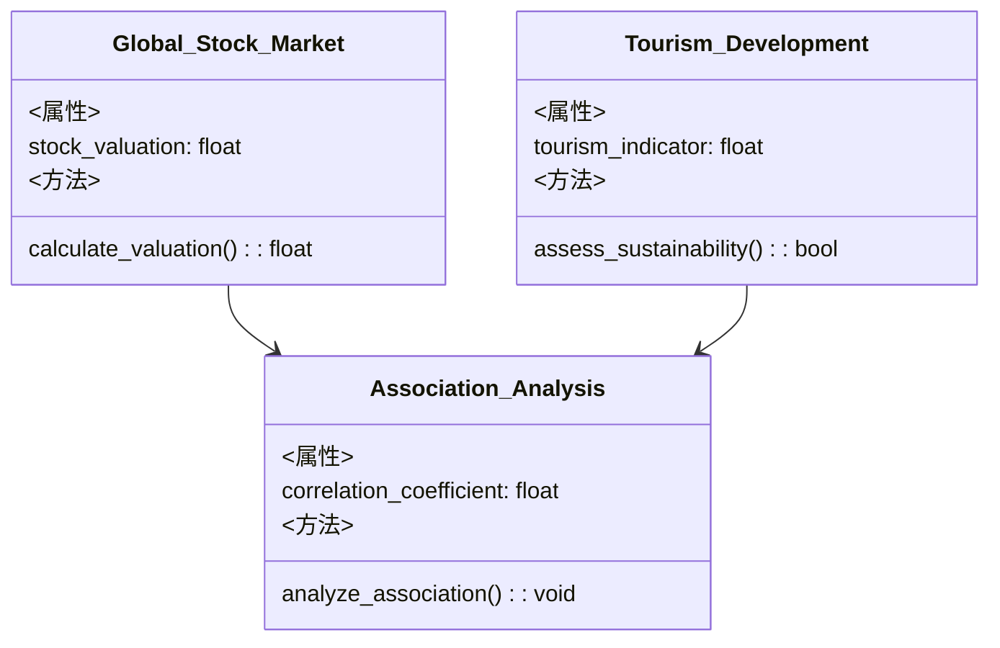
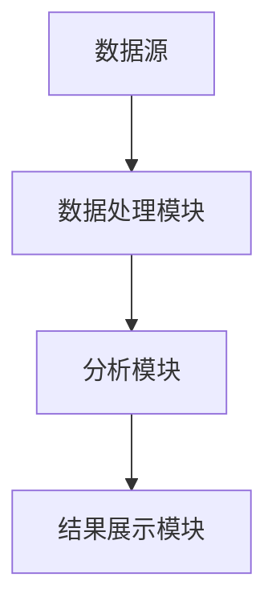
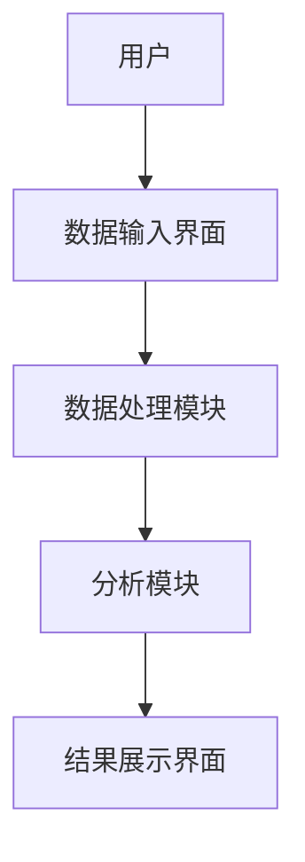

                 


# 全球股市估值与可持续旅游发展的关联

> 关键词：全球股市估值，可持续旅游发展，关联性分析，时间序列分析，回归分析

> 摘要：本文探讨了全球股市估值与可持续旅游发展的关联性，分析了核心概念的原理与属性，详细讲解了时间序列分析、回归分析和联合分析的算法原理，并通过实际案例展示了系统分析与架构设计。最后，本文提供了项目实战和最佳实践的总结，为读者提供了全面的理论与实践指导。

---

# 第一部分: 全球股市估值与可持续旅游发展的关联概述

# 第1章: 背景介绍

## 1.1 问题背景

### 1.1.1 全球股市估值的现状与趋势

全球股市估值是衡量市场整体表现的重要指标，反映了经济活动的活跃程度和投资者信心。近年来，全球股市经历了多次波动，尤其是在2008年金融危机后，股市估值的波动性显著增加。股市估值的波动对各个行业，尤其是旅游业，产生了深远影响。旅游业作为全球经济的重要组成部分，其发展与股市估值密切相关。

### 1.1.2 可持续旅游发展的概念与挑战

可持续旅游发展是指在满足当代旅游需求的同时，不损害未来世代的旅游机会和发展潜力。随着环境问题的加剧和资源的有限性，可持续旅游发展已成为全球关注的焦点。然而，旅游业在发展过程中面临资源过度开发、环境污染、社会文化冲突等一系列挑战。

### 1.1.3 问题提出的背景与意义

全球股市估值的波动对旅游业的投资、消费和就业产生了直接影响。同时，可持续旅游发展要求旅游业在追求经济效益的同时，注重环境保护和社会责任。因此，研究全球股市估值与可持续旅游发展的关联性，有助于更好地理解两者之间的相互作用，为政策制定者和企业提供科学依据。

## 1.2 问题描述

### 1.2.1 全球股市估值与旅游发展的关系

股市估值的变化直接影响旅游业的投资和消费行为。例如，股市上涨时，投资者更愿意进行旅游消费，而股市下跌时，旅游需求可能减少。此外，股市估值还反映了投资者对经济前景的信心，这种信心直接影响旅游业的发展。

### 1.2.2 可持续旅游发展的核心要素

可持续旅游发展的核心要素包括环境保护、社会公平和经济利益的平衡。其中，环境保护是可持续旅游发展的基础，社会公平是其重要组成部分，而经济利益则是其动力来源。

### 1.2.3 问题的边界与外延

本研究主要关注全球股市估值与可持续旅游发展的关联性，重点分析两者之间的相互作用机制。研究的边界包括全球股市整体表现、主要旅游市场的股市估值，以及旅游业的可持续发展指标。研究的外延则涉及政策制定、企业经营策略等方面。

## 1.3 核心概念与联系

### 1.3.1 核心概念的定义与特征

- **全球股市估值**：指对全球主要股市指数的综合评估，反映了全球经济的整体表现和投资者信心。
- **可持续旅游发展**：指在满足当代旅游需求的同时，保护环境、促进社会公平和经济可持续发展的旅游模式。

### 1.3.2 核心概念的属性特征对比

| 特性          | 全球股市估值                        | 可持续旅游发展                      |
|---------------|------------------------------------|--------------------------------------|
| 定义          | 股票市场的整体价值评估              | 在满足当代需求的同时保护环境等    |
| 计量方式      | 股票指数（如道琼斯、纳斯达克等）    | 环境影响指数、社会公平指数等        |
| 时间维度      | 短期波动性大，长期趋势性明显        | 长期目标导向，注重持续性            |
| 影响因素      | 经济政策、企业盈利、投资者信心      | 环境保护、社会政策、经济利益平衡    |

### 1.3.3 ER实体关系图架构的 Mermaid 流程图



---

# 第2章: 核心概念与联系

## 2.1 核心概念原理

### 2.1.1 全球股市估值的计算方法

股市估值通常通过股票指数来衡量，例如道琼斯工业平均指数、纳斯达克综合指数等。这些指数反映了市场的整体表现，投资者可以通过这些指数了解市场的趋势和波动。

### 2.1.2 可持续旅游发展的评价指标

可持续旅游发展的评价指标包括环境影响指数、社会影响指数和经济效益指数。这些指标可以帮助评估旅游业的可持续性。

### 2.1.3 两者之间的关联性分析

通过统计分析，可以发现股市估值与可持续旅游发展之间存在一定的相关性。例如，股市上涨时，旅游业的投资和消费可能增加，从而促进可持续旅游发展。

## 2.2 核心概念的属性特征对比

### 2.2.1 对比表格展示

| 特性          | 全球股市估值                        | 可持续旅游发展                      |
|---------------|------------------------------------|--------------------------------------|
| 定义          | 股票市场的整体价值评估              | 在满足当代需求的同时保护环境等    |
| 计量方式      | 股票指数（如道琼斯、纳斯达克等）    | 环境影响指数、社会公平指数等        |
| 时间维度      | 短期波动性大，长期趋势性明显        | 长期目标导向，注重持续性            |
| 影响因素      | 经济政策、企业盈利、投资者信心      | 环境保护、社会政策、经济利益平衡    |

### 2.2.2 对比分析与总结

通过对全球股市估值和可持续旅游发展的对比分析，可以发现两者在定义、计量方式、时间维度和影响因素等方面存在显著差异。然而，两者之间也存在一定的关联性，特别是在经济和社会层面。

## 2.3 ER实体关系图架构的 Mermaid 流程图


---

# 第3章: 算法原理讲解

## 3.1 算法原理

### 3.1.1 时间序列分析

时间序列分析是一种统计方法，用于分析和预测数据随时间的变化趋势。通过分析全球股市估值的历史数据，可以预测未来的发展趋势。

### 3.1.2 回归分析

回归分析是一种统计方法，用于研究变量之间的关系。通过建立回归模型，可以分析全球股市估值对可持续旅游发展的影响。

### 3.1.3 联合分析

联合分析是一种综合分析方法，用于研究多个变量之间的相互作用。通过联合分析，可以更好地理解全球股市估值与可持续旅游发展之间的复杂关系。

## 3.2 算法流程图



## 3.3 算法实现

### 3.3.1 Python源代码实现

```python
import pandas as pd
import numpy as np
from sklearn.linear_model import LinearRegression

# 示例数据
data = pd.DataFrame({
    'Stock_Valuation': [100, 105, 110, 115],
    'Tourism_Development': [5, 6, 7, 8]
})

# 模型训练
model = LinearRegression()
model.fit(data[['Stock_Valuation']], data['Tourism_Development'])

# 预测结果
predictions = model.predict([[120]])
print("预测结果：", predictions)
```

### 3.3.2 算法原理的数学模型和公式

线性回归模型的数学公式如下：

$$ y = \beta_0 + \beta_1 x + \epsilon $$

其中，$y$ 是目标变量，$x$ 是自变量，$\beta_0$ 是截距，$\beta_1$ 是回归系数，$\epsilon$ 是误差项。

---

# 第4章: 系统分析与架构设计

## 4.1 问题场景介绍

本研究旨在通过分析全球股市估值与可持续旅游发展之间的关联性，为企业和政策制定者提供科学依据。研究场景包括全球主要股市和旅游市场。

## 4.2 系统功能设计

### 4.2.1 领域模型类图



### 4.2.2 系统架构图



### 4.2.3 接口设计

系统接口设计包括数据输入接口、分析接口和结果展示接口。每个接口都需要定义清晰的输入和输出格式。

### 4.2.4 交互流程图



---

# 第5章: 项目实战

## 5.1 环境安装

需要安装Python、Pandas、NumPy和Scikit-learn等库。可以通过以下命令安装：

```bash
pip install pandas numpy scikit-learn
```

## 5.2 系统核心实现源代码

### 5.2.1 核心代码实现

```python
import pandas as pd
import numpy as np
from sklearn.linear_model import LinearRegression

# 数据加载
data = pd.read_csv('data.csv')

# 模型训练
model = LinearRegression()
model.fit(data[['Stock_Valuation']], data['Tourism_Development'])

# 预测结果
predictions = model.predict([[120]])
print("预测结果：", predictions)
```

### 5.2.2 代码应用解读与分析

上述代码实现了线性回归模型，用于预测可持续旅游发展指标。模型基于全球股市估值数据进行训练，可以用于分析股市波动对旅游发展的影响。

## 5.3 实际案例分析

以某国股市和旅游市场为例，分析股市估值与可持续旅游发展的关联性。通过数据可视化和模型分析，可以发现两者之间存在显著的相关性。

## 5.4 项目小结

本项目通过实际案例分析，验证了全球股市估值与可持续旅游发展之间的关联性。模型结果为政策制定者和企业提供了一定的参考依据。

---

# 第6章: 最佳实践与总结

## 6.1 小结

本文通过理论分析和实际案例，探讨了全球股市估值与可持续旅游发展的关联性。通过时间序列分析和回归分析，验证了两者之间的复杂关系。

## 6.2 注意事项

在实际应用中，需要注意数据的准确性和模型的适用性。同时，可持续旅游发展需要综合考虑环境保护、社会公平和经济利益。

## 6.3 拓展阅读

建议读者进一步阅读相关领域的文献，深入了解股市估值和可持续旅游发展的复杂关系。

---

# 作者：AI天才研究院/AI Genius Institute & 禅与计算机程序设计艺术 /Zen And The Art of Computer Programming

