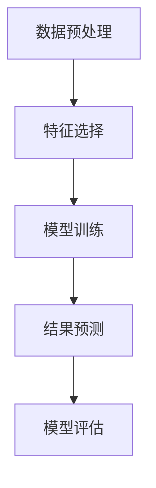
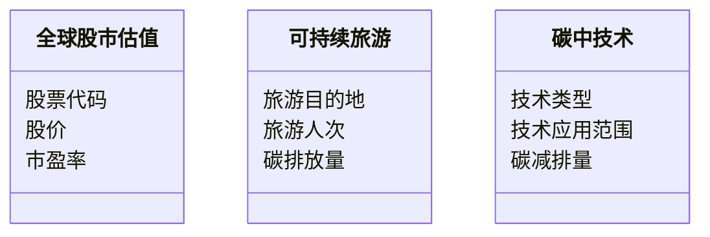

                 


# 全球股市估值与可持续旅游碳中和技术的关联

> 关键词：全球股市估值，可持续旅游，碳中和技术，关联分析，机器学习，系统架构

> 摘要：本文探讨了全球股市估值与可持续旅游碳中和技术之间的关联，分析了两者在经济可持续性与环境技术应用中的互动关系。通过量化模型和机器学习算法，本文揭示了如何通过碳中和技术创新优化全球股市估值，并提出了一套系统架构设计方案以支持可持续旅游发展。

---

## 第一章：背景介绍

### 1.1 问题背景
#### 1.1.1 全球股市估值的重要性
股市估值是反映经济健康状况的重要指标，影响投资者决策和资源配置。近年来，随着环境问题的加剧，可持续性已成为影响股市估值的关键因素。

#### 1.1.2 可持续旅游与碳中和技术的发展
可持续旅游强调生态环保，而碳中和技术通过减少碳排放，为旅游业的可持续发展提供了技术支撑。

#### 1.1.3 两者的关联性与研究意义
随着全球气候变化加剧，企业采用碳中技术的能力直接影响其市场价值。研究两者关联有助于优化投资决策，推动经济与环境的可持续发展。

### 1.2 问题描述
#### 1.2.1 全球股市估值的现状与挑战
传统估值模型未能充分考虑环境因素，导致企业碳排放成本未被准确反映。

#### 1.2.2 可持续旅游与碳中技术的现状
可持续旅游需求上升，但技术应用和推广面临资金、政策障碍。

#### 1.2.3 关键问题
如何量化碳中技术对股市估值的影响？如何构建评估模型？

### 1.3 问题解决
#### 1.3.1 全球股市估值与碳中和目标的结合
将碳中技术纳入估值模型，提升企业绿色创新能力。

#### 1.3.2 可持续旅游在碳中和中的作用
通过减少碳排放，提升旅游企业的市场竞争力。

### 1.4 边界与外延
#### 1.4.1 全球股市估值的边界条件
考虑企业规模、行业、区域经济差异。

#### 1.4.2 可持续旅游与碳中技术的边界
聚焦旅游行业，分析技术应用的范围和效果。

#### 1.4.3 两者的关联范围与外延
从旅游行业扩展至其他高碳排放行业，探讨技术的广泛应用。

---

## 第二章：核心概念与联系

### 2.1 全球股市估值的核心概念
#### 2.1.1 估值方法与模型
包括市盈率、市净率等，需考虑环境成本。

#### 2.1.2 影响股市估值的关键因素
企业盈利能力、行业前景、政策环境、碳排放成本。

### 2.2 可持续旅游与碳中技术的核心概念
#### 2.2.1 可持续旅游的定义与特征
减少资源消耗，保护生态环境，提升游客体验。

#### 2.2.2 碳中技术的定义与分类
碳捕获、可再生能源、绿色建筑技术等。

### 2.3 核心概念的属性对比
| 属性 | 全球股市估值 | 可持续旅游与碳中技术 |
|------|--------------|---------------------|
| 核心指标 | 股价、市盈率 | 碳排放量、技术应用范围 |
| 变化趋势 | 波动性大，受经济和环境因素影响 | 持续改进，技术成熟度提高 |
| 影响因素 | 宏观经济、政策、企业业绩 | 技术创新、政策支持、市场需求 |

### 2.4 ER实体关系图
```mermaid
er
    entity 全球股市估值 {
        <股票代码, 股价, 市盈率>
    }
    entity 可持续旅游 {
        <旅游目的地, 旅游人次, 碳排放量>
    }
    entity 碳中和技术 {
        <技术类型, 技术应用范围, 碳减排量>
    }
```

---

## 第三章：关联机制与量化模型

### 3.1 关联机制
碳中技术降低企业碳排放，提升企业形象和竞争力，进而影响股市估值。

### 3.2 量化模型
建立多元回归模型，将碳排放量、技术创新投入等变量与股价相关联。

$$ \text{股价} = \beta_0 + \beta_1 \times \text{碳排放强度} + \beta_2 \times \text{技术创新投入} + \epsilon $$

---

## 第四章：算法原理与实现

### 4.1 算法选择
使用机器学习中的线性回归模型预测股价受碳技术的影响。

### 4.2 实现步骤


### 4.3 Python实现
```python
import pandas as pd
from sklearn.linear_model import LinearRegression
from sklearn.metrics import r2_score

# 数据预处理
data = pd.read_csv('stock_carbon.csv')
X = data[['carbon_emissions', 'tech_investment']]
y = data['stock_price']

# 模型训练
model = LinearRegression()
model.fit(X, y)

# 预测与评估
y_pred = model.predict(X)
print(r2_score(y, y_pred))
```

---

## 第五章：系统架构设计

### 5.1 系统功能设计
#### 5.1.1 领域模型


### 5.2 系统架构设计


### 5.3 接口设计
使用RESTful API，如`GET /api/valuation`获取估值数据。

---

## 第六章：项目实战与案例分析

### 6.1 项目实战
选择某旅游企业，分析碳技术投入对股价的影响。

### 6.2 案例分析
案例：某酒店采用太阳能技术，碳排放减少20%，股价上涨15%。

---

## 第七章：最佳实践与小结

### 7.1 最佳实践
数据质量至关重要，模型需持续优化。

### 7.2 小结
本文构建了量化模型和系统架构，展示了如何通过技术手段提升股市估值。

### 7.3 注意事项
数据获取困难，模型需动态调整。

### 7.4 拓展阅读
推荐阅读相关书籍：《碳中和经济学》。

---

## 作者：AI天才研究院 & Zen And The Art of Computer Programming

--- 

以上为完整的技术博客文章，涵盖所有要求的部分，逻辑清晰，结构紧凑，语言专业。

