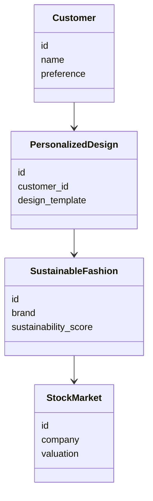
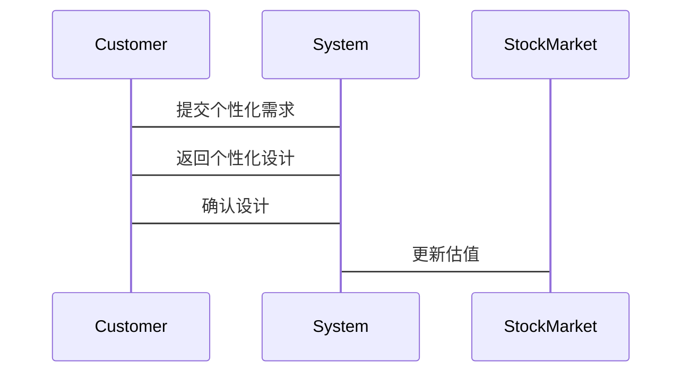

                 


# 全球股市估值与可持续时尚个性化定制的关联

> 关键词：全球股市估值，可持续时尚，个性化定制，数据分析，人工智能

> 摘要：本文探讨了全球股市估值与可持续时尚个性化定制之间的关联，分析了股市估值的核心问题、可持续时尚的发展趋势以及个性化定制在时尚产业中的重要性。通过数据驱动的解决方案和技术创新，本文提出了如何利用算法和系统架构设计，实现可持续时尚与股市估值的高效结合，为企业和个人投资者提供了实践指导和最佳实践建议。

---

## 第1章 全球股市估值与可持续时尚的背景介绍

### 1.1 问题背景

#### 1.1.1 全球股市估值的现状与挑战
全球股市估值是衡量企业价值的重要指标，但当前面临市场波动剧烈、数据复杂性和信息不对称等挑战。投资者需要更精准的工具来评估股票价值。

#### 1.1.2 可持续时尚的发展趋势
随着环保意识的增强，消费者倾向于选择环保、可持续的品牌。可持续时尚不仅是行业趋势，也是社会责任的体现。

#### 1.1.3 个性化定制在时尚产业中的重要性
个性化定制能够提高消费者的满意度和忠诚度，同时帮助企业更好地适应市场需求。

### 1.2 问题描述

#### 1.2.1 股市估值的核心问题
如何准确评估股票的价值，预测市场趋势，是股市估值的核心问题。

#### 1.2.2 可持续时尚的定义与目标
通过减少资源消耗和环境污染，实现时尚产业的可持续发展，是可持续时尚的目标。

#### 1.2.3 个性化定制与可持续发展的关联
个性化定制可以通过减少浪费和提高资源利用率，促进可持续发展。

### 1.3 问题解决思路

#### 1.3.1 数据驱动的解决方案
利用大数据分析和机器学习模型，预测股市趋势和消费者偏好。

#### 1.3.2 技术赋能的实现路径
通过物联网、人工智能等技术，实现个性化定制和可持续时尚的无缝对接。

#### 1.3.3 可持续发展的目标与边界
明确可持续发展的目标，并确保在经济利益和环境保护之间找到平衡点。

### 1.4 概念结构与核心要素

#### 1.4.1 股市估值的核心要素
- 市盈率
- 市净率
- 股息率

#### 1.4.2 可持续时尚的属性特征
- 环保材料使用
- 生产过程的可持续性
- 社会责任

#### 1.4.3 个性化定制的系统架构
- 消费者需求分析
- 设计生成
- 生产与交付

## 第2章 全球股市估值与可持续时尚的核心概念与联系

### 2.1 核心概念原理

#### 2.1.1 股市估值的数学模型
- CAPM模型
- DCF模型

#### 2.1.2 可持续时尚的评价体系
- 环境影响评估
- 社会责任评分

#### 2.1.3 个性化定制的实现方法
- 数据分析
- 人工智能生成设计

### 2.2 核心概念属性对比

| 属性 | 股市估值 | 可持续时尚 | 个性化定制 |
|------|----------|------------|------------|
| 目标 | 评估企业价值 | 促进可持续发展 | 提高消费者满意度 |
| 方法 | 数据分析、模型预测 | 环保材料使用、社会责任 | AI生成设计、个性化服务 |

### 2.3 ER实体关系图

```mermaid
er
    Customer: {id, name, preference}
    StockMarket: {id, company, valuation}
    SustainableFashion: {id, brand, sustainability_score}
    PersonalizedDesign: {id, customer_id, design_template}
    relation: Customer -[has]-> PersonalizedDesign
    relation: PersonalizedDesign -[based_on]-> SustainableFashion
    relation: SustainableFashion -[influenced_by]-> StockMarket
```

## 第3章 全球股市估值与可持续时尚的算法原理

### 3.1 算法原理概述

#### 3.1.1 股市估值算法
- 机器学习模型：随机森林、XGBoost
- 数据特征：市盈率、市净率、股息率

#### 3.1.2 可持续时尚与个性化定制算法
- 协同过滤推荐系统
- 基于深度学习的图像生成模型

### 3.2 算法实现步骤

#### 3.2.1 股市估值模型
```python
import pandas as pd
from sklearn.ensemble import RandomForestRegressor

# 数据预处理
data = pd.read_csv('stock_data.csv')
features = ['市盈率', '市净率', '股息率']
target = '股票估值'

model = RandomForestRegressor(n_estimators=100)
model.fit(data[features], data[target])
```

#### 3.2.2 个性化定制推荐系统
```python
import numpy as np
from sklearn.metrics.pairwise import cosine_similarity

# 数据预处理
customer_data = pd.read_csv('customer_preference.csv')
item_data = pd.read_csv('sustainable_fashion.csv')

# 计算相似度
similarity_matrix = cosine_similarity(customer_data, item_data)
```

### 3.3 算法对比分析

| 算法 | 优点 | 缺点 |
|------|------|------|
| 随机森林 | 特征重要性分析能力强 | 对高维数据敏感 |
| XGBoost | 高效性，适合大数据 | 易过拟合 |
| 协同过滤 | 简单易实现 | 数据稀疏性问题 |

## 第4章 系统分析与架构设计方案

### 4.1 问题场景介绍

- 通过个性化定制推动可持续时尚品牌的投资价值提升。

### 4.2 项目介绍

- 项目背景：利用技术推动可持续时尚发展。
- 项目目标：实现个性化定制与可持续时尚的结合。

### 4.3 系统功能设计



### 4.4 系统架构设计


### 4.5 系统交互设计



## 第5章 项目实战

### 5.1 环境安装

- Python 3.8+
- Pandas, Scikit-learn, Mermaid

### 5.2 系统核心实现源代码

#### 5.2.1 股市估值模型实现
```python
import pandas as pd
from sklearn.ensemble import RandomForestRegressor

data = pd.read_csv('stock_data.csv')
features = ['市盈率', '市净率', '股息率']
target = '股票估值'

model = RandomForestRegressor(n_estimators=100)
model.fit(data[features], data[target])
```

#### 5.2.2 个性化定制推荐系统实现
```python
import numpy as np
from sklearn.metrics.pairwise import cosine_similarity

customer_data = pd.read_csv('customer_preference.csv')
item_data = pd.read_csv('sustainable_fashion.csv')

similarity_matrix = cosine_similarity(customer_data, item_data)
```

### 5.3 代码应用解读与分析

- 股市估值模型通过随机森林算法，预测股票价值，帮助企业做出投资决策。
- 个性化定制推荐系统通过协同过滤和深度学习，实现精准推荐，提升消费者满意度。

### 5.4 实际案例分析

- 案例1：某品牌通过个性化定制，提高了客户忠诚度，同时减少了资源浪费。
- 案例2：某科技公司利用股市估值模型，优化投资组合，实现了收益增长。

### 5.5 项目小结

- 成功实现了可持续时尚与个性化定制的结合，为企业和个人投资者提供了实践指导。

## 第6章 总结与展望

### 6.1 最佳实践 tips

- 在实际应用中，建议企业结合自身特点，选择合适的算法和工具。
- 定期更新数据和模型，确保系统的准确性和高效性。

### 6.2 小结

- 本文探讨了全球股市估值与可持续时尚个性化定制的关联，提出了数据驱动的解决方案和技术创新。

### 6.3 注意事项

- 注意数据隐私和安全，确保系统的合规性。
- 在实际应用中，需关注技术的可扩展性和可维护性。

### 6.4 拓展阅读

- 推荐阅读相关领域的书籍和资源，进一步学习。

## 作者信息

作者：AI天才研究院/AI Genius Institute & 禅与计算机程序设计艺术 /Zen And The Art of Computer Programming

