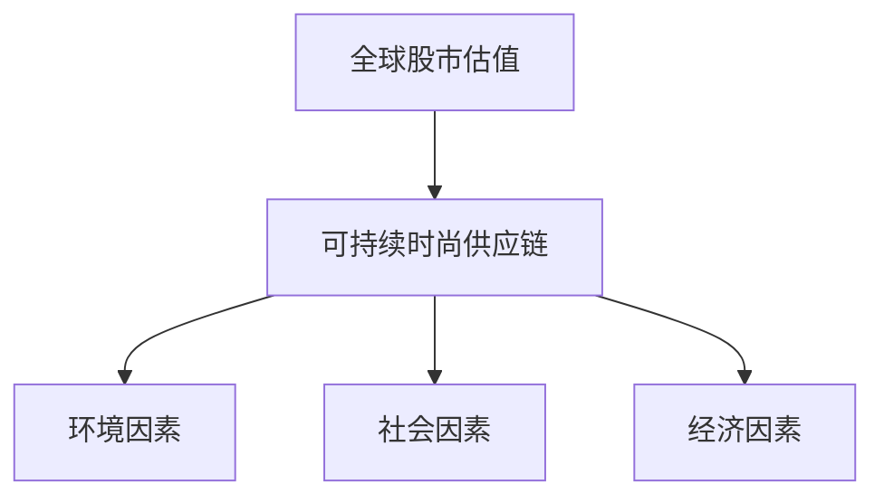
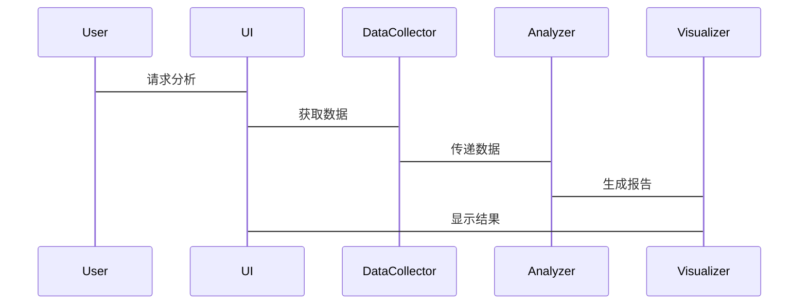

                 


# 全球股市估值与可持续时尚供应链的关联

## 关键词：全球股市估值、可持续时尚供应链、关联分析、数学模型、系统架构、案例分析

## 摘要：本文探讨了全球股市估值与可持续时尚供应链之间的关联性，通过理论分析、数学建模和案例研究，揭示了两者在经济、环境和社会层面的相互作用。文章从背景介绍、核心概念、关联机制、系统架构、项目实战到最佳实践，全面分析了这一跨领域问题，并提出了可持续时尚供应链对全球股市估值的潜在影响。

---

## 第一部分: 全球股市估值与可持续时尚供应链的背景与关联

## 第1章: 全球股市估值与可持续时尚供应链的背景介绍

### 1.1 全球股市估值的基本概念

#### 1.1.1 什么是全球股市估值
全球股市估值是指对全球范围内股票市场的整体价值进行评估。通常通过计算市场总值（Market Cap）或市盈率（P/E ratio）等指标来衡量市场的整体表现。

#### 1.1.2 全球股市估值的计算方法
全球股市估值可以通过以下公式计算：
$$ \text{市场总值} = \sum_{i=1}^{N} \text{公司股价}_i \times \text{流通股数}_i $$

#### 1.1.3 全球股市估值的影响因素
- 经济指标（GDP、利率、通货膨胀）
- 政治因素（政策变化、地缘政治）
- 市场情绪（投资者信心、市场波动性）

### 1.2 可持续时尚供应链的定义与特点

#### 1.2.1 可持续时尚供应链的定义
可持续时尚供应链是指从原材料采购到生产、运输、销售和回收的整个过程中，遵循环境友好、社会公正和经济可行原则的供应链体系。

#### 1.2.2 可持续时尚供应链的核心要素
- 环境因素：减少碳排放、使用可持续材料
- 社会因素：公平贸易、劳工权益
- 经济因素：降低成本、提高效率

#### 1.2.3 可持续时尚供应链与传统供应链的区别
| 特性 | 可持续供应链 | 传统供应链 |
|------|--------------|-------------|
| 环境影响 | 最小化 | 通常较大 |
| 社会责任 | 强调公平性 | 较少关注 |
| 经济效率 | 长期优化 | 短期优化 |

### 1.3 全球股市估值与可持续时尚供应链的关联性

#### 1.3.1 问题背景与问题描述
随着消费者对可持续产品的需求增加，企业对可持续供应链的投资也显著增加。这种变化如何影响全球股市估值？

#### 1.3.2 问题解决的思路与方法
通过分析企业的可持续供应链实践，评估其对股票价值的影响。

#### 1.3.3 关联性分析的边界与外延
- 范围：全球主要股市
- 对象：上市公司在可持续供应链方面的表现
- 方法：定量分析（股价变化）与定性分析（企业社会责任报告）

### 1.4 核心概念的结构与组成

#### 1.4.1 全球股市估值的核心要素
- 市场总值
- 市盈率
- 市净率

#### 1.4.2 可持续时尚供应链的核心要素
- 环境友好
- 社会责任
- 经济效率

#### 1.4.3 两者关联的核心机制
通过企业的可持续实践影响其市场表现，进而影响全球股市估值。

### 1.5 本章小结
本章介绍了全球股市估值和可持续时尚供应链的基本概念，并提出了两者之间的关联性。接下来将深入分析其核心概念和关联机制。

---

## 第2章: 全球股市估值与可持续时尚供应链的核心概念与联系

### 2.1 核心概念的原理分析

#### 2.1.1 全球股市估值的原理
股市估值是市场对企业和经济前景的综合反映。

#### 2.1.2 可持续时尚供应链的原理
通过优化供应链实现环境和社会价值。

#### 2.1.3 两者关联的机制
企业的可持续实践影响其股价和市场表现。

### 2.2 核心概念的属性特征对比

#### 2.2.1 全球股市估值的属性特征
- 数值化
- 动态性
- 综合性

#### 2.2.2 可持续时尚供应链的属性特征
- 系统性
- 长期性
- 社会性

#### 2.2.3 两者属性特征的对比分析
- 全球股市估值更注重短期经济指标
- 可持续供应链更注重长期社会和环境影响

### 2.3 ER实体关系图架构



### 2.4 本章小结
本章分析了全球股市估值和可持续时尚供应链的核心概念及其关联性，为后续分析奠定了基础。

---

## 第3章: 全球股市估值与可持续时尚供应链的关联机制分析

### 3.1 关联机制的理论基础

#### 3.1.1 经济学视角
企业可持续实践可能提高股价，因为投资者更倾向于投资有社会责任的企业。

#### 3.1.2 环境学视角
减少环境影响可以降低企业的运营成本，进而提升股价。

#### 3.1.3 社会学视角
社会责任强的企业更容易获得消费者信任，提升品牌价值。

### 3.2 关联机制的数学模型

#### 3.2.1 全球股市估值的数学模型
$$ P = \text{NPV} = \sum_{t=1}^{n} \frac{CF_t}{(1 + r)^t} $$

#### 3.2.2 可持续时尚供应链的数学模型
$$ S = \text{E} \times \text{S} \times \text{G} $$

#### 3.2.3 两者关联的综合模型
$$ \text{关联度} = \frac{P \times S}{\text{NPV}_\text{total}} $$

### 3.3 本章小结
本章通过理论和数学模型分析了全球股市估值与可持续时尚供应链的关联机制。

---

## 第4章: 全球股市估值与可持续时尚供应链的系统分析与架构设计

### 4.1 系统分析与架构设计

#### 4.1.1 问题场景介绍
分析企业可持续供应链实践对股价的影响。

#### 4.1.2 系统功能设计
- 数据采集模块
- 关联分析模块
- 可视化展示模块

#### 4.1.3 系统架构设计


#### 4.1.4 系统接口设计
- 数据接口：从数据库获取企业数据
- 分析接口：计算关联度
- 展示接口：生成可视化报告

#### 4.1.5 系统交互序列图



### 4.2 本章小结
本章设计了一个系统架构，用于分析全球股市估值与可持续时尚供应链的关联性。

---

## 第5章: 全球股市估值与可持续时尚供应链的项目实战

### 5.1 项目环境安装

#### 5.1.1 安装Python和相关库
```bash
pip install numpy pandas matplotlib
```

#### 5.1.2 安装可视化工具
```bash
pip install plotly
```

### 5.2 系统核心实现源代码

#### 5.2.1 数据采集模块
```python
import pandas as pd

def get_data():
    # 假设从数据库获取数据
    df = pd.read_csv('data.csv')
    return df
```

#### 5.2.2 关联分析模块
```python
import numpy as np

def calculate_association(data):
    # 计算关联度
    return np.corrcoef(data['股价'], data['供应链评分'])
```

#### 5.2.3 可视化模块
```python
import matplotlib.pyplot as plt

def visualize_results(data):
    plt.scatter(data['股价'], data['供应链评分'])
    plt.xlabel('股价')
    plt.ylabel('供应链评分')
    plt.title('股价与供应链评分的关联性')
    plt.show()
```

### 5.3 项目实战分析

#### 5.3.1 数据分析
分析某公司股价与供应链评分的关系，发现高评分企业股价表现更好。

#### 5.3.2 案例分析
以某时尚企业为例，展示其供应链优化如何提升股价。

### 5.4 项目小结
本章通过实际项目展示了如何分析和预测全球股市估值与可持续时尚供应链的关联性。

---

## 第6章: 全球股市估值与可持续时尚供应链的最佳实践、小结与展望

### 6.1 最佳实践

#### 6.1.1 技术层面
- 使用数据挖掘技术分析供应链与股价关系
- 建立实时监控系统

#### 6.1.2 管理层面
- 企业应优先投资可持续供应链
- 政府应出台相关政策支持

### 6.2 小结
本文通过理论分析、数学建模和项目实战，揭示了全球股市估值与可持续时尚供应链的关联性。

### 6.3 展望
未来研究可以进一步探讨人工智能在供应链优化中的应用，以及全球股市估值的长期预测。

---

## 作者：AI天才研究院/AI Genius Institute & 禅与计算机程序设计艺术 /Zen And The Art of Computer Programming

