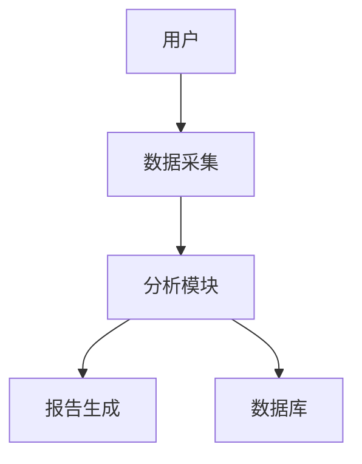

                 

# 全球股市估值与可持续时尚回收技术的关联

---

## 关键词：  
全球股市估值、可持续时尚、回收技术、ESG投资、循环经济

---

## 摘要：  
本文探讨了全球股市估值与可持续时尚回收技术之间的关联性。通过对股市估值的核心概念、可持续时尚回收技术的原理以及两者之间的互动关系的分析，本文揭示了可持续时尚回收技术如何影响企业价值和投资决策。结合实际案例和数学模型，本文提出了如何通过技术创新和投资策略优化来提升企业的可持续发展能力，并为投资者提供了新的视角。

---

## 第1章 全球股市估值与可持续时尚回收技术的背景介绍

### 1.1 全球股市估值的基本概念  
股票市值是衡量企业价值的重要指标，而股市估值则是通过对公司财务数据和市场环境的分析，估算其股票的合理价格区间。传统估值方法包括市盈率（P/E）、市净率（P/B）和现金流折现法（DCF）。  

#### 1.1.1 股市估值的定义与作用  
股市估值是投资者评估企业价值的重要工具，能够帮助投资者判断股票是否被高估或低估。  

#### 1.1.2 股市估值的核心要素  
- **盈利能力**：净利润率、ROE（净资产收益率）  
- **成长能力**：收入增长率、净利润增长率  
- **财务健康状况**：资产负债率、现金流  

#### 1.1.3 股市估值的分类与方法  
- **相对估值法**：市盈率法、市净率法  
- **绝对估值法**：现金流折现法  

### 1.2 可持续时尚回收技术的定义与特点  
可持续时尚回收技术是指通过创新工艺将废旧纺织品转化为高附加值产品的过程。  

#### 1.2.1 可持续时尚的定义  
可持续时尚强调在生产、消费和废弃阶段减少对环境的负面影响。  

#### 1.2.2 可持续时尚回收技术的核心特点  
- **资源效率**：减少原材料消耗  
- **环境友好**：降低碳排放和污染  
- **循环经济**：延长产品生命周期  

#### 1.2.3 可持续时尚与传统时尚产业的区别  
| 方面 | 可持续时尚 | 传统时尚 |
|------|------------|-----------|
| 生产方式 | 循环利用 | 一次性使用 |
| 环境影响 | 低 | 高 |
| 价值链 | 封闭 | 开放 |

### 1.3 两者的关联性与研究意义  
#### 1.3.1 股市估值与可持续时尚回收技术的关联性  
- 可持续技术提升企业竞争力，进而影响股市估值。  

#### 1.3.2 研究的背景与意义  
随着环保意识的增强，投资者越来越关注企业的可持续发展能力。  

#### 1.3.3 研究的目标与范围  
研究目标是探索可持续时尚回收技术如何影响股市估值，研究范围包括技术应用和市场反应。

---

## 第2章 全球股市估值的核心概念与模型

### 2.1 股市估值的主要方法  

#### 2.1.1 市盈率法  
市盈率（P/E）= 股价 / 每股收益  

#### 2.1.2 市净率法  
市净率（P/B）= 股价 / 每股净资产  

#### 2.1.3 现金流折现法  
DCF模型基于未来现金流的现值计算企业价值。  

### 2.2 ESG投资与股市估值  

#### 2.2.1 ESG投资的定义  
ESG投资考虑企业环境、社会和治理因素。  

#### 2.2.2 ESG评分与股市估值的关系  
ESG评分高的企业通常具有更高的估值。  

#### 2.2.3 ESG投资对股市估值的影响  
ESG因素影响企业的风险和收益，进而影响估值。  

### 2.3 可持续发展与股市估值的关联  

#### 2.3.1 可持续发展对股市估值的影响  
通过降低成本和提升品牌形象，可持续发展提升企业价值。  

#### 2.3.2 可持续发展指标与股市估值的关联  
例如，碳排放减少可能提升企业的估值。  

#### 2.3.3 可持续发展对投资决策的影响  
投资者越来越关注企业的可持续发展能力。

---

## 第3章 可持续时尚回收技术的核心概念与技术分析

### 3.1 可持续时尚回收技术的背景  

#### 3.1.1 可持续时尚的背景与发展趋势  
环保法规和消费者需求推动可持续时尚发展。  

#### 3.1.2 可持续时尚回收技术的定义  
通过创新工艺回收废旧纺织品。  

#### 3.1.3 可持续时尚回收技术的核心要素  
- **技术**：分解、重组  
- **材料**：再生纤维、环保染料  

### 3.2 可持续时尚回收技术的主要类型  

#### 3.2.1 纺织品回收技术  
- **化学法**：溶解回收  
- **物理法**：机械分离  

#### 3.2.2 皮革回收技术  
- **湿法**：水解分离  
- **干法**：高温分解  

#### 3.2.3 服装设计与回收的结合  
设计可拆卸服装，便于回收。  

### 3.3 可持续时尚回收技术的优缺点分析  

#### 3.3.1 优点  
- 节约资源  
- 减少污染  

#### 3.3.2 缺点  
- 成本较高  
- 技术不成熟  

#### 3.3.3 改进方向  
加强技术研发，降低成本。

---

## 第4章 全球股市估值与可持续时尚回收技术的关联机制

### 4.1 可持续时尚回收技术对股市估值的影响  

#### 4.1.1 可持续时尚回收技术对企业利润的影响  
通过降低成本和提升效率，增加企业利润。  

#### 4.1.2 可持续时尚回收技术对品牌形象的影响  
提升企业社会责任形象，吸引更多消费者。  

#### 4.1.3 可持续时尚回收技术对市场竞争力的影响  
增强企业在环保领域的竞争力。  

### 4.2 股市估值对可持续时尚回收技术的反馈作用  

#### 4.2.1 股市估值对技术创新的促进  
高估值鼓励企业加大研发投入。  

#### 4.2.2 股市估值对市场推广的支持  
高估值为企业提供更多资金用于技术推广。  

#### 4.2.3 股市估值对政策制定的影响  
高估值推动政府出台更多环保政策。

---

## 第5章 影响因素分析与实际案例

### 5.1 影响因素分析  

#### 5.1.1 政策支持  
政府出台的环保法规促进可持续技术发展。  

#### 5.1.2 市场需求  
消费者对环保产品的需求推动技术应用。  

#### 5.1.3 技术进步  
技术创新降低回收成本，提升效率。

### 5.2 实际案例分析  

#### 5.2.1 某品牌案例  
通过回收技术降低成本，股价上涨。  

#### 5.2.2 技术应用的经济收益  
案例计算：某企业通过回收技术节省成本10%，股价上涨5%。

---

## 第6章 数学模型与系统架构

### 6.1 数学模型  

#### 6.1.1 股市估值模型  
$$ V = \sum_{t=1}^{n} \frac{CF_t}{(1 + r)^t} $$  

#### 6.1.2 可持续技术收益模型  
$$ R = \alpha \times C + \beta \times E $$  
其中，$\alpha$ 和 $\beta$ 是系数，$C$ 是成本节约，$E$ 是环境影响。

### 6.2 系统架构  

#### 6.2.1 系统功能设计  
- 数据采集模块：收集企业数据  
- 分析模块：计算估值  
- 报告生成模块：生成分析报告  

#### 6.2.2 系统架构图  

---

## 第7章 结论与展望

### 7.1 结论  
可持续时尚回收技术对股市估值有显著影响，企业应加强技术创新。  

### 7.2 展望  
未来，随着技术进步和政策支持，可持续时尚回收技术将对股市估值产生更大影响。  

### 7.3 注意事项  
投资者应关注技术成熟度和市场接受度。  

### 7.4 拓展阅读  
建议阅读相关ESG投资和循环经济的文献。

---

## 作者：AI天才研究院 & 禅与计算机程序设计艺术

---

感谢您的阅读！希望这篇文章能为您提供有价值的见解和启发！

